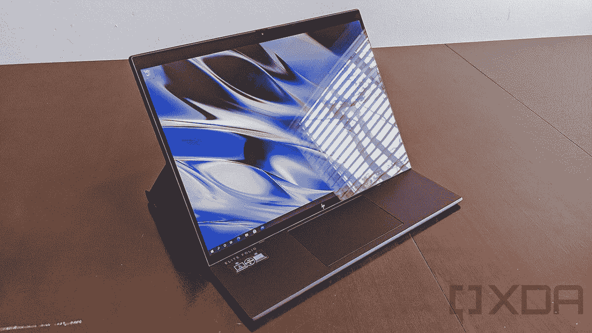

# HP Elite Folio Review:ARM PC 上的最佳 Windows

> 原文：<https://www.xda-developers.com/hp-elite-folio-review/>

惠普的 Elite Folio 是 ARM PC 上最好的 Windows。它的外形融合了笔记本电脑和平板电脑的外形，而不会对其中任何一种做出重大妥协。此外，它采用了惠普 EliteBooks 的高级功能，并将其融入到这款全新的产品中。

它由骁龙 8cx Gen 2 处理器驱动，这意味着你也可以通过 [5G](https://xda-developers.com/5g) 获得它。惠普实际上给了我 4G LTE 模型，但公平地说，5G 模型只支持低于 6GHz 的速度，所以它并没有那么大的不同。

硬件采用纯素皮革，是皮革 Spectre Folio 的新款式。惠普还做了一些其他的调整，比如在键盘上安装了金属键盘和笔库。最重要的是，键盘是非凡的。如果你将惠普 Elite Folio 与 ARM 电脑上的其他 Windows 系统进行比较，它们会相形见绌。如果你将它与同类产品中的其他商用电脑进行比较，那么，惠普有一些强劲的竞争对手。

## 惠普 Elite Folio:规格

| 

中央处理器

 | 高通骁龙 8cx Gen2 5G(最高 3.0GHz 突发频率，4MB 三级高速缓存，8 个内核) |
| 

国家政治保卫局。参见 OGPU

 | 高通 Adreno 690 图形 |
| 

身体

 | 11.75 x 9.03 x 0.63 英寸，2.92 磅 |
| 

显示

 | 13.5 英寸对角线，WUXGA+ (1920 x 1280)，触摸屏，IPS，BrightView，康宁大猩猩玻璃 5，400 尼特，低功耗，72% NTSC |
| 

港口

 | 2 个超高速 USB Type-C 5Gbps 信号速率(USB 供电，DisplayPort 1.4)1 个耳机/麦克风组合 1 个 Nano-SIM |
| 

记忆

 | 16GB LPDDR4-4266 MHz RAM(板载) |
| 

储存；储备

 | 512GB PCIe NVMe TLC 固态硬盘 |
| 

声音的

 | Bang & Olufsen，四声道立体声扬声器，双阵列麦克风 |
| 

网络摄像头

 | 720p 高清隐私摄像机 |
| 

键盘

 | 惠普高级协作键盘–防泼溅背光键盘点击板，支持多点触控手势 |
| 

连通性

 | 高通 Atheros 802.11 a/b/g/n/AC(2 x2)Wi-Fi 和蓝牙 5 组合高通骁龙 X20 LTE Cat 16 |
| 

电池

 | 惠普长寿命 4 芯 46 瓦锂离子 65 瓦 USB Type-C 适配器 |
| 

颜色

 | 黑色 |
| 

操作系统（Operating System）

 | Windows 10 专业版 |
| 

价格

 | $2,063 |

惠普以 1889 美元的价格出售这款预配置的机型，除了 256GB 的固态硬盘。有趣的是，256GB 的型号实际上是该公司说它发送给评测人员的型号。无论如何，定制了 512GB 的固态硬盘，它的价格是 2063 美元。5G 将让你多花 243 美元，或者你可以通过购买只有 Wi-Fi 的型号节省 201 美元。

只有 Wi-Fi 和 5G 之间有 444 美元的价格差异，高通指责原始设备制造商造成了这种价格上涨。这家圣地亚哥公司的信息总是希望蜂窝连接成为标准，客户不应该为 5G 之类的东西支付更多费用。

## 设计:HP Elite Folio 由纯素皮革制成

如果你熟悉幽灵对开本，这是一个不同的野兽。让我们从颜色开始，因为 Spectre Folio 是棕色的，这使得皮革材料很明显。惠普 Elite Folio 由黑色纯素皮革制成，并且更加精致*。*

纯素皮革设计也更加简洁。对于皮革，边缘周围有一个唇，但纯素皮革更容易粘合。只是设备底部和盖子顶部是纯素皮革。

印在纯素皮革上的是优质的惠普标志，而不是你在主流电脑上看到的圆形标志。背面的折痕是一个铰链。当你打开设备时，你可以弹出显示屏，以 folio 或 tablet 模式折叠它，这就是显示屏折叠的地方。

HP Elite Folio 没有太多的端口。在左侧，有一个 USB 3.2 Gen 1 Type-C 端口。显然，没有 [Thunderbolt](https://www.xda-developers.com/best-thunderbolt-4-laptops/) 端口，因为这不是英特尔设备。

看到 [USB 3.2 Gen 2](https://www.xda-developers.com/usb-standards-explained/) 会很好，但惠普告诉我，根据连接的内容，这个端口*支持 10Gbps。它还支持 DisplayPort 1.4，因此如果您愿意，可以在每个端口上连接 4K 显示器。是的，与苹果的 ARM PCs 不同，高通的可以将桌面扩展到多台显示器。*

在另一侧，有另一个 USB 3.2 Gen 1 Type-C 端口和一个 3.5 毫米音频插孔。我很喜欢看到 Windows 10 电脑两侧都有充电端口，因为奇怪的是，这种情况非常少见。你会发现 Windows PCs 在同一侧有两个充电端口，然后 OEM 会制作一个两侧都有 USB Type-C 端口的 Chrome OS 变体，因为谷歌需要它。

这台电脑的设计很酷，因为它很独特，但很微妙。我个人认为，说到整体设计，惠普是把竞争对手吹走了。因此，让我们将其与惠普的其他产品进行比较。在我看来，Spectre x360 是目前市场上最漂亮的笔记本电脑，它采用了双色设计。然而，它太花哨了，不适合作为商务笔记本电脑。

另一方面，EliteBooks 是银色的，这一点也不独特。只有精英蜻蜓有颜色，那是因为它是由镁而不是铝制成的。

HP Elite Folio 采用纯素食皮革设计，独特而美观。但黑色和扁平的边缘代替了皮革唇，它更微妙，在商务场合更好用。当然，它有独特的外形。

## 显示和音频:B&O 音频和隐私显示选项

惠普 Elite Folio 拥有 13.5 英寸 3:2 显示屏，分辨率为 1，920x1，280。3:2 的长宽比是由微软 Surface 推广的，但它越来越受欢迎。我们在[联想 ThinkPad X1 Titanium Yoga](https://www.xda-developers.com/lenovo-thinkpad-2021-range-ces-2021/) 上看到了这一点，我认为这是 Elite Folio 的主要竞争对手。

有两种显示选项。一个是 400 尼特的面板，另一个是 1000 尼特的 Sure View Reflect privacy display。惠普曾在简报中说，有两种人:需要确定观点的人和不知道自己需要确定观点的人。

Sure View 背后的想法是防止“视觉黑客”。如果有人试图越过你的肩膀看，他们就看不到你在做什么。Sure View Reflect 是这种技术的最新一代，该公司在拥有最佳隐私显示技术方面做了大量工作。

不过，惠普给评论者发了一个 400 尼特面板的 Elite Folio。这是一个色彩准确的漂亮屏幕，但它不是太亮，而且非常光滑。由于这是一款具有蜂窝连接功能的产品，它意味着可以随身携带；但是，在阳光直射下使用很痛苦。

对于平板电脑模式，3:2 的宽高比明显优于 16:9。当它作为笔记本电脑使用时更高，当它作为平板电脑使用时更宽。

Bang & Olufsen 扬声器相当不错，尤其是在清晰度方面。由于外形的原因，我原本以为会有一些轻微的声音。但是不，音乐听起来很棒，棒球比赛听起来很棒，最重要的是，通话听起来很棒。HP Elite Folio 毕竟是一台商用电脑，所以您会用它来打电话。

不过，坏消息是:Elite Folio 的网络摄像头很糟糕。它只有 720 便士，对于一个已经发布了一年的全新产品来说，这真是一个耻辱，因为疫情让如此多的人在家工作，以至于我们开始听到像“新常态”、“混合工作”和“在任何地方工作”这样的术语。而且即使是高清分辨率，也只是不是特别好。即使在良好的照明下，视频看起来也是粗糙的。

当然，网络摄像头在顶部挡板中，并且有隐私保护装置。它上面有一个关闭物理防护的开关，所以如果你喜欢的话，你不必担心用胶带把它盖住。

## 键盘和触摸板:惠普 Elite Folio 拥有最好的键盘

我提到我认为联想 ThinkPad X1 Titanium Yoga 是这款电脑的主要竞争对手，我实际上认为 X1 Titanium 和 Elite Folio 拥有市场上最好的两个键盘。多年来，ThinkPads 一直是最好的键盘，但惠普在过去几年里非常努力。

这种键盘在 EliteBook 1000 系列中首次亮相，对我来说，它要么击败了联想 ThinkPad，要么他们打成了平手。无论哪种方式，HP Elite Folio 都能为您带来卓越的打字体验。琴键是稳定的，它们有*恰到好处的阻力。它们很准确，而且很舒服。*

凭借惠普的最新设计，它把一切都放在了键盘上。例如，电源按钮在右上角。如果这台电脑上有指纹传感器，那也应该有。

它配备了微软 Precision 触摸板，这意味着它速度快、响应快，并支持您习惯的所有手势。当然，几乎所有现代笔记本电脑都有一个精密触摸板，但惠普是最后一个坚持下来的。如果你将它与 Spectre Folio 进行比较，那么*没有*有精确的触摸板。

键盘顶部是一个笔库，这是我最喜欢的笔记本电脑新功能。这类似于微软对其 Surface Pro X 所做的。这是一只扁平的笔，有三个充电引脚，所以当它在那里时，它总是在充电。它也总是伴随着你，但从不碍事。

例如，许多电脑在电脑侧面使用磁铁来存放笔。棘手的问题是，笔在你的包里时可能会掉下来。有一段时间笔环也是一个东西，但痛苦的是，当你拿着它时，它会妨碍你的手，即使笔不在笔环中。

酷的是，公司正在重新想象 Windows 10 平板电脑的体验，至少从硬件方面来看是这样的。惠普的 Elite Folio、联想的 ThinkPad X1 Titanium 和戴尔的 Latitude 7320 disable 等设备在设计时都考虑到了平板电脑的用途，而不仅仅是具有 360 度转轴的笔记本电脑。

## 基于 ARM 和惠普软件的 Windows:这是第一款采用骁龙 8cx Gen 2 的产品

当惠普举行该产品的审查研讨会时，它将惠普 Elite Folio 与联想 Flex 5G、微软 Surface Pro X、三星 Galaxy Book S 甚至苹果的 iPad Pro 等设备进行了比较。这些都是 ARM 设备，我到目前为止还没有提到它的原因是，如果你正在考虑为你的业务使用 Elite Folio，你更有可能将其与其他高级商用电脑进行权衡。正如我所说的，这些包括 ThinkPad X1 Titanium Yoga 和戴尔 Latitude 7320 disable。

首先，如果你是 ARM 上的 Windows 新手，欢迎。2016 年 12 月在高通骁龙技术峰会上宣布，一年后，ARM 上的 Windows 首次推出了首款基于 Snapdragon 835 的设备。2019 年 12 月，该公司宣布了[骁龙 8cx](https://www.xda-developers.com/qualcomm-snapdragon-8cx-always-on-always-connected-pc/) ，这是第一款从头开始为 PC 打造的 SoC。现在，我们在[骁龙 8cx Gen 2](https://www.xda-developers.com/qualcomm-snapdragon-8cx-gen-2/) 上。

2016 年的大事是微软和高通宣布这些电脑将能够模拟 x86 应用。这是早期 Windows on ARM 尝试所缺乏的功能，如 Windows RT。目前，Windows on ARM 可以运行原生 ARM 应用程序和模拟 x86 应用程序。

对 x64 仿真的支持在预览版中可用[，并将在今年晚些时候面向所有人发布。然而，正如任何评论者都会告诉你的，这篇评论是基于现在可用的内容，而不是未来更新中承诺的内容。](https://www.xda-developers.com/microsoft-x64-app-emulation-windows-on-arm-pc/)

您将看到模拟应用程序的性能影响，尽管它远没有以前那么糟糕。微软的 Edge 浏览器和 Office 应用都是原生的，所以运行得相当好。事实上，它们相当快。

可能最值得注意的非本地应用是谷歌浏览器。如果那是你需要的浏览器，你可能更适合英特尔的机器。事实上，我的消息来源多次告诉我，Chrome for ARM 已经准备好发布几年了。ARM 上 Windows 的原生 Chromium 版本已经发布了一年多。即便如此，也不要指望 Chrome 支持会很快到来。其他尚未推出的常见应用包括 Slack，有趣的是，惠普的大多数商业应用也是如此。

惠普 Elite Folio 附带一款名为 HP QuickDrop 的应用。虽然它的文件大小限制为 50MB，但它可以让你在手机上来回传输文件。这非常有用，因为我确信我们都在浏览我们的手机，想要访问我们在电脑上看到的东西。毕竟，你难道没有在你的电脑上浏览过，拿出你的手机来看看另一个更小的互联网上发生了什么吗？你当然有。

有趣的是，惠普的商用电脑通常附带一系列其他商务应用，如 Sure Click，它旨在保护你的浏览。据推测，这些应用目前还不能在 ARM 上使用。

不过，这是 ARM 上 Windows 状态的一个例子。有些东西还没准备好。Adobe 有一个可以使用的 Creative Cloud 应用程序，但唯一可用的应用程序是 Photoshop 和 Lightroom。与此同时，现在苹果正在转向 ARM，Adobe 已经发布了 Photoshop 和 Lightroom，以及 Premiere Pro、Premiere Rush、Illustrator、After Effects、XD 等测试版。

### 性能、电池寿命和连接性:4G 和 5G 很好，但如果是标准配置就更好了

谈到上面没有谈到的性能，我没有太多可以介绍的。原生应用运行良好，仿真应用运行良好。我还知道一个事实，我们很快就会看到更多的本地应用。

这个型号有一个骁龙 8cx 第二代和 16GB 内存。事实上，据我所知，这只是继微软 Surface Pro X 之后，ARM PC 上第二个提供 16GB 内存的 Windows。在高端 PC 上看到 ARM 处理器真的很好。

真正的问题是，如果你将它与联想 ThinkPad X1 Titanium Yoga 或戴尔 Latitude 7320 disable 进行比较，它们在性能方面会胜出。最重要的是，他们本机运行所有应用程序，因为整个计算世界都是围绕 x86 构建的(就目前而言)。

但是 ARM 处理器有自己的好处。其中之一就是续航，惠普 Elite Folio 的 46WHr 电池相对较小。尽管如此，我还是花了 10 个小时完成了真正的工作。我在正常工作流程中运行的唯一模拟应用程序是 Slack。剩下的包括 Edge，OneNote，Skype，Microsoft To Do，偶尔还有 Office。

高通喜欢吹嘘的另一个好处是集成的蜂窝调制解调器。事实上，一个关键特征是 [4G LTE 连接](https://www.xda-developers.com/best-4g-lte-laptops/)和 [5G 连接](https://www.xda-developers.com/best-5g-laptops/)并不昂贵，这是与英特尔的一大区别。使用英特尔电脑，您总是需要为手机支付更多费用。但据我所知，惠普 Elite Folio 是 ARM PC 上第一款仅提供 Wi-Fi 选项的 Windows。

尽管如此，手机连接还是很不错的。现在是 2021 年。一切都应该连接到互联网。你不必担心公共 Wi-Fi 的不安全性或最终出现在星巴克的邮件列表中。它只是工作。

对于基准测试，我使用了 Geekbench 5，遗憾的是，这是唯一一个原生运行在 ARM 上的基准测试应用程序。这很令人失望，因为 Geekbench 主要测试 CPU，所以这不是一个衡量整体性能的好方法。

| 

惠普 Elite FolioSnapdragon 8cx Gen 2

 | 

联想 ThinkPad X1 钛金 YogaCore i7-1160G7

 | 

Surface Pro XSQ2

 | 

三星 Galaxy Book SSnapdragon 8cx

 |
| --- | --- | --- | --- |
| 801 / 3,150 | 1,333 / 4,055 | 794 / 3,036 | 726 / 2,909 |

正如我们所知，微软在 Surface Pro X 中的“SQ”芯片只是骁龙 8cx 芯片的改进。毫不奇怪，骁龙 8cx Gen 2 与微软 SQ2 不相上下。尽管如此，你可以看到 ThinkPad X1 Titanium Yoga 相当容易地击败了 Elite Folio。

## 结论:你应该购买惠普精英对开？

HP Elite Folio 无疑是 ARM PC 上最好的 Windows。如果你将它与 Surface Pro X 和 Galaxy Book S 等产品进行比较，它拥有最好的外形、最好的键盘等等。

最大的问题是它不是最好的商用电脑。我很高兴我们看到市场趋势转向真正好的敞篷车。以前 Windows 10 敞篷车用起来超级别扭。它们很重，被设计成笔记本电脑。我们看到越来越多的产品是以平板电脑为设计理念的。

惠普肯定会全力以赴。除了周围最好的键盘之一，HP Elite Folio 还配备了高端规格，如 16GB RAM 和 512GB 存储空间。它还包括惠普的 Sure View Reflect privacy display 等功能，非常棒。

我们不要忘记电池续航时间很长，并且它带有蜂窝连接，最高可达 5G。我真的希望他们有它的标准，但它就是它。如果你正在寻找一些有点不同的东西，感觉溢价，惠普精英对开是它。

 <picture></picture> 

HP Elite Folio

##### 惠普精英版

惠普 Elite Folio 配备了骁龙 8cx Gen 2 处理器、高端键盘、纯素食皮革等。