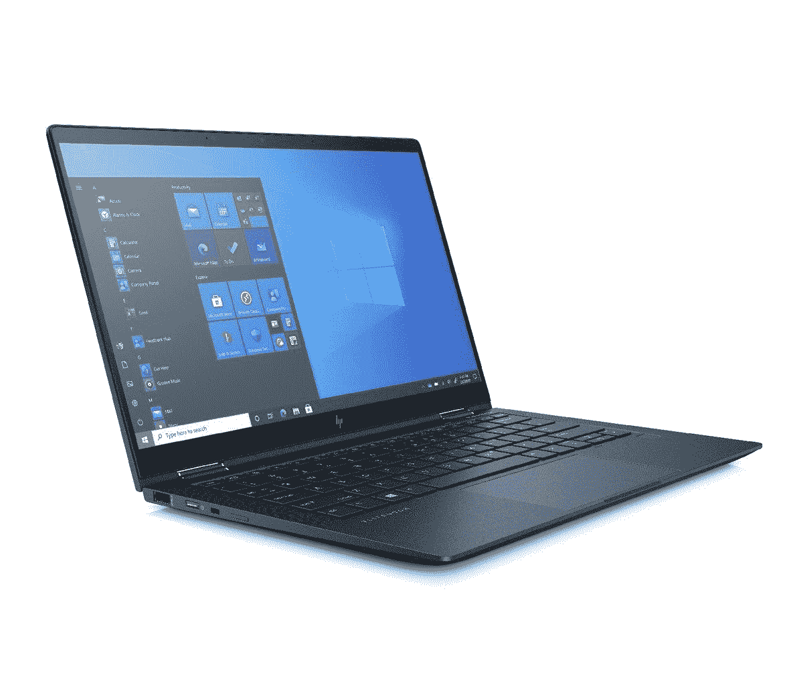

# 惠普 Elite Folio vs Elite 蜻蜓:惠普高端商用电脑对比

> 原文：<https://www.xda-developers.com/hp-elite-folio-vs-elite-dragonfly/>

惠普的 Elite 系列提供主要面向企业用户的高端笔记本电脑，具有时尚、性能和安全性的良好平衡。今年早些时候，该公司在产品线中增加了一款新产品 [Elite Folio](https://www.xda-developers.com/hp-elite-folio-review/) ，这是今天你可以在 ARM 笔记本电脑上获得的最好的 Windows 之一，取代了 Surface Pro X 等产品。这给我们带来了一个重要的问题。它与惠普最高端的商务笔记本电脑 Elite 蜻蜓相比如何？这正是我们要找出的。

## 惠普 Elite Folio 与惠普 Elite 蜻蜓:规格

|  | 

惠普精英版

 | 

惠普精英蜻蜓

 |
| --- | --- | --- |
| **CPU** | 

*   高通骁龙 8cx Gen2(高达 3.0GHz 的突发频率，4MB 三级高速缓存，8 个内核)

 | 

*   英特尔酷睿 i3-1115G4
*   英特尔酷睿 i5-1135G7
*   英特尔酷睿 i7-1165G7
*   英特尔酷睿 i7-1185G7

 |
| **图形** | 

*   高通 Adreno 690 图形

 | 

*   英特尔 UHD 显卡
*   英特尔 Iris Xe 集成显卡

 |
| **正文** | 

*   298.45×229.36×16 毫米(11.75×9.03×0.63 英寸)
*   1.32 千克(2.92 磅)

 | 

*   304.29×197.61×16 毫米(11.98×7.78×0.63 英寸)
*   起价 988 克(2.18 磅)

 |
| **显示** | 

*   13.5 英寸 WUXGA+ (1920×1280)，触摸屏，康宁大猩猩玻璃 5400 尼特，低功耗，72% NTSC
*   13.5 英寸 IPS WUXGA+ (1920x1280)触摸屏，康宁大猩猩玻璃 51000 尼特，确保视图反映隐私

 | 

*   13.3 英寸 FHD (1920×1080)触摸屏，400 尼特，康宁大猩猩玻璃 5
*   13.3 英寸 FHD (1920×1080)触摸屏，1000 尼特，康宁大猩猩玻璃 5，惠普 Sure View Reflect
*   13.3 英寸 4K UHD (3840×2160)触摸屏，采用康宁大猩猩玻璃，5550 尼特，HDR-400

 |
| **端口** | 

*   2 倍 USB Type-C 5Gbps 信号速率(USB 供电，DisplayPort 1.4)
*   1x 耳机/麦克风组合
*   1x Nano-SIM 卡

 | 

*   2x Thunderbolt 4，带 USB4 Type-C
*   1 个 USB 类型 A 5Gbps
*   1x 耳机/麦克风组合
*   1 个 HDMI 2.0b 接口

 |
| **存储** | 

*   高达 512GB 的 PCIe NVMe TLC 固态硬盘

 | 

*   高达 2TB 的 PCIe NVMe TLC 固态硬盘

 |
| **闸板** | 

*   高达 16GB LPDDR4 4266MHz RAM

 | 

*   最高 32GB LPDDR4X 4266MHz

 |
| **电池** | 

*   惠普长寿命 4 芯 46 瓦时锂离子电池
*   65W USB Type-C 适配器

 | 

*   2 芯 38 瓦时
*   4 芯 56 瓦时电池
*   65 瓦交流适配器，USB-C 连接器

 |
| **音频** | 

*   Bang & Olufsen 四声道立体声扬声器
*   双阵列麦克风

 | 

*   B&O 的音频
*   4 个高级立体声扬声器
*   多阵列面向世界的麦克风

 |
| **键盘** | 

*   惠普高级协作键盘–防泼溅背光键盘
*   支持多点触控手势的点击板

 | 

*   惠普现代化键盘，防泼溅，带 DuraKeys 背光；玻璃点击板，微软精密触摸板
*   惠普现代化的隐私键盘，防泼溅，带 DuraKeys 背光；玻璃点击板，微软精密触摸板

 |
| **摄像机** |  | 

*   720p 高清红外摄像头，集成电子隐私快门和惠普 Sure 快门

 |
| **连通性** | 

*   高通 Atheros 802.11 a/b/g/n/AC(2×2)Wi-Fi
*   蓝牙 5
*   高通骁龙 X20 LTE 第 16 类

 | 

*   英特尔双频 Wi-Fi 6
*   蓝牙 5
*   英特尔 XMM 7360 LTE-高级宽带无线(第 9 类)
*   高通骁龙 X55 5G 宽带无线(第 20 类)

 |
| **价格** |  |  |

## 设计:精英蜻蜓有更多的功能

Elite Folio 和 Elite 蜻蜓都是高级可转换笔记本电脑；然而，在设计上还是有一些不同。Elite Folio 具有吸引人的纯素皮革表面，包裹着整个机器。它摸起来很柔软，握感也很好。Elite 蜻蜓是一款传统的 2 合 1 笔记本电脑，配有坚固的镁制机箱。它还使用海洋塑料，这是回收的塑料，最终将进入大海，从而使它更加环保。

[Elite Folio](https://www.xda-developers.com/hp-elite-folio-review/) 上增加的一层皮革使其更重(2.92 磅对 2.18 磅)，但两款笔记本的厚度相同(0.63 英寸)。另一个有趣的方面是这些笔记本电脑如何改变形态。Elite 蜻蜓有两个转轴，你可以在大多数可折叠笔记本电脑上看到，让你可以将显示屏完全翻转回来，并在帐篷模式、媒体模式、平板电脑模式等模式下使用笔记本电脑。

Elite Folio 还能够四处弯曲，但不是有铰链，而是通过外部皮革饰面连接显示器的顶部。因此，它提供了向前拉的设计，而不是向后翻转显示屏。

在端口选择方面，精英蜻蜓占据上风，因为它提供了两个 Thunderbolt 4 端口，一个全尺寸 USB Type-A 端口，一个 HDMI 端口和一个 3.5 毫米音频插孔。Elite Folio 具有两个 USB-C 端口(不是 Thunderbolt)和一个耳机插孔。精英版蜻蜓还提供了两种登录 Windows 的方式，即使用红外网络摄像头或指纹扫描仪。Folio 只提供可选的红外摄像头，但没有指纹扫描仪。

两款笔记本电脑的设计本身都有独特的视角，与精英蜻蜓的传统设计相比，精英对开本无疑是一种全新的方式。然而，蜻蜓显然是更好的选择，因为它比对开本拥有更多的功能。

## 显示器:精英蜻蜓提供高达 4K 的分辨率

惠普为 [Elite Folio](https://shop-links.co/1747005742021970390?u1=f62e7ed4-dc77-44a4-b7c8-537d9a2e72e5) 和 [Elite 蜻蜓](https://shop-links.co/1747005742749820622?u1=28fa3d99-9033-4493-a69b-cbe8f3349b2c)的显示屏提供了非常相似的配置。Folio 确实提供了一个稍大的显示屏，对角线尺寸为 13.5 英寸，因为它的长宽比为 3:2，因此分辨率为 1920x1280，而蜻蜓的显示屏为 13.3 英寸 1080p。然而，后者也有更清晰的 4K UHD 选项，亮度为 550 尼特，支持 HDR400。拥有 4K 分辨率的显示器有助于获得更清晰的视觉效果，但在这种尺寸下它不会很有用。与此同时，它最终将消耗更多的电池来推出这些额外的像素。

显示器还支持笔输入，你可以在两台笔记本电脑上使用手写笔。Elite Folio 在显示屏和键盘之间有一个很好的车库，可以存放有点扁平的手写笔。另一方面，精英蜻蜓有一个圆形，传统外观的手写笔。请记住，Elite 蜻蜓上没有存储手写笔的空间，您只能使用内置磁铁将其粘贴到笔记本电脑的顶部。你应该能够轻松地记下笔记，甚至做一些复杂的草图，因为你可以获得 4，096 级的压力和倾斜灵敏度。

同样，Elite 蜻蜓为 Folio 带来了强劲的竞争，因为它不仅提供了相同的显示选项，而且还可以配置 4K 分辨率的面板，特别是如果你优先考虑卓越的视觉体验而不是电池续航时间。

## 性能:英特尔超过 ARM

这就是事情变得有趣的地方。Elite Folio 是惠普最新的笔记本电脑，采用 ARM 处理器，特别是高通骁龙 8cx Gen2，一种高达 3GHz 的八核处理器。它也是唯一一款基于 ARM 的笔记本电脑，提供高达 16GB 的内存和 512GB 的 SSD 存储。

Elite 蜻蜓是一款基于英特尔的笔记本电脑，提供第 11 代 Tiger Lake 选项，最高可配酷睿 i7-1185G7，最高可配 32GB 内存和 2TB 固态硬盘存储。很明显，精英蜻蜓提供了更好的性能体验，然后你还可以在四个 SKU 之间进行选择。

为了便于比较，下面是 Elite Folio 与 [Elite 蜻蜓 Max](https://www.xda-developers.com/hp-elite-dragonfly-max-review/) 的 Geekbench 结果比较，后者与 Elite 蜻蜓非常相似，但有一些附加功能。

|  | 

惠普精英蜻蜓 MaxCore i7-1185G7

 | 

惠普 Elite FolioSnapdragon 8cx Gen 2

 |
| --- | --- | --- |
| 极客工作台 | 1,117 / 3,663 | 801 / 3,150 |

话虽如此，Elite Folio 是近年来 ARM 笔记本电脑上性能最好的 Windows 之一。它设法超越了微软 Surface Pro X，后者一直是更受欢迎的选择之一。

由于 ARM 处理器更节能，Elite Folio 提供了更好的电池性能。在正常情况下，它的 46 瓦时电池应该可以使用近 10 个小时。Elite 蜻蜓有一个更大的 56 瓦时电池，但这对耗电的英特尔处理器来说是不够的，你可以期待 7-8 小时的电池寿命。这两款笔记本电脑在连接方面都提供了标准的 Wi-Fi 6、蓝牙 5.0 和可选的 5G 移动连接。说到这里，看看我们的[最佳 4G/LTE](https://www.xda-developers.com/best-4g-lte-laptops/) 和[最佳 5G 笔记本电脑](https://www.xda-developers.com/best-5g-laptops/)名单。

## 结果

如果与 Elite Folio 相比，HP Elite 蜻蜓是一个明智的选择。由于更强大的第 11 代英特尔处理器、更多的 I/O 端口和更好的配置选项(包括 4K 显示屏)以及更多的内存和存储，它提供了更好的性能。话虽如此，精英对开本却自成一派。它有一个独特的可转换设计，人造革完成，是少数几个基于 ARM 的笔记本电脑，我们实际上可以推荐。

 <picture></picture> 

HP Elite Dragonfly G2

##### 惠普精英蜻蜓 G2

惠普精英蜻蜓是一款专为企业用户设计的顶级轻质可变形笔记本电脑，采用最新的英特尔第 11 代 Tiger Lake 处理器。

 <picture></picture> 

HP Elite Folio

##### 惠普精英版

惠普 Elite Folio 是该公司推出的一款高级可转换笔记本电脑，也是采用 ARM 芯片组的最佳 Windows 电脑之一。

如果你想买一台新的笔记本电脑，你一定要读一读我们关于 2021 年 T4 最佳笔记本电脑的指南。我们还专门列出了[最佳惠普笔记本电脑](https://www.xda-developers.com/best-hp-laptops/)。