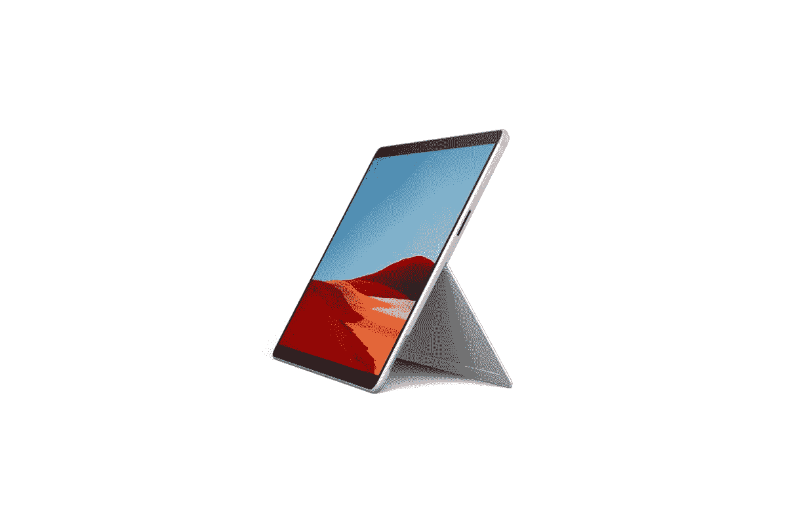

# 惠普 Elite Folio vs 微软 Surface Pro X:该买哪个？

> 原文：<https://www.xda-developers.com/hp-elite-folio-vs-surface-pro-x/>

今年，ARM 上的 Windows 正在慢慢赶上这个步伐。我们看到惠普推出了搭载骁龙 8cx Gen2 的二合一笔记本电脑 [Elite Folio](https://www.xda-developers.com/hp-elite-folio-review/) 。但它不同于我们已经见过的任何基于 ARM 的 Windows 笔记本电脑，这要归功于它的纯素食皮革外壳。在我们的评测中，我们将其评为 ARM PC 上最好的 Windows，但它如何与微软的 Surface Pro X 抗衡？两者都运行在几乎相同的芯片组上，你也可以获得可转换的外形，但哪一个更好呢？

## 惠普 Elite Folio 与微软 Surface Pro X:规格

|  | 

惠普精英版

 | 

微软 Surface Pro X

 |
| --- | --- | --- |
| **CPU** | 

*   高通骁龙 8cx Gen2(高达 3.0GHz 的突发频率，4MB 三级高速缓存，8 个内核)

 | 

*   微软 SQ1(最高 3GHz，8 核)
*   微软 SQ2(最高 3.15GHz，8 核)

 |
| **图形** | 

*   高通 Adreno 690 图形

 | 

*   高通 Adreno 685
*   高通 Adreno 690

 |
| **正文** | 

*   298.45×229.36×16 毫米(11.75×9.03×0.63 英寸)
*   1.32 千克(2.92 磅)

 | 

*   287×208×7.3 毫米(11.3×8.2×0.28 英寸)
*   774 克(1.7 磅)，不含键盘

 |
| **显示** | 

*   13.5 英寸对角线，WUXGA+ (1920×1280)，触摸，IPS，BrightView，康宁大猩猩玻璃 5，400 尼特，低功耗，72% NTSC

 | 

*   13 英寸 PixelSense (2880×1920)，267 PPI，3:2 宽高比，10 点多点触控

 |
| **端口** | 

*   2 超高速 USB Type-C 5Gbps 信号速率(USB 供电，DisplayPort 1.4)
*   1 个耳机/麦克风组合
*   1 个 Nano-SIM

 | 

*   2 个 USB-C
*   1 个表面连接端口
*   表面键盘端口
*   1 个 nano SIM

 |
| **存储** | 

*   高达 512GB 的 PCIe NVMe TLC 固态硬盘

 |  |
| **闸板** | 

*   高达 16GB LPDDR4 4266MHz RAM

 |  |
| **电池** | 

*   惠普长寿命 4 芯 46 瓦时锂离子电池
*   65W USB Type-C 适配器

 | 

*   长达 15 小时的典型设备使用时间

 |
| **音频** | 

*   Bang & Olufsen 四声道立体声扬声器
*   双阵列麦克风

 | 

*   双通道远场录音室话筒
*   2W 立体声扬声器，带杜比音效

 |
| **键盘** | 

*   惠普高级协作键盘–防泼溅背光键盘
*   支持多点触控手势的点击板

 | 

*   Surface Pro X 键盘(单独出售)
*   Surface Pro X 签名键盘，配有纤细的笔束

 |
| **摄像机** |  | 

*   500 万像素前置摄像头，支持 1080p 全高清视频
*   10MP 后置自动对焦摄像头，支持 1080p 高清和 4k 视频

 |
| **连通性** | 

*   高通 Atheros 802.11 a/b/g/n/AC(2×2)Wi-Fi
*   蓝牙 5
*   高通骁龙 X20 LTE 第 16 类

 | 

*   兼容 Wi-Fi 5: 802.11ac
*   蓝牙 5.0
*   高通骁龙 X24 LTE 型号

 |
| **颜色** |  |  |

## 设计

惠普 Elite Folio 和微软 Surface Pro X 都提供了灵活的外形，但当你将它们放在一起时，就会有很大的不同。Surface Pro X 是一款平板电脑第一设备，与其他 Surface 设备类似，它使用磁铁和弹簧针连接到外部键盘。你可以使用背面的支架支撑它，或者如果你想在平板电脑模式或帐篷模式下使用它，只需折叠或移除键盘。

另一方面，Elite Folio 感觉更像一台笔记本电脑。它有一个漂亮的纯素皮革外壳，键盘一直在它身边。此外，您可以在帐篷模式下使用 Elite Folio，方法是从底部拉出显示屏，或者干脆将其平放，以便在平板电脑模式下使用。

Surface Pro X 更薄、更轻、更便于携带，尽管你可能认为它提供了更多的灵活性，但还是有一些事情需要考虑。首先，HP Elite Folio 上的键盘不仅与笔记本电脑的其余部分保持在一起，而且还提供了更好的按键行程和更好的触感。与 Surface Pro X 相比，Elite Folio 的触控板略大，USB-C 端口的放置也更加自然和方便。

虽然我们更倾向于 Elite Folio，但设计是用户偏好的主观体现。一些人可能更喜欢超薄的平板电脑外形，而另一些人可能会欣赏传统翻盖设计背后的思想。

## 显示器:Elite Folio 提供了一个更大、颜色更准确的面板

再说一次，我们有一些优点和缺点。惠普 Elite Folio 提供了更大的 13.5 英寸全高清(1920 x 1280 像素)触摸屏。Surface Pro X 提供了更小的 13 英寸显示屏，但分辨率更高，为 2880 x 1920，这意味着它更清晰。但如果对比性能，Elite Folio 提供了更好的色彩还原和准确性，但 Surface Pro X 上的显示屏更亮。就像设计方面一样，你是想要更亮更清晰的显示器，还是想要更大更好色彩准确度的东西，这取决于你。

## 性能:两者旗鼓相当

惠普 Elite Folio 采用骁龙 8cx Gen 2，最高可配置 16GB 内存。Surface Pro X 提供 SQ1 或 SQ2 芯片，这些芯片基本上是骁龙 8cx Gen 和 Gen 2 的变体。理论上，两者非常相似，基准测试也给出了相同的建议。Elite Folio 和 Surface Pro X 在 Geekbench 5 上的得分相似，前者仅略胜一筹。

你需要考虑的事实是，惠普为 Elite Folio 提供了可选的 5G 连接，以实现更快的移动连接，而 Surface Pro X 仅限于 4G。

## 结论:应该买哪个？

我们建议您选择 HP Elite Folio，因为它提供了更健康的体验。使用起来感觉更自然，不会在外形上妥协。与此同时，Surface Pro X 也是一款出色的设备，因为它更轻，显示屏更亮更清晰，甚至价格更低。但归根结底，它是一台平板电脑，会限制你的一些工作效率，尤其是在 Windows 上。

 <picture></picture> 

Surface Pro X

##### 微软 Surface Pro X

Surface Pro X 是微软试图制造一款基于 ARM 的 Windows 可拆卸机器，由定制版的高通骁龙 8cx 驱动。

 <picture></picture> 

HP Elite Folio

##### 惠普精英版

新的惠普 Elite Folio 是该公司的一款高端混合笔记本电脑，也是由 ARM 芯片组驱动的最好的 Windows 机器之一。

如果你不相信其中任何一个，看看我们的 2021 年最佳笔记本电脑名单、[最佳 4G 笔记本电脑](https://www.xda-developers.com/best-4g-lte-laptops/)和[最佳 5G 笔记本电脑](https://www.xda-developers.com/best-5g-laptops/)。