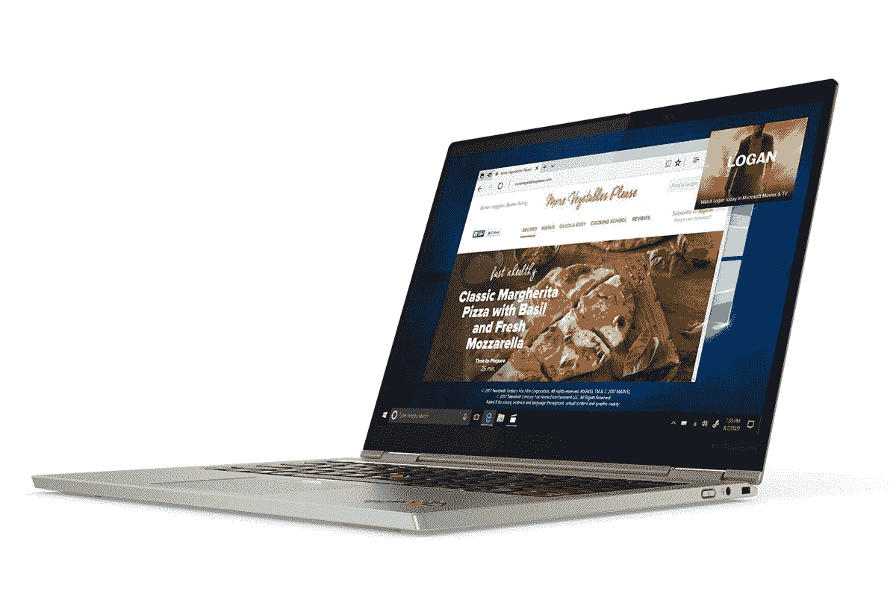

# 惠普 Elite Folio vs ThinkPad X1 Titanium:商务敞篷车对决

> 原文：<https://www.xda-developers.com/hp-elite-folio-vs-thinkpad-x1-titanium/>

市面上并不缺少[优秀的笔记本电脑](https://www.xda-developers.com/best-laptops/)，无论你的使用情况如何，你都能找到自己喜欢的东西。但有时，选择一个你最喜欢的可能并不容易。即使在轻薄的商务敞篷车领域，你可能会发现你被宠坏的选择。这一领域的两大竞争者是[惠普 Elite Folio](https://www.xda-developers.com/hp-elite-folio-review/) 和联想 ThinkPad X1 Titanium Yoga。

作为两款轻便的商务敞篷车，这两款笔记本电脑有一些相似之处。例如，两者都提供了与 [LTE](https://www.xda-developers.com/best-4g-lte-laptops/) 或 [5G](https://www.xda-developers.com/best-5g-laptops/) 的蜂窝连接选项，并且 Windows 10 Pro 也是一个选项。然而，这两款笔记本电脑在几乎所有其他方面都有很大不同。主要区别是一款基于 ARM 处理器，而另一款使用英特尔处理器。

## 惠普 Elite Folio vs ThinkPad X1 Titanium:规格

让我们先来看看这些电脑的规格。通过这种方式，您可以立即看到一些巨大的差异。

|  | 

惠普精英版

 | 

联想 ThinkPad X1 钛金瑜伽

 |
| --- | --- | --- |
| **操作系统** | 

*   Windows 10 主页
*   Windows 10 专业版

 | 

*   Windows 10 主页
*   Windows 10 专业版

 |
| **处理器** | 

*   高通骁龙 8cx 第 2 代(最高 3GHz，4 个高性能内核，4 个高效内核)

 | 

*   英特尔酷睿 i5-1130G7(最高 4GHz，四核)
*   英特尔酷睿 i5-1140G7 博锐处理器(最高 4.2GHz，四核)
*   英特尔酷睿 i7-1160G7(最高 4.4GHz，四核)
*   英特尔酷睿 i7-1180G7 博锐处理器(最高 4.6GHz，四核)

 |
| **图形** |  |  |
| **闸板** |  |  |
| **存储** |  |  |
| **显示** | 

*   13.5 英寸 WUXGA+ (1920 x 1280) IPS，防眩光，450 尼特
*   13.5 英寸 WUXGA+ (1920 x 1280) IPS，防眩光，1000 尼特，隐私屏幕

 | 

*   13.5 英寸 QHD (2256 x 1504) IPS，防眩光，防污迹，450 尼特

 |
| **音频** |  |  |
| **网络摄像头** |  |  |
| **生物认证** |  | 

*   Windows Hello 红外摄像机
*   指纹读取器

 |
| **电池** |  |  |
| **端口** | 

*   2 个 USB 3.2 第 1 代 C 类端口
*   3.5 毫米耳机插孔

 | 

*   2 个 Thunderbolt 4(USB C 类)端口
*   3.5 毫米耳机插孔

 |
| **连通性** | 

*   高通无线网络 6 (2x2) +蓝牙 5
*   4G LTE(骁龙 X20，第 16 类)(可选)
*   5G(骁龙 X55)(可选)

 | 

*   英特尔 AX201 Wi-Fi 6 (2x2) +蓝牙 5.1
*   4G LTE (Fibocom L850-GL，第 9 类)(可选)
*   5G(骁龙 X55)(可选)

 |
| **颜色** |  |  |
| **尺寸(WxDxH)** | 11.75 x 9.03 x 0.63 英寸(298.45 x 229.36 x 16 毫米) | 

*   11.71 x 9.16 x 0.45 英寸(297.5 x 232.7 x 11.5 毫米)

 |
| **重量** | 起始重量为 2.92 磅(1.32 千克) | 

*   起始重量为 2.54 磅(1.15 千克)

 |
| **起始价格** | 1 699.20 美元(各不相同) | 1 771.80 美元(各不相同) |

## 性能:高通对英特尔不是一场公平的战斗

在上面的规格表中，第一个可能会引起您注意的是处理器。惠普 Elite Folio 采用高通骁龙 8cx Gen 2，而联想 ThinkPad X1 Titanium Yoga 采用英特尔处理器，最高可达酷睿 i7-1180G7。像骁龙 8cx Gen 2 这样的 ARM 处理器非常适合实现这样的轻薄外形。

与此同时，ThinkPad X1 Titanium Yoga 中的英特尔处理器来自过去被称为 Y 系列的处理器。这意味着这些也是用于无风扇超薄设备的低功耗芯片。从这个意义上说，这些是相似的产品。

然而，英特尔在这里把高通打得落花流水。我们已经使用这两款笔记本电脑运行了基准测试，特别是 ThinkPad X1 Titanium Yoga 的英特尔酷睿 i7 版本，结果很明显。骁龙处理器在单核和多核性能上都有所欠缺。如果我们采用英特尔酷睿 i5 型号，差异可能会更小，但看看该处理器的[基准测试，看起来不会有太大变化。](https://browser.geekbench.com/v5/cpu/search?utf8=%E2%9C%93&q=Intel+Core+i5-1130G7)

| 

惠普精英对开本(骁龙 8cx 第二代)

 | 

联想 ThinkPad X1 Titanium Yoga(英特尔酷睿 i7-1160G7)

 |
| --- | --- |
| 801/3,150 | 1,333/4,055 |

还有一点需要考虑，那就是这些处理器的原生支持。虽然许多应用程序已经适应了 ARM 处理器，但许多其他应用程序仍然需要模拟，其他应用程序仍然根本无法运行(尽管这将在带有 x64 模拟的 [Windows 11](https://www.xda-developers.com/windows-11/) 中发生变化)。仿真增加了开销，这意味着总体性能下降。借助英特尔处理器，每个应用都能以最高性能在本地运行。

这两款笔记本电脑至少在内存方面是一样的，都具有 8GB 或 16GB 的焊接内存，时钟速度为 4，266MHz。然而，联想 ThinkPad X1 Titanium Yoga 也在存储方面胜出，提供高达 1TB 的固态硬盘。惠普 Elite Folio 的最大内存为 512GB。正如我们提到的，这两款笔记本电脑都支持 4G 或 5G——尽管你可能会在惠普 Elite Folio 上获得更快的 4G。

借助英特尔处理器，每个应用都能以最高性能在本地运行。

这里更喜欢 HP Elite Folio 的唯一原因可能是电池寿命。虽然电池大小相似，但 ARM 处理器往往效率更高，因此您可以在不插电的情况下使用 HP Elite Folio 更长时间。惠普声称视频播放时间长达 24.5 小时，而联想表示，使用 MobileMark 基准测试，其电池将持续 11.7 小时。这是不同的测量条件，但你仍然可以期待惠普精英对开版会更好一点。

## 设计和端口:ThinkPad X1 钛合金更轻、更薄、更好

谈到设计，惠普 Elite Folio 失去了一些优势。从惠普的优势开始，Elite Folio 是一款绝对经典的设备，从其他笔记本电脑中脱颖而出。这是因为它的外部使用了纯素皮革外壳，这使得它摸起来感觉更好。在一个银色金属商务笔记本电脑的世界里，Elite Folio 真正脱颖而出，同时仍然很精致，适合商务用户。联想 ThinkPad X1 Titanium Yoga 更无聊一些，它使用了金属底盘和与普通银色相差不远的钛色。

HP Elite Folio 的外形也更加独特。要从笔记本电脑模式切换到平板电脑模式，只需将屏幕底部拉向自己，屏幕就会平放在键盘上。你甚至可以将它拉到一半，盖住键盘，但不盖住触控板。联想 ThinkPad X1 Titanium 通过 360 度旋转转轴变成平板电脑，这是大多数其他笔记本电脑的做法。有点不太方便，但没什么大不了的。

但当你开始审视更客观的衡量标准时，联想会获得更大的优势。0.45 英寸的 ThinkPad X1 Titanium Yoga 薄得令人难以置信，甚至比 0.66 英寸的 Elite Folio 还要薄。它的起始重量也更轻，只有 2.54 磅，而 Elite Folio 只有 2.92 磅。这使得它很容易成为两款笔记本电脑中更便携的一款。

（...)ThinkPad X1 Titanium Yoga 是 Intel 笔记本电脑，所以那些 USB Type-C 端口有 Thunderbolt 4。

不仅如此，联想笔记本电脑上的端口也更好。公平地说，这两款笔记本电脑的端口数量都很少——基本上都是两个 USB Type-C 端口和一个耳机插孔。问题是，ThinkPad X1 Titanium Yoga 是一款英特尔笔记本电脑，所以那些 USB Type-C 端口有 Thunderbolt 4。你可以插入一个扩展坞，添加所有你想要的端口，包括显示输出。惠普 Elite Folio 只有标准 USB，它是 USB 3.2 Gen 1，数据速率为 5Gbps。USB-C 集线器也存在，但在这种速度下，连接外部存储几乎总是会慢得多。

不过，惠普精英版还有更多的好处。它的 USB 端口在不同的一边，所以你可以从任何一边给笔记本电脑充电。键盘上方还有一个笔库，可以轻松存放笔，不会丢失。联想 Thinkpad X1 Titanium Yoga 的笔通过磁力附着在笔记本电脑的侧面，这意味着它更容易丢失。

另一方面，联想还在电源按钮上包含了指纹识别器，为您提供了一个额外的 Windows Hello 登录选项。你不能在惠普精英版上看到这一点。

## 显示屏:惠普 Elite Folio 有一个隐私屏幕，但 ThinkPad X1 更清晰

谈到显示器，这两款笔记本电脑都使用 3:2 宽高比的 13.5 英寸面板，这对于工作效率来说非常重要。在笔记本电脑/风景模式下，它更高，所以你有更多的空间来阅读文本或适应某些用户界面元素。不过，在纵向模式下，它更宽，所以你不太可能遇到与显示器格式不匹配的应用程序。然而，大小和长宽比是这里唯一的相似之处。

联想 ThinkPad X1 Titanium Yoga 拥有分辨率为 2256 x 1504 的“QHD”显示屏。联想称之为 QHD，尽管 QHD 的分辨率通常是 2560 x 1440。这不是很清晰，更高的垂直像素数与 3:2 的纵横比有关。不过，这比惠普 Elite Folio 提供的要清晰得多，因为它只有一个 1920 x 1280 的面板。

对于大多数用例来说，这仍然足够清晰，但如果你确实想要最高的像素密度，联想的产品更好。与惠普 Elite Folio 的基本型号相比，联想 ThinkPad X1 Titanium Yoga 的显示屏也略亮，为 450 尼特，而惠普为 400 尼特。HP Elite Folio 的显示屏也非常反光，这使得它在户外很难看到。

然而，对于商业用户来说，惠普有一个很大的优势，那就是隐私屏的选择。借助 HP Sure View Reflect，Elite Folio 可以防止周围的人窥探您的工作。这项技术使得当从一个角度看笔记本电脑时，你看不到显示器上的任何内容。这样，您可以在咖啡店或机场处理文档，而不必担心数据安全性。你可以随时打开或关闭它，这样如果你在一个安全的环境中，你就不必总是限制视角。这种隐私显示器的亮度高达 1，000 尼特，这是确保您可以看到启用该功能的显示器所必需的。

这两款笔记本电脑都在网络摄像头方面做出了一些牺牲，被限制在 720p 分辨率，质量也不理想。然而，两者都有一个红外摄像头，使登录更容易。联想甚至为您提供了添加人体存在检测的选项，这样当您接近笔记本电脑时，它就会被唤醒。

## 一句话:你可能想要联想 ThinkPad X1 Titanium

考虑到我们所看到的所有差异，很明显联想 ThinkPad X1 Titanium Yoga 在大多数指标上都优于惠普 Elite Folio。它有更好的 CPU 性能，并且它还可以本地运行每个应用程序。此外，它还提供了更多的存储空间，因此随着时间的推移，您可以保存更多的文件和文档。不仅如此，它比 HP Elite Folio 更轻更薄，因此也更易于携带。作为一台英特尔笔记本电脑也意味着它支持 Thunderbolt，因此您可以连接各种外设，包括显示器甚至外部 GPU。此外，它还拥有更清晰的显示屏，这意味着不仅看起来更好，而且 UI 元素可以进一步缩小，为额外的内容腾出空间。

（...)很明显，联想 ThinkPad X1 Titanium Yoga 在大多数指标上都超过了惠普 Elite Folio。

不过，惠普 Elite Folio 确实有其优势。它有一个独特的，但经典的外观，不同于几乎所有的笔记本电脑，这是伟大的。它还提供了隐私屏幕的选项，如果你在公共环境中处理敏感信息，你可能会需要它。由于 ARM 处理器通常效率更高，电池也可能持续更长时间。此外，USB Type-C 端口位于不同的侧面，便于充电，存储附带的笔更容易，可转换的外形更方便。

但是，这些优势大多取决于个人喜好。这些东西不一定在客观上更好，而 ThinkPad X1 Titanium Yoga 的优势更加明显。或者它们不是每个人都关心的东西，比如只有当你真正使用活动笔时，笔库才是真正重要的。

无论如何，有充分的理由选择这两种笔记本电脑中的任何一种。如果你已经做出了选择，你可以使用下面的链接购买。你目前可以在亚马逊上找到 ThinkPad X1 Titanium Yoga，价格远低于联想网站上的可比配置。然而，你不能在亚马逊上轻松配置它的规格。

 <picture></picture> 

Lenovo ThinkPad X1 Titanium Yoga

##### 联想 ThinkPad X1 钛金瑜伽

联想 ThinkPad X1 Titanium Yoga 是一款非常轻薄的商务敞篷车，同时仍能通过其英特尔处理器提供出色的性能。它拥有经典的商务设计和清晰的 3:2 显示屏。

 <picture></picture> 

HP Elite Folio

##### 惠普精英版

惠普 Elite Folio 是目前最好的基于 ARM 的 Windows 笔记本电脑之一，包裹在经典的纯素食皮革中，使其显得突出而不浮华。它也很薄很轻，ARM 芯片组也提供了很长的电池寿命。