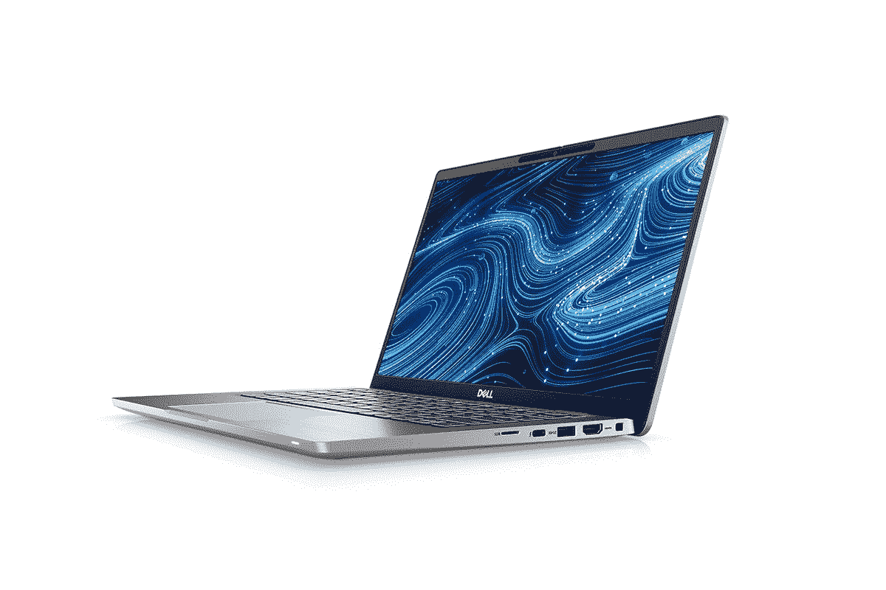

# 惠普 Pavilion EliteBook 840 Aero 与戴尔 Latitude 7420:哪个更好？

> 原文：<https://www.xda-developers.com/hp-elitebook-840-aero-vs-dell-latitude-7420/>

购买一台新的笔记本电脑可能是一个令人兴奋的时刻，但做出选择并不总是容易的。现在有这么多优秀的笔记本电脑，即使是特定的细分市场也有激烈的竞争。当谈到[商用笔记本电脑](https://www.xda-developers.com/best-business-laptops/)、[戴尔](https://www.xda-developers.com/best-dell-laptops/)和[惠普](https://www.xda-developers.com/best-hp-laptops/)是该领域最强有力的竞争者，如果您正在寻找一款[轻量级](https://www.xda-developers.com/best-lightweight-laptops/)，您可能会发现自己在惠普 EliteBook 840 Aero 和戴尔 Latitude 7420 之间做出选择。

这些笔记本电脑都很轻便，功能强大，适合处理业务任务，但它们确实有一些显著的差异。如果你需要在两者之间选择的帮助，我们将引导你通过这些差异，让你可以做出正确的选择。

## 规范

首先，让我们来看看每台笔记本电脑的规格，了解它们的不同之处。

|  | 

惠普 EliteBook 840 Aero G8

 | 

戴尔 Latitude 7420

 |
| --- | --- | --- |
| **操作系统** | 

*   Windows 10 主页
*   Windows 10 专业版

 | 

*   人的本质
*   Windows 10 主页
*   Windows 10 专业版

 |
| **处理器** | 

*   英特尔酷睿 i5-1135G7(最高 4.2GHz，四核)
*   英特尔酷睿 i5-1145G7 博锐处理器(最高 4,4GHz，四核)
*   英特尔酷睿 i7-1165G7(最高 4.7GHz，四核)
*   英特尔酷睿 i7-1185G7 博锐处理器(最高 4.8GHz，四核)

 | 

*   英特尔酷睿 i5-1135G7(最高 4.2GHz，四核)
*   英特尔酷睿 i5-1145G7 博锐处理器(最高 4,4GHz，四核)
*   英特尔酷睿 i7-1165G7(最高 4.7GHz，四核)
*   英特尔酷睿 i7-1185G7 博锐处理器(最高 4.8GHz，四核)

 |
| **图形** |  |  |
| **闸板** |  |  |
| **存储** | 

*   256GB
*   512GB
*   512GB + 32GB 英特尔 Optane
*   1TB
*   2TB

 |  |
| **显示** | 

*   14 英寸全高清(1920 x 1080)，防眩光，高达 1000 尼特
    *   可选的隐私屏幕
    *   可选环境光传感器
    *   可选触摸

 | 

*   14 英寸全高清(1920 x 1080)，防眩光，安全屏幕，高达 400 尼特
    *   可选触摸
    *   可选 2 合 1 带笔支架和环境光传感器
*   14 英寸超高清(3840 x 2160)，防眩光，非触摸，400 尼特

 |
| **音频** |  |  |
| **网络摄像头** |  | 

*   720p 高清摄像头
*   1080p 全高清摄像头

 |
| **生物认证** | 

*   Windows Hello 红外摄像机
*   指纹识别器(可选)

 | 

*   Windows Hello 红外摄像头(可选)
*   指纹识别器(可选)

 |
| **电池** |  | 

*   3 芯 42 瓦时电池
*   4 芯 63 瓦时电池

 |
| **端口** | 

*   2 个 Thunderbolt 4(USB C 类)端口
*   2 个 USB 3.2 第 1 代 A 类端口
*   HDMI 2.0b
*   3.5 毫米耳机插孔
*   智能卡读卡器(可选)

 | 

*   2 个 Thunderbolt 4(USB C 类)端口
*   一个 USB 3.2 第 1 代 A 类端口
*   HDMI 2.0
*   microSD 读卡器
*   3.5 毫米耳机插孔
*   智能卡读卡器(可选)

 |
| **连通性** | 

*   英特尔 AX201 Wi-Fi 6 (2x2) +蓝牙 5.0
*   4G LTE(英特尔 XMM 7360，第 9 类)(可选)
*   5G(骁龙 X55)(可选)
*   NFC(可选)

 | 

*   英特尔 AX201 Wi-Fi 6 (2x2) +蓝牙 5.1
*   4G LTE(骁龙 X20，第 9 类/第 16 类)(可选)
*   NFC(可选)

 |
| **颜色** |  | 

*   银(铝)
*   黑色(碳纤维)+暗银色(铝)

 |
| **尺寸(WxDxH)** | 12.71 x 8.46 x 0.7 英寸(322.83 x 214.88 x 17.78 毫米) | 

*   翻盖:12.65 x 8.22 x 0.68 英寸(321.35 x 208.69 x 17.27 毫米)
*   2 合 1:12.65 x 8.22 x 0.67(321.35 x 208.69 x 17.06 毫米)

 |
| **重量** | 起始重量为 2.5 磅(1.13 千克) | 

*   翻盖:起始重量为 2.89 磅(1.31 千克)
*   2 合 1:起始重量为 3.23 磅(1.46 千克)

 |
| **起价** | 1 591.20 美元(各不相同) | 1 477.84 美元(各不相同) |

## 设计:Dell Latitude 7420 可以是 2 合 1 设备

虽然这两款笔记本电脑在规格方面有很多共同点，但设计却有一些不同。最值得注意的是，HP EliteBook 840 Aero 只是一款翻盖式笔记本电脑，尽管它有可选的触摸支持。Dell Latitude 7420 可以配置触摸支持，但也可以是 2 合 1 可转换设备，在这种情况下，它还具有笔支持。仅此一点就能为你做出选择。

如果可以选择，我个人会一直选择 2 合 1 设计，前提是规格相当。敞篷车的功能要多得多，你可以以多种不同的方式使用你的笔记本电脑，在上面画画，或者旋转键盘，只关注屏幕。

如果你重视便携性，HP EliteBook 840 Aero 可能会更有吸引力。这款笔记本电脑起始重量仅为 2.5 磅，非常轻。如果您坚持使用典型的翻盖式机型，Dell Latitude 7420 的起始重量为 2.89 磅。如果您选择 2 合 1 版本，它的起始重量为 3.23 磅，这是一个不小的差异。另一方面，Dell Latitude 7420 更紧凑，不宽、不高、不厚。然而，这些并不是很大的区别，重量可能是便携性的更大因素。

对于连接和端口，每台笔记本电脑都有优点和缺点，尽管 Dell Latitude 可以说具有更全面的端口。两者都有两个 Thunderbolt 4 端口，但 Latitude 7420 在笔记本电脑的两侧各有一个，所以你可以将充电器放在任何一侧。HP EliteBook 840 Aero 不仅有两个紧挨着的 Thunderbolt 端口，甚至连筒式充电端口也在同一侧，这可能会限制您充电的灵活性。

如果你重视便携性，HP EliteBook 840 Aero 可能会更有吸引力。

同时，Dell Latitude 7420 只有一个 USB Type-A 端口，而 EliteBook 840 Aero 有两个。但是，这需要一个 microSD 读卡器，Latitude 7420 有，而 EliteBook 没有。当然，microSD 卡并不是每个人都需要的，所以哪种更好最终取决于你。除此之外，这两款笔记本电脑都很相似，都有可选的智能卡读卡器、NFC 和指纹传感器。然而，HP EliteBook 840 Aero 在可定制性方面更胜一筹，因为这些选项彼此独立。戴尔将其中一些附加物组合在一起。

最后，就外观而言，戴尔 Latitude 7420 有可能变得更有趣。虽然这两款笔记本电脑都有简单的银色选项，但 Latitude 7420 可以配备黑色碳纤维盖子。这个型号也有一个较暗的键盘面板。这两款笔记本电脑都不太花哨，但对于一款商务笔记本电脑来说，这是意料之中的(通常也是令人向往的)。

## 性能:HP EliteBook 840 Aero 拥有更多选项

这两款笔记本电脑都有相当标准的笔记本规格——它们都有完全相同的处理器选项，RAM 和存储配置也有很多重叠。然而，惠普有一些王牌，使 EliteBook 840 Aero 可能是更好的选择。

首先，它可以配备高达 64GB 的内存和 2TB 的存储，这两个容量都是 Dell Latitude 7420 最大容量的两倍。HP EliteBook 840 Aero 的最低配置也包括 256GB 的存储空间，而 Dell Latitude 7420 的最低配置为 128GB。

惠普在灵活性方面也获得了加分。这些选项中的每一个都可以随心所欲地配置，而不考虑其他选项。你可以得到配备英特尔酷睿 i5 的 EliteBook 840 Aero，但如果你愿意，也可以拥有 64GB 的 RAM 和 2TB 的存储空间。如果你想要戴尔 Latitude 7420 的 32GB 内存，你必须使用英特尔酷睿 i7-1185G7，如果你想要 8GB 内存，你必须选择英特尔酷睿 i5 型号。如果您想要选择最适合您的性能，HP EliteBook 840 Aero 是最佳选择。

EliteBook 840 Aero 还可以配置 5G 连接，这是戴尔 Latitude 7420 上没有的选项，从而延续了惠普在这方面的领先地位。两款笔记本电脑都有 4G LTE 选项，但只有一款可以有 5G，这可能现在不是超级重要，但随着 5G 变得更加主流，它将变得更加重要。

如果您想要选择最适合您的性能，HP EliteBook 840 Aero 是最佳选择。

最后，如果您关心电池续航时间，Dell Latitude 7420 可能更适合您-配置合适。HP EliteBook Aero 有一块 53 瓦时的电池，但这是你唯一能得到的选择。Dell Latitude 的基本配置电池更小，只有 42 瓦时，但您也可以升级到 63 瓦时的型号。如果你长时间不在家或不在办公室工作，这可能会让戴尔更有吸引力。

虽然这不一定与性能相关，但也值得注意的是，Dell Latitude 7420 可以开箱即用 Ubuntu，而 HP EliteBook 840 Aero 仅可用于 Windows 10。不过你可以在装有 Windows 的电脑上安装 Ubuntu。

## 显示

继续看显示屏，这两款笔记本电脑在基本配置上非常相似，但在配置方式上有一些不同。两者都从 14 英寸全高清显示屏开始，亮度为 250 尼特，但从那里开始，有一些差异。默认情况下，Dell Latitude 7420 有一个 SafeScreen 隐私显示屏，而在 EliteBook 840 Aero 上，它是可选的。

另一方面，如果你在惠普的笔记本电脑上安装了隐私屏幕，你会得到一个高达 1000 尼特亮度的显示器，远远超过戴尔在其任何配置中提供的亮度。默认情况下，HP EliteBook 840 Aero G8 包括一个用于 Windows Hello 的红外摄像头，而 Dell Latitude 7420 将它作为一个选项提供。

两款笔记本电脑都有环境光传感器选项，但有限制。如果你想要环境光线传感器，你不能在 HP EliteBook 840 Aero 上获得触摸屏或隐私屏幕。事实上，如果你想要一个隐私屏幕，你也不能得到一个触摸屏。在 Dell Latitude 7420 上，光传感器仅在 2 合 1 机型中可用。

与 HP EliteBook 840 Aero 相比，Dell Latitude 7420 提供的一个选项是 4K 显示屏。这仅在不支持触摸的情况下可用，但如果您只需要超清晰的显示屏，Dell Latitude 7420 可以为您提供这一选项。惠普的产品只有全高清显示屏。

## 一句话:HP EliteBook 840 Aero 在性能和便携性方面胜出

你总是听到这种说法，但这是真的-哪种笔记本电脑是最好的取决于你在寻找什么。然而，公平地说，HP EliteBook 840 Aero 在几个关键领域令人信服地战胜了 Dell Latitude 7420。首先，性能。您可以为 EliteBook 840 Aero 配置两倍于 Latitude 7420 的存储和 RAM，这意味着笔记本电脑可以使用更长时间，并处理更多内存密集型任务。惠普在如何组合这些规格方面也更加灵活，因此您可以根据自己的具体需求定制各个方面。

虽然 HP EliteBook 840 Aero 在原始规格和便携性方面显然是赢家，但我们有充分的理由选择 Dell Latitude 7420。

HP EliteBook 840 Aero 也更加便携，起始重量明显低于 Latitude 7420。最重要的是，如果你想在远离 Wi-Fi 的时候获得更高的互联网速度，你可以为它配置 5G 支持。另一方面，戴尔为您提供了更大电池的选项，因此如果您一次离开插座几个小时，可能会更好。

然而，Dell Latitude 7420 有自己的吸引力，首先是它可以是一款敞篷车。这可能对每个人都无关紧要，但 64GB 内存或 5G 支持也不是每个人都需要的。如果您想要 2 合 1 外形的灵活性，Latitude 7420 仍然是一款高性能笔记本电脑。

戴尔还为您提供碳纤维覆盖的笔记本电脑盖子选项。市场上有大量银色笔记本电脑，但是如果您想要一些与众不同的东西，您必须选择 Dell Latitude 7420。

归根结底，这取决于你最看重什么。虽然 HP EliteBook 840 Aero 在原始规格和便携性方面显然是赢家，但我们有充分的理由选择 Dell Latitude 7420。如果您已经做出选择，您可以使用下面的链接定制其中一台笔记本电脑。

 <picture></picture> 

HP EliteBook 840 Aero G8

##### 惠普 EliteBook 840 Aero G8

HP EliteBook 840 Aero 是一款轻便的翻盖式笔记本电脑，为企业用户提供了大量配置选项。您可以获得高达 64GB 的内存和 2TB 的存储，因此它可以持续使用多年。

 <picture></picture> 

Dell Latitude 7420

##### 戴尔 Latitude 7420

Dell Latitude 7420 是一款功能强大、设计紧凑的商用笔记本电脑。它有翻盖式或 2 合 1 式两种型号，具有高端规格。