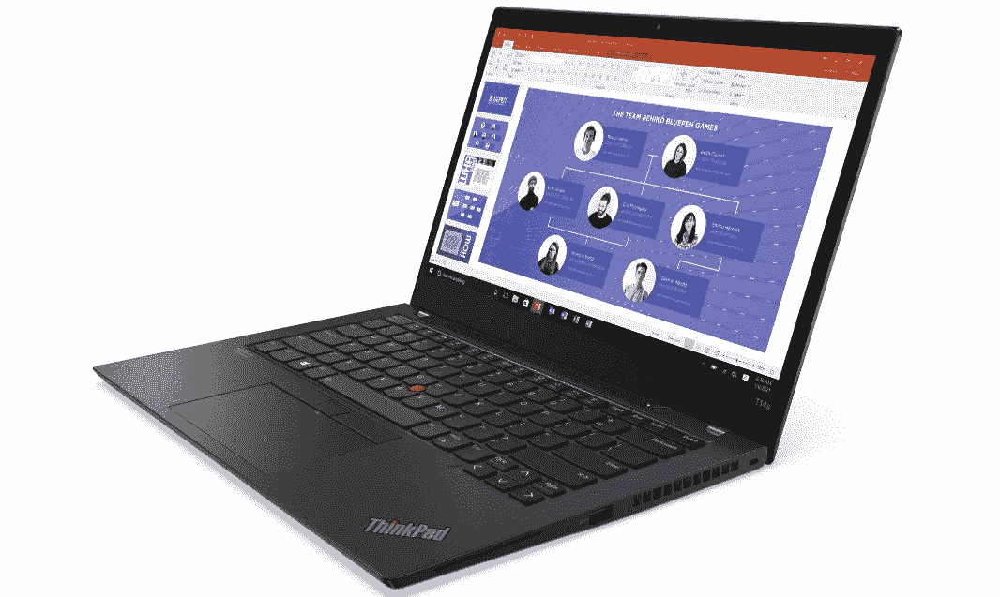

# 惠普 EliteBook 840 Aero vs 联想 ThinkPad T14s:哪个更好？

> 原文：<https://www.xda-developers.com/hp-elitebook-840-aero-vs-lenovo-thinkpad-t14s/>

笔记本电脑市场充斥着各种选择，做出决定可能很难。即使你特别关注[商用笔记本电脑](https://www.xda-developers.com/best-business-laptops/)，你也有一些不错的选择。今天你能找到的最好的商务笔记本电脑是 HP EliteBook 840 Aero 和联想 ThinkPad T14s Gen 2。这两个都是[轻量级](https://www.xda-developers.com/best-lightweight-laptops/)，并且有大量的配置选项，但是与另一个相比，它们都有自己的优缺点。

在本文中，我们将对这两款商用笔记本电脑进行对比，看看哪一款做得更好。最后，你应该更清楚选择哪一款适合你的个人需求。

## 规范

像往常一样，我们将从简单比较这两款笔记本电脑的规格开始。这让我们来看看它们在功能方面的基本区别。

|  | 

惠普 EliteBook 840 Aero G8

 | 

联想 ThinkPad T14s Gen 2

 |
| --- | --- | --- |
| **操作系统** | 

*   Windows 10 主页
*   Windows 10 专业版

 | 

*   Windows 10 主页
*   Windows 10 专业版

 |
| **处理器** | 

*   英特尔酷睿 i5-1135G7(最高 4.2GHz，四核)
*   英特尔酷睿 i5-1145G7 博锐处理器(最高 4,4GHz，四核)
*   英特尔酷睿 i7-1165G7(最高 4.7GHz，四核)
*   英特尔酷睿 i7-1185G7 博锐处理器(最高 4.8GHz，四核)

 | 

*   英特尔酷睿 i5-1135G7(最高 4.2GHz，四核)
*   英特尔酷睿 i5-1145G7 博锐处理器(最高 4,4GHz，四核)
*   英特尔酷睿 i7-1165G7(最高 4.7GHz，四核)
*   英特尔酷睿 i7-1185G7 博锐处理器(最高 4.8GHz，四核)

 |
| **图形** |  |  |
| **闸板** |  |  |
| **存储** | 

*   256GB
*   512GB
*   512GB + 32GB 英特尔 Optane
*   1TB
*   2TB

 |  |
| **显示** | 

*   14 英寸全高清(1920 x 1080)，防眩光，高达 1000 尼特
    *   可选的隐私屏幕
    *   可选环境光传感器
    *   可选触摸

 | 

*   14 英寸全高清(1920 x 1080)，防眩光，最高 500 尼特
    *   可选触摸
    *   可选的隐私保护
*   14 英寸超高清(3840 x 2160)，防眩光，非触摸，杜比视觉，500 尼特

 |
| **音频** |  | 

*   带杜比音频的双立体声扬声器

 |
| **网络摄像头** |  | 

*   720p 高清摄像头
*   1080p 全高清网络摄像头

 |
| **生物认证** | 

*   Windows Hello 红外摄像机
*   指纹识别器(可选)

 | 

*   Windows Hello 红外摄像头(可选)
    *   可选项:人体存在检测
*   指纹识别器(可选)

 |
| **电池** |  |  |
| **端口** | 

*   2 个 Thunderbolt 4(USB C 类)端口
*   2 个 USB 3.2 第 1 代 A 类端口
*   HDMI 2.0b
*   3.5 毫米耳机插孔
*   智能卡读卡器(可选)

 | 

*   2 个 Thunderbolt 4(USB C 类)端口
*   两个 USB 3.2 第 1 代 A 类端口
*   HDMI 2.0
*   3.5 毫米耳机插孔
*   机械对接插槽
*   智能卡(可选)

 |
| **连通性** | 

*   英特尔 AX201 Wi-Fi 6 (2x2) +蓝牙 5.0
*   4G LTE(英特尔 XMM 7360，第 9 类)(可选)
*   5G(骁龙 X55)(可选)
*   NFC(可选)

 | 

*   英特尔 AX201 Wi-Fi 6 (2x2) +蓝牙 5.2
*   英特尔 AX210 Wi-Fi 6E (2x2) +蓝牙 5.2
*   4G LTE (Quectel EM120R-GL，第 12 类)(可选)
*   5G(骁龙 X55)(可选)

 |
| **颜色** |  |  |
| **尺寸(WxDxH)** | 12.71 x 8.46 x 0.7 英寸(322.83 x 214.88 x 17.78 毫米) | 

*   4K 或低功耗 FHD: 12.89 x 8.82 x 0.63 英寸(327.5 x 224 x 16.14 毫米)
*   其他黑色显示屏选项:12.89 x 8.83 x 0.66 英寸(327.5 x 224.4 x 16.81 毫米)
*   风暴灰:12.89 x 8.87 x 0.66 英寸(327.5 x 225.4 x 16.81 毫米)

 |
| **重量** | 起始重量为 2.5 磅(1.13 千克) | 

*   起始重量为 2.83 磅(1.28 千克)

 |
| **起价** | 1 591.20 美元(各不相同) | $1,606.38 |

## 性能:HP EliteBook 840 Aero 拥有更多内存和存储空间

联想 ThinkPad T14s 和惠普 EliteBook 840 Aero 都有类似的英特尔 Tiger Lake CPUs。在大多数情况下，您可以预期性能是相似的，但也有一些关键的区别。

惠普 EliteBook 840 Aero 在 RAM 和存储方面更有优势。它可以有高达 64GB 的内存，而 ThinkPad T14s 的最大内存为 32GB。此外，对于 ThinkPad T14s，只有升级到英特尔酷睿 i7 处理器，才能获得 32GB 的内存。惠普让你随意组合内存和处理器。另一方面，ThinkPad T14s 上的 RAM 主频为 4，266MHz，而 EliteBook 840 Aero 使用的是 3，200MHz RAM。

此外，HP EliteBook 840 Aero 可以配备高达 2TB 的固态硬盘存储，而联想 ThinkPad T14s Gen 2 的最大存储容量为 1TB。这应该会让笔记本电脑更容易使用几年，而不必担心删除旧文件或使用云服务。

（...)HP EliteBook 840 Aero 可配备高达 2TB 的固态硬盘存储(...)

关于性能的话题，我们也可以触及网络性能。这两款笔记本电脑都可以配置蜂窝网络，并且都提供 5G 选项。然而，5G 升级在联想 ThinkPad T14S 上比在 EliteBook 840 Aero 上贵得多。此外，如果你想要 5G，联想要求你添加一个红外摄像头，所以在基础价格上增加了 37 美元。EliteBook 840 Aero 的每个型号都包括一个红外摄像头，所以这不是一个问题。同样值得注意的是，如果你想购买风暴灰色的联想 ThinkPad T14s，没有蜂窝网络选项。

然而，联想 ThinkPad T14s 在 Wi-Fi 性能方面具有潜在优势。一些型号支持 Wi-Fi 6E，虽然这还不是一项常见的技术，但随着时间的推移，它应该会变得更加广泛。Wi-Fi 6E 可以提供比标准 Wi-Fi 6 更高的速度，尽管它的范围较短。但是，如果你自己配置笔记本电脑，看起来你不能选择这个选项——你必须购买一个预设的配置。

## 设计和端口:HP EliteBook 840 Aero 更轻(主要是)更小

如果您经常离家工作，并且您关心便携性，HP EliteBook 840 Aero 在这方面略微领先。这款笔记本电脑的起始重量仅为 2.5 磅，而联想 ThinkPad T14s Gen 2 的起始重量为 2.83 磅。这不是一个巨大的差异，但如果你在背包中携带笔记本电脑数小时，你可能会注意到这一点。惠普 EliteBook 840 Aero 的宽度和高度也不如联想 ThinkPad T14s，但联想笔记本电脑更薄。

如果您经常离家工作，并且您关心便携性，HP EliteBook 840 Aero 在这方面略微领先。

端口方面，两款笔记本电脑非常相似。两者都有两个 Thunderbolt 4 端口，而且都放在笔记本电脑的同一侧，限制了你的充电选择。这两款笔记本电脑还有两个 USB 3.2 Gen 1 端口、HDMI 2.0 和一个耳机插孔，不过 ThinkPad T14s 增加了一个小型以太网扩展，可以用于有线连接。然而，你仍然需要一个标准 RJ45 连接的适配器。

再来看看其他产品，HP EliteBook 840 Aero 的所有配置中都包括一个红外摄像头，而联想 ThinkPad T14s 仅提供它作为一个选项。另一方面，联想提供了添加人类存在检测的选项，因此当你靠近笔记本电脑时，它就会醒来，当它看到你的脸时就会解锁。这一切都是无缝的，不需要你采取任何行动，所以更方便。这两款笔记本电脑还提供了添加指纹识别器的选项。

至于美观，联想给你两种颜色选择——绒毛黑和风暴灰——而惠普只让你选择银色。然而，这里值得注意的是，ThinkPad T14s 的风暴灰色型号在您如何配置它方面有一些限制。前面提到的人类存在检测在这里不是一个选项，如果您选择 Storm Grey 模型，您也不能添加蜂窝连接。虽然你可以选择，但很明显联想更喜欢经典的黑色。

## 显示屏:4K 仅在联想 ThinkPad T14s Gen 2 上提供

说到显示器，这两款笔记本电脑的基本配置非常相似。两者都是全高清 16:9 显示屏，并且都提供了触摸屏和隐私显示屏的选项。不过，惠普的 Sure View 隐私显示器应该可以提供更好的可视性，因为它是一个 1000 尼特的面板，而联想的笔记本电脑只有 500 尼特。然而，HP EliteBook 840 Aero 上的一些显示选项限制了您添加蜂窝连接的能力。如果你添加了触摸屏，你只能获得 4G 的选项，如果你选择了低功耗的 400 尼特面板，你根本不能获得蜂窝。

联想还有另一个潜在的巨大优势。惠普只能让你获得带全高清面板的 EliteBook 840 Aero，但有了联想 ThinkPad T14s Gen 2，你可以一直到超高清，完全支持杜比视界和 HDR 400。这个选项并不意味着你不能得到一个 1080p 的摄像头，但是，所以你必须权衡你的优先权。平心而论，惠普根本没有给你全高清摄像头的选择，所以联想在这里还是赢了。

## 结果

这是一场势均力敌的比赛，但做出决定取决于你需要考虑的几个因素。在基本配置上，这些笔记本电脑非常相似，但惠普有一些优势。默认情况下，Windows Hello 包含一个红外摄像头。另外，EliteBook 840 Aero 比联想 ThinkPad T14s 更轻更小(尽管它更厚)。相反，联想使用更快的 RAM，并提供两种颜色供您选择，而惠普的 EliteBook 840 Aero 只有一种颜色。

更大的区别在于你能得到的升级。联想 ThinkPad T14s 的 4K 面板有可能带来更好的显示效果。此外，如果你想多花一点钱，你可以添加一些很酷的额外功能，如人类存在检测，以尽可能无缝地锁定和解锁你的计算机。不过这个功能只有 ThinkPad T14s 的黑色款才有。

联想 ThinkPad T14s 的 4K 面板有可能带来更好的显示效果。

另一方面，HP Pavilion 840 Aero 提供了更多的内存和存储空间。您可以获得高达 64GB 的 RAM，这对于内存密集型任务或多任务处理来说非常棒。此外，2TB 的存储空间为您提供了大量存储文件的空间，如果您主要存储文档和工作文件，它应该可以供您使用很长时间。如果你对 5G 感兴趣，惠普的笔记本电脑比联想的更实惠。

如果你已经下定决心，你可以使用下面的链接选择你喜欢的笔记本电脑。如果你还没有完全信服，看看其他[伟大的惠普笔记本电脑](https://www.xda-developers.com/best-hp-laptops/)，或者前往[联想最好的 ThinkPad](https://www.xda-developers.com/best-thinkpads/)。

 <picture></picture> 

HP EliteBook 840 Aero G8

##### 惠普 EliteBook 840 Aero G8

HP EliteBook 840 Aero 是一款轻便的翻盖式笔记本电脑，为企业用户提供了大量配置选项。您可以获得高达 64GB 的 RAM 和 2TB 的存储，以及 5G 支持。

 <picture></picture> 

Lenovo ThinkPad T14s Gen 2

##### 联想 ThinkPad T14s Gen 2

联想 ThinkPad T14s Gen 2 是一款轻薄笔记本电脑，采用英特尔 Tiger Lake 处理器。它可以配置高达 4K 显示器和 5G 支持。