# HP EliteBook 840 G9 的最佳配件

> 原文：<https://www.xda-developers.com/hp-elitebook-840-g9-accessories/>

购买像 HP EliteBook 840 G9 这样的新型商用笔记本电脑仅仅是一个开始。一旦你在工作或家里体验了你的[笔记本电脑](https://www.xda-developers.com/best-laptops/)，你可能会想给它加点配件。你需要一个显示器来扩展 1920 x 1200 分辨率的显示器，甚至可能需要一个坞站来帮助你连接其他附件。

这就是为什么我们想说你来对地方了。在这篇文章中，我们为 HP EliteBook 840 G9 收集了一些我们最喜欢的配件。这些来自许多不同的类别。我们将看到显示器、GPU 外壳、坞站、鼠标、耳机、网络摄像头、外壳、外部固态硬盘，甚至是外壳和袖子等随机物品。请跟随我们一起浏览下面的导航指南。

**浏览本指南:**

## HP EliteBook 840 G9 的显示器

有些人可能能够在 HP EliteBook 840 G9 的 1920 x 1200 分辨率显示屏上完成他们需要的基本工作。它很宽敞，为多任务处理提供了充足的空间，但专用显示器可以为您做更多的事情。你可以一次打开更多的窗口，甚至可以与游戏机或其他电脑共享显示器。这些是我们的选择。

*   <picture></picture>

    惠普 E34m G4 34 WQHD 曲面屏 LED 液晶显示器

    ##### 惠普 E34m G4 34 WQHD 曲面屏 LED 液晶显示器

    惠普 E34m G4 34 英寸显示器让您尽情享受时尚的视频会议。它拥有 HDMI 连接，75Hz 的刷新率，以及弹出式网络摄像头和内置扬声器。超宽的 3440x1440 分辨率也将帮助您在屏幕上一次显示更多内容。

*   <picture>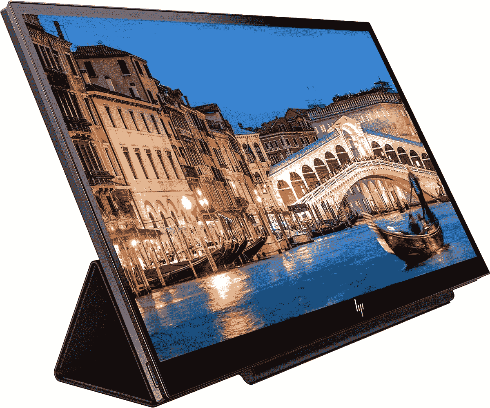</picture>

    惠普 S14 FHD 便携显示器

    ##### 惠普 S14 FHD 便携显示器

    如果你想要一款惠普官方便携显示器，这款就是你要购买的。它与 USB-C 连接，并包括一个迷你扬声器，因此您可以无线输出笔记本电脑上的音频。

*   <picture>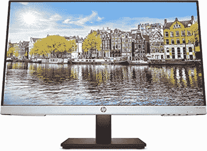</picture>

    惠普 24MH FHD 显示器

    ##### 惠普 24MH FHD 显示器

    这款惠普显示器拥有您需要的基本配置，不会超出预算。您将获得 FHD 分辨率、HDMI 和 DisplayPort 连接，价格不到 180 美元。

*   <picture></picture>

    戴尔 UltraSharp u 3223 QE

    ##### 戴尔 UltraSharp U3223QUE

    戴尔 UltraSharp u 3223 que 是一款现象级的 4K 显示器，配有 32 英寸面板。它采用 IPS 黑科技，对比度是典型 IPS 面板的两倍，并且具有出色的色彩覆盖范围，包括 100%的 sRGB 和 98%的 DCI-P3。

*   <picture></picture>

    华硕 ProArt PA278CV

    ##### 华硕 ProArt PA278CV 27 英寸 WQHD 显示器

    华硕 pro art pa 278 cv 是一款适合任何人的出色显示器，提供了规格和价格的完美结合。您可以获得四倍高清分辨率，100%覆盖 sRGB 和 Rec。709，色彩准确度等级为δE<2。这一切都是在一个非常好的价格。

## 适用于 HP EliteBook 840 G9 的外部 GPU

惠普 Elitebook 840 G9 内部没有配备 GPU。这意味着如果你想做更苛刻的任务，如游戏或运行虚拟机，甚至视频编辑，你就必须投资一个外部 GPU。您可以购买大量产品，但大多数产品的价格几乎与另一台笔记本电脑一样高，因为机箱中不包含 GPU。如果这对你来说是值得的，看看下面吧。

*   <picture></picture>

    Mantiz Saturn Pro II

    ##### Mantiz MZ-03 Saturn Pro II

    Mantiz Saturn pre II 是外置 GPU 盘柜的另一个绝佳选择。它可以为 GPU 提供高达 550 瓦的功率，为笔记本电脑提供 100 瓦的功率，甚至还有一个用于硬盘或固态硬盘的 SATA 插槽。此外，它还具有多个 USB 端口和以太网，可扩展您笔记本电脑上的连接

*   <picture></picture>

    Gigabyte Aorus 游戏盒

    ##### Gigabyte Aorus 游戏盒

    外置 GPU 机箱通常需要你单独购买 GPU，但这个包装中包含一个 NVIDIA GeForce RTX 3080。盘柜本身有一个 550 瓦的 PSU，并增加了三个 USB 端口和以太网。它最近降价了，这使它比以往任何时候都是更好的选择。

## HP EliteBook 840 G9 的坞站和适配器

虽然 HP EliteBook 840 G9 有许多端口，包括 2 个 Thunderbolt 4 端口、2 个 USB-A 端口、一个 HDMI 端口和一个智能卡读卡器，但您可能需要更多端口。在这些情况下，您需要购买一个坞站。有各种各样的坞站可以选择，从简单的到更复杂的 Thunderbolt 4 坞站。这里有一个选择。

*   <picture></picture>

    戴尔双充电坞站

    ##### 戴尔双充电坞站

    并不适合所有人，但戴尔双充电坞站是一款有趣的产品，它可以为您的笔记本电脑提供更多端口，为它充电，还可以为您的手机提供无线充电板。这相当昂贵，但你可以获得一些额外的端口和一个非常独特的功能集来启动

*   <picture></picture>

    Anker 341 USB-C Hub

    ##### Anker 341 USB-C Hub

    如果你只需要几个额外的端口而不需要太多花里胡哨的话，这款来自 Anker 的 7 合 1 hub 是个不错的选择。它有 USB Type-A 端口，HDMI，甚至支持高达 85W 的功率输出。它也很小，所以很容易随身携带，这样您就可以随时准备更多的端口。

*   <picture></picture>

    Caldigit TS4

    ##### Caldigit TS4 迅雷 4 Dock

    迅雷 Dock 比 Caldigit TS4 好不了多少。总共有 18 个端口，包括 Thunderbolt 下游端口、DisplayPort、USB-C、USB-A 和超快 2.5Gb 以太网，这一个是另一回事。它还具有坚固的金属结构，这有助于它感觉优质和耐用。

*   <picture></picture>

    亚马逊基本款 10 合 1 雷电 3 坞

    ##### 亚马逊基本款 10 合 1 雷电 3 坞

    大多数 Thunderbolt 坞的价格往往超过 300 美元，但这款来自亚马逊基本款的价格在 250 美元以下。它仍然有稳定的端口供应，包括 DisplayPort 和以太网。USB Type-A，以及下游迅雷。

*   <picture>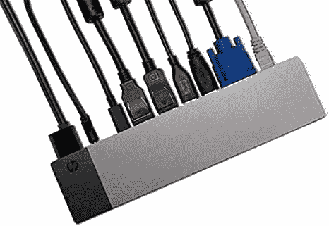</picture>

    HP elite book ZBook TB3 Thunderbolt Dock 90W

    ##### HP elite book z book TB3 Thunderbolt Dock 90W

    该 Dock 旨在与 z book 工作站一起使用，但它可以与任何设备一起工作。它可以为笔记本电脑提供高达 90 瓦的功率，并将添加从 USB-A、显示端口、VGA，甚至耳机插孔和 RJ45 以太网插孔

    的广泛端口

## 适用于 HP EliteBook 840 G9 的鼠标和键盘

如果你和我一样，总有一天笔记本电脑的键盘和鼠标不再适合你。可能是感觉太拥挤，或者让你的手腕和手疼痛。这就是为什么你可以投资全尺寸键盘或专用鼠标。有了其中的一些选项，您可以整天无忧无虑地打字和滚动。

 <picture>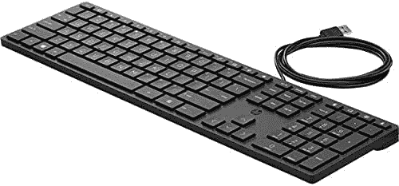</picture> 

HP Smart Buy Wired 320K Keyboard

##### 惠普智能购买有线 320K 键盘

惠普的这款有线键盘可以连接到笔记本电脑的 USB 端口。你永远不必担心充电或更换电池。

 <picture>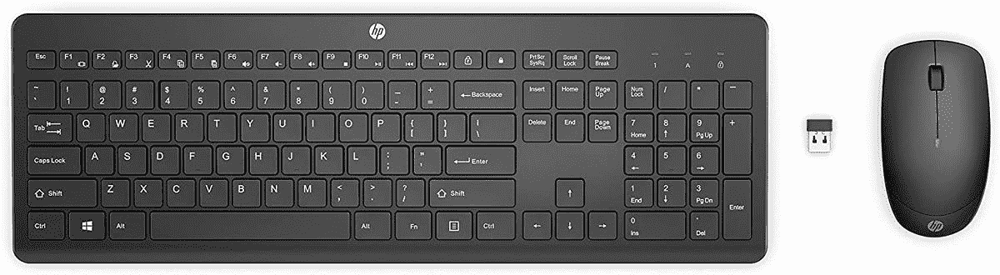</picture> 

HP 230 WL Mouse and KB Combo

##### 惠普 230 WL 鼠标和 KB 组合

惠普的这款键盘和鼠标组合为您提供了使用带显示器的笔记本电脑所需的一切。这是基本的，而且一定会持续下去。

 <picture>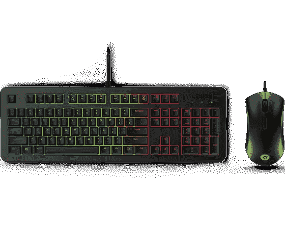</picture> 

Lenovo Legion KM300 RGB Gaming Mouse and Keyboard Combo

##### 联想军团 KM300 RGB 游戏鼠标和键盘组合

惠普产品用于商业，但这种键盘和鼠标组合会让你看起来很花哨。有了 RGB 背光效果，你就可以在工作中鹤立鸡群，大放异彩。

 <picture>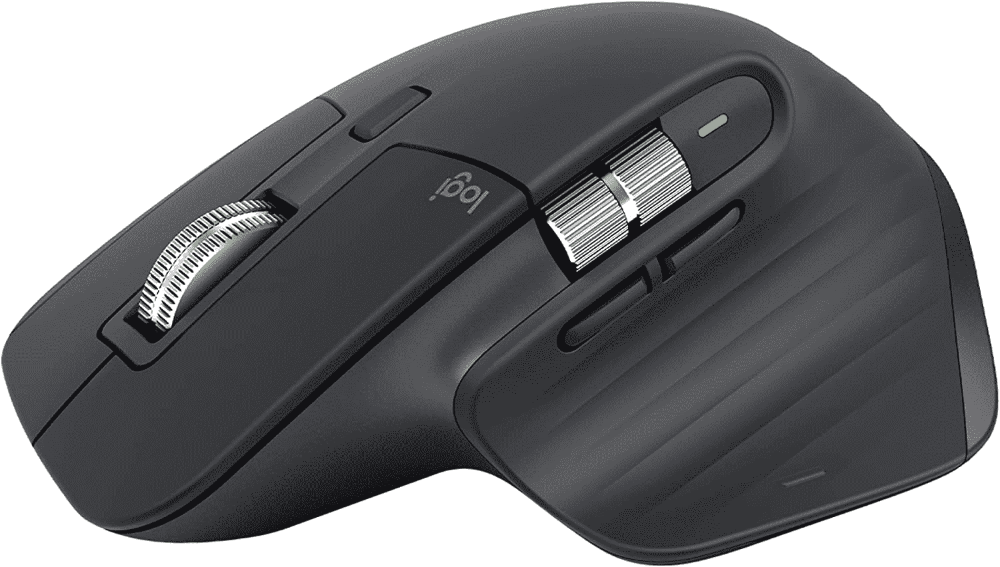</picture> 

Logitech MX Master 3S

##### 罗技 MX 大师 3S

如果笔记本电脑上的内置触控板让你的手或手臂疼痛，罗技的这款鼠标可以让你放松。它有一个舒适的侧手柄，以及大量可定制的按钮。

 <picture></picture> 

Logitech MX Mechnical

##### 罗技 MX 机械

机械键盘通常是专业打字员的首选，罗技 MX Mechanical 是一个很好的选择。它将多种设备的使用等生产力功能与触摸按键和多种模式的纯白色 LED 背光等游戏功能相结合。

 <picture></picture> 

HP X500 Wired Mouse

##### 惠普 X500

这款有线鼠标将通过 USB 连接到您的惠普笔记本电脑。它不需要电池或充电，将持续到永远。

## 适用于 HP EliteBook 840 G9 的耳机或耳塞

HP EliteBook 840 G9 上的扬声器非常逼真，但有时您可能需要更多的个人音频。这就是耳机和耳塞的作用。有了这些选择，您可以一整天都舒适地戴着耳机或耳塞，从笔记本电脑中获得最佳的音乐、会议等声音。

 <picture>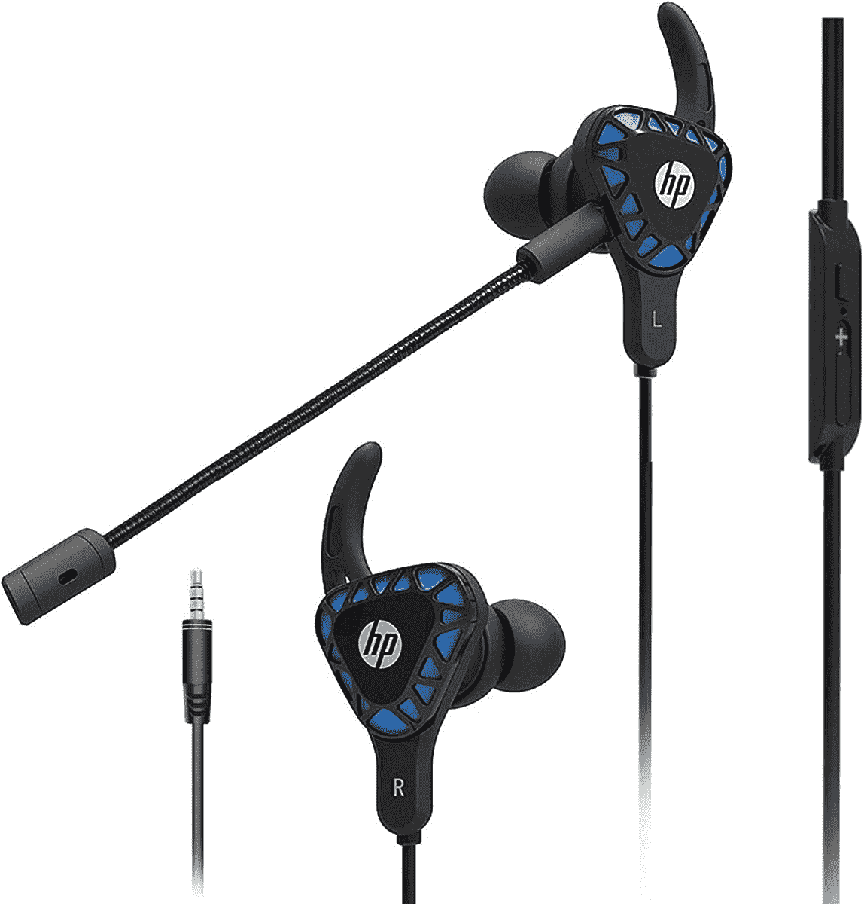</picture> 

HP Gaming Earbuds with mic

##### 带麦克风的惠普游戏耳塞

这些惠普耳塞具有深沉的低音和内置耳机。你将能够沉浸在你的音乐中。

 <picture></picture> 

Sony WH-1000XM5

##### 索尼 WH-1000XM5

索尼生产了一些世界上最好的音频产品，WH-1000XM5 耳机采用了新的更时尚的设计，更好的音频，改进的 ANC，八个麦克风和两个处理器，以及 30 小时的电池寿命。它很贵，但它提供了一种奇妙的体验。

 <picture>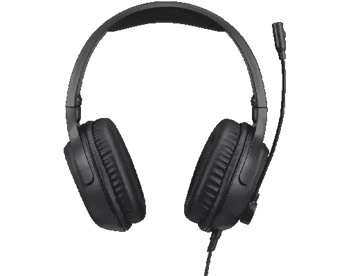</picture> 

Lenovo IdeaPad Gaming H100 Headset

##### 联想 IdeaPad 游戏 H100 耳机

虽然不是惠普的产品，但这款耳机提供了出色的声音和麦克风，让您沉浸在会议中。你可以旋转它来存放它，从侧面控制音量，并通过软垫耳罩长时间佩戴它。

## HP EliteBook 840 G9 的网络摄像头

如今，我们都在网络摄像头前花费了更多的时间，你需要保持最佳状态。虽然 HP Elitebook 840 G9 上的 500 万像素网络摄像头很棒，但您可以使用专用网络摄像头来扩展它。我们的选择质量更高，将帮助您在 Zoom、Skype 或 Microsoft Teams 通话中看起来更干净、更明亮。

 <picture></picture> 

Lenovo IdeaPad Gaming H100 Headset

##### 惠普 W500 网络摄像头

这款惠普制造的网络摄像头分辨率为 1080p 全高清。它也有很多智能功能，就像你的 HP EliteBook 一样，可以帮助你看起来更好。甚至还有一个广角选项，可以帮助你在框架中适应更多的身体。

 <picture>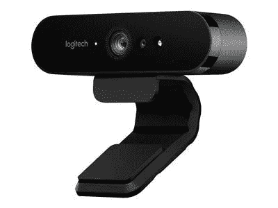</picture> 

Logitech Brio 4K Pro Webcam

##### 罗技布里奥 4K 专业网络摄像头

罗技布里奥 4K 网络摄像头是最高评级之一。具有数码变焦、清晰的 4K 传感器和对 Windows Hello 的支持等功能。

 <picture></picture> 

Obsbot Tiny 4K

##### 小小 4K

Obsbot 微型 4K 网络摄像头是一款令人敬畏的人工智能摄像头，它不仅具有出色的图像质量(尽管它也有这一点。它实际上可以实时跟踪用户，并通过旋转和倾斜其底座来确保他们留在框架中。如果你想在通话中四处走动，这是最完美的。

## 适用于 HP EliteBook 840 G9 的机箱

如果你像我一样，在一台笔记本电脑上的花费远远超过 1000 美元，那么你会想要投资一个箱子来帮助保护它的安全。如果没有箱子，那么袖子也是一个不错的选择。这有助于确保您不会划伤新笔记本电脑的表面。这些是我们最喜欢的，点击这里查看我们的完整列表。

 <picture>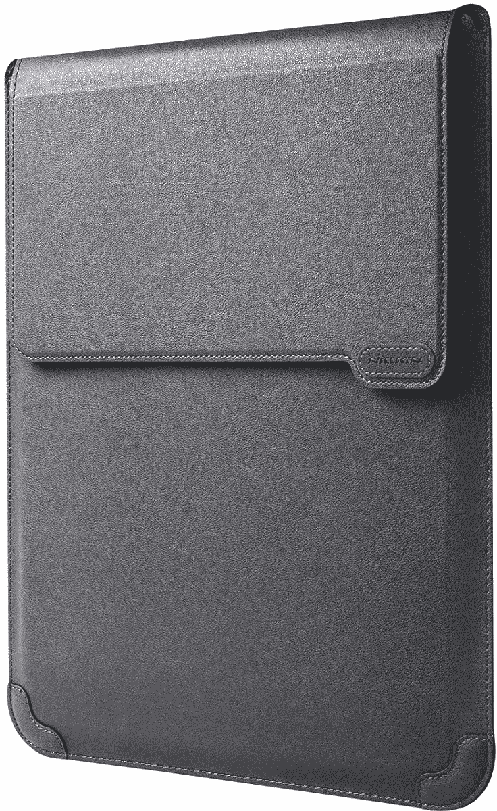</picture> 

Nillkin Laptop Sleeve

##### Nillkin 笔记本电脑包，带支架

Nillkin 保护套是一个有趣的案例，因为它不仅可以为您的 HP EliteBook 840 G9 提供保护，还可以兼作笔记本电脑支架，翻盖可以用作鼠标垫，更加精确。

 <picture>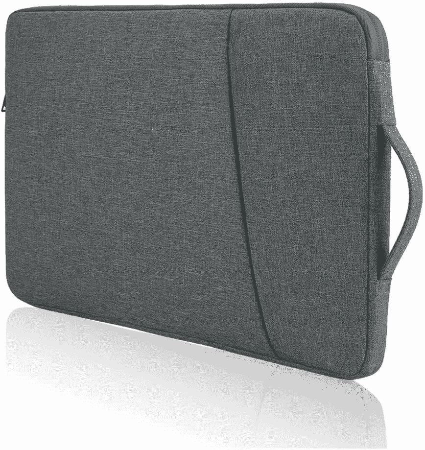</picture> 

Bevegekos Laptop Sleeve

##### Bevegekos 笔记本电脑套

这款 Bevegekos 袖套可能没有任何特别之处，但它是保护笔记本电脑的一种廉价而有效的方式。它有一个额外的口袋，可以放配件，还有一个提手，可以让你垂直拿着它。

 <picture></picture> 

Smatree 14-inch hard sleeve

##### Smatree 硬质笔记本电脑套

有时你需要一些更坚韧的东西，这款来自 Smatree 的硬套可以为你提供更强的保护，防止更硬的碰撞和跌落，而且它还防水。它没有额外的口袋或手柄，但如果你需要更多的耐用性，这是很好的。

## HP EliteBook 840 G9 的外部存储

HP EliteBook 840 G9 可以选择添加高达 2TB 的存储空间。你可以在结账时这样做，但这会增加你的最终价格。这就是我们建议查看这些外部存储解决方案的原因。您将能够在旅途中和离开笔记本电脑时存储不太重要的文件，从而释放空间。我们有三个顶级建议供你选择。

 <picture>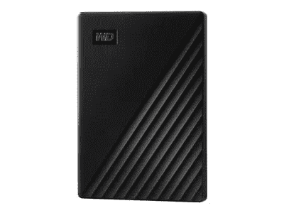</picture> 

WD 1TB My Passport External Hard Drive

##### WD My Passport 外置硬盘

需要额外的文件存储空间？这款外置硬盘容量为 1TB，可以保证您重要文档的安全和加密

 <picture>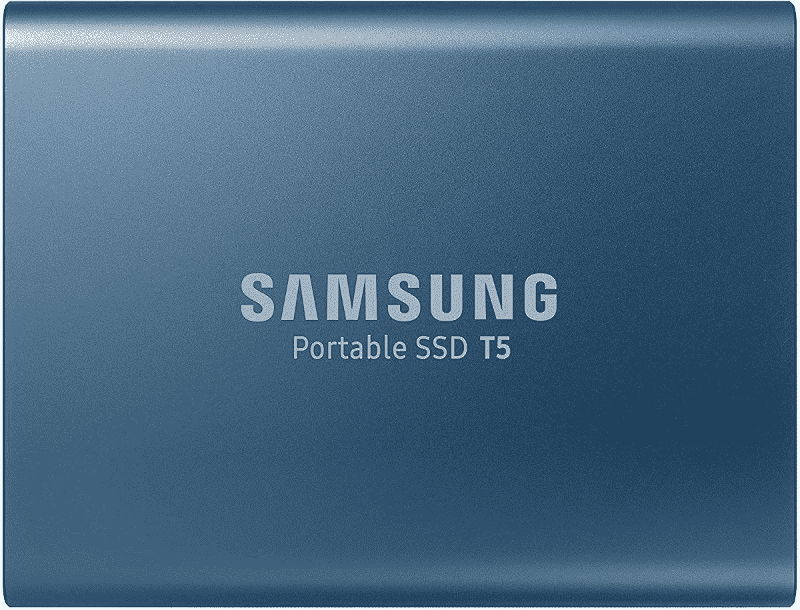</picture> 

Samsung T5 SSD

##### 三星 T5 便携式固态硬盘

三星 T5 固态硬盘是一款紧凑型迷你外置固态硬盘，可以存放您的文档。它通过 USB-C 连接，因此非常适合现代电脑。

##### 可插拔雷电 3 外置固态硬盘

如果你担心放错线缆，这款固态硬盘内置了这一功能。它还支持 Thunderbolt，尽管速度只能达到 2400 MB/s 的读取和 1800 MB/s 的写入，这仍然比大多数速度都快。

## HP EliteBook 840 G9 的充电器

购买 HP EliteBook 840 G9 时，惠普提供 65 瓦智能充电器或标准 45 瓦充电器。为了更快地充电，你需要 65 瓦的选项。与其直接从惠普购买，我们建议您查看两款我们最喜欢的 USB-C 充电器。有了这些，你就可以给你的笔记本电脑以及手机、平板电脑等其他设备充电了。

 <picture>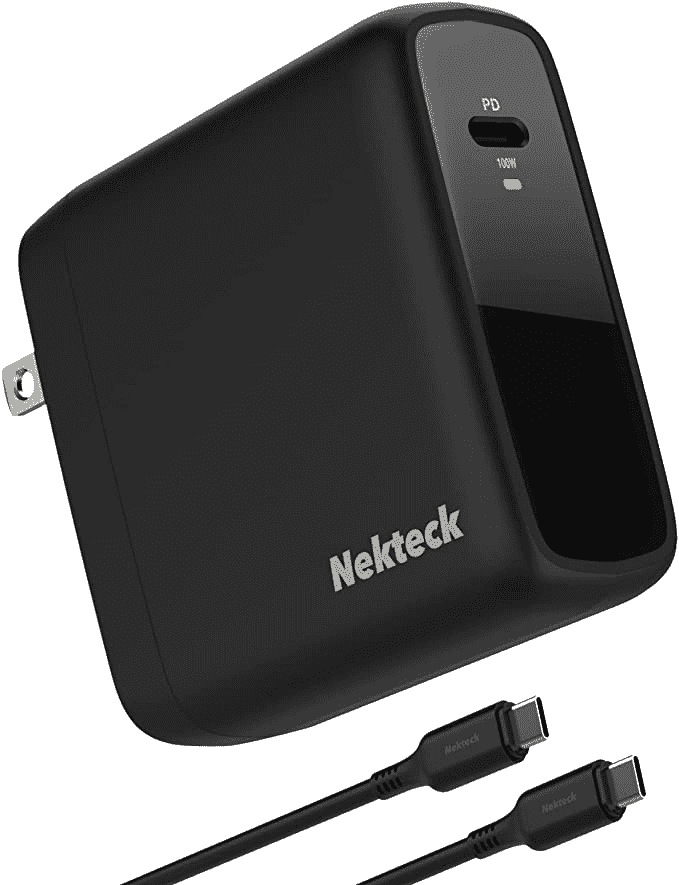</picture> 

Nekteck 100W USB-C Charger

##### Nekteck 100W GaN USB-C 充电器

如果你想要大多数 USB-C 设备最快的充电速度和更实惠的价格，Nekteck 100W 充电器是一个很好的选择。

 <picture>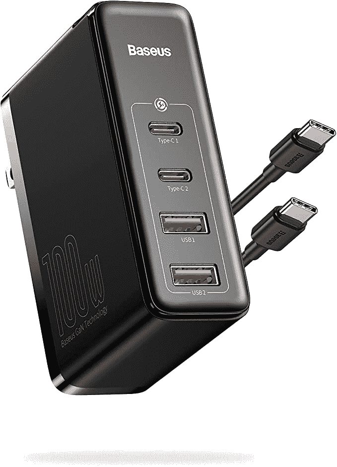</picture> 

Baseus 100W 4-Port Charger

##### Baseus 100W 4 端口 GaN II 快速充电站

如果您想在 ThinkPad 旁边给手机、平板电脑或其他设备充电，这款 100 瓦充电器有四个端口，让您可以做到这一点，同时仍然很紧凑。

## 适用于 HP EliteBook 840 G9 的杂项

我们介绍了您可以在新的 HP EliteBook 上使用的主要附件，但我们认为还有一些您可能会感兴趣的附件。这些可以帮助清洁您的笔记本电脑，让您使用起来更加舒适。以下是我们的建议。

 <picture>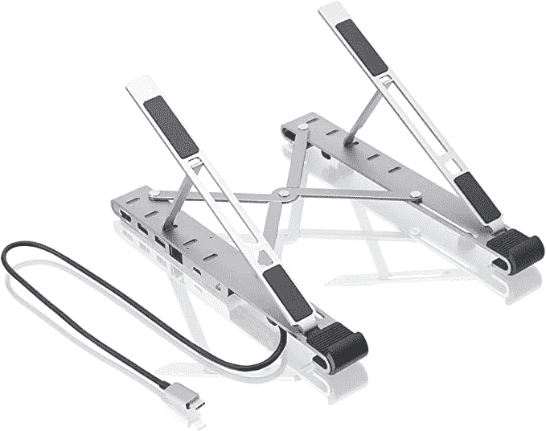</picture> 

IOGEAR Dock Pro

##### IOGEAR Dock Pro 100 USB-C 4K 超薄工作站

这种支架不仅有助于将您的电脑提升到一个很好的角度，以便打字和使用显示器，而且它还有一些内置的附加端口。您将不再需要同时使用坞站和支架，因为这是一种一体化解决方案。

 <picture>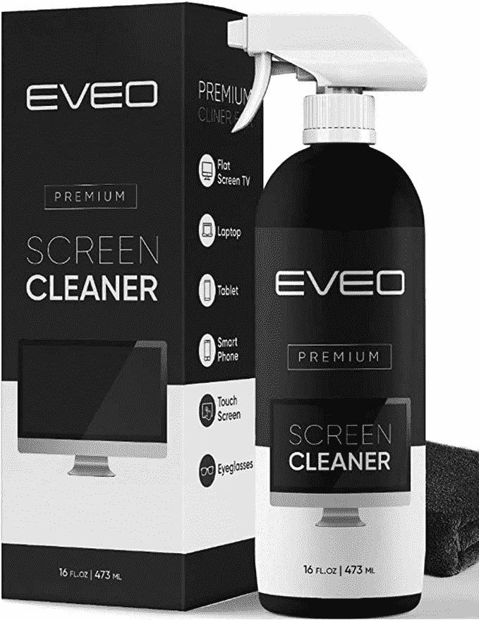</picture> 

EVEO Screen cleaner

##### Eveo 屏幕清洁器

这看起来很平常，但在使用一段时间后，很难保持笔记本电脑的屏幕清洁。该套件包括喷雾和超细纤维布，帮助您让您的 ThinkPad 看起来像新的一样。

 <picture></picture> 

Moft Laptop Stand

##### Moft Z 隐形笔记本电脑支架

我们都有过在办公桌上使用笔记本电脑不像我们希望的那样舒适的时候，Moft Z 是一款多功能笔记本电脑支架，可以解决这个问题。它可以让您在不同的位置和高度使用笔记本电脑，让您更舒适、更高效地工作。

正如您所知，我们已经没有 HP EliteBook 840 G9 配件可谈了。我们希望它们能对你的工作效率有所帮助，这也是为什么我们尽力让我们的列表尽可能的宽泛。

这提醒了我们，如果你还没有购买 HP EliteBook 840 G9，你可以通过下面的链接查看一下。起价为 2197 美元，但有时它的售价几乎是这个价格的一半。

 <picture>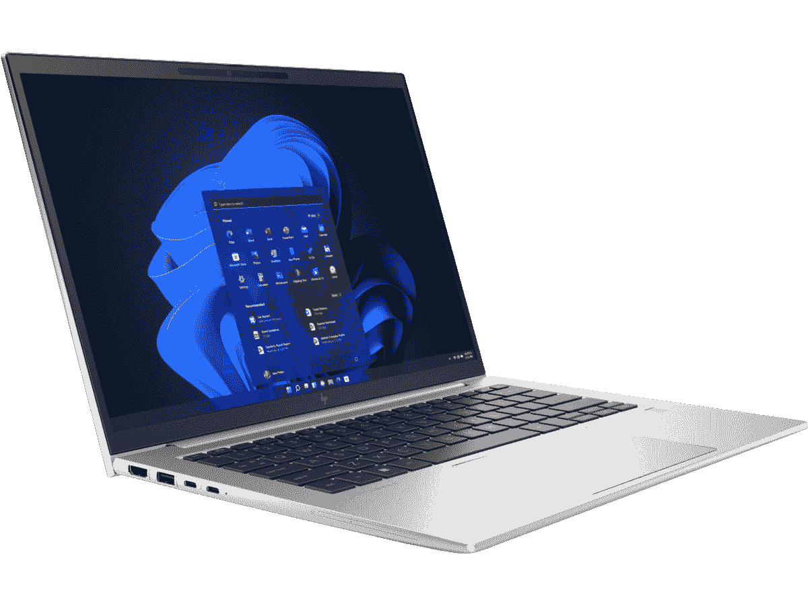</picture> 

HP EliteBook 840 G9

##### 惠普 EliteBook 840 G9

HP EliteBook 840 G9 是一款 14 英寸笔记本电脑，采用英特尔 P 系列处理器，设计时尚低调。