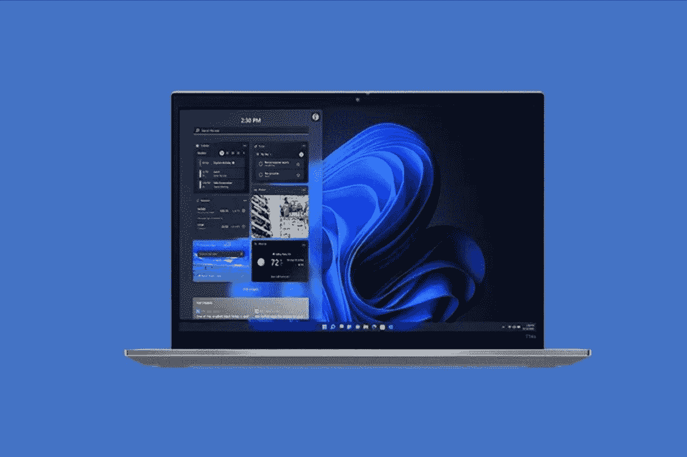

# 惠普 EliteBook 840 G9 vs 联想 ThinkPad T14s:主流商务笔记本电脑对决

> 原文：<https://www.xda-developers.com/hp-elitebook-840-g9-vs-lenovo-thinkpad-t14s-mainstream-business-laptop-showdown/>

你可以花钱买到大量的商用笔记本电脑，但 2022 年有两款真正值得比较，包括惠普 EliteBook 840 G9，以及联想 ThinkPad T14s。从英特尔第 12 代 CPU 到 1920 x 1200 分辨率显示器和整体端口选择，这两款笔记本电脑表面上看起来相似，但只有一款真正物有所值。

这就是为什么在本指南中，我们将看看这两款设备，并将它们放在不同的类别中进行对比。您可以通过查看下面的内容进行导航，我们将详细介绍总体性能、显示屏、设计、键盘、网络摄像头和连接性等规格。请继续阅读，了解更多信息。

**浏览本文:**

## 惠普 EliteBook 840 G9 与联想 ThinkPad T14s:规格

| 

投机

 | 

惠普 Elitebook 840 G9

 | 

联想 ThinkPad T14s

 |
| --- | --- | --- |
| **操作系统** | 

*   Windows 11 专业版
*   Windows 11 专业教育版
*   Windows 11 主页
*   Windows 11 家庭单一语言
*   Windows 11 专业版
*   Windows 11 企业版通过批量许可协议提供)
*   Windows 10 专业版(通过 Windows 11 专业版的降级权限提供)
*   FreeDOS

 | 

*   Windows 11 主页
*   Windows 11 专业版
*   企业版 Windows 11 专业版
*   通过 Windows 11 Pro 64 中的降级权限预装 Windows 10 Pro 64

 |
| **处理器** | 

*   第 12 代英特尔酷睿 i5-1250 处理器博锐
*   第 12 代英特尔酷睿 i7-1260 处理器
*   第 12 代英特尔酷睿 i7-1270 处理器博锐
*   第 12 代英特尔酷睿 i7-1280 处理器博锐

 | 

*   第 12 代英特尔酷睿 i5-1235U
*   支持博锐技术的第 12 代英特尔酷睿 i5-1240 处理器
*   第 12 代英特尔酷睿 i5-1245U 博锐处理器
*   支持博锐技术的第 12 代英特尔酷睿 i5-1250 处理器
*   第 12 代英特尔酷睿 i7-1260 处理器
*   支持博锐技术的第 12 代英特尔酷睿 i7-1270 处理器
*   支持博锐技术的第 12 代英特尔酷睿 i7-1280 处理器

 |
| **图形** |  |  |
| **闸板** | 

*   64 GB DDR5-4800 MHz RAM，非焊接，双通道支持

 | 

*   最高 32GB LPDDR5 4800Mhz，焊接，DIMM

 |
| **存储** | 

*   256 GB 最高 2 TB PCIe Gen4x4 NVMe M.2 固态硬盘 TLC
*   256 GB 高达 512 GB PCIe Gen4x4 NVMe M.2 SED 固态硬盘 TLC
*   256 GB 高达 512 GB 的 PCIe NVMe 超值 M.2 固态硬盘

 | 

*   高达 2TB 的 PCIe 固态硬盘第四代性能

 |
| **显示** | 

*   14 英寸 WUXGA LED UWVA 防眩光(1920x1200) 250 尼特
*   14 英寸 WUXGA LED UWVA 防眩光(1920x1200) 400 尼特
*   14 英寸 WUXGA LED UWVA 防眩光(1920x1200) 250 尼特，触摸
*   14 英寸 WUXGA LED UWVA 防眩光(1920x1200)防眩光隐私屏幕，1000 尼特

 | 

*   14 英寸 WUXGA (1920 x 1200) IPS，防眩光，300 尼特，45% NTSC 色域
*   14.4 英寸 WUXGA (1920 x 1200) IPS，防眩光，触摸，300 尼特，45% NTSC 色域
*   14 英寸 2.2K (2240 x 1400) IPS，防眩光，300 尼特，100% sRGB，Eyesafe 认证的低蓝光

 |
| **音频** | 

*   Bang & Olufsen 音频，双立体声扬声器，双阵列面向世界的麦克风

 | 

*   带杜比语音的杜比音频扬声器系统(2 个面向用户的麦克风)

 |
| **网络摄像头** | 

*   双阵列麦克风 500 万像素摄像头

 | 

*   720p 高清 RGB，带网络摄像头隐私快门(部分型号)
*   1080p FHD RGB，带网络摄像头隐私快门
*   1080p FHD +红外摄像头，带网络摄像头隐私快门

 |
| **Windows Hello** | 

*   是的，某些型号上有红外和指纹识别器

 | 

*   是的，所有型号的电源按钮上都有红外和指纹识别器

 |
| **电池** | 

*   长寿命 51 瓦时快速充电 3 芯电池

 |  |
| **港口** | 

*   2 个带 USB4 Type-C 的雷电 4
*   2 个超高速 USB 型
*   1 个 HDMI 2.0 接口
*   1 交流电源
*   耳机/麦克风组合

 | 

*   2 个英特尔迅雷 4
*   2 个 USB-A 3.2 第 1 代
*   HDMI 2.0
*   耳机/麦克风组合

 |
| **连通性** | 

*   英特尔 AX211Wi-Fi 6E
*   蓝牙 5.3
*   英特尔 XMM 7560 R+LTE-Advanced Pro Cat 16 WWAN 宽带无线
*   英特尔 5000 5G 解决方案 WWAN 宽带无线

 | 

*   英特尔 Wi-Fi 6E AX211 802.11AX (2 x 2)
*   支持 eSIM 的 4G/LTE(第 20 类)(部分型号)
*   支持 eSIM 的 4G/LTE(第 16 类)(部分型号)
*   带 eSIM 的 5G sub6 (CAT20)(部分型号)
*   蓝牙 5.2

 |
| **颜色** |  |  |
| **尺寸** | 

*   12.42 x 8.82 x 0.76 英寸

 | 

*   12.50 x 8.93 x 0.65 英寸

 |
| **重量** |  |  |
| **起始价格** | 

*   售价为 2，197 美元或 1，537 美元

 |  |
| **可用性** | 

*   某些型号视供货情况而定

 |  |

## 性能:势均力敌，但联想有更多选择

如果你看看这两款笔记本电脑的规格，你会注意到一件事。惠普和联想都配备了英特尔第 12 代处理器，支持或不支持博锐技术。这两种处理器选项也来自 P 系列。然而，有一个小而微妙的区别。联想提供了一个额外的选项，第 12 代英特尔 U 系列选项。请注意，博锐在这两款笔记本电脑中也很重要，因为它通常是企业寻求的东西。英特尔博锐特性包括硬件增强的安全特性，如用于远程可管理性的英特尔主动管理技术。像这样的博锐笔记本电脑也已经过英特尔认证，可以在企业中使用。

无论如何，虽然我们还没有评论这两款笔记本电脑，但英特尔的 P 系列 CPU 在这两款设备上的性能都将非常出色。这是因为英特尔的 P 系列芯片提供了大量的电力，而不会影响电池寿命。它的功率大约是 28 瓦。与其他第 12 代芯片一样，P 系列 CPU 也结合了性能和效率内核，以获得更好的性能。

这就是为什么联想有两种英特尔 U 系列芯片可供选择。特别是，该芯片的运行功率低于 P 系列。这意味着更长的电池寿命。当然，与 P 系列相比，您将获得更少的性能内核(与 P 系列 4 或 6 相比，它只有 2 个)，但您可能不会注意到这种日常差异。选择 U 系列芯片将有助于延长电池寿命。

在其他性能方面，惠普的 RAM 选项更高。你可以得到高达 64GB 的双通道，而且是可替换的。在联想上，只升到 32GB，换不出来。所以你可能要记住这一点。这两款笔记本电脑都提供 PCIe 第四代固态硬盘，最高可配置为 2TB，所以这是公平的。

## 显示:几乎相同，但差异很大

这些笔记本电脑的显示屏具有相同的分辨率。它们都被调整到 1900 x 1200，长宽比为 16:10。这也称为 WUXA 解决方案。我们确实更喜欢联想，因为它是 IPS 面板，而且惠普使用的是 LED。原因如下。

IPS 面板具有更好的图像质量和清晰度、色彩准确度、视角以及亮度。IPS 面板只是在对比度方面有点吃亏。联想的 LED 面板黑电平和对比度会更好，但可能会有更多的眩光。另一个区别呢？电池寿命。众所周知，LED 显示器效率更高，由于 IPS 显示器更亮，电池寿命会有所下降。

 <picture></picture> 

ThinkPad T14s Gen 3

这是一个很小的区别，但不是每个人都会注意到。否则的话，这两款笔记本电脑的亮度都是 300 尼特左右，并且都有触摸选项。您应该能够在两台笔记本电脑上正常工作，同时进行多任务处理并完成任务。它们都有细长的边框，会有身临其境的感觉。不过，惠普确实在更多的显示器选择上超过了联想，你可以选择防眩光隐私屏幕，并选择亮度高达 1000 尼特的显示器选项。

## 设计:两款都是翻盖式笔记本电脑

这两款笔记本电脑都是蛤壳式的，所以没有太多的设计差异。就重量和尺寸而言，两者差不多。这只是颜色的选择或重量的一小部分，让你与众不同。这里有更多的信息。

联想的 ThinkPad T14s Gen 3 由可回收的消费后物质(PCC)制成，如塑料和天然材料，包括扬声器外壳、电池盒和适配器在内的各种组件。这是一台又薄又轻的机器。重量约为 2.70 磅，厚度为 0.65 英寸。它还有一种标志性的雷黑色。

在光谱的另一端，HP EliteBook 840 G9 有点不同。对某些人来说，银色可能更引人注目。它也稍微重一点，厚一点。重量为 2.99 磅，厚度为 0.76 英寸。不过，你可能不会注意到这一点。以今天的标准来看，这两款机器都很轻，非常便携。

## 键盘和触控板:没人能打败联想

笔记本电脑的关键部分是键盘和触控板。在这些领域，没有人能打败联想。惠普 EliteBook 840 G9 上的键盘和触控板没什么问题，但是联想的好太多了。

我们这么说是因为联想 ThinkPad 键盘在顶端。有了可以拥抱手指的弧形键帽，在联想的机器上打字应该是轻而易举的事情。键盘中间还有一个额外的跟踪点，可用于精确点击。这种品质真的很难打。

惠普的键盘也很棒。它有更传统的 chicklet 风格的按键。键盘也与银色表面形成对比，因为键帽是黑色的。触控板也和联想的类似。它非常大，占据了笔记本电脑底部的三分之一。两台机器都有足够的滚动空间和舒适的打字空间。

哦，请注意，联想在另一个领域占据上风。联想和惠普的键盘都是背光的，但联想增加了防溅功能。如果你出了事故，水掉到了你的笔记本电脑上，那么联想更有可能安然无恙。

## 网络摄像头、端口、连接性:惠普胜出

2022 年，当我们都在笔记本电脑前花费更多时间时，网络摄像头和连接变得更加重要。在这方面，很难说惠普 EliteBook 更好。我们来解释一下原因。

从端口来看，这两台机器都连接良好。它在 Thunderbolt 4、USB-A、HDMI 和耳机/麦克风组合之间匹配。如果您购买这两款笔记本电脑中的任何一款，您都不需要加密狗，因为在任何给定的时间都会有端口可供您使用。

在连接性上，也是一个匹配。这两款机器都有 Wi-Fi 6E 和蓝牙，以及蜂窝连接选项。如果你打算带着你的笔记本电脑出门，那么你将会被覆盖，并且可以在没有 Wi-Fi 的情况下生活。也别忘了电池。联想有一个更大的 57Wh 电池，所以它会比惠普的 51Wh 电池持续更长时间，特别是如果你选择 U 系列芯片。

不过，有了网络摄像头，惠普胜出了。[惠普的大部分笔记本电脑](https://www.xda-developers.com/best-hp-laptops/)都改用了 5MP 网络摄像头。然而，联想的 ThinkPad 仍然停留在 720p 和 1080p 网络摄像头上。出于这个原因，你在惠普的网络摄像头上看起来会更好，特别是由于机载软件可以调整照明和其他效果，让你看起来更好。1080p 是网络摄像头的新标准，所以你不能责怪联想。哦，是的，两个网络摄像头都兼容 Windows Hello，所以你可以用你的脸登录你的电脑。

## 最终想法:购买联想

在比较这两款笔记本电脑时，我们真的认为您应该购买联想 ThinkPad T14s。这是一款便宜得多的设备，在几个方面优于 HP EliteBook 840 G9。首先是键盘。第二个是处理选项。第三，是重量和设计。最后是显示器。当然，网络摄像头可能不是最好的，所以这是惠普的优势，但如果你像我一样，你可能已经在使用外部网络摄像头了。点击下面的链接查看这些笔记本电脑。或者，查看我们的[最佳笔记本电脑指南](https://www.xda-developers.com/best-laptops/)了解更多信息。

 <picture></picture> 

ThinkPad T14s Gen 3

##### 联想 ThinkPad T14s Gen 3

ThinkPad T14s Gen 3 是一款性能强劲的商务笔记本电脑，拥有出色的键盘。

 <picture></picture> 

HP EliteBook 840 G9

##### 惠普 EliteBook 840 G9

HP EliteBook 840 G9 是一款高端商务笔记本电脑，具有高端规格和简洁的设计，非常适合办公使用。它还支持 5G 或 LTE，因此您可以在任何地方工作。