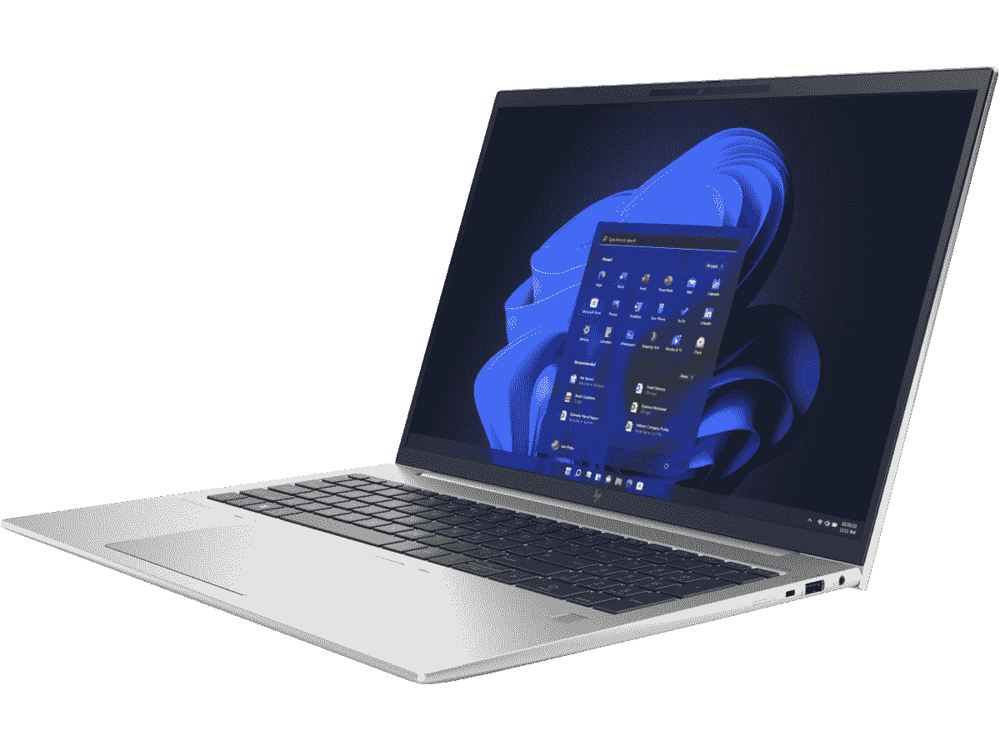

# HP EliteBook 865 G9 评测:完全符合您的预期

> 原文：<https://www.xda-developers.com/hp-elitebook-865-g9-review/>

惠普 EliteBook 865 G9 是惠普产品线中最大的商用笔记本电脑之一，也是其最高端的产品之一。它配备了 16:10 的大显示屏，优质的铝合金设计，以及最新的 AMD 锐龙 6000 系列处理器，提供了非常好的性能。惠普还将在 2022 年为其所有高端笔记本电脑配备 500 万像素网络摄像头，包括 EliteBook 865。

我没有发现这台笔记本电脑有什么特别令人兴奋的地方，但是它做了你期望它做的一切，而且做得非常好。性能很棒，电池续航时间很棒，没有什么感觉达不到预期。它也是少数配备 USB4 40Gbps 端口的 AMD 笔记本电脑之一，与成熟的雷电 3 几乎相同。

就像商务笔记本电脑的情况一样，所有这些都有一个有点沉重的价格标签，但随着频繁的销售，它变得更容易证明是合理的。

***关于本次评测:*** *惠普为我们送来了一款 EliteBook 865 G9 的高端机型，以供本次评测之用。它在出版前没有审查内容。*

惠普 EliteBook 865 G9 是惠普产品线中最大的[商务笔记本电脑](https://www.xda-developers.com/best-business-laptops/)之一，也是其最高端的产品之一。它配备了 16:10 的大显示屏，优质的铝合金设计，以及最新的 AMD 锐龙 6000 系列处理器，提供了非常好的性能。惠普还将在 2022 年为其所有高端笔记本电脑配备 500 万像素网络摄像头，包括 EliteBook 865。

我没有发现这台笔记本电脑有什么特别令人兴奋的地方，但是它做了你期望它做的一切，而且做得非常好。性能很棒，电池续航时间很棒，没有什么感觉达不到预期。它也是少数配备 USB4 40Gbps 端口的 AMD 笔记本电脑之一，与成熟的雷电 3 几乎相同。

就像商务笔记本电脑的情况一样，所有这些都有一个有点沉重的价格标签，但随着频繁的销售，它变得更容易证明是合理的。

***关于本次评测:*** *惠普给我们发来了一款高端型号的 EliteBook 865 G9，用于本次评测。它在出版前没有审查内容。*

## HP EliteBook 865:定价和可用性

*   HP EliteBook 865 G9 可在惠普网站上购买，也可通过各种面向企业的经销商购买
*   价格可能会有所不同，但这种型号的价格应该在 2189 美元左右

今年早些时候推出的惠普 EliteBook 800 G9 系列，包括 EliteBook 865 和其他不同尺寸的型号，以及采用英特尔处理器的选项。最容易找到它的地方是在惠普自己的网站上，但其他经销商也可能会出售它。正如许多商用笔记本电脑的情况一样，这种笔记本电脑可能很难在百思买等更以消费者为导向的零售商那里找到。

根据惠普的说法，我们在这次评测中获得的高端型号 EliteBook 865 G9 的价格为 2189 美元。然而，这可能会有很大的变化，因为像这样的商用笔记本电脑通常会得到很大的折扣。我试图在惠普的网站上建立一个类似的配置，结果是 2045.40 美元，但这将取决于你何时购买。

 <picture></picture> 

HP EliteBook 865 G9

##### 惠普 EliteBook 865 G9

凭借 AMD 锐龙 7 Pro 6850U 和其他高端规格，惠普 EliteBook 865 G9 是一款出色的商务笔记本电脑，只要你有钱。

**Brand**

HP

**Storage**

512GB PCIe Gen 4 x4 SSD

**CPU**

AMD Ryzen 7 Pro 6850U (8 cores, 16 threads, up to 4.7GHz)

**Memory**

16GB DDR5-4800

**Operating System**

Windows 11 Pro

**Battery**

76Whr 6-cell battery

**Ports**

2 x USB4 (Type-C) 40Gbps, 2 x USB 3.2 Gen 2 Type-A, HDMI, 3.5mm headphone jack, nano-SIM slot, Smart Card reader

**Camera**

5MP front-facing webcam with IR, physical privacy shutter, dual-array digital microphones

**Display (Size, Resolution)**

16-inch IPS, WUXGA (1920 x 1200), 16:10 aspect ratio, 400 nits

**Weight**

3.84 pounds (base model)

**GPU**

AMD Radeon graphics 680M (integrated)

**Dimension**

359 × 251 × 19.2mm (14.13 x 9.88 x 0.76 inches)

**Network**

Qualcomm FastConnect 6900 Wi-Fi 6E + Bluetooth 5.3; Intel XMM 7560R+ LTE-A Pro

**Speakers**

Dual stereo speakers (bottom-firing)

**Price**

$2,189 (varies)

**Color**

Natural silver

## 设计和端口:它看起来很时尚，有很多端口

*   惠普 EliteBook 865 G9 采用了纯银设计
*   就其大小而言，它相当轻
*   它有很多端口，包括 40Gbps 带宽的 USB4

笔记本电脑的设计通常是我想首先谈论的，尽管这里没有什么特别令人兴奋的东西。绝大多数[惠普的笔记本电脑](https://www.xda-developers.com/best-hp-laptops/)，尤其是面向商务的笔记本电脑，都采用了自然的银色配色，这里也是如此。它看起来光滑而柔和，所以它非常适合工作空间，不会引起不必要的注意。不过，由于铝底座和镁盖子，它仍然感觉很高级。唯一感觉不那么高端的是显示屏周围的边框由塑料制成，但这在商用笔记本电脑中也很常见。在惠普的产品线中，你只能选择[惠普精英蜻蜓](https://www.xda-developers.com/hp-elite-dragonfly-g3-review/)，这显然更贵。

我真的希望它有不同的颜色，但我知道这不会很快发生。尤其是在惠普的业务阵容中。该公司总是说这是最受欢迎的颜色，从市场上大多数笔记本电脑来看，似乎是这样。

即使它有 AMD 处理器，但它实际上支持 USB4 40Gbps。

就屏幕尺寸而言，这是我用过的最大的笔记本电脑之一，但谢天谢地，它并不重。3.84 磅的起始重量对于这样一台大型机器来说是非常合理的，而且它仍然设法做到了 20 毫米以下的厚度，因此便携性是体面的。镁盖很可能对其重量起着重要作用。

HP EliteBook 865 G9 的一大优点是它为如此轻薄的笔记本电脑配备了大量端口。尽管它有 AMD 处理器，但它实际上支持 USB4 40Gbps，因此您应该能够使用大多数为雷电 3 设计的外设和两个附带的端口。这一直是使用英特尔笔记本电脑的一大优势，但只要制造商愿意利用它，USB4 甚至有助于公平竞争。

笔记本电脑左侧还有一个 USB Type-A 端口和一个 HDMI 端口，以及一个可选的智能卡读卡器。在右侧，有一个额外的 USB Type-A 端口，一个耳机插孔，可选的 nano-SIM 卡插槽，以及一个 Kensington lock 插槽。

我觉得这种设置有点不平衡，我希望在左侧有一个 USB4 端口，以便更均匀地分布它们。尽管如此，这仍然是一个很好的选择，也是为什么你首先要买一台商务笔记本电脑的原因。

## 键盘和触摸板:打字很棒，触摸板很大

*   HP EliteBook 865 G9 包括一个数字键盘
*   键盘打字感觉很棒
*   它还有一个非常大、光滑的触控板

我不认为自己对笔记本电脑键盘很挑剔，但惠普 EliteBook 865 G9 有一个很棒的键盘。在这个键盘上打字感觉很棒，按键有令人满意的移动量，而不会太刺耳。我也没有遇到太多的打字错误——除了我个人在不同地区更换键盘时的混淆。按键也有背光，这意味着你可以在晚上舒适地打字，而不必眯着眼睛。

惠普充分利用了这里的额外空间，添加了一个数字键盘。它们通常只在 15 英寸以上的笔记本电脑上才有，但即使这样，许多人也没有。虽然它以顶级扬声器为代价，但大多数用于生产的笔记本电脑实际上并不需要优秀的扬声器。

一个有趣的特性是位于 F12 上的惠普可编程按键。使用 myHP 应用程序，您可以自定义它来启动应用程序、网站或打开文件或文件夹。您还可以将多个操作组合起来，通过一次按键触发所有操作，为按键分配特定的文本位，或者使按下可编程按键触发一系列按键。

还有触摸板，也很棒。EliteBook 865 G9 拥有一个非常大、光滑的触摸板，可以充分利用机箱中的所有可用空间。它使用起来非常简单和舒适，包括点击的感觉，不会感觉太硬或太软。刚刚好。

## 显示屏和网络摄像头:专为办公室工作而设计

*   16 英寸大显示屏的长宽比为 16:10，分辨率为 WUXGA
*   惠普在其所有高端笔记本电脑中使用了 500 万像素的网络摄像头，非常适合通话和会议

如果你想知道为什么没有 EliteBook 865 G8，那是因为这实际上是 EliteBook 855 的继任者。惠普 EliteBook 865 G9 配备了 16 英寸显示屏，这是这款笔记本电脑首次配备 16:10 的纵横比。这是高端笔记本电脑中最常见的功能，但它已经慢慢渗透到更实惠的设备中。由于屏幕更高，它的整体也变得更大，因此更改了名称以反映这一点。

在每种配置上，您还将获得一个 WUXGA 面板(1920 x 1200)。有些人可能更喜欢这么大的东西，但屏幕上的一切在这个分辨率下看起来都很好，这对于办公室工作来说非常有意义。除非你打算像素偷窥，否则不会有任何抱怨。惠普发给我们的型号配备了一个低功耗面板，承诺高达 400 尼特的亮度，尽管基本型号只有 250 尼特。还有一种 HP Sure View Reflect 的变体，该公司的隐私屏幕技术，可以达到 1000 尼特。

| 

环境

 | 

聪明

 | 

黑色

 | 

对比

 | 

白色点

 |
| --- | --- | --- | --- | --- |
| 

0%

 | 17.0 | 0.03 | 570:1 | 6100 (0.319,0.329) |
| 

25%

 | 70.7 | 0.06 | 1180:1 | 6200 (0.319,0.328) |
| 

50%

 | 153.8 | 0.12 | 1290:1 | 6200 (0.318,0.328) |
| 

75%

 | 262.7 | 0.21 | 1260:1 | 6300 (0.316,0.328) |
| 

100%

 | 396.0 | 0.30 | 1330:1 | 6400 (0.315,0.327) |

根据我的测试，面板在 100%亮度下达到了 396 尼特。我测试过的大多数笔记本电脑都倾向于超过宣传的最大亮度，所以它比最大亮度低是第一个事实。不过，这并不是说面板不够亮；我通常在室内 40%的亮度下使用它，它非常清晰可见。对比度也相当不错，高达 1，330:1，白点也可以接受。

至于色彩覆盖范围，很明显这是一款为办公室工作而设计的笔记本电脑，所以这里的重点是 sRGB 色域，EliteBook 865 G9 很好地覆盖了这一色域。P3 或 Adobe RGB 的覆盖范围并不惊人，但无论如何，这不是你为创造性工作购买的那种笔记本电脑。

这款笔记本电脑——以及今年惠普的大多数笔记本电脑——最棒的一点就是网络摄像头。惠普在大多数笔记本电脑中使用 500 万像素的网络摄像头，并支持 1080p 视频，因此处于领先地位。因为有了高分辨率传感器，相机还可以使用面部跟踪和自动取景来保持对焦，而不会牺牲图像质量。这种自动成帧的方式，有时会有点反应迟钝，但还是很好的。

## 性能:AMD 锐龙 6000 系列处理器非常快

*   EliteBook 865 G9 配备了 AMD 锐龙 6000 处理器和 RDNA2 显卡
*   有了 76 瓦时的电池，它可以支持您工作一整天

惠普 EliteBook 865 G9 可以从 AMD 的锐龙 6000 系列处理器中选择几个处理器，我的特别单元是一个相对高端的锐龙 7 Pro 6850U，它有 8 个核心，16 个线程，最高可提升到 4.7GHz。这可能是移动性的最佳选择，但实际上有一个 AMD 锐龙 7 Pro 6850HS 的型号，如果你想以牺牲电池寿命为代价获得更高的性能，这是一个更强大的 35W 处理器。

但这并不是说这台机器的性能有任何不足。锐龙 7 Pro 6850U 轻松应对各种办公室工作负载，您永远不会发现自己想要更多。此外，集成的镭龙显卡 680M 提供了目前笔记本电脑上最好的集成 GPU 性能。16GB 的内存也足以处理各种浏览器标签和应用程序打开时的多任务处理，但如果你需要更多，你可以一直到 64GB。RAM 也使用 SODIMM 插槽，所以如果你想在结账时省钱，你可以在事后升级它。您还可以获得高达 2TB 的固态硬盘存储。

查看基准测试，您可以看到 AMD 在多核 CPU 性能方面仍然领先于英特尔的 U 系列处理器。当然，像[戴尔 XPS 13](https://www.xda-developers.com/dell-xps-13-2022-review/) 中的 P 系列机型可以有更好的性能，但它们也使用更多的电力，并且很难控制热量。由于 GPU 的差异，EliteBook 865 G9 实际上在 PCMark 10 等通用基准测试中得分更高，3DMark 显示了 AMD 镭龙集成 GPU 带来的差异。

|  | 

惠普 EliteBook 865 G9 AMD 锐龙 7 Pro 6850U

 | 

[惠普精英蜻蜓 G3](https://www.xda-developers.com/hp-elite-dragonfly-g3-review/) 英特尔酷睿 i7-1265U

 | 

[Dynabook Portégé X40K-L](https://www.xda-developers.com/dynabook-portege-x40l-k-review/) 英特尔酷睿 i7-1270P

 |
| --- | --- | --- | --- |
| 

PCMark 10

 | 5,755 | 5,094 | 4,878 |
| 

3DMark:时间间谍

 | 2,365 | 1,717 | 1,939 |
| 

Cinebench R23

 | 1,506 / 9,908 | 1,692 / 6,756 | 1,707 / 8,319 |
| 

极客工作台 5

 | 1,535 / 7,932 | 1,713 / 7,284 | 1,742 / 9,196 |
| 

交叉标记(总体/生产力/创造力/响应能力)

 | 1,356 / 1,344 / 1,508 / 1,015 | 1,559 / 1,484 / 1,744 / 1,288 | 1,504 / 1,407 / 1,774 / 1,119 |

CrossMark 很有意思，因为它似乎非常倾向于英特尔处理器。根据我用它测试的多台笔记本电脑，AMD 的型号总是得分较低，尽管在其他测量中领先。

关于性能需要注意的一点是，与其他 [AMD 笔记本电脑](https://www.xda-developers.com/best-amd-ryzen-laptops/)一样，HP EliteBook 865 G9 在不插入充电器时会损失很多性能。与交流电源相比，每台笔记本电脑的电池电源性能都更差，但 AMD 笔记本电脑受到的影响往往更大。事实上，我同时测试了一款惠普 Envy x360，它拥有 9W 英特尔处理器，虽然 EliteBook 865 G9 在交流电源方面遥遥领先(基于 PCMark 10)，但 Envy x360 在电池方面表现更好。有些人认为这是一个交易破坏者，但性能上的打击还不足以给你一个糟糕的体验。在实际使用中，我没有遇到任何性能问题。

至于 RAM，性能似乎与其他配备 DDR5 内存的 AMD 笔记本电脑不相上下，比如我今年早些时候评测的联想 Slim 7 Pro X。这几乎是你对任何现代笔记本电脑的期望。您还可以获得 PCIe 4.0 固态硬盘，拥有您所期望的最大连续速度。我开始注意到的一个趋势是，与采用英特尔技术的电脑相比，采用 AMD 处理器的电脑通常随机读写速度较低，即使顺序速度要高得多。然而，基于我相对较小的样本量，我不能果断地说这是 AMD 驱动的设备的问题。

最后，让我们谈谈电池寿命，这是最好的规格之一。我喜欢用两种方式测试电池寿命。首先，我有一个更标准化的测试。我播放 720p 的 YouTube 视频，亮度和音量设置为 50%，直到笔记本电脑没电。惠普 EliteBook 865 G9 持续了 13 和 30 分钟，这是非常好的。

然后，我测试了一个更现实的场景，像平常一样使用笔记本电脑工作。我让屏幕保持 40%的亮度，让 20%的电量进入省电模式。我得到的最低记录是 5 小时 41 分钟，但这是在一个非常繁忙的一天，包括几个小时的会议。否则，我几乎总是超过 6 小时(即使有一些虚拟会议)，我甚至有几次超过 7 小时。最好的时间是 8 小时 9 分钟。这是一个很棒的电池，尽管惠普确实出售一种电池较小的型号，这种电池不会那么令人印象深刻。

## 该不该买惠普 EliteBook 865 G9？

**您应该购买惠普 EliteBook 865 G9，如果您:**

*   想要出色的性能和电池续航时间以满足一般商务用途
*   正在寻找一款重量相对较轻的大型笔记本电脑
*   经常参加虚拟会议

**如果你有以下情况，你不应该购买惠普 elite book 865 G9:**

*   需要非常高分辨率或色彩精确的显示器
*   不打算花很多钱

惠普 EliteBook 865 G9 几乎没有什么让人不喜欢的地方。AMD 处理器提供全面的卓越性能，并且电池续航时间也很长。考虑到笔记本电脑的尺寸，它的设计并不太重，智能的 500 万像素网络摄像头、大触摸板和舒适的键盘等额外功能使它成为工作的理想笔记本电脑。

我想说购买 HP EliteBook 865 G9 的最大障碍可能是价格，但正如我之前提到的，像这样的商务笔记本电脑往往会频繁打折，并获得很大的折扣。如果你能利用这些交易中的一个，这绝对是一个神奇的机器。

 <picture></picture> 

HP EliteBook 865 G9

##### 惠普 EliteBook 865 G9

凭借 AMD 锐龙 7 Pro 6850U 和 16 英寸大显示屏，HP EliteBook 865 G9 是一款出色的商务笔记本电脑。

**Brand**

HP

**Storage**

512GB PCIe Gen 4 x4 SSD

**CPU**

AMD Ryzen 7 Pro 6850U (8 cores, 16 threads, up to 4.7GHz)

**Memory**

16GB DDR5-4800

**Operating System**

Windows 11 Pro

**Battery**

76Whr 6-cell battery

**Ports**

2 x USB4 (Type-C) 40Gbps, 2 x USB 3.2 Gen 2 Type-A, HDMI, 3.5mm headphone jack, nano-SIM slot, Smart Card reader

**Camera**

5MP front-facing webcam with IR, physical privacy shutter, dual-array digital microphones

**Display (Size, Resolution)**

16-inch IPS, WUXGA (1920 x 1200), 16:10 aspect ratio, 400 nits

**Weight**

3.84 pounds (base model)

**GPU**

AMD Radeon graphics 680M (integrated)

**Dimension**

359 × 251 × 19.2mm (14.13 x 9.88 x 0.76 inches)

**Network**

Qualcomm FastConnect 6900 Wi-Fi 6E + Bluetooth 5.3; Intel XMM 7560R+ LTE-A Pro

**Speakers**

Dual stereo speakers (bottom-firing)

**Price**

$2,189 (varies)

**Color**

Natural silver