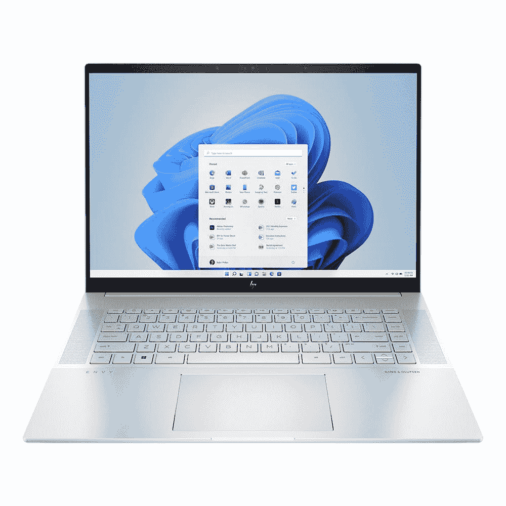

# 惠普 Envy 16 评测:面向普通人的创造者笔记本电脑

> 原文：<https://www.xda-developers.com/hp-envy-16-review/>

现在几乎每个人都是创造者。如果你像我一样，你正在通过发微博、浏览网页和阅读文章来创造新的记忆。您甚至可以在看电影、在笔记本电脑上编辑家庭视频，甚至与朋友一起玩游戏时创造有趣的时刻。

这正是我认为新的 HP Envy 16 适合的东西。这款笔记本电脑是去年惠普 Envy 15.6 的后续产品，主要针对视频编辑或摄影师等创作者。然而，它也拥有日常生活中人们可能希望在笔记本电脑中获得的游戏、工作和消费内容。

这一切都要归功于惠普为这款 Envy 16 审查设备配置的一系列惊人规格。它是最新的第 12 代英特尔酷睿 i7-12700-H 处理器，16GB 内存，英伟达 RTX 3060 显卡和 1 TB 固态硬盘。最重要的是，我也不能忘记令人惊叹的 16 英寸 3840 x 2400 分辨率有机发光二极管触摸显示屏。

尽管有非常重要的改进，如更好的 500 万像素网络摄像头和切换到 16:10 的宽高比显示屏，但也有一些小缺陷。这些问题包括低于平均水平的电池寿命，以及系统在重负载下声音有点太大。但这绝对是一段时间以来最好的惠普 Envy 笔记本电脑之一，具有意义深远的代际变化，最终使其值得购买一些最好的主流惠普笔记本电脑。

 <picture></picture> 

HP Envy 16

##### 惠普嫉妒 16

HP Envy 16 也为创作者和日常用户提供了很多功能。有机发光二极管显示器、强大的 RTX 显卡、英特尔 H 系列处理器让它物超所值。

**浏览此评论:**

## HP Envy 16 的定价和可用性

*   惠普 Envy 16 可在 HP.com、百思买、好市多和微中心买到。价格从 1400 美元起。

惠普正在多家零售商处销售 Envy 16。某些配置可能没有库存，这取决于您在哪里寻找。惠普 Envy 16 的低端版本在 HP.com 的 T2 起价 1400 美元。这将为您带来第 12 代英特尔酷睿 i5 H 系列处理器、英特尔 A370M Arc 显卡、标准 16 英寸 UHD+显示屏、120Hz 刷新率、16GB 内存和 512GB 固态硬盘。它在惠普网站上的标价通常是 1180 美元。

惠普发给我的型号通常定价为 1809 美元，但目前售价为 1700 美元。正如我在评论顶部提到的，这包括第 12 代英特尔酷睿 i7-12700-H 处理器，16GB 内存，英伟达 RTX 3060 显卡和 1 TB 固态硬盘。在我的情况下，显示器也提升到了 3840 x 2400 分辨率的有机发光二极管。

如果你真的想要强大的功能，你可以将这台机器的规格提升到酷睿 i9-12900H 处理器，Nvidia RTX 3060 显卡，32GB 内存，2TB 固态硬盘和 WQXGA 120Hz 面板。打折时，这会让你节省 2600 或 2380 美元。

## 惠普 Envy 16 规格

| 

处理器

 | 

英特尔酷睿 i7-12700H(多达 14 个内核，24MB 高速缓存，4.7 GHz 睿频加速)

 |
| --- | --- |
| **图形** | 英特尔 Iris Xe+ Nvidia Geforce RTX 3060，配备 6GB GDDR6 内存 |
| **正文** | 14.07 x 9.94 x 0.78 英寸，5.91 磅 |
| **显示** | 16 英寸 3840 x 2400 分辨率有机发光二极管，触摸，60 赫兹，WVA 窄边玻璃微边低蓝光，400 尼特 |
| **记忆(可更换)** | 16 GB DDR5-4800 |
| **存储(可更换)** | 1TB PCIe NVMe M.2 第四代 |
| **连通性** | 2x2 无线局域网 Wifi 6E (802.11ax) MU-MIMO 支持 802.11 b 802.11g 802.11 a Wifi 5(802.11 AC)Wifi 4(802.11n)Wifi 6(802.11 ax)蓝牙 5.2 |
| **电池** | 6 芯锂离子聚合物 200 瓦交流适配器 |
| **端口** | 2 个 USB 3.1 (Gen 2 Type-A) 2 个 Thunderbolt 4 个 x2 1 个交流智能 Pin 1 个 HDMI 1 个耳机/麦克风组合 1 个 microSD 媒体读卡器 |
| **网络摄像头** | 500 万像素惠普真视觉摄像头，配有 Windows Hello 和时间降噪功能以及双阵列数字麦克风 |
| **音频** | B&O 音频，四扬声器，惠普音频增强 |
| **输入** | 带多点触控手势的全尺寸背光自然银色键盘 HP Imagepad |
| **颜色** | 天然银 |
| **材质** | 铝金属 |
| **操作系统** | Windows 11 主页 |
| **已审核的价格** | $1,809 |

## 设计:很重，但有很多端口

*   HP Envy 16 看起来像典型的铝制笔记本电脑，只有一种自然银色，但它非常重
*   两代人之间更小的设计调整有助于通风和冷却
*   它有很多港口

如果你花 1000 多美元买一台这样的笔记本电脑，那么你想要的是高品质。你不想感觉塑料或廉价材料。你想对你的购买感到满意，并自豪地使用它。这正是 HP Envy 16 带给您的一切。

就像 Spectre 和主流 Pavillion 系列中的一些惠普设备一样，这款笔记本电脑非常坚固。它是铝制的。没有弯曲和弯曲的问题，即使我在键盘上使劲按，在屏幕上拉。我确信这台笔记本电脑经得起时间的考验。更好的是，用一只手就可以打开盖子，我以前在其他更大的笔记本电脑上遇到过这个问题。

惠普还做出了一些有趣的世代设计选择，以帮助笔记本电脑的冷却。底盘底部向外伸出一点，以改善空气流通。橡胶支脚还可以提升笔记本电脑，使其倾斜一点，以帮助冷却，双通风口可以进气和排气。我发现这些功能有助于确保良好的气流，这样在使用笔记本电脑时，您的桌子就不会变热。

正如我将在稍后介绍的那样，在上一代 HP Envy 15.6 和今年的 HP Envy 16 之间，惠普将显示器的纵横比调整为 16:10。这意味着更大的显示屏，更高、更窄的笔记本电脑。但是这对整体重量没有帮助。这台笔记本电脑仍然很重。我带着它在我家的各个房间之间移动，我真的感觉到了我的典型设备 [Surface Laptop Studio](https://www.xda-developers.com/surface-laptop-studio-review/) 的重量差异。如果比较两者，HP 的重量比我的 Surface 多了将近 1 磅。

这款 16 英寸机型的一大优势是端口。它在机箱侧面为他们留出了大量空间。在左边，有一个 USB-A 端口(是下拉式的)，一个耳机插孔和一个 microSD 卡插槽。右边有 HDMI，一个标准 USB-A，两个 Thunderbolt 4 USB-C。

对于创作者甚至那些喜欢连接显示器的人来说，这是非常棒的。即使不是创造者的普通人也可能会使用 USB-A 配件，如鼠标或 USB 驱动器。不过重要的是，你可以通过这种方式连接到更多的显示器，而无需使用坞站。将一个插头插入 HDMI 端口，另两个插入 Thunderbolt 4 USB-C 端口，一切就绪。那些其他的 USB-A 端口对于附件来说仍然是免费的。

## 展示:美丽的有机发光二极管 16:10

*   16 英寸的有机发光二极管显示屏令人身临其境，并采用了新的 16:10 宽高比
*   显示屏顶部有一个改进的 500 万像素网络摄像头

我能说出很多带有机发光二极管显示屏的[笔记本电脑](https://www.xda-developers.com/best-oled-laptops/)，我们甚至有它们的清单。因此，很高兴看到惠普再次在 Envy 16 上加入了有机发光二极管选项。去年的 Envy 15.6 英寸也有一个，所以它不是新的，但今年的模型中有一个新东西。Envy 16 采用了新的 16:10 宽高比，有更多的空间来观看内容，内容看起来也格外漂亮。

这又回到了我在评论开头所说的，创意型和普通人都能从有机发光二极管的展示中受益。内容看起来比传统的带液晶面板的笔记本电脑更加生动活泼。你会*希望*每天在他的笔记本电脑上工作，就像我一样。在笔记本电脑上，像这样的有机发光二极管显示器意味着你可以得到更真实的黑色和更生动的色彩。

不过，当笔记本电脑有难看的厚边框时，这并不意味着什么，因为这会破坏整体的沉浸感。因此，随着今年纵横比从 16:9 切换到 16:10，惠普能够切除显示器上难看的底部下巴，使显示器更高。这些加起来会让事情变得更好。好得多，您可以为您的内容获得 11%以上的垂直空间。

就我而言，当我在浏览网页时，多亏了有机发光二极管显示器，网页变得栩栩如生。例如，在 XDA 网站上，我注意到 XDA 页眉的标志中有更多的紫色。甚至在写这篇文章的时候，黑色的文字在白色的背景下看起来更有活力。让我不要忘记媒体。我在这台 HP Envy 上观看了纽约大都会队的棒球比赛，天哪，从大都会队主场队服的草色到蓝色，我感觉自己就在棒球场。

我在色度计测试中得到的数字将支持这一点。Envy 的显示器覆盖了 100%的 sRGB 光谱、97%的 AdobeRGB 光谱、92%的 P3 色域和 92%的 NTSC 色域。对于需要在 Photoshop 和其他应用程序中获得最佳色彩准确度的创意人员来说，这是有机发光二极管屏幕的绝佳数字。你得到真正准确的颜色，以确保你的内容看起来就像你想要的。

有机发光二极管展示让你感觉身临其境。

我只是希望 120 赫兹是 OLED 面板的一个选项。但我认为惠普的显示控制弥补了这一点。您可以手动切换到针对色彩鲜艳度、web、Adobe RGB、DCI PC 优化的显示模式，或者坚持原生模式。自动颜色模式也会根据应用程序切换模式。很高兴看到惠普为您如何使用显示器提供选项。

至于显示器顶部是什么，惠普现在包括一个 500 万像素的 Windows Hello 网络摄像头。去年 Envy 15.6 的指纹识别器支持这一点。大多数笔记本电脑都有 1080p 网络摄像头，所以很高兴看到惠普超越了基本功能。使用这种设备的创意型人才会花大量时间与客户，甚至朋友和家人通话。

从 Surface Laptop 工作室出来，我真的注意到了质量的差异，我的脸看起来亮了很多，当我启动这个网络摄像头时，我身后的房间也变亮了。它还可以变得更好，这要感谢惠普增强的照明应用程序，它可以为你创造效果。或者，HP Auto Frame 可以让您保持在相机框架中。

*   chicklet 风格的键盘很舒适，并在 F1 键上添加了一个新的表情按钮
*   触控板又大又精确

我总是在我正在评论的笔记本电脑上写我的评论。在这种情况下，我很高兴我在 HP Envy 16 上做到了。chicklet 风格的键盘相当舒服。当我在这篇文章中挤来挤去时，我得到了很好的反馈，因为在打字时按键会轻轻地缩回机箱中。因为这是 16 英寸的笔记本电脑。塑料键帽本身也很大，便于携带。

今年键盘上的一个新功能是 F1 键上的表情符号按钮。它帮助我在 Slack 上给同事发信息时选择表情符号，尽管我不确定每个人都会那么需要它。是的，今年的一个损失是键盘上的指纹识别器。惠普选择了 Windows Hello。不过，静音麦克风和相机快门按钮仍然存在。

至于触控板，它直接位于笔记本电脑的中间。它也相当大。我在打字时没有碰到触控板的问题。我喜欢触控板点击时的柔软感。其他一些笔记本电脑，如旧的 XPS 型号，有一个反馈更苛刻的触控板。表面有一层很好的涂层，便于用手指滚动。

你可能还会注意到键盘旁边的扬声器。惠普这一代跳到了四扬声器，而去年是立体声扬声器。这有助于为电影和电视节目带来更丰富的低音和充满房间的声音。

## 性能:英特尔 H 级 CPU 和 RTX 显卡胜出，但电池除外

*   HP Envy 16 配备了与英特尔 Arc 或英伟达 RTX 3060 显卡配对的英特尔 H 系列处理器选项
*   由于 45 瓦的 CPU 和耗电的 Nvidia GPU，电池寿命很差

HP Envy 16 的处理能力令人叹为观止。我有一个 Core i7-12700H 型号，它有 14 个内核(6 个高性能，8 个高效)，20 个线程，可以提升到 4.7 GHz。惠普还提供了一款配备英特尔酷睿 i9-12900H CPU 的疯狂机型。它的内核和线程数量与 Core i7 型号相同，但睿频速度更高，为 5.00 GHz。老实说，我不明白你为什么要为此升级，除非你想获得更多的多核性能。

这两个 CPU 都以 45 瓦运行，这增加了我对 Core i9 模型的怀疑。惠普也在惠普 Envy 两代产品之间实现更快的内存和存储跳跃。这种新型号使用更快的 PCIe Gen 4 规格和更快的 GDDR5 RAM。当涉及到我们接下来要处理的更高要求的任务时，感觉是不同的。

我拥有的配备酷睿 i7 和 RTX 显卡的型号在性能方面非常出色。在撰写这篇评论时，我在微软 Edge 中打开了大约 20 个标签，我连接了一台 4K 显示器，笔记本电脑除此之外没有变慢，因为这台笔记本电脑有一个专用的 GPU，我确实启动了一些游戏进行测试。正如我的同事在他的[HP pavilion Plus 评论](https://www.xda-developers.com/hp-pavilion-plus-review/)中指出的，英特尔 H 系列处理器在使用专用显卡时性能更好。

HP Envy 16 的性能令人惊叹。

惠普很清楚这不是一款游戏笔记本电脑。它旨在作为 Photoshop 等应用程序或 Adobe Premiere Pro 等视频编辑器的内容创建机器。然而，有了 RTX 图形，如果你愿意，你仍然可以玩游戏。您将获得接近实际游戏笔记本电脑的良好效果。根据 Cinebench、Crossmark 和 3D Mark 评分，即使是实际的视频或照片编辑也应该比您预期的要好。这些都是游戏笔记本电脑级别的，我也在比较这款设备。在我们对 CPU 和 GPU 进行的所有测试中，你可以看到它与另一款创造者优先的笔记本电脑 XPS 17 相匹配，XPS 17 的配置几乎与这款设备相同。

| 

已执行测试

 | 

惠普嫉妒 16

 | 

[戴尔 XPS 17 (2022)酷睿 i7-12700h RTX 3060](https://www.xda-developers.com/dell-xps-17-2022-review/)

 | 

[外星人 x15 R2 酷睿 i7-12700H，RTX 3070 Ti](https://www.xda-developers.com/alienware-x15-r2-review/)

 | 

[联想军团 5i Pro 酷睿 i7-12700H，RTX 3070 Ti](https://www.xda-developers.com/lenovo-legion-5i-pro-2022-review/)

 | 

[戴尔 XPS 15 有机发光二极管](https://www.xda-developers.com/dell-xps-15-2022-review/)酷睿 i7-12700H，RTX 3050 Ti

 | 

宏基掠夺者 Triton 500 SE

 |
| --- | --- | --- | --- | --- | --- | --- |
| PC Mark 10 | 6,829 | 6,789 | 7,141 | 7,076 | 6,640 | 6.955 |
| 3DMark:时间间谍 | 6,729 | 6,250 | 10,443 | 10,391 | 4,535 | 11,192 |
| Geekbench 5(单/多) | 1,712/10,848 | 1,753/12,992 | 1,768/13,200 | 1,787/9,209 | 1,774/11,580 | 1,881/12,938 |
| Cinebench R23(单/多) | 1,814/12,149 | 1,767/11,714 | 1,776/16,182 | 1,714/9,549 | 1,767/11,714 | 1,815/12,886 |
| 交叉标记(总体/生产力/创造力/响应能力) | 1,731/1,608/1,981/1,444 | 1,871/1,702/2,157/1,624 | 1,830 / 1,670 / 2,123 / 1,543 |  | 1,871/1,702/2,157/1,624 | 2,001/1,854/2,196/1,901 |
| VRMark 橙色/青色/蓝色 | 9,331/2,750/2,097 | 8,689/2,752/1,902 | 11,066 / 8,834 / 3,073 | 13,593 / 9,480 / 3,176 | 4,745/2,753/1,325 | 9,331/2,750/2,907 |

我在我的机器上玩了三个游戏，都在原生分辨率下流畅运行。微软飞行模拟器被设置为最高可能的设置，我仍然在原生分辨率下达到接近每秒 30 帧。 *Forza Horizon 5* 在类似的设定上也表现相同。就连*侠盗猎车手 V* 也表现不错，没有滞后。

总的来说，这是一台性能良好的机器，但所有的权力都伴随着糟糕的电池寿命。在我连续几天的视频通话、网页浏览、观看 YouTube 和其他工作任务的测试中，我的电池续航时间只有大约 4 个半小时。插在显示器上，时间缩短到了 3 小时。有机发光二极管屏幕非常耗电。随着显示器亮度降低到 38%，窗口设置为*平衡*，我只能从下午 12:00 持续到下午 6:00，并不得不在一天结束时插上电源。你不应该这样做，这是一台笔记本电脑，你必须靠近充电器。

另一个缺点是风扇噪音。虽然今年的风扇叶片轻了 33%,并且惠普比去年的型号增加了 6 个叶片，但它们仍然非常清晰。在正常负荷下长时间使用期间。风扇开始冷却笔记本电脑的键盘面板和侧面。声音不算大，但还是很烦人。当游戏以接近全速运行时，在高分辨率和高设置下，你肯定会注意到这一点。

## 你应该购买惠普 Envy 吗？

HP Envy 16 是内容创建者或任何寻求全能笔记本电脑的人的理想笔记本电脑。

**谁应该购买惠普 Envy 16**

*   热衷于视频编辑或照片编辑的内容创作者
*   你想要一台 RTX 显卡和有机发光二极管显示器的笔记本电脑

**谁不应该购买惠普 Envy 16**

*   需要电池续航时间长的笔记本电脑的创作者

总的来说，HP Envy 16 是一款出色的笔记本电脑，具有出色的显示屏和强大的功能。只是电池寿命让它无法完美，为此，你可能会考虑 Spectre 或惠普 OMEN 游戏笔记本电脑。

 <picture></picture> 

HP Envy 16

##### 惠普嫉妒 16

HP Envy 16 也为创作者和日常用户提供了很多功能。有机发光二极管显示器、强大的 RTX 显卡、英特尔 H 系列处理器让它物超所值。