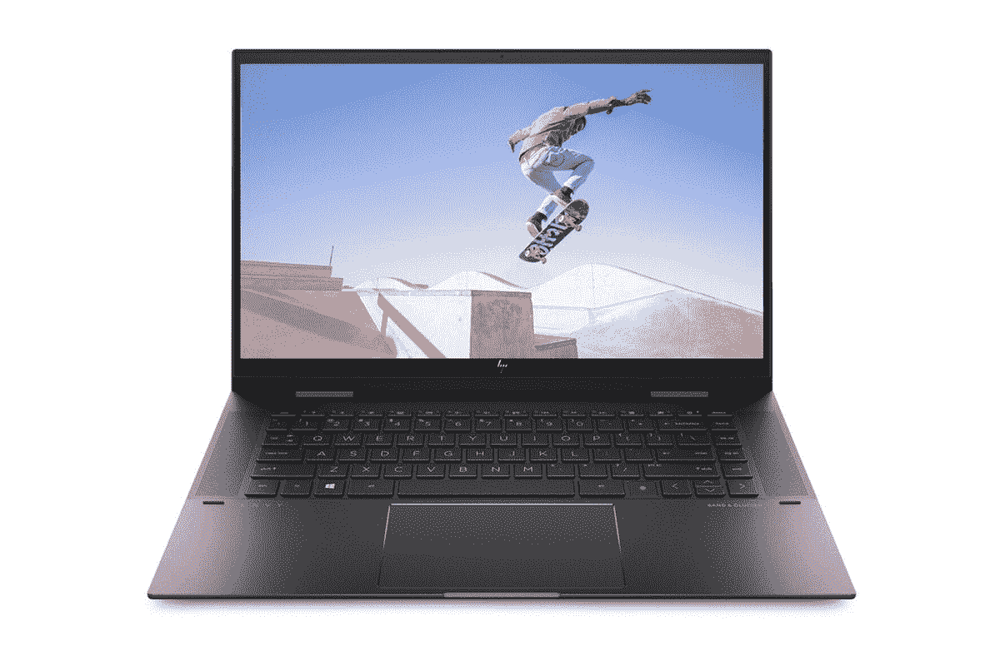
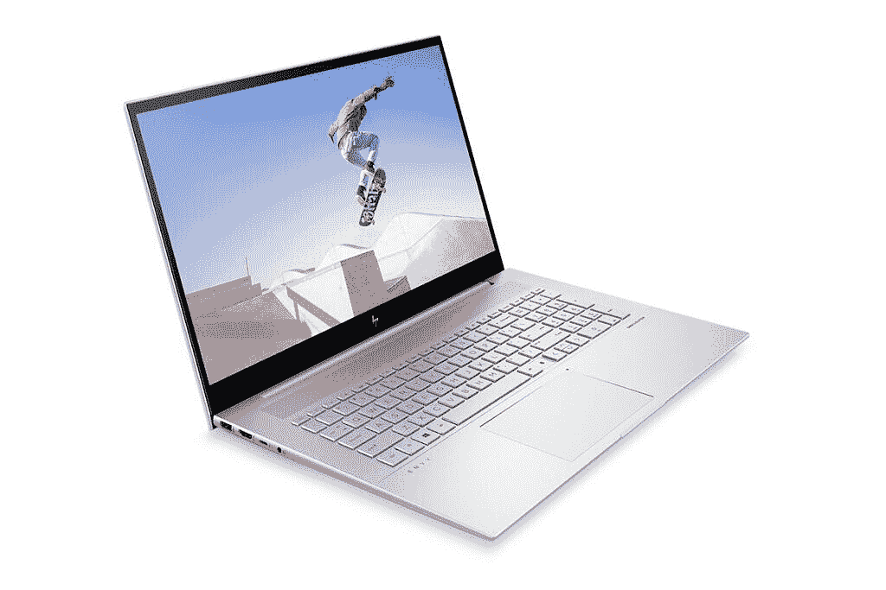

# 惠普采用英特尔第 11 代处理器和 AMD 锐龙 5000U 处理器更新 Envy 系列

> 原文：<https://www.xda-developers.com/hp-envy-x360-15-envy-17-update-launch/>

惠普宣布了其 Envy 系列笔记本电脑的更新，包括 15 英寸和 17 英寸型号。2021 Envy x360 15 是一款二合一机型，将配备[英特尔新的第 11 代 Tiger Lake CPU](https://www.xda-developers.com/intel-tiger-lake-11th-gen-core-i3-i5-i7-xe/)，或者您可以配置新的 [AMD 锐龙 5000U](https://www.xda-developers.com/amd-ryzen-5000-mobile-7nm-zen-3/) 处理器。更大的 Envy 17 也进行了新的升级，现在提供更强大的独立 GPU。

### 惠普 Envy x360 15

首先说一下新 Envy x360 15。你得到了一个新的触控板，它现在大了 19%，更居中，总体重量也减轻了。惠普将为这款笔记本电脑提供 AMD 锐龙 5 5500U APU 和 256GB NVMe 固态硬盘，或者 AMD 锐龙 7 5700U 和 512GB NVMe 固态硬盘。这两种型号都将提供 8GB DDR4 内存，时钟频率为 3200MHz，但用户无法升级。显示器是 15.6 英寸 FHD (1920 x 1080 像素)IPS 触摸屏，提供 250 尼特的亮度和 45%的 NTSC 色域覆盖率。它也可以配置 4K OLED 面板。

英特尔型号将提供酷睿 i5-1135G7 或酷睿 i7-1165G7 选项。虽然大多数功能都相似，但英特尔的变种将配备 Wi-Fi 6 AX201，如果你选择 Core i7 型号，你可以获得 12GB 的 DDR4-3200 RAM，以及 512GB 的 PCIe 存储和 32GB 的英特尔 Optane 内存。酷睿 i5 版本将提供 8GB 内存和 256GB NVMe 固态硬盘。英特尔 SKU 还将配备带有 USB 4 的 Thunderbolt 4 端口，这意味着数据吞吐量高达 40Gbps。

这些笔记本电脑还可以配置可选的 NVIDIA GeForce MX450 GPU，而其他功能包括英特尔模式下的人工智能噪音消除、视频通话的灯光调节、移动设备和笔记本电脑之间无缝文件共享的 QuickDrop，以及物理相机快门、专用麦克风静音按钮和指纹读取器等安全功能。

如果您选择 AMD 型号，HP Envy x360 将提供“夜幕黑”颜色选项。它将从 4 月份开始通过 HP.com 和 T4 百思买发售，锐龙 5 版本的起价为 749.99 美元，锐龙 7 版本的起价为 959.99 美元。另一方面，英特尔型号将从 4 月开始通过百思买和 HP.com 提供“自然银”颜色。酷睿 i5 型号的售价为 899.99 美元，酷睿 i7 版本的售价为 1，049.99 美元。

 <picture></picture> 

HP Envy x360 15

##### 惠普 Envy x360 15

新的惠普 x360 15 是一款二合一笔记本电脑，提供最新的 AMD 锐龙 5000U CPUs，起价不到 800 美元

 <picture></picture> 

HP Envy x360 15 ($310 off)

##### 惠普 Envy x360 15

全新 HP Envy x360 15 采用英特尔全新第 11 代 Tiger Lake CPUs，以经济实惠的 2 合 1 外形提供最佳性能。

### 惠普 Envy 17

HP Envy 17 在性能和设计方面也略有提升。虽然这款笔记本电脑已经在销售最新的第 11 代英特尔 Tiger Lake Core i7-1165G7，但惠普现在已经将 GPU 更新为 NVIDIA GeForce MX450。与 HP Envy x360 15 一样，17 英寸型号的 2021 版本也配备了 19%的更大触摸板和更轻的机箱，现在起价为 2.5 千克。同样，17.3 英寸将提供全高清或 4K 分辨率，尽管后者不会成为 OLED 面板。

 <picture></picture> 

HP Envy 17

至于硬件，笔记本电脑配备了 12GB 的 DDR4-3200 非用户可访问内存和 512GB 的 PCIe 固态硬盘以及 32GB 的英特尔 Optane H10 内存。消费者还可以选择高达 32GB 的内存和 1TB 的 PCIe 存储。新的 Envy 17 还具有与 15 英寸 2 合 1 变体相同的增强功能，包括物理相机快门人工智能降噪、惠普 QuickDrop 等。新款 HP Envy 17 的起价为 999.99 美元，将于 4 月起通过 BestBuy 和 HP.com 发售。

 <picture></picture> 

HP ENVY 17

##### 惠普 Envy 17

惠普对 Envy 17 进行了小幅升级，现在提供了更精致的设计以及新的 NVIDIA MX450 显卡选项。