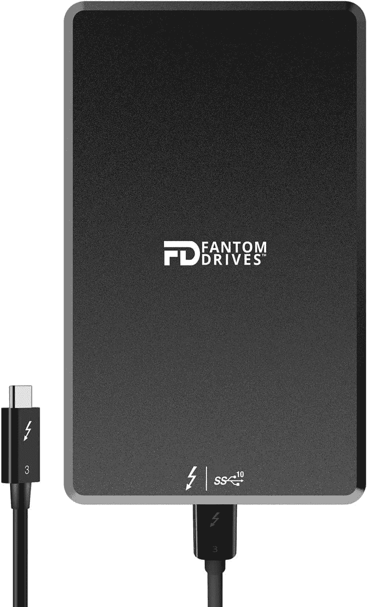

# 惠普 Envy x360 (2022)有雷电吗？

> 原文：<https://www.xda-developers.com/hp-envy-x360-2022-thunderbolt/>

如果您正在考虑购买 HP Envy x360 (2022)，您可能想知道连接性。毕竟，除了 USB-A 端口甚至耳机插孔，Thunderbolt 是许多 2022 年最佳笔记本电脑的新标准。尽管这款特别的新[二合一设备不到 1000 美元](https://www.xda-developers.com/best-laptops-under-1000/)，我们还是有好消息要告诉你。13.3 英寸版本的 HP Envy x360 (2022)和 15.6 英寸版本的 HP Envy x360 (2022)采用英特尔芯片，确实具有 Thunderbolt 端口。只有配有 AMD CPU 的 15.6 英寸型号的 HP Envy x360 (2022)没有。

## 惠普 Envy x360 (2022)上的 Thunderbolt 解释道

Thunderbolt 是由英特尔开发的一项技术，已经在许多 Windows 笔记本电脑上使用，甚至在苹果 MAC 电脑上使用。该技术已经经历了几代，许多 2022 年笔记本电脑上的最新产品是 Thunderbolt 4。

虽然它使用 USB-C 连接器，但 Thunderbolt 比普通的 USB Type-C 具有明显的优势，因为你将获得 PCIe 信号。这使您可以将外部 GPU 连接到 HP Envy x360 (2022)上，进行严肃的游戏甚至视频编辑，但前提是您要一直坐在办公桌前。

除此之外，它还允许您享受 Thunderbolt 认证的附件，如固态硬盘(SSD)或显示器。您甚至可以使用 Thunderbolt 连接多达两个 60 Hz 的 4K 显示器，这样您就可以在办公桌上进行多任务处理并增强您的设置。如果你感兴趣的话，这里有一些配件可以开始使用。

*   ##### Razer Core X

    虽然惠普 Envy x360 (2022)的 13.3 英寸版本和 select 15.5 英寸版本缺少专用 GPU，但这种外部 GPU 外壳可以让你为你的设备添加 GPU，用于游戏和其他用途。

*   <picture></picture>

    Fantom 硬盘极速 1TB 固态硬盘

    ##### Fantom 硬盘极速 1TB 固态硬盘

    这是一款经过 Thunderbolt 认证的外置固态硬盘，适用于 HP Envy x360 (2022)如果您需要额外的快速存储。您可以获得高达 2800MB/S 的数据传输速度。

*   <picture></picture>

    LaCie 加固 SSD

    ##### LaCie 加固 SSD Pro

    这是一款为惠普 Envy x360 (2022)打造的加固迅雷 SSD。)如果您打算带着自己的设备外出旅行，并且想要一个耐用的储物解决方案，这是您的理想选择。

*   ##### Anker 777 Thunderbolt 4 坞站

    惠普 Envy x360 (2022)有 USB-A 和 Thunderbolt 端口，但这是一个 Thunderbolt 坞站，它可以让你扩展端口，以获得一个 SD 读卡器，两个 HDMI 端口，甚至有足够的电力在办公桌上为 2 合 1 充电。

    T34
*   ##### 惠普霹雳坞 G4

    这个霹雳坞就来自惠普。这也是一个非常时尚的书桌坞站，您可以为您的 HP Envy x360 (2022)提供额外的端口，如 USB-A、DisplayPort 和 HDMI。此外，还有高达 120 瓦的功率为您的笔记本电脑充电。

*   <picture></picture>

    戴尔 UltraSharp 27 up 2720 q

    ##### 戴尔 UltraSharp up 2720 q

    这是任何二合一设备的最佳显示器之一。只需一根 Thunderbolt 或 USB-C 电缆，您就可以连接该显示器，享受 4K 分辨率和宽色域的内容创作。

借助 Thunderbolt 技术，您可以享受 Razer Core X 等外部 GPU，以及我们从 Fantom Drives 建议的 SSD 等快速数据传输速度。您甚至可以连接到双显示器，增加多任务处理能力。

如果您还没有 HP Envy x360 (2022)，您可以通过下面的链接立即购买。如果你觉得 Envy x360 不适合你，还有许多其他惠普笔记本电脑也有 Thunderbolt 端口。

*   ##### 惠普 Envy x360 13(2022)

    2022 惠普 Envy x360 是一款注重便携性的敞篷车，配备英特尔 9W 处理器和大电池，加上 16:10 显示屏，非常适合完成工作。几乎对任何人来说，这都是一款出色的笔记本电脑。

*   ##### 惠普 Envy x360 (2022) 15 英寸(英特尔)

    惠普 Envy x360 的 2022 版本之一尺寸为 15.6 英寸，可选择英特尔 P 系列和 U 系列处理器。还有一个选项是添加英伟达 RTX 20 系列移动 GPU。

*   ##### 惠普 Envy x360 (2022) 15 英寸(AMD)

    这个版本的 2022 惠普 Envy x360 带有 AMD 锐龙 5000 系列 CPU 的选项。这款 15.6 英寸的机型还有一种黄昏黑色。