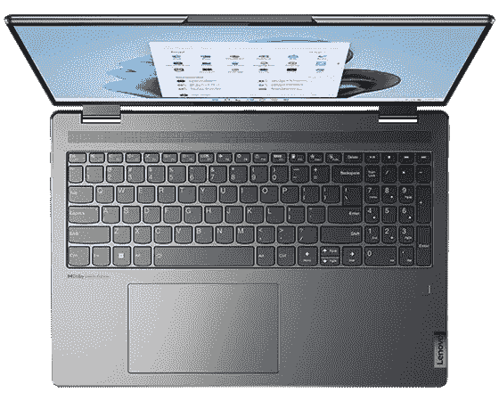

# 惠普 Envy x360 (2022) vs 联想 Yoga 7i:哪款时尚二合一适合你？

> 原文：<https://www.xda-developers.com/hp-envy-x360-2022-vs-lenovo-yoga-7i/>

Windows 11 驱动的 2 合 1 和[笔记本电脑](https://www.xda-developers.com/best-laptops/)如今有各种不同的形状和尺寸。你现在能以不到 1000 美元买到的最好的笔记本电脑是[惠普 Envy x360 (2022)](https://www.xda-developers.com/hp-envy-x360-13-2022-review/) 和[联想 Yoga 7i](https://www.xda-developers.com/lenovo-yoga-7i-2022-review/) 。这些设备有很多共同的特点，从整体设计到身临其境的显示器，以及引擎盖下的英特尔 CPU。

但是，如果你想了解这些基础知识之外的东西，就要注意一些关键的区别。除非你更喜欢惠普或联想的产品，否则你可能会想知道哪一款最划算。让我们来看看不同之处，好吗？

*请注意，我们正在考虑这两款二合一设备的所有可用尺寸。不仅仅是标准的 13.3 寸和 14 寸机型。您可以在本指南开头的表格中向左或向右滚动到每个型号的相应规格。*

*   ##### HP Envy x360 13(2022)

    2022 HP Envy x360 是一款注重便携性的敞篷车，配有英特尔 9W 处理器和大电池，以及 16:10 显示屏，非常适合完成工作。几乎对任何人来说，这都是一款出色的笔记本电脑。

*   ##### 惠普 Envy x360 (2022) 15 英寸(英特尔)

    惠普 Envy x360 的 2022 版本之一，尺寸为 15.6 英寸，可选择英特尔 P 系列和 U 系列处理器。还有一个选项是添加英伟达 RTX 20 系列移动 GPU。

*   ##### 惠普 Envy x360 (2022) 15 英寸(AMD)

    这个版本的 2022 惠普 Envy x360 带有 AMD 锐龙 5000 系列 CPU 的选项。这款 15.6 英寸的机型还有一种黄昏黑色。

    T35
*   ##### 联想- Yoga 7i 二合一(14 英寸)

    联想 Yoga 7i 是一款出色的整体笔记本电脑，采用了英特尔第 12 代处理器、全新设计等等。

*   <picture></picture>

    联想 Yoga 7i (16 英寸)带弧形图形

    ##### 联想 Yoga 7i 2 合 1 (16 英寸)

    联想 Yoga 7i 是一款出色的可变形笔记本电脑，拥有强大的处理能力和出色的 GPU，可用于轻度游戏和拍照

    T34

## 惠普 Envy x360 (2022)与联想 Yoga 7i:规格

| 

投机

 | 

惠普 Envy x360 13.3

 | 

惠普 Envy x360 15.6(英特尔和 AMD)

 | 

联想 Yoga 7i 2 合 1 (14 英寸和 16 英寸)

 |
| --- | --- | --- | --- |
| **处理器** | 

*   英特尔酷睿 i5-1230U(最高 4.4 GHz，12 MB 三级高速缓存，10 个内核，12 个线程)
*   英特尔酷睿 i7-1250U(最高 4.7 GHz，12 MB 三级高速缓存，10 个内核，12 个线程)

 | 英特尔:

*   英特尔酷睿 i5-1235U(最高 4.4 GHz，12 MB 三级高速缓存，10 个内核，12 个线程)
*   英特尔酷睿 i5-1240P(最高 4.4 GHz，12 MB 三级高速缓存，12 个内核，16 个线程)
*   英特尔酷睿 i7-1255U(最高 4.7 GHz，12 MB 三级高速缓存，10 个内核，12 个线程)
*   英特尔酷睿 i7-1260 处理器(最高 4.7 GHz，18 MB 三级高速缓存，12 个内核，16 个线程)
*   英特尔酷睿 i5-1235U(最高 4.4 GHz，12 MB 三级高速缓存，10 个内核，12 个线程)
*   英特尔酷睿 i7-1255U(最高 4.7 GHz，12 MB 三级高速缓存，10 个内核，12 个线程)

AMD:

*   AMD 锐龙 5 5625U(最高 4.3 GHz，16 MB 三级高速缓存，6 个内核，12 个线程)
*   AMD 锐龙 7 5825U(最高 4.5 GHz，16 MB 三级高速缓存，8 个内核，16 个线程)

 | 14 英寸:

*   第 12 代英特尔酷睿 i5-1235U 处理器(10 个内核，12 个线程，12 MB 高速缓存)
*   第 12 代英特尔酷睿 i7-1255U 处理器(10 个内核，12 个线程，12 MB 高速缓存)

16 英寸:

*   第 12 代英特尔酷睿 i5-12500H (12 个内核、16 个线程、18 MB 高速缓存)
*   第 12 代英特尔酷睿 i5-1240P (12 个内核，16 个线程，12 MB 高速缓存)
*   第 12 代英特尔酷睿 i7-1260 处理器(12 个内核，16 个线程，18 MB 高速缓存)
*   第 12 代英特尔酷睿 i7-12700H 处理器(14 个内核，20 个线程，24 MB 高速缓存)

 |
| **图形** |  | 英特尔:

*   英特尔 Iris Xe 显卡
*   仅配备英特尔酷睿 i5-1235U 芯片组的 Nvidia GeForce RTX 2050 (4GB)显卡
*   仅配备英特尔酷睿 i7-1255U 芯片组的 Nvidia GeForce RTX 2050 (4GB)显卡

AMD: | 14 英寸:16 英寸:

*   集成英特尔 Iris Xe 显卡
*   英特尔 Arc A370M

 |
| **公羊** |  | 英特尔和 AMD:

*   8GB DDR4-3200 SDRAM (2 个 4 GB)
*   16GB DDR4-3200 SDRAM (2 个 8 GB)

 | 14 英寸:

*   8GB LPDDR5-4800MHz(焊接)
*   16GB LPDDR5-4800MHz(焊接)

16 英寸:

*   8GB LPDDR5-4800MHz(焊接)
*   16GB LPDDR5-4800MHz(焊接)
*   32GB LPDDR5-4800MHz(焊接)仅适用于酷睿 i7 型号

 |
| **储存** | 

*   512GB PCIe NVMe M.2 固态硬盘
*   512GB PCIe NVMe TLC M.2 固态硬盘(4x4 固态硬盘)
*   1TB PCIe NVMe M.2 固态硬盘

 | 英特尔:

*   256GB PCIe NVMe M.2 固态硬盘
*   512GB PCIe NVMe M.2 固态硬盘
*   1TB PCIe NVMe M.2 固态硬盘

AMD:

*   256GB PCIe NVMe M.2 固态硬盘
*   512GB PCIe NVMe M.2 固态硬盘
*   1TB PCIe NVMe M.2 固态硬盘
*   1TB PCIe NVMe TLC M.2 固态硬盘

 | 14 英寸:

*   512GB 固态硬盘 M.2 2242 PCIe 第四代 TLC
*   1TB 固态硬盘 M.2 2242 PCIe 第四代 TLC

16 英寸:

*   256GB 固态硬盘 M.2 2242 PCIe 第四代 TLC
*   512GB 固态硬盘 M.2 2242 PCIe 第四代 TLC
*   1TB 固态硬盘 M.2 2242 PCIe 第四代 TLC(仅配备酷睿 i7-12700H)

 |
| **显示** | 

*   13.3 英寸对角线，WUXGA (1920 x 1200)，支持多点触控，IPS，窄边框玻璃，微边缘，400 尼特
*   13.3 英寸对角线，WQXGA (2560 x 1600)，支持多点触控，IPS，窄边框玻璃，微边缘，400 尼特
*   13.3 英寸对角线，2.8K (2880 x 1800)，有机发光二极管，支持多点触摸，UWVA，低蓝光，SDR 400 尼特

 | 英特尔:

*   15.6 英寸对角线，FHD (1920 x 1080)，支持多点触控，IPS，250 尼特
*   15.6 英寸对角线，FHD (1920 x 1080)，支持多点触控，IPS，400 尼特
*   15.6 英寸对角线，FHD (1920 x 1080)，有机发光二极管，支持多点触摸，UWVA，低蓝光，SDR 400 尼特
*   15.6 英寸对角线，QHD (2560 x 1440)，支持多点触摸，120 赫兹，IPS，低蓝光，300 尼特

AMD:

*   15.6 英寸对角线，FHD (1920 x 1080)，支持多点触控，IPS，250 尼特
*   15.6 英寸对角线，FHD (1920 x 1080)，有机发光二极管，支持多点触摸，UWVA，低蓝光

 | 14 英寸:

*   14 英寸 2.2K (2240 x 1400)，IPS，防眩光，触摸，300 尼特，60Hz，LED 背光
*   14 英寸 2.2K (2240 x 1400)，IPS，防眩光，触摸，100%sRGB，300 尼特，60Hz，玻璃

16 英寸:

*   16 英寸 WQXGA (2560 x 1600)，IPS，防眩光，触摸，400 尼特，60Hz，窄边框，低蓝光
*   16 英寸 WQXGA (2560x1600)，IPS，防眩光，触摸，低蓝光，400 尼特，60Hz

 |
| **音频** | 

*   Bang & Olufsen 的音频；双扬声器；惠普音频增强

 | 

*   Bang & Olufsen 的音频；双扬声器；惠普音频增强

 | 14 英寸:

*   4 个扬声器(2 个 2W 高音扬声器，2 个 2W 低音扬声器)

16 英寸:

*   2 个 2W 高音喇叭
*   2 个 3W 低音扬声器

 |
| **网络摄像头&麦克风** | 

*   720 像素网络摄像头，带摄像头快门和集成双阵列麦克风

 | 

*   惠普 True Vision 5MP 万像素红外摄像头，配有摄像头快门、瞬时降噪和集成双阵列数字麦克风

 | 

*   带隐私快门的 1080p FHD 红外照相机

 |
| **生物安全** |  |  | 

*   是的，摄像头和指纹识别器

 |
| **电池** | 

*   4 芯 66 瓦时锂离子聚合物电池

 | 

*   3 芯 51 瓦时锂离子聚合物电池

 | 14 英寸:16 英寸:

*   独立显卡型号 99.9 瓦时电池
*   集成显卡型号:71 瓦时电池

 |
| **端口** | 

*   2 个 Thunderbolt 4，带 USB4 Type-C
*   1 个超高速 USB 型
*   1 个超高速 USB Type-A 1
*   1 个耳机/麦克风组合
*   1 个 microSD 媒体读卡器

 | 英特尔:

*   2 个 Thunderbolt 4，带 USB4 Type-C
*   1 个超高速 USB 型
*   1 个超高速 USB 型
*   1 个 HDMI 2.1 接口
*   1 个耳机/麦克风组合
*   1 个多格式 SD 媒体读卡器

AMD:

*   2 个超高速 USB Type-C
*   1 个超高速 USB 型
*   1 个超高速 USB 型
*   1 个 HDMI 2.1 接口
*   1 个耳机/麦克风组合
*   1 个多格式 SD 媒体读卡器

 | 14 英寸:

*   2 个 USB-C 雷电 4.0
*   HDMI 2.0
*   MicroSD 读卡器
*   USB-A 3.2 第 1 代
*   耳机/麦克风组合

16 英寸:

*   2 个 USB-A 3.2 第 1 代
*   2 个 USB-C 雷电 4
*   高清晰度多媒体接口
*   SD 读卡器
*   耳机/麦克风组合

 |
| **连通性** | 

*   英特尔 Wi-Fi 6E AX211 (2×2)，
*   蓝牙 5.2

 | 英特尔:

*   联发科 Wi-Fi 6 MT7921 (2x2)和蓝牙 5.2 二合一
*   英特尔 Wi-Fi 6E AX211 (2x2)和蓝牙 5.2 组合

AMD:

*   联发科 Wi-Fi 6 MT7921 (2x2)和蓝牙 5.2 二合一
*   联发科 Wi-Fi 6E MT7922 (2x2)和蓝牙 5.2 组合

 | 14 英寸:

*   WiFi 6E 802.11AX (2 x 2)
*   蓝牙 5.1

16 英寸:

*   802.11 像素(2 x 2)
*   蓝牙 5.1 或以上版本

 |
| **颜色** |  | 英特尔:

*   夜幕降临
*   天然银

AMD:

*   夜幕降临
*   天然银

 | 14 英寸:16 英寸: |
| **尺寸(WxDxH)** | 

*   11.75 x 8.46 x 0.63 英寸

 | 英特尔:

*   14.13 x 9.02 x 0.73 英寸

AMD:

*   14.13 x 9.02 x 0.73 英寸

 | 14 英寸:

*   12.47 x 8.67 x 0.68 英寸

16 英寸:

*   14.23 x 9.83 x 0.76 英寸

 |
| **重量** |  | 英特尔:AMD: | 14 英寸16 英寸: |
| **起步价** |  | 英特尔:AMD: | 14 英寸:16 英寸: |

## 惠普 Envy x360 (2022)与联想 Yoga 7i:价格和可用性

惠普 Envy x360 (2022)和联想 Yoga 7i 现已上市。你可以在百思买购买，或者直接通过惠普或联想购买。我们建议直接从惠普和联想购买，因为他们往往有最多的库存和更多的方式来定制您的系统。这些都是价格低于 1000 美元的中端 2 合 1 系统[。只有 16 英寸型号的 Yoga 7i 的价格高于这个数字。](http://www.xda-developers.com/best-laptops-under-1000/)

标准的 13.3 英寸惠普 Envy x360 (2022)起价 900 美元，标准的联想 Yoga 7i 起价 879 美元。在标准的 HP Envy x360 (2022)型号上，您可以获得英特尔酷睿 i5-1230U CPU、13.3 英寸 1920 x 1200 分辨率显示屏、512GB 存储空间和 8GB 内存。看看 14 英寸的联想 Yoga 7i，规格几乎相同。标准型号配备英特尔酷睿 i5-1235U CPU，14 英寸 2440 x 1400 分辨率显示屏，512GB 存储空间和 8GB 内存。同样的价格，Yoga 7i 更便宜，有更好的显示屏和更好的 15 瓦 CPU。

如果你在考虑这些设备的更大型号，那么事情就变得有趣了。有一个 15 英寸版本的 HP Envy x360 (2022)型号，同时采用 AMD 和英特尔芯片。联想 Yoga 7i 只有一个更大的型号，它有 16 英寸的显示屏。这两款更大的 HP 都比 Yoga 7i 16 英寸便宜，后者为 1000 美元。

基本型号 15 英寸 HP Envy x360 (2022)配备英特尔酷睿 i5-1230U CPU，13.3 英寸 1920 x 1200 分辨率显示屏，512GB 存储空间和 8GB 内存。配备 AMD CPU 的基本型号 15 英寸 HP Envy x360 (2022)配备 AMD 锐龙 5 5262U CPU、15.6 英寸 1920 x 1080 分辨率显示屏、256GB 存储和 8GB 内存。

最后，基本的 16 英寸型号配备了联想 Yoga 7i，但没有专用图形。它有一个英特尔酷睿 i7-1260P CPU，2560 x 1600 分辨率的显示屏，512GB 的存储空间和 16GB 的内存。正如你所知道的，这是最高端的基础型号，因此价格。如果你愿意，你也可以买一个带有英特尔 Arc 显卡的型号，但这将价格推高到 1200 美元以上。

*   ##### HP Envy x360 13(2022)

    2022 HP Envy x360 是一款注重便携性的敞篷车，配有英特尔 9W 处理器和大电池，以及 16:10 显示屏，非常适合完成工作。几乎对任何人来说，这都是一款出色的笔记本电脑。

*   ##### 惠普 Envy x360 (2022) 15 英寸(英特尔)

    惠普 Envy x360 的 2022 版本之一，尺寸为 15.6 英寸，可选择英特尔 P 系列和 U 系列处理器。还有一个选项是添加英伟达 RTX 20 系列移动 GPU。

*   ##### 惠普 Envy x360 (2022) 15 英寸(AMD)

    这个版本的 2022 惠普 Envy x360 带有 AMD 锐龙 5000 系列 CPU 的选项。这款 15.6 英寸的机型还有一种黄昏黑色。

    T17
*   ##### 联想- Yoga 7i 二合一(14 英寸)

    联想 Yoga 7i 是一款出色的整体笔记本电脑，封装了英特尔的第 12 代处理器、全新的设计等等。

*   <picture></picture>

    联想 Yoga 7i (16 英寸)带弧形显卡

    ##### 联想 Yoga 7i 二合一(16 英寸)

    联想 Yoga 7i 是一款出色的可转换笔记本电脑，拥有强大的处理能力和出色的 GPU，可用于轻度游戏以及照片和视频编辑。

## 设计:高级感和便携性，但尺寸不同

联想 Yoga 7i 和惠普 Envy x360 (2022)的设计非常相似。这两款二合一设备均由铝制成，非常小巧便携。这两款设备都有柔软的圆角，握起来更舒适。两者都是可转换的，所以你可以折叠屏幕，在帐篷，支架，平板电脑或笔记本电脑模式下使用。

不过，最大的区别在于底盘尺寸。Yoga 7i 的起始屏幕为 14 英寸，而 HP Envy x360 的起始屏幕为 13.3 英寸。除此之外，HP Envy x360 还配有惠普可充电 MPP2.0 倾斜笔，可通过磁性附着在设备侧面。联想 Yoga 7i 没有任何地方可以放置笔，这也是一个可选的购买。

这两款二合一设备均由铝制成，非常小巧便携。

更具体地说，惠普 Envy x360 (2022)的标准 13 英寸版本的尺寸为 11.75 x 8.46 x 0.63 英寸。正如你所料，标准的 14 英寸联想 Yoga 7i 只是稍微大一点，厚一点，为 12.47 x 8.67 x 0.68 英寸。重量差不多:惠普 2.95 磅，联想 3.1 磅。大多数人不会注意到这些细微的差别。

继续向上，15 英寸版本的 HP Envy x360 (2022)比 16 英寸版本的联想 Yoga 7i 略小。Yoga 7i 的尺寸为 14.23 x 9.83 x 0.76 英寸，而 HP Envy x360 (2022)的尺寸为 14.13 x 9.02 x 0.73 英寸。你不会注意到大小的差异，但你会注意到重量。HP Envy x360 的重量为 3.93 磅，比 4.19 磅的联想 Yoga 7i 还要轻。

我们也想提一下颜色。13 英寸版本的 HP Envy x360 采用自然银色。15 英寸版本有自然银和夜幕黑两种颜色。与此同时，14 英寸的联想 Yoga 7i 有石蓝和风暴灰两种颜色。16 英寸版本有风暴灰或北极灰两种颜色。我们会让你决定哪种颜色适合你的需要。

## 显示器:有机发光二极管选项与高分辨率

正如我们之前提到的，这些设备上的显示器因各自的机箱而大相径庭。显然，更大的笔记本电脑有更大的显示屏。

如果你想要在较小的型号上使用更大的屏幕，Yoga 肯定更适合你的需求，但请记住，HP Envy x360 可以选择有机发光二极管屏幕，这将更适合观看电影和创建内容。有机发光二极管屏幕有更深的黑色层次，所以你的内容会弹出很多。

你会注意到这些屏幕尺寸的差异也会导致分辨率的提高。两款设备都有 16:10 的屏幕宽高比，因此有很大的多任务处理空间。但惠普 Envy x360 的屏幕分辨率较低，显示器升级更多，可以获得更好的体验。13.3 英寸型号有一个 1920 x 1200 IPS 显示屏，但你可以升级到 2560 x 1600 IPS 或 2880 x 1800 有机发光二极管。然后，对于这些二合一设备的 15.6 英寸和 16 英寸型号，我们很容易推荐 16 英寸的 Yoga 7i，因为它具有更高分辨率的面板。

由于机箱尺寸不同，这些设备差别很大。

与联想 Yoga 7i 相比，你会看到额外的像素，而无需支付升级费用。Yoga 7i 只有一种屏幕分辨率，分辨率为 2240 x 1400，比 Envy 的普通分辨率要好。

在这些设备的 15 英寸和 16 英寸型号上，很容易说 16 英寸的联想 Yoga 7i 具有更高的显示分辨率。15.6 英寸的 Envy x360 最大分辨率为 1920 x 1080。联想 Yoga 7i 配备了像素封装的 2560 x 1600 IPS 防眩光面板。

## 端口和连接性:势均力敌

这些二合一设备的所有型号都连接良好。不过，15 英寸的 Envy x360 和 16 英寸的 Yoga 7i 有额外的端口。无论大小如何，这两种系统和所有型号都有很好的端口选择。

13 英寸的 HP Envy x360 有两个 Thunderbolt 4 端口和两个 USB Type-A 端口，此外还有一个 microSD 读卡器和耳机插孔。15 寸机型增加了一个 HDMI 端口(注意 AMD 机型没有 Thunderbolt)。与此同时，14 英寸 Yoga 7i 与 13 英寸 HP Envy x360 的端口选择相同，只是少了一个额外的 USB-A 端口。在更大的 16 英寸 Yoga 7i 上，您可以添加 HDMI 和两个 USB-A 端口。

这些二合一设备都没有 5G 或 LTE。Yoga 7i 14 英寸和 Envy x360 13.3 英寸具有 Wi-Fi 6E，因此与这两款设备的 15 和 16 英寸型号相比，这些型号的 Wi-Fi 速度更快。

## 性能:9W 与 15W 英特尔 U 系列 CPU

在 HP Envy x360 和 Yoga 7i 的 13 英寸型号和 14 英寸型号之间，您将感受到性能差异。虽然这两个系统都使用 U 系列英特尔酷睿 i5 和酷睿 i7 第 12 代处理器，但一个系统的 CPU 功率比另一个高。在这种情况下，HP Envy x360 使用 9W CPUs。联想 Yoga 7i 使用的是 15W CPUs。

从长远来看，如果您打算尝试轻度游戏，甚至轻度照片编辑和视频编辑，Lenovo Yoga 7i 中的 15W CPUs 将会更好。如果你看看我们在两个单元之间的测试结果，你会看到一个更高瓦数的芯片能为你做什么。当我们在更多使用多核性能的软件(如 CineBench 和 3DMark)中对它进行基准测试时，它的测试效果更好。

不过，对于电池来说，9W 的 CPU 最终会更好。Envy x360 13 英寸一次充电可持续使用约 8 小时。与此同时，瑜伽 7i 只持续了大约 6 小时 30 分钟。这是我们的日常任务，屏幕设置为舒适的亮度水平。

|  | 

惠普 Envy x360 13 (2022)英特尔酷睿 i7-1250U

 | 

联想 Yoga 7i(酷睿 i7-1255U)

 |
| --- | --- | --- |
| 

PCMark 10

 | 5,183 | 5,453 |
| 

3DMark 时间间谍

 | 1,484 | 1,774 |
| 

极客工作台 5

 | 1,655 / 7,425 | 1,694/8,370 |
| 

Cinebench R23

 | 1,671 / 7,931 | 1,763/7,315 |

我们还没有测试 15 英寸的 Envy x360 和 16 英寸的 Yoga 7i。但是，有一点我们要注意。惠普 Envy x360 的 15 英寸英特尔版本最大限度地发挥了英特尔 P 系列 CPU 的作用，其运行功率为 28W。16 英寸 Yoga 7i 也有相同的 P 级 CPU，但也有英特尔 H 级 CPU 的选项，其运行功率为 45W。这些 H 级 CPU 与英特尔 Arc 显卡搭配使用，我们将在接下来进行介绍。它将更适合游戏和其他任务。

## 专用 GPU:英伟达与英特尔 Arc 在更大型号上的对比

你不会在这些设备的任何一个库存模型中获得专用 GPU。专用 GPU 仅在更大的 15 英寸 HP Envy x360 或 16 英寸联想 Yoga 7i 中提供。即便如此，惠普 Envy x360 使用的是较旧的英伟达 RTX 20 系列 GPU。在联想 Yoga 7i 上，联想选择了英特尔的首款专用移动 GPU，即英特尔 Arc A370M。

如果你想要一个具有更好 GPU 的系统，我们建议你选择 HP Envy x360。虽然英特尔的 Arc 图形提供了从集成 Iris Xe 的跳跃，并与 H-class CPU 配对，但它对高端游戏来说并不强大。Nvidia 的 20 系列 GPU 将为您提供更好的性能，特别是因为它有 4GB 的视频内存。

## 惠普 Envy x360 (2022) vs 联想 Yoga 7i:你该买哪个？

总体来说，你应该考虑联想 Yoga 7i。它比惠普 Envy x360 稍贵一些——原厂型号的 839.99 美元比 879.99 美元贵——但这款二合一设备提供了更好的更高分辨率屏幕(除了它不是有机发光二极管)和更好的 CPU。如果你想要一个更好的有机发光二极管屏幕和一只附带的笔，你可能只需要考虑 HP Envy x360。不过，如果你不想花 1000 美元买一台新的 Windows 11 设备，这两款二合一设备仍然是很好的选择。

*   ##### HP Envy x360 13(2022)

    2022 HP Envy x360 是一款注重便携性的敞篷车，配有英特尔 9W 处理器和大电池，以及 16:10 显示屏，非常适合完成工作。几乎对任何人来说，这都是一款出色的笔记本电脑。

*   ##### 惠普 Envy x360 (2022) 15 英寸(英特尔)

    惠普 Envy x360 的 2022 版本之一尺寸为 15.6 英寸，可选择英特尔 P 系列和 U 系列处理器。还有一个选项是添加英伟达 RTX 20 系列移动 GPU。

    T17
*   ##### 惠普 Envy x360 (2022) 15 英寸(AMD)

    这个版本的 2022 惠普 Envy x360 带有 AMD 锐龙 5000 系列 CPU 的选项。这款 15.6 英寸的机型还有一种黄昏黑色。

*   ##### 联想- Yoga 7i 二合一(14 英寸)

    联想 Yoga 7i 是一款出色的整体笔记本电脑，采用了英特尔第 12 代处理器、全新设计等等。

*   <picture></picture>

    联想 Yoga 7i (16 英寸)带弧形图形

    ##### 联想 Yoga 7i 2 合 1 (16 英寸)

    联想 Yoga 7i 是一款出色的可变形笔记本电脑，拥有强大的处理能力和出色的 GPU，可用于轻度游戏和拍照

    T34