# 等不及了？惠普劳动节销售包括准备发货的笔记本电脑和个人电脑

> 原文：<https://www.xda-developers.com/hp-labor-day-laptops-pc-ready-to-ship/>

随着技术领域持续的组件短缺，你可能已经注意到购买新设备有点棘手。许多笔记本电脑缺货，或者从订购到发货需要一段时间。如果你在新学年需要一台笔记本电脑，现在不是处理这些延迟的最佳时机。为了帮助这一点，惠普强调了一些准备发货的自己的设备，其中许多是持续到 9 月 11 日的劳动节销售的一部分。

如果您需要尽快购买新的笔记本电脑、台式机或显示器，您现在就可以获得一些选项，它们将在一个工作日内发货。最重要的是，由于劳动节大减价，它们现在也更便宜了。以下是您可以在惠普在线商店找到的一些交易。

## 笔记本电脑(Chromebooks)

从笔记本电脑开始，惠普为消费者和企业用户推出了少量 Chromebooks。对于较年轻的学生或较简单的工作负载，这些都是价格合理的可靠选择。以下是你现在可以买到的特价商品:

 <picture>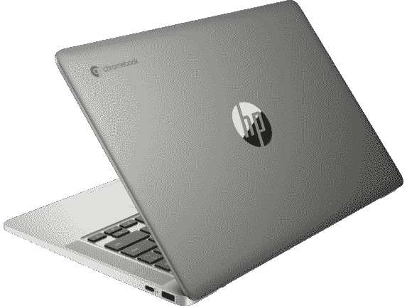</picture> 

HP Chromebook 14a-nd0097nr ($50 off)

##### 惠普 Chromebook 14a

这款惠普 Chromebook 配备了 AMD 锐龙 3 处理器和 8GB 内存，为您提供稳定的多任务处理性能。它还有 64GB 的存储空间来存储您的文件。

 <picture></picture> 

HP Chromebook 11a-nb0047nr ($30 off)

##### 惠普 Chromebook 11A

对于从未有过电脑的小孩子来说，这款 11 英寸的 Chromebook 是让他们入门的好方法。它足以胜任基本任务，而且足够轻便，可以随身携带。

 <picture></picture> 

HP Chromebook x360 14

##### 惠普 Chromebook x360 14C

优质的 Chromebooks 很少见，但这很漂亮。凭借第 11 代英特尔酷睿 i3、全高清显示屏和高端设计，这是惠普制造的最好的 Chromebooks 之一。

 <picture>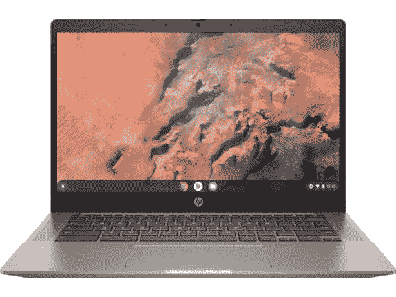</picture> 

HP Chromebook 14b-na0010nr ($110 off)

##### 惠普 Chromebook 14a

如果你想在学校工作或浏览网页时获得稳定的性能，这款 Chromebook 可以通过其 AMD Athlon 处理器和 4GB 内存处理日常任务。

 <picture>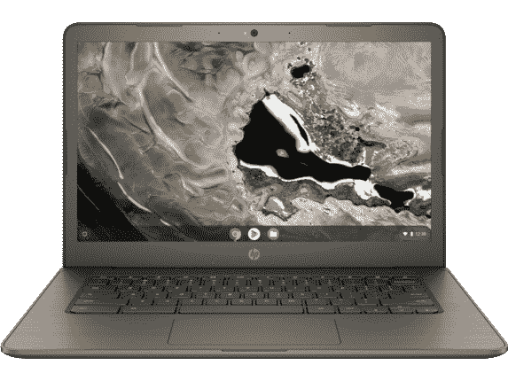</picture> 

HP Chromebook 14A G5 ($49 off)

##### 惠普 Chromebook 14a

这款机型有一些旧规格，但由于采用了 AMD A4 处理器，4GB 内存和 16GB 存储，如果您需要为家里的年轻孩子买些东西，它是一个可靠的入门级选择。

 <picture>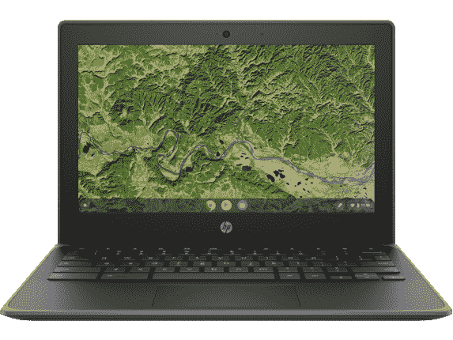</picture> 

HP Chromebook 11A G8 Education Edition ($50 off)

##### 惠普 Chromebook 11A G8

如果你有一个需要娱乐或开始用笔记本电脑练习的小孩，这款 11 英寸 Chromebook 有 4GB 内存和 32GB 存储空间，可用于基本任务。

## 桌面

如果你对台式电脑更感兴趣，或者你不是 Chrome OS 的粉丝，那么在劳动节销售中，惠普也准备好了一些 Windows 台式机。这些也都是打折的，所以如果你很快就需要一台新电脑，这是一个很好的时机。以下是你现在可以得到的优惠:

 <picture>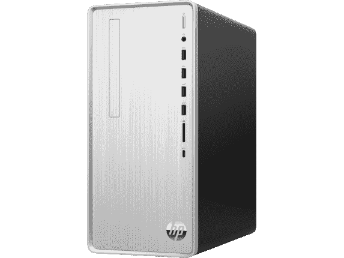</picture> 

HP Pavilion Desktop TP01-2155m ($150 off)

##### 惠普 Pavilion 台式机 TP01

这是为数不多的拥有锐龙台式机 CPU 和集成镭龙显卡的台式机之一，因此您可以玩一些轻度游戏。它配备了 AMD 锐龙 3 5300G，8GB 内存和大量存储空间。

 <picture>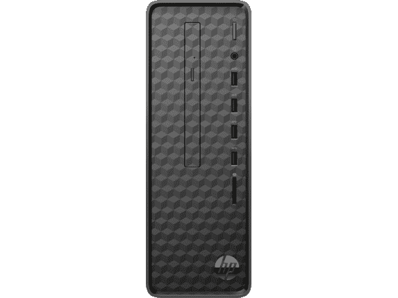</picture> 

HP Slim S01-aF0134z ($50 off)

##### HP Slim S01

如果您只需要一台基本的家用电脑来浏览网页或打印文档，这款惠普纤薄电脑可以满足您的需求。它拥有 AMD 锐龙 3 处理器，8GB 内存，1TB 硬盘和 256GB 固态硬盘。

 <picture>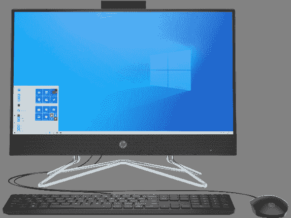</picture> 

HP All-in-One 22-df10266t ($50 off)

##### 惠普多功能一体机 22-df10266t

这款惠普一体机配有英特尔酷睿 i3-111G4 处理器和 8GB 内存。它也有足够的存储空间，128GB 的固态硬盘加上 1TB 的硬盘可以保存你所有的文件。它还配有 22 英寸全高清显示屏和带 Windows Hello 面部识别功能的网络摄像头。

 <picture></picture> 

HP 24-dp0140z AiO ($50 off)

##### 惠普 24 芯 dp0140z 一体机

如果你想要更多的工作空间，这款 24 英寸一体机配备了 AMD 锐龙 5 3500U 处理器、16GB 内存、256GB 固态硬盘和 1TB 固态硬盘。它可以存储您的所有文件，并配有快速固态硬盘来提升整体性能，处理日常任务的多任务处理。

 <picture>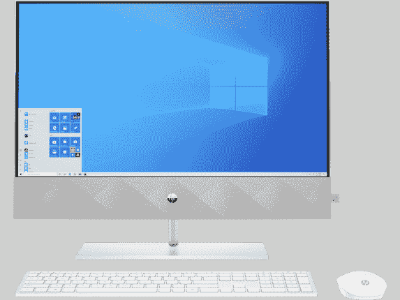</picture> 

HP Pavilion 24-k1305st ($100 off)

##### 惠普展馆 24

这款一体机集成了英特尔的台式机级酷睿 i5 处理器和 NVIDIA GeForce MX350，这意味着您可以使用它来处理视频编辑和轻度游戏等要求更高的任务。它还拥有 16GB 的内存和 256GB 的固态硬盘以及 1TB 的硬盘。

## 监视器

最后，如果你需要的只是一个新屏幕和更多的工作空间，惠普劳动节销售中有一些显示器可以发货。以下是一些你能以折扣价买到的选择:

 <picture>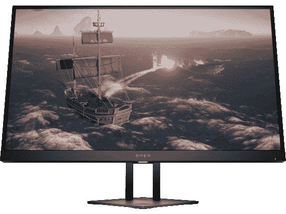</picture> 

HP Omen 27i ($50 off)

##### 惠普 Omen 27i

想升级吗？HP Omen 27i 配备了一个 27 英寸的大显示屏，具有四核高清分辨率和 165Hz 的刷新率，并支持 AMD FreeSync 和 NVIDIA G-Sync。此外，它的响应时间为 1 毫秒。

 <picture>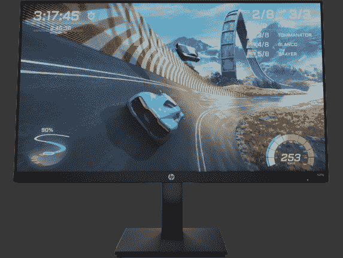</picture> 

HP X27q QHD Gaming monitor ($20 off)

##### 惠普 X27q QHD 游戏显示器

这款 27 英寸的大型显示器具有 165 赫兹的刷新率和四倍高清分辨率，能够在游戏中呈现清晰流畅的图像。它还具有 1 毫秒的响应时间，因此您的输入会立即反映在屏幕上。

 <picture>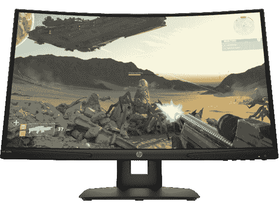</picture> 

HP X24c Gaming Monitor ($35 off)

##### 惠普 X24c 游戏显示器

这款 24 英寸游戏显示器的刷新率为 144Hz，支持 AMD FreeSync 和全高清分辨率。它还具有 1500R 曲率，可以帮助您在外围视觉中保持更多内容，而不必移动太多。

 <picture></picture> 

HP M27fw ($50 off)

##### 惠普 M27fw 显示器

与之前的型号一样，这是一周前上市的显示器的不同颜色型号。这款 27 英寸全高清 IPS 显示器配有白色背板，但在其他方面具有相同的现代设计和功能，使其成为完成工作的绝佳基本显示器。

 <picture>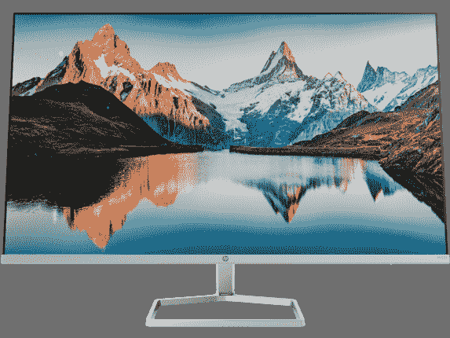</picture> 

HP M32f FHD Monitor ($40 off)

##### 惠普 M32f 显示器

这是一个你只能在本周使用的显示器，它给了你更多的活动空间。它的分辨率与前两款相同，但更大，让你可以看到更多的应用程序或以更身临其境的方式观看电影。

* * *

这些都是惠普劳动节销售中包含的准备发货的产品，但是如果您有能力等待，本次销售还包含一些产品。查看我们的[惠普劳动节交易](https://www.xda-developers.com/hp-labor-day-2021-sales-include-dicounts-spectre-envy-more/)综述，看看还有什么活动。如果你对这里的设备不感兴趣，惠普还列出了所有准备发货的产品[、](https://shop-links.co/1751422059578526383?u1=ab329a3b-2f9b-4e83-bc11-19d8746ac813)，即使它们现在没有打折。