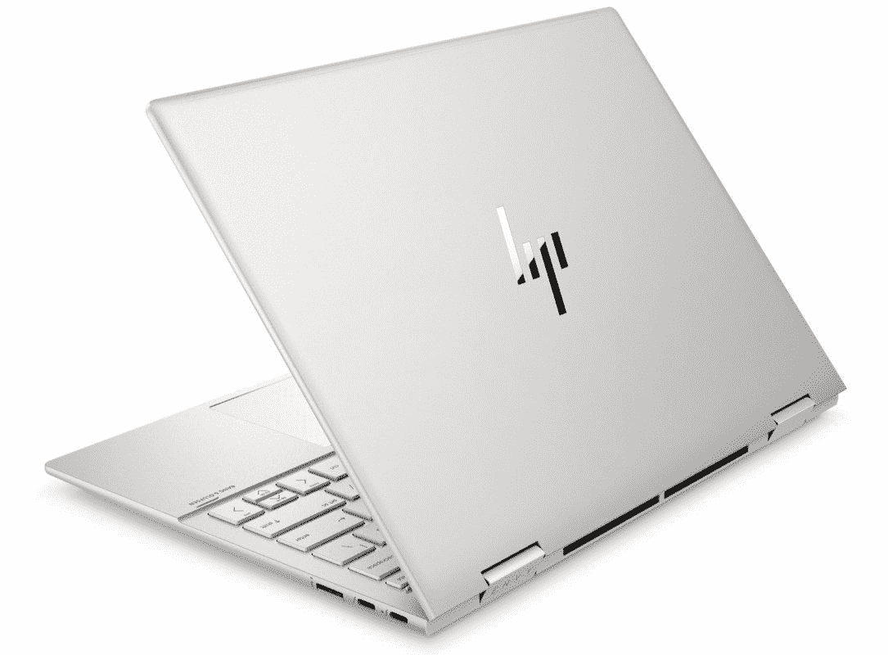
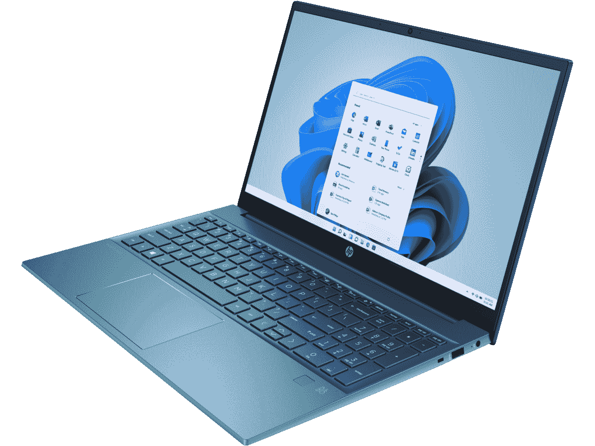

# 惠普的阵亡将士纪念日促销活动包括 Spectre x360 16 的 500 多美元折扣

> 原文：<https://www.xda-developers.com/hp-memorial-day-sale-2022-spectre-x360/>

今天是美国阵亡将士纪念日，如果你想抽出时间去购物，惠普正在进行促销活动，这可能正是你所需要的。该公司对其许多笔记本电脑和台式电脑提供折扣，包括其优质的 Spectre x360 和 Envy x360 笔记本电脑，这是你今天可以买到的一些最好的笔记本电脑。如果您正在寻找新的笔记本电脑或台式机，我们已经收集了一些您今天仍然可以获得的最佳交易。请记住，对于这些交易中的大多数，列出的价格仅适用于基本型号，如果您想要更高的性能，您可以利用折扣来获得一些升级。

## 笔记本电脑交易

从笔记本电脑开始，亮点自然是 Spectre x360 和 Envy xx360 型号，尽管更便宜的设备也有一些折扣。

*   <picture></picture>

    惠普 Envy x360 15 美元(优惠 310 美元)

    ##### 惠普 Envy x360 15

    惠普 Envy x360 15 是一款高端笔记本电脑，如果你想要酷睿 i7 型号，通常售价为 1，159.99 美元，但现在你只需 844 美元就能买到

*   <picture></picture>

    惠普 Envy x360 13 美元(233 元起)

    ##### 惠普 Envy x360 13

    如果你想要小一点的东西，Envy x360 13 也打折到 840 美元以下，其中还包括一个 8GB 的酷睿 i7-1195G7 使用优惠券代码 5MDSHP，您还可以节省额外的 5%，使其更具吸引力。

*   <picture></picture>

    HP Envy 15(315 美元起)

    ##### HP Envy 15

    敞篷车并不是每个人都喜欢的，HP Envy 15 翻盖是一款功能强大的笔记本电脑，配备 8 核英特尔酷睿 i7-11800H CPU 和 GeForce RTX 3060 显卡，让游戏成为现实您可以获得 250 美元的折扣，外加优惠券代码为 5MDSHP 的 5%的额外折扣(65 美元)，因此仅需 1234.99 美元。

*   <picture></picture>

    预兆 16t-b100

    ##### HP 预兆 16

    如果你想更认真地对待游戏，那么预兆 16 可能是你最好的选择。这是一款非常强大的游戏笔记本电脑，配有 8 核 AMD 锐龙 7 5800H 和 GeForce RTX 3070 GPU，通常售价为 154999 美元。现在，它是 1399.99 美元，所以这是一个很好的时机。

*   <picture></picture>

    HP Pavilion 15

    ##### HP Pavilion 15

    对于那些想要更便宜的东西的人来说，HP Pavilion 15 是一个很好的选择，它还有一些非常漂亮的颜色。它从英特尔酷睿 i5，8GB 内存和 512GB 固态硬盘开始，但它不只是 499.99 美元，而不是 899.99 美元，你可以配置它，让它变得更好。

这些是我们的亮点，但如果您想看看其他一些交易，这里有一些您可能会喜欢的选项:

## 台式机/游戏阵亡将士纪念日优惠

如果你更想买一台新的台式电脑，惠普也为你提供了一些不错的选择。其中大多数专注于游戏，但也有几个选项适合任何地方。

*   <picture></picture>

    惠普 Envy TE02-0250xt(优惠 350 美元)

    ##### 惠普 Envy 台式机 TE02-0250xt

    外观更加整洁，这款 Envy 台式机给您一个 12 代英特尔酷睿 i5-12400 和英伟达 GeForce RTX 300 通常，它需要 1299.99 美元，但现在只需 999 美元就能买到。您还可以使用优惠券代码 5MDSHP 在结账时获得额外的 5%折扣。

*   <picture></picture>

    Omen 30L GT13-1265 XT(700 元起)

    ##### HP omm acryl

    如果你想要一台真正的野兽般的游戏 PC，Omen 30L 就是这样。凭借英特尔酷睿 i7-11700K 和 Nvidia GeForce RTX 3080 Ti 显卡，加上 32GB 内存，在这台机器上玩游戏轻而易举。通常，它的价格是 2499.99 美元，但现在你只需 1999.99 美元就能买到。如果优惠券代码为 10MDSHP，价格将降至 1799.99 美元。

*   <picture></picture>

    Omen 40L GT21-0350 ST(450 美元起售)

    ##### HP Omen 40L

    有了更多的喘息空间，Omen 40L 是另一款强大的游戏 PC，这款采用了 12 核英特尔酷睿 i7-12700K 和它通常售价为 1，799.99 美元，但现在你可以用 1，499.99 美元买到它，另外你还可以用优惠券代码 10MDSHP 获得额外的 10%的折扣。

*   <picture></picture>

    Omen 40L GT21-0126m(450 美元起)

    ##### HP Omen 40L

    这是一款 AMD 版本的同款 PC；配备 8 核 AMD 锐龙 5800X COU 和 Nvidia GeForce RTX 3060 显卡，默认情况下还有 16GB 内存(也可升级)。它还打折到 1，499.99 美元，加上优惠券代码 10MDSHP，您可以获得额外的 10%的折扣，这是一个非常诱人的交易。

*   <picture></picture>

    Victus 15L TG02-0355 z(400 美元起)

    ##### HP vic tus 15L

    如果你想要一台全 AMD 的钻机，这款 vic tus 15L 型号配有锐龙 7 5700G 处理器和独立 AMD 镭龙 600 x 通常是 1349.99 美元，但现在降到了 999.99 美元。另外，再一次，你可以用优惠券代码 5MDSHP 获得额外的 10%的折扣，这使得这款机器在价格上非常有吸引力。

如果你对其他东西感兴趣，还有一些交易可以利用。以下是一些额外的选项:

*   [Omen 40L GT21-0148z (AMD 锐龙 7 5800X，镭龙 RX 6600XT，16GB 内存，512GB 固态硬盘)](https://shop-links.co/1775866046904151249?u1=3153d106-ab81-4ed1-8e89-681f7143b7c7)-1259.99 美元(500 美元优惠+优惠券代码 10MDSHP)
*   [Omen 25L GT15-0245m (AMD 锐龙 5 5600G，GeForce RTX 3060，8GB RAM，256 GB SSD)](https://shop-links.co/1775866047408258733?u1=a0a9d9dd-a1fd-4877-9481-e8555f23e614)-949.99 美元(优惠 300 美元+优惠券代码 5MDSHP)
*   [Omen 25L GT15-0340qd(英特尔酷睿 i5-12400，GeForce RTX 3060，8GB 内存，256GB 固态硬盘)](https://shop-links.co/1775866047735454660?u1=0d2ededa-d8d0-4daa-8def-04b7cc75e7d8)-989.99 美元(优惠 300 美元+优惠券代码 10MDSHP)
*   [Victus 15L TG02-0346st(英特尔酷睿 i5-12400，GeForce GTX 1660 超级版，8GB 内存，256GB 固态硬盘)](https://shop-links.co/1775866048443282247?u1=4b171ea6-e050-4236-9107-b72b48b71160)-617.49 美元(优惠 250 美元+优惠券代码 5MDSHP)
*   [Victus 15L TG02-0325m (AMD 锐龙 5 5600G，镭龙 RX 5500，8GB RAM，256 GB SSD)](https://shop-links.co/1775866050044582411?u1=7a646f79-87d3-49dc-a9c1-f571e47e772d)-569.99 美元(优惠 200 美元+优惠券代码 5MDSHP)
*   [惠普 Pavilion Gaming TG01-2260xt(英特尔酷睿 i5-11400，GeForce GTX 1650 Super，8GB 内存，256GB 固态硬盘)](https://shop-links.co/1775866050110840208?u1=864c0dd5-584f-4156-9ba1-4b750f045043)-549.99 美元(优惠 250 美元)
*   [惠普 Pavilion Gaming TG01-2170m (AMD 锐龙 3 5300G，AMD 镭龙 RX 5500，8GB 内存，256GB 固态硬盘)](https://shop-links.co/1775866049595642787?u1=2b05e1d3-2dd0-444c-b541-eff0f7ea6f57)-499.99 美元(优惠 200 美元)
*   [惠普 Pavilion Gaming TG01-1160xt(英特尔酷睿 i3-10100，GeForce GTX 1650，16GB 内存，256GB 固态硬盘)](https://shop-links.co/1775866050595872502?u1=cbf91de0-1f14-4bdf-ae6b-c1ef79f56002)-399.99 美元(优惠 250 美元)

## 外围交易

如果你也想买些外设，惠普也为阵亡将士纪念日打折了一些。以下是你现在可以买到的一些其他好东西:

* * *

如果您希望升级您的设置，无论是全新的电脑还是一些新的配件，这些惠普阵亡将士纪念日交易。可以说，最划算的交易是壮观的惠普 Spectre x360 16 便宜得多，但这里每个人都有一点点东西。如果你正在寻找一台新的笔记本电脑，并且不在乎价格，也许还可以看看[最佳惠普笔记本电脑](https://www.xda-developers.com/best-hp-laptops/)。