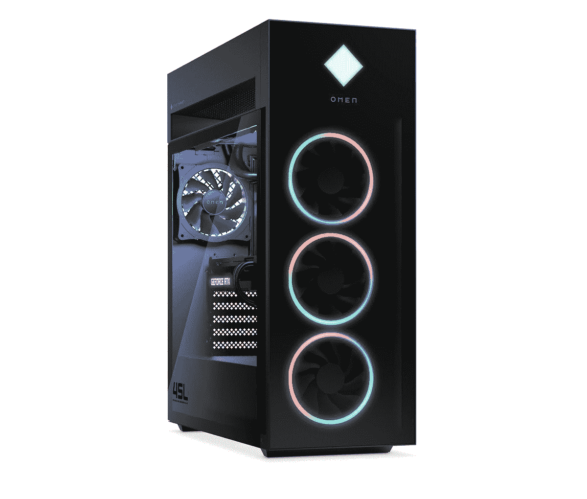
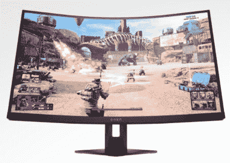
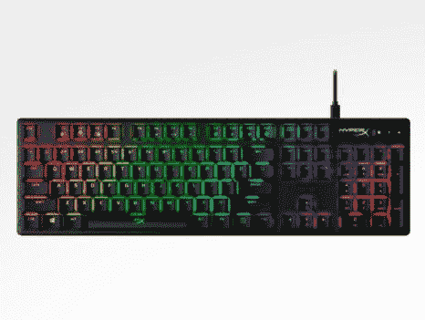
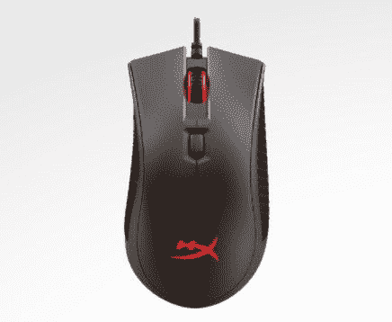
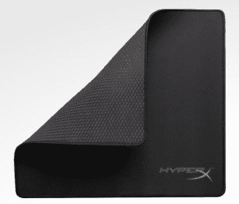
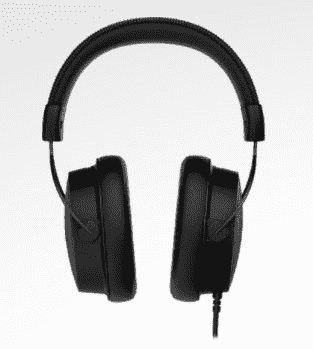

# 惠普桌面评论:这是一个怪物钻机

> 原文：<https://www.xda-developers.com/hp-omen-45l-desktop-review/>

在消费电子展上，惠普宣布推出两款全新的游戏台式机，om -------------------------------------- om ----------------------- om ----- l 和 om ------ l。没错，这些东西都是大男孩，公司给我发了 omn icuring l 台式机来评测，一路 spec 出来。的确，这东西是个野兽。

。bestawarddiv {

浮动:对；

宽度:20%；

边距:0.75em

边距-顶部:0；

}

但不仅仅是强大。惠普表示，它希望给人一种定制 PC 的感觉。这意味着这个东西很容易拆卸、升级等等。它的 45L 也很大，但如果你担心这一点，该公司确实为其 OMEN 台式电脑提供了 40L、30L 和 25L 的选择。对于这一代人来说，om nuclearing l 实际上是全新的，更大的尺寸不仅意味着更多的定制，也意味着更多的散热。

**浏览此评论:**

***关于这次评测:**惠普在 CES 之前给我们发了 omz old l 进行评测。该公司对此次审查的内容没有任何意见。*

### 惠普 OMEN 45L 规格

| 

中央处理器

 | 英特尔酷睿 i9-12900K |
| 

制图法

 | 英伟达 GeForce RTX 3090 |
| 

规模

 | 8.03 英寸(宽)x 18.50 英寸(深)x 21.85 英寸(高) |
| 

储存；储备

 | (2) 2TB NVMe M.2 固态硬盘 |
| 

随机存取存储

 | 64GB HyperX 3733 DDR4 |
| 

港口

 | 耳机/麦克风组合，麦克风插孔前置 I/O: 2 个超高速 USB Type-A 5Gbps 信号速率，2 个 USB2.0 Type-ARear: 1 个超高速 USB Type-A 5Gbps 信号速率，1 个超高速 USB Type-A 10Gbps 信号速率，2 个 USB 2.0 Type-A，1 个超高速 USB Type-C 5Gbps 信号速率，1 个超高速 USB Type-C 10Gbps 信号速率 HDMI3 显示端口 |
| 

电源

 | 800 W 80 Plus 金牌认证 ATX 电源 |
| 

连通性

 | Wi-Fi 6 (2x2)和蓝牙组合(支持千兆文件传输速度，MU-MIMO 支持 10/100/1000 Base-T 网络 |
| 

膨胀

 | 1 个 PCI-E Gen 4 x16(已占用)1 个 PCI-E Gen 3 x4(可用)3 个 M.2(一个可用) |
| 

内存插槽

 | 4 个 DIMM (288 针)(两个可用) |
| 

操作系统（Operating System）

 | Windows 11 专业版 |
| 

价格

 | ~$5,000 |

## 设计:美学和气流

首先，我想说一下惠普 omn drinking l 的整体观感。毕竟，虽然在设计这款电脑时就考虑了功能，但如果它放在你的桌子上或桌子下看起来很碍眼，那还是绝对重要的。不是那样的。

这台 PC 其实挺好看的。它有一个干净整洁的设计，类似于我们看到的以前的惠普 omn icuring l 设计，但更大，更丰富多彩。前面的风扇以前是白光照明，现在是 RGB 照明。当然，如果你想要更微妙的外观，你可以设置为白色。现在还有第三个风扇，是 45L 车型的专属。像 40L 这样较小的型号有两个，而 30L 型号有一个。

侧面是玻璃面板，所以你可以看到所有的内部。DDR4 内存、CPU 冷却器和 GeForce RTX 徽标等东西也亮了起来。

我非常欣赏的一点是，前面有四个 USB Type-A 端口，以及麦克风和扬声器插孔。我不太明白的是为什么有这么多 USB 2.0。两个是 USB 3.2 Gen 1，它已经与 USB 3.2 Gen 2 有点过时了，甚至现在已经有 USB 4 了，但两个是 USB 2.0。

背面的端口也是如此。背面只有四个 USB Type-A 口，其中两个是 USB 2.0。让事情更加扑朔迷离的是，出了另外两个，一个是 USB 3.2 Gen 1，一个是 USB 3.2 Gen 2。这同样适用于两个 USB Type-C 端口。

当然，USB 2.0 在某些情况下很好。插上鼠标和键盘？没问题。插入外部固态硬盘播放 4K 视频或连接 4K 网络摄像头？你敢。

问题是最终用户必须知道这一点。他们必须知道不同的 USB 标志是什么意思(SS 意味着超高速，所以如果没有 SS，那就是 USB 2.0)，他们必须知道每个端口的能力是什么。对用户的期望是不公平的。

在这台电脑的后部也有一些珍贵的端口阻碍了一半的 USB 类端口。理想情况下，前端口用于经常连接和断开的设备，后端口用于一直连接的设备，如键盘、鼠标、网络摄像头、耳机和...没关系，我们没有港口了。

## 设计:HP OML 台式机专为定制而打造

免工具可修复性是我多年来从惠普那里听到的很多东西，但 omn cending l 台式机将它带到了另一个层次。该公司表示，这意味着感觉像一个定制的个人电脑。

按下顶部的一个按钮就可以卸下任一侧面板。事实上，*所有的*面板都可以轻松拆除。你会注意到在顶部有一个被称为低温舱的组件，在它和电脑顶部之间也有一个间隙，所以它可以被用作拿起它的手柄。低温舱是液体冷却器泵出的地方。如前所述，前面有三个风扇将空气吸入，并通过装置的后部推进。

卸下另一个面板后，您就可以操作电缆管理、CPU 底座背面等。

前面板也可以拆除，连同三个 RGB 风扇上的灰尘过滤器。这使得它很容易清洗。再说一次，没有螺丝可以卸下这些零件。你也可以移除冷冻箱本身，它上面的盖子，等等。

## 性能:惠普 OML 台式机拥有顶级规格，但 DDR4 内存

为了这次评测，惠普给我发了一整套工具。它送去审查的 OML 台式机完全配备了英特尔酷睿 i9-12900K、英伟达 GeForce RTX 3090、两个 2TB NVMe M.2 固态硬盘和 64GB 内存。它还发送了一个 27 英寸的弯曲 OMEN 显示器，具有 QHD 分辨率和 240Hz 刷新率，以及一套 HyperX 配件，如 Pro Gaming Mousepad、Cloud Alpha 耳机、Pulsefire FPS Pro 鼠标和 Origins Core 键盘。

我不指望每个购买这台电脑的人都会像这台电脑一样对它进行详细说明，也不指望每个人都能得到全套配件。不过，很明显，这东西是头野兽。如果你在玩游戏，它不可能是为比这台电脑规格更高的东西设计的，因为没有更高的规格了。嗯，大部分是。

It *是否使用 DDR4 内存，而不是英特尔第 12 代 CPU 支持的较新 DDR5。惠普表示，这是由于零部件短缺。DDR5 的价格仍然太高，而且不会像任何人希望的那样很快降下来。你会在消费电子展上的产品中注意到这一点。还是有很多用 DDR4 的。唯一的问题是，你现在必须问自己是否愿意花 5000 美元购买一台使用 DDR4 的游戏电脑。*

我运行了 AIDA64 和 MaxxMem2 来测试内存。我还在我用来[审查英特尔第 12 代处理器](https://www.xda-developers.com/intel-alder-lake-review/)的个人电脑上运行了它。这是一个定制版本，包括一个酷睿 i9-12900K、64GB DDR5(两个 32GB 记忆棒)、一个 NVIDIA GeForce RTX 2080 Ti 和一个 1TB NVMe M.2 SSD。

|  | 

惠普 OMEN 45L 台式机

 | 

DDR5 台式电脑

 |
| --- | --- | --- |
| 

AIDA64 存储器读取

 | 46，576 MB/秒 | 62368 兆字节/秒 |
| 

AIDA64 存储器写操作

 | 48，252 兆字节/秒 | 60，954 兆字节/秒 |
| 

AIDA64 存储器拷贝

 | 45，880 兆字节/秒 | 63187 兆字节/秒 |
| 

AIDA64 存储器延迟

 | 76.3 纳秒 | 95.8 纳秒 |
| 

MaxxMem2 读取

 | 37，813 兆字节/秒 | 39284 兆字节/秒 |
| 

MaxxMem2 写入

 | 41，851 兆字节/秒 | 45117 兆字节/秒 |
| 

MaxxMem2 副本

 | 32，440 兆字节/秒 | 38737 兆字节/秒 |
| 

MaxxMem2 延迟

 | 81.7 纳秒 | 97.1 纳秒 |

用 DDR4 又不是世界末日。考虑到更长的延迟，这甚至不是一个重大的改进。事实上，如果你不为这 5000 美元的 SKU 付钱，你可能根本不在乎。

让我们来看看一些性能指标评测。显然，惠普 OML 台式机将在这里彻底击败它。请注意，这些年来我并没有一直运行相同的基准，所以有些分数会不完整。使用的四台 PC 中有三台是该产品的最新一代，但该列表实际上是通过按 PCMark 10 分数对我的历史基准列表进行排序而得出的。

|  | 

惠普 OML 台式机酷睿 i9-12900K，RTX 3090

 | 

[CLX Ra](https://www.xda-developers.com/clx-ra-gaming-pc-review/) 酷睿 i9-11900K，RTX 3090

 | 

惠普 OML 台式机酷睿 i9-10900K，RTX 3080

 | 

惠普 OMEN 方尖碑 i9-9900K，RTX 2080 Ti

 |
| --- | --- | --- | --- | --- |
| 

PCMark 10

 | 9,012 | 7,822 | 7,463 | 7,137 |
| 

3DMark:时间间谍

 | 18,734 | 17,456 | 16,553 | 11,811 |
| 

3DMark:时间间谍极限

 | 9,594 |  |  |  |
| 

极客工作台

 | 1,921 / 15,723 | 1,803 / 9,887 | 1,365 / 10,933 |  |
| 

电影院长凳

 | 1,894 / 23,659 | 1,675 / 15,098 | 1,312 / 15,266 |  |
| 

橙色房间

 | 16,616 | 14,555 | 14,723 | 11,116 |
| 

VRMark:青色房间

 | 16,887 | 2,752 | 15,146 | 12,474 |
| 

蓝色房间

 | 6,174 | 6,225 | 5,223 | 4,311 |

3DMark 在运行测试时也会评估游戏性能。这是它得出的结论:

| 

比赛

 | 

解决

 | 

帧频

 |
| --- | --- | --- |
| 战地 V | 1440p 超高 | 185+ |
|  | 1080p 超高 | 200+ |
| Apex 英雄 | 1440p 超高 | 140+ |
|  | 1080p 超高 | 140+ |
| GTA V | 1440p 超高 | 110+ |
|  | 1080p 超高 | 165+ |
| 《堡垒之夜》 | 1440p 超高 | 190+ |
|  | 1080p 超高 | 265+ |
| RDR2 | 1440p 超高 | 80+ |
|  | 1080p 超高 | 95+ |

有关这些测试的更多详细信息，如 PCMark 10 测试中的热量、3DMark 中 CPU 和 GPU 分数的细分以及 CrystalDiskMark 分数，请参见下图。

## 结论:该不该买惠普 omn xucing l 台式机？

惠普新推出的 OML 台式机是一款出色的游戏电脑，一如既往，该公司在定制和散热等方面做得很好。凭借英特尔第 12 代处理器和 RTX 30 系列显卡，它还拥有顶级性能。如果这更符合你的风格，你甚至可以用 AMD 的 Zen 3 处理器来实现。

它确实有它的缺陷，我已经在我的评论中指出了。对我来说，最大的问题是它配备了 DDR4 内存，因为这不是你以后可以升级的东西。如果你购买的电脑内存较少，你可以增加内存，但你不能将其换成 DDR5 模块，即使 CPU 和芯片组支持它。他们只是不适合在董事会。还是那句话，对于大多数用户来说，应该没什么大不了的。我只想说，对于那些购买像惠普发给我的那种特殊型号的人来说，当我花 5000 美元购买最好的产品时，我会想要 DDR5。

另一个是令人困惑的 USB 端口阵列。八个 USB Type-A 端口中有一半是 USB 2.0，这本身就是一个真正的痛点，更不用说你要求用户知道哪些端口是哪些端口，以及这意味着什么。

但是一旦你过了那一关，这就是一台神奇的机器。它时尚，安静，可升级，性能出色。通过一个独立的低温舱，它使用外部空气来冷却 CPU，而不是内部的温暖空气。借助英特尔最新一代的器件，使用英特尔线程管理器，可以为不同的任务提供独立的内核。如果您想要一台出色的游戏电脑，这是您的不二之选。

 <picture></picture> 

HP OMEN 45L Desktop

##### 惠普 Omen 45L

惠普的 OML 设计用于更好的冷却、性能和定制

 <picture></picture> 

HP OMEN 27c QHD Curved 240Hz Gaming Monitor

##### 惠普预兆 27c

惠普的曲面游戏显示器具有高分辨率和高刷新率

 <picture></picture> 

HyperX Alloy Origins - Mechanical Gaming Keyboard

##### HyperX 合金起源

这款键盘配有 RGB 照明、红色开关等。

 <picture></picture> 

HyperX Pulsefire FPS Pro - Gaming Mouse

##### HyperX Pulsefire FPS Pro

这款游戏鼠标提供 16，000DPI，因此非常精确。

 <picture></picture> 

HyperX FURY S - Gaming Mouse Pad - Cloth

##### 超级狂怒 S

这款游戏鼠标垫包括缝合的防磨损边缘和编织表面，以便更好地跟踪。

 <picture></picture> 

HyperX Cloud Alpha S - Gaming Headset

##### HyperX 云阿尔法星

这款耳机提供虚拟 7.1 环绕声、低音调节滑块等等。