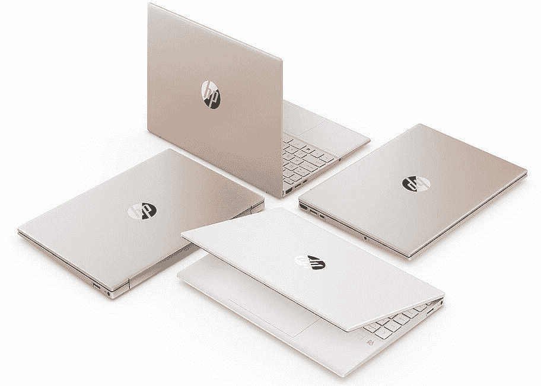

# 惠普 Pavilion Aero 13 评测:超越自身重量

> 原文：<https://www.xda-developers.com/hp-pavilion-aero-13-review/>

在[笔记本](https://www.xda-developers.com/best-laptops/)评论的世界里，惠普的 Pavilion 品牌是我们不常谈论的东西。谈到技术，我们倾向于专注于旗舰产品，如惠普的 Spectre 或戴尔的 XPS。有时，我们会用联想 Yoga 7 系列或惠普 Envy 比这低一步。Pavilion 更为主流，这就是为什么您会对 HP Pavilion Aero 13 的出色程度感到惊讶。

我过去看过几个展馆，最后一个是一台 700 美元的 PC，它有 [4G LTE 连接](https://www.xda-developers.com/best-4g-lte-laptops/)。它们总是有很多价值，并且是体面的 PC。Pavilion Aero 不仅仅是体面的。这是一台非常好的[惠普笔记本电脑](https://www.xda-developers.com/best-hp-laptops/)，我个人会把它作为我的日常驾驶，这是我不常提到的主流设备。

它的重量不到一公斤，因此有了航空品牌。不过，这还不是最棒的。它有一个 AMD 锐龙 7 5800U CPU 和 16GB 内存，所以性能也在那里。它甚至有一个非常棒的 FHD 显示器，这让我特别惊讶。

**浏览此页面:**

### 惠普 Pavilion Aero 13 规格

| 

处理器

 | AMD 锐龙 7 5800U(最高 4.4 GHz 最大提升时钟，16 MB 三级高速缓存，8 个内核，16 个线程) |
| 

制图法

 | 集成:AMD 镭龙显卡 |
| 

身体

 | 11.72x8.23x0.67in，<2.2 lbs |
| 

Display

 | 13.3" diagonal, WUXGA (1920 x 1200), IPS, micro-edge, anti-glare, 400 nits, 100% sRGB |
| 

Memory

 | 16GB DDR4-3200MHz RAM (onboard) |
| 

Storage

 | 512GB PCIe NVMe M.2 SSD |
| 

Battery

 | 3-cell, 43Wh Li-ion polymer45W Smart AC power adapter |
| 

Ports

 | (1) SuperSpeed USB Type-C 10Gbps signaling rate (USB Power Delivery, DisplayPort 1.4, HP Sleep and Charge)(2) SuperSpeed USB Type-A 5Gbps signaling rate(1) HDMI 2.0(1) AC smart pin(1) headphone/microphone combo |
|  | Realtek Wi-Fi CERTIFIED 6 (2x2) and Bluetooth 5.2 combo (Supporting Gigabit data rate) |
| 

Webcam

 | HP Wide Vision 720p HD camera with integrated dual array digital microphones |
| 

Audio

 | Audio by B&O; Dual speakers; HP Audio Boost |
| 

Color and material

 | Natural silver magnesium-aluminum Thixomolding cover and keyboard frame, natural silver base |
| 

Input

 | HP Imagepad with multi-touch gesture support; Precision Touchpad SupportFull-size, natural silver keyboard |
| 

OS

 | Windows 10 Home |
| 

Price

 | $999.99 |

## Design: The HP Pavilion Aero 13 weighs under a kilogram

Much like when I [评测三星 Galaxy Book Go](https://www.xda-developers.com/samsung-galaxy-book-go-review/) ，将惠普 Pavilion Aero 13 开箱真是一个“哇”的时刻。就像我说的，我以前审查过 Pavilions，以及主流范围内的其他 PC。这很简单。你通常会得到与高端产品相同的 U 系列处理器、内存和存储空间，但这款笔记本电脑又厚又重，显示屏也不理想。

[sc name = " pull-quote-right " quote = " HP Pavilion Aero 13 是一款非凡的产品，给人一种超乎想象的感觉。"]这里的情况根本不是这样。它由镁-铝制成，非常轻，但仍然感觉比它应该的更高级。对于一台全功能的个人电脑来说，它已经轻得不能再轻了。有趣的事实-惠普实际上没有列出这款笔记本电脑的重量，你可能已经从上面的规格表中注意到了。公司只说不到 2.2 磅。

像这样使用笔记本电脑会有所不同。当它在你的背包里时，感觉什么都没有。你会离开家，仔细检查你的包，以确保你没有忘记你的笔记本电脑。这也意味着它更容易长期携带，也更容易背在身上。这些都不是新东西，但在这个价位上非常罕见。

它有四种颜色——天然银、暖金、陶瓷白和玫瑰金。惠普发给我的是天然银，没问题。我从来没有真正喜欢过银色的笔记本电脑，但它也是最受欢迎的颜色。惠普有一年停止了 Spectre x360 中的天然银，但由于大众的需求，不得不重新推出。

盖子上印有圆形惠普标志，这种标志出现在[入门级到主流设备](https://www.xda-developers.com/best-cheap-laptops/)中。事实上，这是一种方式来看看展馆航空和知道它不意味着像幽灵或羡慕溢价。

在右侧，有一个桶形充电端口和一个 USB 3.2 Gen 1 Type-A 端口，速度为 5Gbps。USB Type-A 端口使用 dropjaw 铰链，允许惠普将更大的端口安装到更薄的机箱中。是的，有一个桶充电端口，这意味着它带有一个桶充电器。我在评测这台笔记本电脑的时候，连一次充电口都没用过。

而是用了 USB 3.2 Gen 2 Type-C 口，位于左侧。对，只有一个 USB Type-C 口，还有不对，不是迅雷。请记住，这是一个 AMD 的机器，所以霹雳是不会发生的。同样在左侧，有一个 HDMI 2.0 端口塞在底座最厚的部分，另一个 USB Type-A 端口带有 dropjaw 铰链，还有一个 3.5 毫米音频插孔。

总的来说，有两个 USB A 类端口和一个 USB C 类端口。对于大多数用例来说，这完全没问题，尽管许多现代工作流可能依赖于双 USB Type-C 端口。当然，你可以随时使用桶形充电器来释放 USB 端口。

## 显示:惠普 Pavilion Aero 13 上的 FHD 屏幕其实相当不错

当我看到惠普 Pavilion Aero 13 的规格时，我的第一个问题是为了达到这一目标需要做出哪些妥协。毕竟，你不会把 Pavilion 品牌推广到一台相对低成本、重量不到一千克、但仍有很大动力的机器上。通常会受到打击的一件大事是显示器。在入门级到主流笔记本电脑上，你经常会注意到屏幕的视角很窄。

惠普 Pavilion Aero 13 就不是这样了。这台机器的屏幕其实还不错。没有触感，这并不奇怪，反正这也不是我在翻盖手机上怀念的东西。

根据我的测试，它支持 100%的 sRGB、76%的 NTSC、81%的 Adobe RGB 和 83%的 P3。这对于任何屏幕来说都非常好，更不用说起价 749.99 美元的笔记本电脑了。

这还不是故事的全部。这只是我的开场白，因为这完全出乎我的意料。还有更多。

HP Pavilion Aero 13 拥有 13.3 英寸 16:10 1，920 x 1，200 的显示屏。过去一年，16:10 的宽高比在高端市场越来越受欢迎，因为它提供了更高的显示屏和更大的表面积。现在，它正在向航空馆前进。没有触摸屏或惠普 Sure View 隐私显示器的选项，但有趣的是，有一个 2,560 x 1600 的选项，这是一个亮点——只需额外花费 30 美元即可配置更高分辨率的显示器。

它的亮度为 400 尼特，鉴于它是一个哑光防眩光显示器，它在所有照明条件下都非常好。印象相当深刻。

虽然我一直在说惠普如何没有在某些领域做出妥协，但这并不是一台没有妥协的机器。它仍然有一个 720p 的网络摄像头，没有面部识别红外摄像头的选项。FHD 摄像头的缺失仍然引人注目；记住，你可以用三分之一的价格买到一部前置摄像头更好的手机。只是没有人把个人电脑市场推向那个方向，直到 COVID 的在家办公繁荣起来。

## 键盘:它没有背光

惠普 Pavilion Aero 13 上的键盘相当不错。它很舒适，很准确，尽管屏幕较窄，但由于它是边对边的，所以键盘感觉像是全尺寸的。该公司实际上同时向评论者发出了 EliteBook 840 Aero G8，所以我正在寻找两款主流超轻 PC，EliteBook 是为企业制造的。EliteBook 还有一个高级键盘。

Pavilion Aero 有一个非常适合消费电脑的键盘。然而，EliteBook 的键盘更类似于 EliteBook 1000 系列笔记本电脑。这意味着它是市场上最好的键盘之一。

如果你没有抓住这一节的标题，键盘不是背光的。它*是*的一个选项，但它确实是我认为现代笔记本电脑中理所当然的东西之一。这就像如果我买了一辆便宜的 2021 型汽车，它没有电动车窗。

它有一个微软精密触摸板，旁边有一个指纹传感器。指纹传感器是标配，这实际上让我有点惊讶，但由于这一点，你可以使用生物认证登录这台笔记本电脑。

## 性能:它拥有 AMD 锐龙 5000 处理器

惠普发给我的型号包括 AMD 锐龙 7 5800U 处理器、16GB 内存和 512GB 固态硬盘，所以它非常可爱。AMD 在过去几年里做得非常好，为相对低价的设备注入了高性能。Pavilion Aero 13 甚至使用了两种处理器的更好版本——锐龙 5 5600U 和锐龙 7 5800U，而不是锐龙 5 5500U 和锐龙 7 5700U。

注意，与上一代产品相比，更高端的处理器编号意味着它具有同步多线程(SMT)，但今年，SMT 出现在两个版本的芯片中。

7 纳米处理器似乎在电池寿命方面做得很好，因为我在 50%的亮度下获得了超过 7 个小时的时间，功率滑块比节电模式高出一个档次。电池为 43 瓦时，对于笔记本电脑来说并不算大，所以实际使用超过 7 小时是非常令人印象深刻的。

性能也很棒，虽然我没发现它总能打败英特尔。实际上，我认为这两者不相上下。AMD 的大问题是它在电池寿命方面表现不佳。我在做电池测试时遇到了很多问题。它似乎比插上电源时更容易堵塞。

尽管这是一台高效的机器。它不是为照片编辑而设计的，尽管它的屏幕很好，你当然可以这样做。相反，它是为像我这样的人设计的，他们需要打开十几个浏览器标签，并使用 Slack 和 OneNote 等其他应用程序。它肯定能完成任务，而且做得很好，尤其是 16GB 的 RAM。

对于基准测试，我使用了 PCMark 8、PCMark 10、3DMark、Geekbench 和 Cinebench。

|  | 

惠普 Pavilion Aero 13Ryzen 7 5800U

 | 

联想 Yoga Slim 7Ryzen 7 4800U (28W)

 | 

[联想 ThinkPad X1 Carbon Gen 9](https://www.xda-developers.com/lenovo-thinkpad-x1-carbon-review/) 酷睿 i7-1185G7

 |
| --- | --- | --- | --- |
| 

PCMark 8:主页

 | 4,512 | 4,556 | 4,532 |
| 

PCMark 8:创意

 | 4,360 | 4,861 | 4,910 |
| 

PCMark 8:工作

 | 3,977 | 3,926 | 4,144 |
| 

PCMark 10

 | 5,758 | 5,252 | 5,168 |
| 

3DMark:时间间谍

 | 1,212 | 1,376 |  |
| 

极客工作台

 | 1,427 / 5,524 | 1,160 / 6,362 | 1,489 / 5,280 |
| 

电影院长凳

 | 1,365 / 7,115 | 1,245 / 8,703 | 1,303 / 4,224 |

请注意，Yoga Slim 7 中的最新一代锐龙 7 功率提高到了 28W，这就是它仍然竞争如此激烈的原因。

## 结论:该不该买惠普 Pavilion Aero 13？

简短的回答是肯定的，你应该买惠普 Pavilion Aero 13。这只是一个非凡的产品。当我[写下我的第一印象](https://www.xda-developers.com/hp-pavilion-aero-13-first-impressions/)时，我说它感觉比它应该的更高级。这是整个审查的主题。

[sc name = " pull-quote-left " quote = "毫无疑问，HP Pavilion Aero 13 是您能以这个价格买到的最好的产品。"[商务英语坏消息来了。默认情况下，它没有背光键盘，没有用于面部识别的红外摄像头，网络摄像头为 720p。首先，如果你买了这款笔记本电脑，只要确保配置了背光键盘就可以了；我也会选择 2，560 x 1，600 的显示器，尽管你会牺牲一些精彩的电池寿命。对我来说，与许多笔记本电脑一样，最大的问题是 720p 网络摄像头。两年前，没有人关心网络摄像头的质量(没有真的，没有人关心；这就是戴尔将网络摄像头放在 XPS 笔记本电脑显示屏下方的原因。我们今天仍在处理它的影响。

让我们回到好的方面，因为这款笔记本电脑太棒了。我能给它的最大赞美是我很乐意把它作为我的日常驱动。它拥有我想要的笔记本电脑的一切(除了 4G LTE，它在我评论的最后一个展馆中)，例如感觉很棒的超轻构建，很棒的键盘，甚至是很棒的 16:10 显示屏。最重要的是，它拥有我需要的 AMD 锐龙 7 5800U、16GB RAM 和 512GB SSD 的能力和存储。

当你想到 HP Pavilion Aero 13 提供的所有东西，价格都不到 1000 美元，这感觉是显而易见的。毫无疑问，这是你能得到的最好的价钱了。

 <picture></picture> 

HP Pavilion Aero 13

##### 惠普展馆 Aero 13

惠普 Pavilion Aero 是一款主流笔记本电脑，重量不到一千克，但仍然有很大的功率。