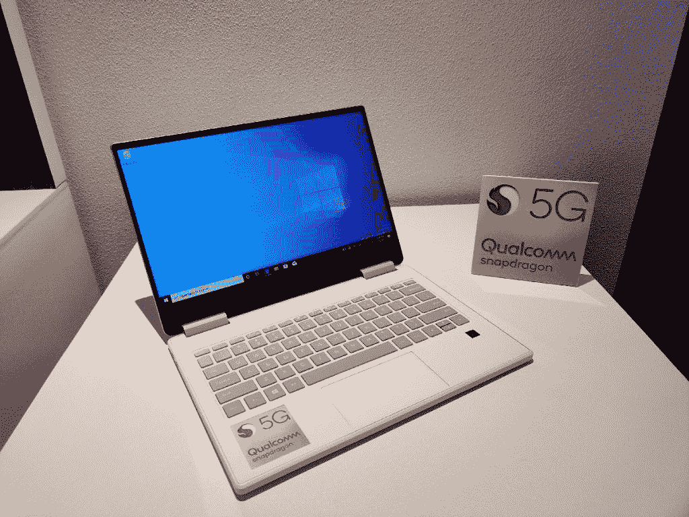
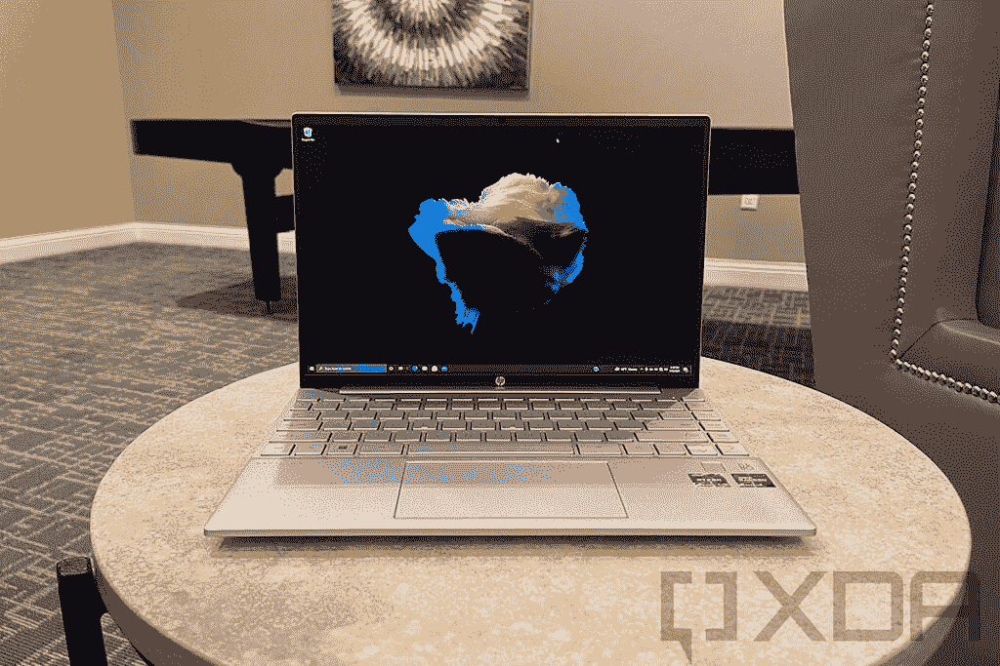

# 惠普 Pavilion Aero 有 5G 吗？我需要它吗？

> 原文：<https://www.xda-developers.com/hp-pavilion-aero-5g/>

惠普 Pavilion Aero 是惠普主流产品系列中一款非常有前途的笔记本电脑。这是该公司最轻的消费类笔记本电脑，但仍然功能强大。它配备了 AMD 最新的锐龙处理器，高达锐龙 7 5800U，高达 16GB 的内存和 1TB 的存储空间。它还拥有全高清+分辨率和 16:10 宽高比的出色显示屏。鉴于它如此便携，如果惠普 Pavilion Aero 也配备 5G，或至少 LTE，那就太好了。这样，无论您去哪里，都可以与互联网保持连接。

然而不幸的是，HP Pavilion Aero 没有 5G 或任何其他蜂窝支持。虽然这款笔记本电脑的许多方面可以在购买时进行配置，但目前没有蜂窝选项。然而，你是否需要它是一个不同的问题。

## 5G 是什么，需要吗？

5G 是蜂窝通信标准的最新版本，这种网络可以让你的手机工作。它是 4G LTE 的继任者，承诺更高的速度和更大的带宽，以适应不断增长的联网设备数量。5G 有两种主要形式——毫米波和 6GHz 以下。Sub-6GHz 类似于当前的 LTE 技术，因为它在可比的频率下工作，但这也意味着它只是稍微快一点。毫米波的工作频率更高，速度也更快，但它很容易被任何物理障碍物阻挡，如树或窗户。

虽然它主要是针对手机的，但 5G -就像 4G LTE 一样-也可以在一些笔记本电脑上使用。虽然你不能用它来打电话，但它能让你无论走到哪里都能上网。通常，你必须依赖 Wi-Fi 网络才能在你的电脑上连接到互联网。这将限制你的选择，但你也可能在外出时连接到公共 Wi-Fi 热点，从而危及你的安全。5G 等蜂窝网络允许笔记本电脑在任何地方保持连接，并且没有安全风险。

 <picture></picture> 

A reference design of a 5G laptop

然而，笔记本电脑的蜂窝连接仍然没有完全普及，当选择存在时，通常会使设备更加昂贵。对于仍处于早期阶段的 5G 来说尤其如此。为笔记本电脑添加 5G 支持会大幅提高价格，目前的好处仍然有限。在许多情况下，使用 LTE 可能会更好。

## Pavilion Aero 会有 5G 版本吗？其他笔记本电脑呢？

不幸的是，HP Pavilion Aero 是仅配备 Wi-Fi 互联网连接的笔记本电脑之一。惠普没有说最终会推出 5G 或 LTE 版本，所以现在还不知道。不过，即使真的发生，也很可能是 LTE 版本。5G 仍然被认为是更高级的选择，只有高端笔记本电脑才有。

 <picture></picture> 

The HP Pavilion Aero

如果你有钱花，并且你想让自己适应未来，你可以看看我们今天可以买到的[最佳 5G 笔记本电脑](https://www.xda-developers.com/best-5g-laptops/)列表。或者，如果你现在只想用 LTE，我们也有一个[伟大的 4G 笔记本电脑](https://www.xda-developers.com/best-4g-lte-laptops/)的列表。

需要说明的是，就其价格而言，HP Pavilion Aero 仍然是一款出色的笔记本电脑。它拥有高端性能和出色的显示屏，您可以轻松地将它带到任何地方。例如，对于学生来说，这是一台很棒的笔记本电脑。缺乏 5G 或 LTE 支持可能会令人失望，但在这个价格范围内也并不罕见。惠普 Pavilion Aero 仍然是[公司最好的笔记本电脑](https://www.xda-developers.com/best-hp-laptops/)之一，对于 AMD 的粉丝来说，这也是[包装 AMD 锐龙处理器](https://www.xda-developers.com/best-amd-ryzen-laptops/)的最佳笔记本电脑设计之一。

起价 749.99 美元，也相当实惠，但是如果你想要更便宜的东西，你可以看看我们的[预算惠普笔记本电脑](https://www.xda-developers.com/best-cheap-hp-laptops/)列表，看看你感兴趣的是什么。不然可以买下面的惠普 Pavilion Aero。

 <picture></picture> 

HP Pavilion Aero

##### 惠普展馆 Aero 13

Pavilion Aero 是惠普最轻的消费者笔记本电脑，但它仍然很强大。凭借强大的 AMD 锐龙处理器和高清晰的显示屏，它的性价比非常高。