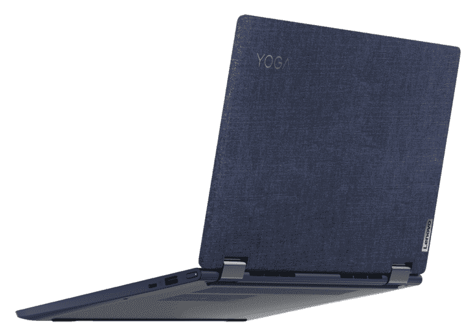
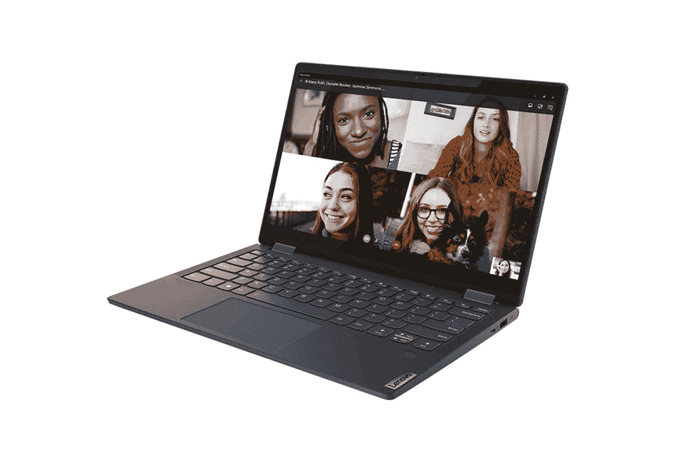

# 惠普 Pavilion Aero vs 联想 Yoga 6:主流笔记本电脑哪个最好？

> 原文：<https://www.xda-developers.com/hp-pavilion-aero-vs-lenovo-yoga-6/>

惠普最近推出了 Pavilion Aero 笔记本电脑，该公司称这是迄今为止最轻的消费者笔记本电脑。由于采用了最新的 AMD 锐龙处理器，它的重量不到 2.2 磅，当然重量也很轻，而且还具备一些功能。这是[惠普最好的笔记本电脑](https://www.xda-developers.com/best-hp-laptops/)之一，但是笔记本电脑市场非常拥挤，竞争总是很激烈。在这场比赛中，我们将与 HP Pavilion Aero 和联想 Yoga 6 进行较量，联想 Yoga 6 是另一款采用 AMD 处理器的 13 英寸笔记本电脑，功能丰富。这也是[联想最好的笔记本电脑](https://www.xda-developers.com/best-hp-laptops/)之一，特别是在预算部分。

仅从显示器尺寸和处理器来看，这些笔记本电脑可能看起来相似，但实际上有很多不同之处。很多时候，不仅仅是性能的问题。做出选择需要考虑每种设备提供的设计元素和额外功能。让我们来看看这些笔记本电脑都带来了什么，以及为什么你会更喜欢其中的一个。

## 规范

正如我们刚才所说，虽然规格并不是笔记本电脑的全部，但了解每台笔记本电脑的内部情况总是有好处的。这为比较提供了一个坚实的基础，即使有更多的东西需要考虑。这两款笔记本电脑的对比如下:

|  | 

惠普航空馆

 | 

联想 Yoga 6

 |
| --- | --- | --- |
| **处理器** | 

*   AMD 锐龙 5 5600U (2.3GHz 基础，4.2GHz 增强，6 核)
*   AMD 锐龙 7 5800U (1.9GHz 基础，4.4GHz 增强，8 核)

 | 

*   AMD 锐龙 5 5500U (2.1GHz 主频，4GHz 增强 6 核)
*   AMD 锐龙 7 5700U (1.8GHz 基础，4.3GHz 增强，8 核)

 |
| **图形** | 

*   AMD 镭龙显卡(7 核，1.8GHz)
*   AMD 镭龙显卡(8 核，2GHz)

 | 

*   AMD 镭龙显卡(7 核，1.8GHz)
*   AMD 镭龙显卡(8 核 1.9GHz)

 |
| **闸板** |  |  |
| **存储** |  |  |
| **显示** | 

*   13.3 英寸，WUXGA (1920 x 1200)，IPS，微边缘，防眩光，400 尼特
*   13.3 英寸，WQXGA (2560 x 1600)，IPS，微边缘，防眩光，400 尼特

 | 

*   13.3 英寸 FHD (1920 x 1080) IPS 触摸屏，300 尼特

 |
| **音频** | 

*   双扬声器，B&O 音频，惠普音频增强

 | 

*   带杜比 Atmos 的立体声扬声器

 |
| **网络摄像头** | 

*   惠普 True Vision 720p 高清摄像头

 |  |
| **Windows 你好** |  |  |
| **电池** | 

*   3 芯 43 瓦时电池
*   65W 充电器

 | 

*   4 芯 60 瓦时电池
*   45W 充电器

 |
| **端口** | 

*   1 个 USB Type-C 3.2 Gen 2 (10Gbps，电源传输，DisplayPort 1.4，惠普睡眠和充电)
*   2 个 USB Type-A 3.2 Gen 1 (5Gbps)
*   1 个 HDMI 2.0 接口
*   3.5 毫米组合音频插孔
*   交流智能引脚

 | 

*   1 个 USB Type-C 3.2 Gen 1 (5Gbps，显示端口，电源传输)
*   1 个 USB Type-C 3.2 Gen 1 (5Gbps，显示端口)
*   2 个 USB Type-A 3.2 Gen 1 (5Gbps)
*   3.5 毫米组合音频插孔

 |
| **连通性** | 

*   Wi-Fi 5 (1x1) +蓝牙 4.2
*   Wi-Fi 6 (1x2) +蓝牙 5.2
*   Wi-Fi 6 (2x2) +蓝牙 5.2

 | 

*   Wi-Fi 6 (2x2) +蓝牙 5.0

 |
| **颜色** | 

*   天然银
*   陶瓷白
*   温暖的金色
*   浅玫瑰金

 |  |
| **尺寸(WxDxH)** | 11.72 x 8.23 x 0.67 英寸(297.69 x 209.04 x 17.02 毫米) | 12.13 x 8.12 x 0.67-0.72 英寸(308 x 206.4 x 17–18.2 毫米) |
| **重量** | <2.2 lb (<997.9 grams) | 2.91 lb (1.32 kg) |
| **起价** | $749.99 | 749.99 美元(各不相同) |

## 设计:翻盖还是敞篷？

HP Pavilion Aero 和 Lenovo Yoga 6 之间的差异从外形开始，仅此一点就可以为您做出决定。Pavilion Aero 是一款典型的翻盖式笔记本电脑，而 Yoga 6 则是一款敞篷车。如果你只是想要一个基本的笔记本电脑外形，那么 Pavilion Aero 可能会有用。但对于像我这样喜欢敞篷车的人来说，毫无疑问联想 Yoga 6 更有吸引力。你可以旋转屏幕，将其用作触摸屏，这样更有趣、更自然。此外，Yoga 6 还支持活动笔——尽管你需要单独购买。

就外观而言，公平地说，这两款笔记本电脑互有高下。惠普走得更远，为 Pavilion Aero 提供了四种不同的颜色选择，这很好。如今大多数笔记本电脑只给你一两种颜色选择，而且通常都是中性色。看到一家公司提供更多选择总是很棒。

另一方面，联想 Yoga 6 只有深渊蓝，但它有一张王牌。笔记本电脑的上半部分覆盖着布料，看起来很惊艳。这是经典和优雅的，非常突出。此外，它可以给你一个更舒适的抓地力。这两款笔记本电脑都得分，但我个人认为联想 Yoga 6 胜出。

就端口而言，这两款笔记本电脑都没有 Thunderbolt 支持，因为它们都有 AMD 处理器。然而，HP Pavilion Aero 有一个 10Gbps 信号速率的 USB Type-C 端口，这使它有可能比联想的任何端口都快。惠普还包括一个 HDMI 端口，这仍然是显示器和(尤其是)电视上最常见的显示输入。

另一方面，联想 Yoga 6 已经完全过渡到 USB Type-C 充电(因此有两个 Type-C 端口)，而惠普仍然有一个专有的筒式充电器。与此同时，两款笔记本电脑都通过指纹识别器支持 Windows Hello，但都没有红外摄像头。

（...)虽然这两款笔记本电脑都相对较轻，但就便携性而言，HP Pavilion Aero 显然是赢家。

最后，虽然这两款笔记本电脑都相对较轻，但在便携性方面，HP Pavilion Aero 显然是赢家。它的重量不到 1 公斤，即 2.2 磅，这使得它非常容易携带到任何地方。联想 Yoga 6 起价 2.91 磅，明显偏多。敞篷车往往就是这种情况，但这仍然是一个显著的差异，如果你把它放在背包里几个小时，你可能会在一段时间后注意到它。惠普 Pavilion Aero 也比 Yoga 6 更薄、更窄，尽管它更高。这部分是因为显示器，我们将在接下来讨论。

## 显示屏:惠普 Pavilion Aero 的屏幕更高、更清晰、更明亮

如果你关注笔记本电脑市场更高端的部分，你可能已经看到了一些配有更高显示屏的设备。多年来，几乎每台笔记本电脑都使用 16:9 的宽高比，这主要是为了匹配 DVD 电影和节目的宽高比。然而，近年来，我们已经看到一些高端笔记本电脑，如微软 Surface 系列、MacBook 和其他采用 3:2 或 16:10 宽高比的笔记本电脑。

HP Pavilion Aero 是首批将这一技术引入主流市场的产品之一。具体来说，它的长宽比为 16:10，这意味着您可以获得一点额外的垂直空间。这听起来可能没什么大不了的，但是这种差异让您在浏览网页或撰写文档时可以看到更多的文本，这非常方便。

这还不是它带来的全部。如果你愿意支付更多，你可以支付 2560 x 1600 的面板，它更清晰，让眼睛看起来更舒服。有了联想 Yoga 6，您唯一的选择就是 16:9 全高清面板。

如果这还不够，Pavilion Aero 的屏幕亮度高达 400 尼特，如果你想在户外使用，这是一个很大的问题。联想 Yoga 6 高达 300 尼特，足以在室内使用，但在阳光直射下可能很难看到。

另一方面，正如我们提到的，联想 Yoga 6 是一款敞篷车，因此显示屏是触摸屏。你在 Pavilion Aero 上根本没有这种选择，这可能是你的一个重要因素。然而，不可否认的是，就显示器的质量而言，惠普在几乎所有领域都轻松击败了联想。

（...)就显示器质量而言，惠普几乎在所有领域都轻松击败了联想。

至于声音，两款笔记本电脑差不多。HP Pavilion Aero 有两个扬声器，声音由 Bang & Olufsen (B&O)调谐，但没有提到对杜比全景声的支持。联想 Yoga 6 拥有立体声扬声器，并声称支持杜比全景声，可以在观看电影或节目时提供额外的沉浸感。

这两款笔记本电脑都有 720p 高清摄像头，对于日常使用来说可能是不错的。大多数笔记本电脑的网络摄像头都没有那么好，你也不应该期望它们中的任何一个有什么惊人之处，但它们都是可以接受的。

## 性能:Pavilion Aero 拥有比 Yoga 6 更快的处理器

这两款笔记本电脑都配备了 AMD 锐龙 5000 系列移动处理器，高达 1TB 的存储空间和 16GB 的内存。这看起来好像两台笔记本电脑完全处于同一水平，但这里有一些差异。

尽管非常相似，但 HP Pavilion Aero 使用的处理器的时钟速度略高。例如，联想 Yoga 6 中的锐龙 5 5500U 的基础时钟为 2.1GHz，可以提升至 4GHz，但惠普 Pavilion Aero 中的锐龙 5 5600U 的基础时钟为 2.3GHz，提升时钟为 4.2GHz。在锐龙 7 的情况下，惠普 Pavilion Aero 中的集成镭龙图形也比联想 Yoga 6 略快。

看看 GeekBench 的成绩，差异是显而易见的。锐龙 5 5600 u T1 的 Pavilion Aero 的基准测试结果似乎经常超过 1200，这一分数在 T2 5 5500 u T3 中几乎从未出现过。类似的故事也发生在锐龙 7 车型上。[锐龙 7 5800U](https://browser.geekbench.com/v5/cpu/search?utf8=%E2%9C%93&q=ryzen+7+5800U) 经常突破 1300，有时 1400，但[锐龙 7 5700U](https://browser.geekbench.com/v5/cpu/search?utf8=%E2%9C%93&q=ryzen+7+5700U) 似乎从未接近过。

惠普似乎做出了一些奇怪选择的一个领域是无线通信。默认配置仍然只支持 Wi-Fi 5 和蓝牙 4.2，两者都已被取代。Wi-Fi 6 和蓝牙 5.2 都有选项，但是你要具体选择。惠普的网站让这变得有点奇怪，因为如果你选择升级版本，就不会产生额外的费用，但至少这意味着你不用考虑是否应该升级。你总是想选择更新的型号。

## 惠普 Pavilion Aero vs 联想 Yoga 6:底线

公平地说，在客观可比性方面，HP Pavilion Aero 比联想 Yoga 6 更具吸引力。您可以获得更快的处理器、更快的 USB Type-C 端口，以及几乎在所有方面都更好的显示器。它可以变得更亮，你可以得到更高的分辨率，它有一个高纵横比，这使它更有利于生产力。更重要的是，它还更轻、更便于携带。

（...)如果您想要最高的性能、最佳的显示效果或最佳的便携性，HP Pavilion Aero 在这里取得了令人信服的胜利。

但这并不总是关于客观规格。联想 Yoga 6 的可转换外形确实提供了多功能性。如果你喜欢使用触摸屏，喜欢时不时地把你的电脑当作平板电脑使用，这就是你想要的选择。你甚至可以用它用活动笔画画。另外，联想 Yoga 6 默认使用 USB Type-C 充电器，所以你不太可能担心没有合适的充电器。

 <picture></picture> 

Lenovo Yoga 6

最后，你可能还想考虑长相。惠普为 Pavilion Aero 提供了几种颜色可供选择，因此您更有可能找到适合自己口味的产品。但是联想 Yoga 6 尽管只有一种颜色，却比惠普的任何颜色都要独特得多。这种织物涂层不是你每天都能看到的，所以你必须给它加分。

如果是我来做选择，我可能还是会选择联想 Yoga 6 的外形。但是，如果你想要最大的性能，最好的显示，或最好的便携性，惠普 Pavilion Aero 在这里取得了令人信服的胜利。你可以从下面的链接中购买任何一款，或者查看我们的[最佳 AMD 驱动的笔记本电脑](https://www.xda-developers.com/best-amd-ryzen-laptops/)的综述，看看其他的选择。

 <picture></picture> 

HP Pavilion Aero

##### 惠普展馆 Aero 13

Pavilion Aero 是惠普最轻的消费者笔记本电脑，但它仍然很强大。凭借强大的 AMD 锐龙处理器和高清晰的显示屏，它的性价比非常高。

 <picture></picture> 

Lenovo Yoga 6

##### 联想 Yoga 6

联想 Yoga 6 是一款功能强大的基于 AMD 的敞篷车，可以提供很多功能。它有时尚的织物覆盖设计，Windows Hello 的指纹识别器，以及顶级的规格。