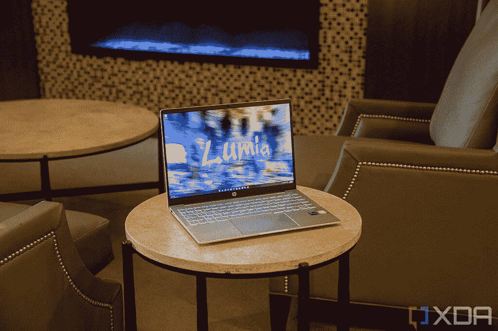
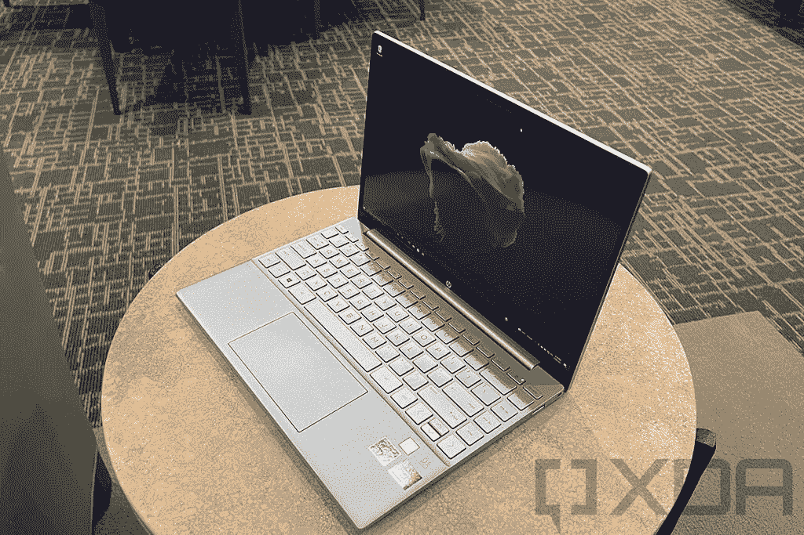
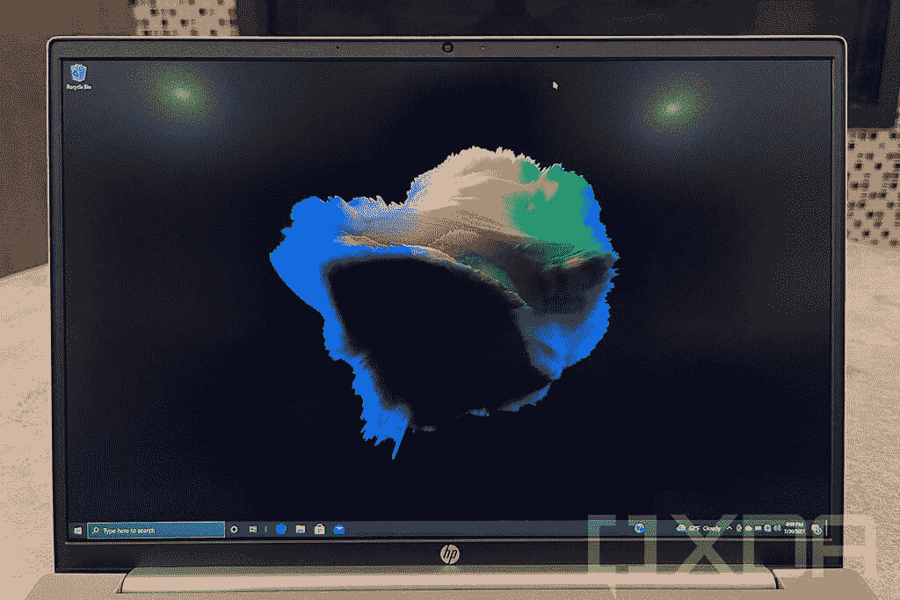
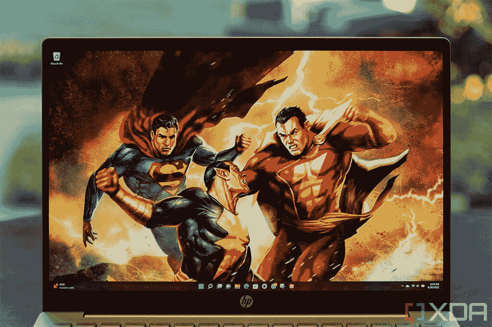

# HP Pavilion Plus 与 HP Pavilion Aero:哪一个适合您？

> 原文：<https://www.xda-developers.com/hp-pavilion-plus-vs-hp-pavilion-aero/>

在过去的几年中，HP Pavilion 的阵容相当有趣。通常，这是惠普更便宜的笔记本电脑的去处——尽管称它们为主流笔记本电脑可能更准确。虽然它们不是惠普高端产品系列的一部分，但它们仍然有一些发展，在 2021 年和 2022 年，惠普推出了一些非常有趣的 Pavilion 产品。首先，有去年首次亮相并赢得大量赞誉的 [HP Pavilion Aero](https://www.xda-developers.com/hp-pavilion-aero-13-review/) ，今年我们有新的 [Pavilion Plus](https://www.xda-developers.com/hp-pavilion-plus-review/) 。

这两个都是非常有趣的笔记本电脑，但出于不同的原因，除了品牌之外，它们彼此完全不同。然而，它们都相对便宜，很有可能你会发现自己想要在它们之间进行选择，所以我们在这里提供帮助。我们将对 HP Pavilion Plus 和 Pavilion Aero 进行比较，找出哪一款最适合您的需求。事不宜迟，我们开始吧。

**浏览这篇文章:**

## HP Pavilion Plus 与 HP Pavilion Aero:规格

|  | 

惠普 Pavilion Plus

 | 

惠普航空馆

 |
| --- | --- | --- |
| **操作系统** | 

*   Windows 11 主页
*   Windows 11 专业版

 |  |
| **处理器** | 

*   第 12 代英特尔酷睿 U 系列(15W)
    *   英特尔酷睿 i5-1235U (10 个内核，12 个线程，最高 4.4GHz，12MB 高速缓存)
    *   英特尔酷睿 i7-1255U (10 个内核，12 个线程，最高 4.7GHz，12MB 高速缓存)
*   第 12 代英特尔酷睿 P 系列(28W)
    *   英特尔酷睿 i5-1240P (12 个内核，16 个线程，最高 4.4GHz，12MB 高速缓存)
*   第 12 代英特尔酷睿 H 系列(45 瓦)
    *   英特尔酷睿 i5-12500H (12 个内核，16 个线程，最高 4.5GHz，18MB 高速缓存)
    *   英特尔酷睿 i7-12700H (14 个内核，20 个线程，最高 4.7GHz，20MB 高速缓存)

 | 

*   AMD 锐龙 5 5625U (6 个内核，12 个线程，最高 4.3GHz，16MB 高速缓存)
*   AMD 锐龙 7 5825U (8 个内核，16 个线程，最高 4.5GHz，16MB 高速缓存)

 |
| **图形** | 

*   英特尔酷睿 U 系列型号:
    *   Nvidia GeForce MX550 (2GB 内存)(酷睿 i5)
    *   Nvidia GeForce RTX 2050 笔记本电脑(4GB 内存)(酷睿 i7)
*   英特尔酷睿 P 系列型号:
    *   英特尔 Iris Xe 显卡(80 个欧洲单位)
*   英特尔酷睿 H 系列型号:
    *   英特尔 Iris Xe 显卡(最高 96 个欧洲单位)

 | 

*   AMD 镭龙显卡(7 核，1.8GHz)
*   AMD 镭龙显卡(8 核，2GHz)

 |
| **闸板** | 

*   8GB(焊接)
*   16GB(焊接)

 | 

*   8GB(焊接)
*   16GB(焊接)

 |
| **存储** | 

*   256GB PCIe NVMe 固态硬盘
*   512GB PCIe NVMe 固态硬盘
*   512GB PCIe 4 x4 NVMe TLC 固态硬盘
*   1TBPCIe NVMe 固态硬盘

 | 

*   256GB PCIe NVMe 固态硬盘
*   512GB PCIe NVMe 固态硬盘
*   1TB PCIe NVMe 固态硬盘

 |
| **显示** | 

*   14 英寸，2.2K (2240 x 1400)，IPS，低蓝光，防眩光，300 尼特
*   14 英寸，2.8K (2880 x 1800)，有机发光二极管，90Hz，低蓝光，BrightView，400 尼特(SDR)

 | 

*   13.3 英寸，WUXGA (1920 x 1200)，IPS，微边缘，防眩光，400 尼特
*   13.3 英寸，WQXGA (2560 x 1600)，IPS，微边缘，防眩光，400 尼特

 |
| **音频** | 

*   双立体声扬声器，B&O 音频

 | 

*   双立体声扬声器，B&O 音频

 |
| **网络摄像头** |  |  |
| **视窗你好** |  |  |
| **电池** |  |  |
| **端口** | 

*   2 个 USB Type-C 3.2 Gen 2 (10Gbps，电源传输，DisplayPort 1.4，惠普睡眠和充电)
*   2 个 USB Type-A 3.2 Gen 1
*   HDMI 2.1
*   3.5 毫米组合音频插孔
*   microSD 读卡器

 | 

*   1 个 USB Type-C 3.2 Gen 2 (10Gbps，电源传输，DisplayPort 1.4，惠普睡眠和充电)
*   2 个 USB Type-A 3.2 Gen 1 (5Gbps)
*   HDMI 2.1
*   3.5 毫米组合音频插孔
*   交流智能引脚

 |
| **连通性** |  |  |
| **颜色** |  | 

*   天然银
*   陶瓷白
*   温暖的金色
*   浅玫瑰金

 |
| **尺寸(WxDxH)** | 12.34 x 8.83 x 0.65 英寸(313.44 x 224.28 x 16.51mm 毫米) | 11.72 x 8.23 x 0.67 英寸(297.69 x 209.04 x 17.02 毫米) |
| **重量** | 起始重量为 3.09 磅(1.4 千克) | 起价<2.2 lb (<997.9 grams) |
| **起价** | 起价 799.99 美元(打折前) | 起价 799.99 美元(不含折扣) |

## 性能:HP Pavilion Plus 速度更快，但会延长电池寿命

查看这两款笔记本电脑的规格，您可能会注意到的第一件事是，HP Pavilion Plus 为您提供了许多处理器选项，旨在实现不同的性能水平。可以得到 15W U 系列处理器，搭配专用 Nvidia 显卡，28W P 系列处理器，45W H 系列处理器。后两种只配备了集成显卡，因为光是处理器就已经消耗了大量的能量。

 <picture></picture> 

HP Pavilion Plus

与此同时，惠普 Pavilion Aero 只配备了 AMD 锐龙 U 系列处理器，它们实际上并不是最新的处理器。它配备了 AMD 的锐龙 5000 系列处理器的更新版本，可以稍微提升，仍然非常强大。事实上，从性能指标评测来看，AMD 处理器在性能方面遥遥领先。当然，45W 处理器有潜力更快。

|  | 

惠普 Pavilion AeroAMD 锐龙 7 5825U( [参见测试](https://browser.geekbench.com/v5/cpu/15421509))

 | 

惠普 Pavilion plus Intel Core i7-1255 u([见测试](https://browser.geekbench.com/v5/cpu/15093208))

 | 

惠普 Pavilion plus 英特尔酷睿 i7-12700H

 |
| --- | --- | --- | --- |
| Geekbench 5(单核/多核) | 1,495 / 6,509 | 1,446 / 5,666 | 1,747 / 8,658 |

然而，这些 45W 处理器也更容易受到热节流的影响，这意味着在负载较重时，性能可能会下降很多。因为惠普在同一个机箱中使用了所有不同类型的处理器，这是必然会发生的，而且这一点在 Geekbench 5 这样的短期基准测试中并没有真正反映出来。

HP Pavilion Plus 的高端配置电池寿命低得令人难以置信。

45W 处理器对电池寿命也有很大影响。我们实际上已经评测了配备英特尔酷睿 i7-12700H 的惠普 Pavilion Plus，我们通常只能获得 2 小时 40 分钟的电池寿命，这是令人难以置信的低。请记住，这是一个 90Hz OLED 面板的高端配置，但当你有一个 51 瓦时的小电池和一个像这样耗电的处理器时，这只是意料之中的事情。在我们对 Pavilion Aero 的评测中，我们获得了超过 7 个小时的电池续航时间。Pavilion Plus 的 U 系列型号可能也更接近这一点，尽管你仍然必须考虑使用更多功率的独立 GPU。

 <picture></picture> 

HP Pavilion Aero

不过，这是 HP Pavilion Plus 的一个优势——GPU 性能。AMD 锐龙处理器拥有非常好的集成 GPU，但它们与 Nvidia GeForce MX550 等独立 GPU 不在同一水平上，尤其是 GeForce RTX 2050 笔记本电脑。同样，这是以电池寿命为代价的，但如果你想玩游戏，HP Pavilion Plus 可能更适合你。

最后，谈到 RAM，两款笔记本电脑都有 8GB 或 16GB，并且在这两种情况下，RAM 都焊接在主板上。至于存储，选项也是类似的，尽管 Pavilion Plus 确实给了你更快的 PCIe 4 SSD 的选项。

## 显示器:惠普 Pavilion Plus 有一个有机发光二极管选项

继续展示，惠普 Pavilion Plus 确实很突出，尽管 Pavilion Aero 在这个价格上还算不错。在基本型号中，HP Pavilion Aero 配备了 13.4 英寸的全高清+ (1920 x 1200)分辨率显示屏，亮度最高可达 400 尼特。您还可以以相对较低的价格升级到 Quad HD+ (2560 x 1600)面板，从而获得更清晰的显示效果。

 <picture></picture> 

HP Pavilion Aero

另一方面，惠普 Pavilion Plus 拥有 14 英寸的显示屏，分辨率为 2.2K (2240 x 1400)，亮度为 300 尼特。考虑到尺寸差异，如果你打算坚持使用入门级产品，HP Pavilion Aero 实际上可能是更好的选择。锐度几乎相同，Aero 的显示屏更亮，更适合户外使用。

然而，Pavilion Plus 的真正优势在于它的升级选项——令人惊叹的 2.8K (2880 x 1800) OLED 面板，刷新率为 90Hz，以这个价格提供了在其他任何地方都无法获得的体验。有机发光二极管意味着您可以获得真正的黑色和非常高的对比度，以及更鲜艳的颜色，加上 90 赫兹的刷新率使运动和动画看起来更加流畅。它确实会消耗你的电池寿命，但这个屏幕上的视觉体验非常棒。此外，它还达到了 400 尼特的亮度，这消除了 Pavilion Aero 可能拥有的任何优势。这简直是一个漂亮的屏幕。

 <picture></picture> 

HP Pavilion Plus

显示器上方是网络摄像头，同样，惠普 Pavilion Plus 在这里真的粉碎了它。2022 年，许多惠普笔记本电脑现在都配备了 500 万像素的网络摄像头，它们基本上是目前所有 Windows 笔记本电脑中内置的最佳网络摄像头。它可以录制 1080p 视频，并且具有智能功能，可以跟随你并在不牺牲分辨率的情况下裁剪到画面中。惠普 Pavilion Aero 仍然有一个 720p 的摄像头，在必要时可以使用，但仅此而已。

至于声音，这两款笔记本电脑都采用 Bang & Olufsen 的双扬声器音频，应该不错，尽管不是太令人印象深刻。两者都有双麦克风用于语音拾取。

## 设计:尺寸(和便携性)很重要

HP Pavilion Plus 起始重量为 3.09 磅，而 Pavilion Aero 仅重 2.2 磅

惠普 Pavilion Plus 更强大的硬件和显示器必须付出一定的代价，除了我们已经提到的电池寿命，这里最重要的是便携性。惠普 Pavilion Plus 的重量为 3.09 磅，并不算太重，但以今天的标准来看，它也算不上是一款轻量级机器。它可以随身携带，没有太大的问题，但在背包里放一段时间后你会感觉到它。

与此同时，惠普 Pavilion Aero 在这个价格点上令人印象深刻地轻，这也是它去年推出时实际上站在那里的原因之一。它的起价不到 2.2 磅，在这个价位上非常罕见，尤其是当你也有这么一台功能强大的笔记本电脑时。它确实是一款非常便携的笔记本电脑，这要归功于镁合金机箱——这是其他在平价笔记本电脑中不太常见的东西。

就整体美学而言，笔记本电脑并没有太大的不同，但有一点值得一提。HP Pavilion Plus 只有银色可选，而 Pavilion Aero 有多种颜色，包括银色、金色、白色和浅玫瑰金。这些都是相当柔和的颜色，但你通过这种方式获得了某种形式的个人表达，这可能对你很重要。如今，几乎每台笔记本电脑都带有某种银色，有选择总是好的。

## 端口和连接:两者都有坚实的，但基本的设置

最后，回到端口，笔记本电脑没有太大的不同。作为一款较小的笔记本电脑，HP Pavilion Aero 的选择稍微有限，但它仍然具有一个 USB Type-C 端口(10Gbps)、两个 USB Type-A 端口(5Gbps)、HDMI 和一个耳机插孔，所以坦白说，这是一个非常好的设置。

与此同时，HP Pavilion Plus 也拥有这些规格中的大部分，只是它有一个额外的 USB Type-C 端口(也具有 10Gbps 的速度)，而且它还有一个 microSD 读卡器，你可能会发现它对从相机或其他设备传输照片或视频很有用。也许令人惊讶的是，尽管有英特尔处理器，但这里没有 Thunderbolt 支持，所以 USB-C 端口并不比 Pavilion Aero 快。

至于无线，这两款笔记本电脑提供了非常相似的配置。你可以选择 Realtek 提供的基线 Wi-Fi 5 型号，联发科的 Wi-Fi 调制解调器，或 spring 支持 Wi-Fi 6E，其中 Pavilion Aero 使用联发科调制解调器，而 Pavilion Plus 使用英特尔调制解调器。无论哪种方式，这两款笔记本电脑的性能应该不会相差太远，只要你考虑为两者提供相同的 Wi-Fi 版本。

## 惠普 Pavilion Plus vs 惠普 Pavilion Aero:最终想法

HP Pavilion Plus 和 Pavilion Aero 都是出色的笔记本电脑，即使您知道所有的差异，也很难做出选择。HP Pavilion Plus 是一款功能更强的设备，它可以选择更快的处理器或更好的 GPU，此外它还有更好的显示器(特别是有机发光二极管型号)和一个很棒的网络摄像头。如果便携性对你来说是次要的，这是一款很棒的笔记本电脑，但是你更看重额外的性能和 OLED 面板。当然，这是以电池寿命为代价的，获得如此出色的显示屏会让你花掉一大笔钱。此外，它更重，尤其是对于更高层的配置。

如果你需要一个更便携的机器，惠普 Pavilion Aero 是一个更合适的选择。对于这么便宜的东西来说，它轻得令人难以置信，虽然在整体性能和显示方面它与 H Pavilion Plus 不太相同，但它远不是一台缓慢的笔记本电脑，即使在其基本配置中也是如此。你可以花更多的钱来获得更好的体验，但无论如何，这都是一台很棒的笔记本电脑。

我认为 HP Pavilion Aero 对每个人来说都是更好的笔记本电脑，因为您最有可能在一个包中获得日常使用所需的所有性能，您可以在远离插座的情况下长时间使用。但是，如果您有特定的性能需求或者您真的想要 OLED 面板，HP Pavilion Plus 可能更适合您。

无论你选择哪一种方式，你都可以通过下面的链接查看这两款笔记本电脑。如果他们都没有完全说服你，你可能会想看看[最好的惠普笔记本电脑](https://www.xda-developers.com/best-hp-laptops/),或者看看你能用不到 1000 美元买到的最好的笔记本电脑，因为其他品牌也有一些很好的选择。

 <picture></picture> 

HP Pavilion Aero

##### 惠普展馆 Aero 13

HP Pavilion Aero 是一款令人印象深刻的轻型笔记本电脑，由于采用了 AMD 锐龙处理器，它仍然保持了稳定的性能，而且价格合理。

 <picture></picture> 

HP Pavilion Plus

##### 惠普 Pavilion Plus

HP Pavilion Plus 采用第 12 代英特尔酷睿处理器和可选的 Nvidia 显卡，提供强大的性能。它还有一个惊人的有机发光二极管 90Hz 显示选项。