# 惠普黄金日交易在这里:Spectre，Omen 和更多！

> 原文：<https://www.xda-developers.com/hp-prime-day-deals-are-here-spectre-omen-and-more/>

亚马逊的 [Prime Day 交易](https://www.xda-developers.com/amazon-prime-day-sales-june-21/)就在眼前，但如果你在市场上购买一些惠普产品，你不必等那么久。惠普自己的 Prime Day 交易今天也在这里，它们包括数十种产品的折扣，包括台式机、笔记本电脑、显示器和配件。每个人都有一点小礼物，但这些交易仅在有限的时间内可用-直到 6 月 22 日-有些只有有限的单元可用。此外，其中一些可能会每天重新进货，所以如果你错过了你感兴趣的东西，请继续检查。

我们将把交易分成几类，这样你就可以更容易地找到你感兴趣的东西。你可以从下面的列表中选择你最感兴趣的类别:

## 笔记本电脑

从笔记本电脑开始，有相当多的入门级设备在销售，但这次展览的明星是惠普 Spectre x360，这是你今天可以买到的[最好的笔记本电脑](https://www.xda-developers.com/best-laptops/)之一。这意味着它现在起价 899.99 美元，但每种配置都在打折。当然，这里还有其他不错的笔记本电脑交易。

 <picture></picture> 

HP Spectre x360 13

##### 惠普 Spectre x360 13

惠普 Spectre x360 是惠普最高端的敞篷车。它采用第 11 代英特尔处理器和高达 16GB 的内存和 2TB 的存储，设计轻薄。

 <picture></picture> 

HP Envy x360 15 ($310 off)

##### 惠普 Envy x360 15

它可能没有 Spectre 的开创性设计，但 Envy x360 有更大的屏幕和同样强大的内部功能。第 11 代英特尔处理器和高达 16GB 的内存使它成为一款功能强大的敞篷车。

 <picture>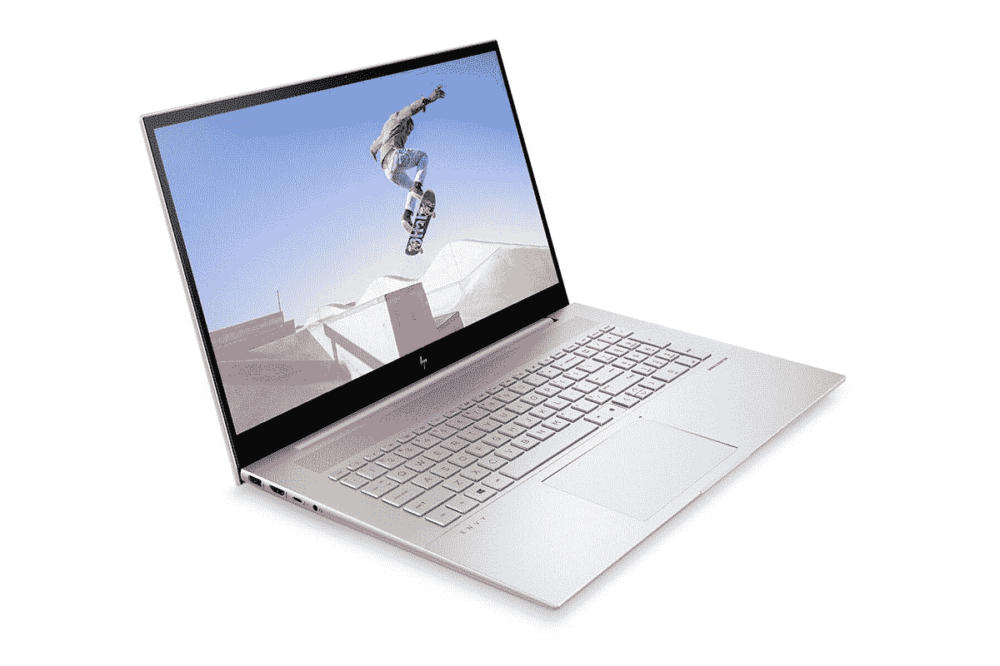</picture> 

HP ENVY 17

##### 惠普 Envy 17

如果您想要更大的屏幕，并且不需要可转换的外形，Envy 17 是另一个很好的选择。采用相同的英特尔处理器、可选的 Nvidia 显卡和高达 32GB 的内存，它相当强大。

 <picture>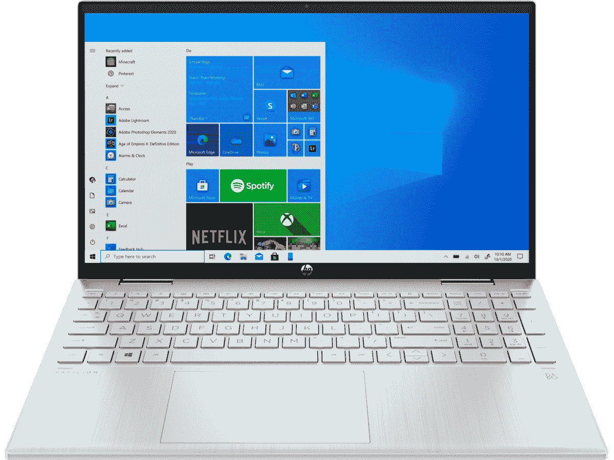</picture> 

HP Pavilion x360 15 ($200 off)

##### 惠普 Pavilion x360 15

HP Pavilion x360 是一款更加经济实惠的敞篷车，但它仍然拥有最新的英特尔处理器和出色的整体性能。屏幕的分辨率在基本水平上略低，但如果你想要一辆敞篷车，它仍然是一个很好的选择。

 <picture>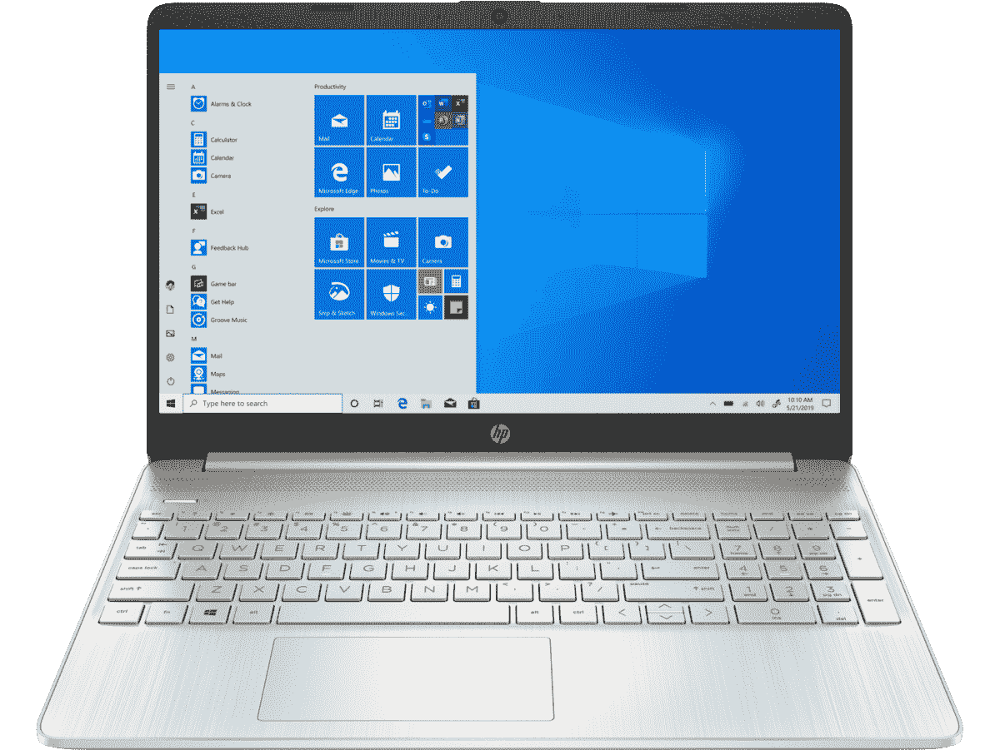</picture> 

HP Laptop 15T-DY200, now just $629.99

##### 惠普笔记本电脑 15t

它可能没有最惊艳的设计，但这款惠普笔记本电脑 15 拥有第 11 代英特尔酷睿 i7 处理器和 16GB 内存，价格实惠。它还配备了至少 256GB 的固态硬盘存储，但你可以升级以获得更多。

 <picture>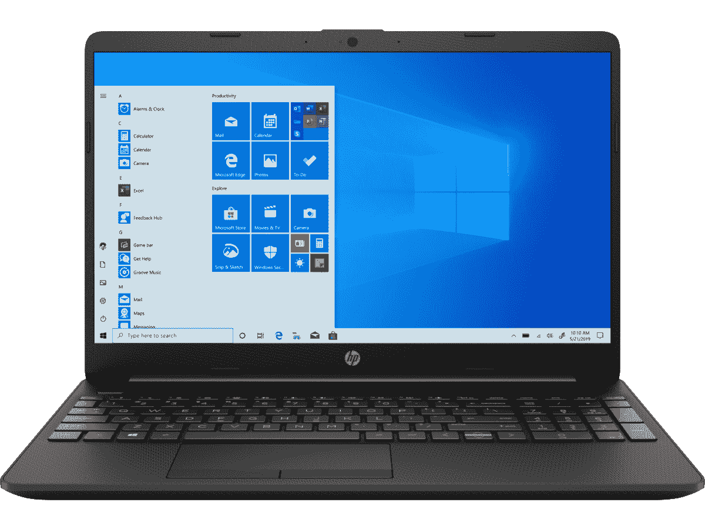</picture> 

HP Laptop 15T-DW3000, $190 off

##### 惠普笔记本电脑 15t

如果您正在寻找一台像样的笔记本电脑，并且不需要超高的性能，这款惠普笔记本电脑是临时用户的可靠选择。它仍然拥有第 11 代英特尔酷睿 i5 和 Iris Xe 显卡，以及 8GB 内存。

## 桌面

有些人可能更喜欢台式电脑，惠普的 Prime Day 交易也为他们提供了一些东西。除了更面向办公室的设计之外，您还可以在一些游戏台式机上获得优惠。

 <picture></picture> 

Omen 30L GT13-1265xt ($700 off)

##### 惠普 OMEN 30L

惠普 Omen 30L 是一款强劲的台式电脑。它拥有第十代英特尔处理器和 Nvidia GeForce RTX 3090 GPU，为您提供游戏所需的所有性能，甚至更多。它最初有 16GB 的内存和 512GB 的存储空间，但可以扩展。

 <picture>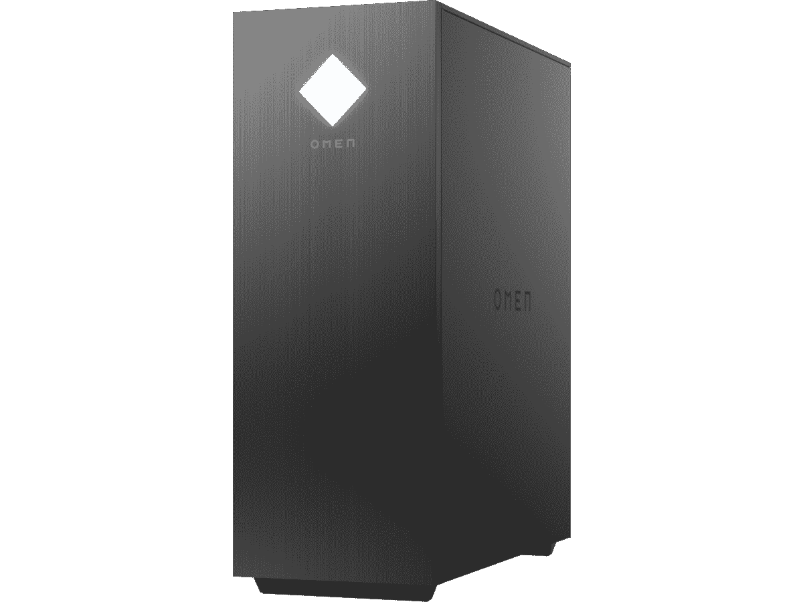</picture> 

OMEN 25L GT12-0225qd, $150 off

##### 惠普 Omen 25L

惠普 Omen 25L 采用 25 升底盘，与 30L 相比，它的设计更加简洁，但动力依然强劲。它始于 Nvidia GeForce GTX 1650，但如果你想在游戏中获得最佳图形质量，你可以升级到 RTX 3070。

 <picture>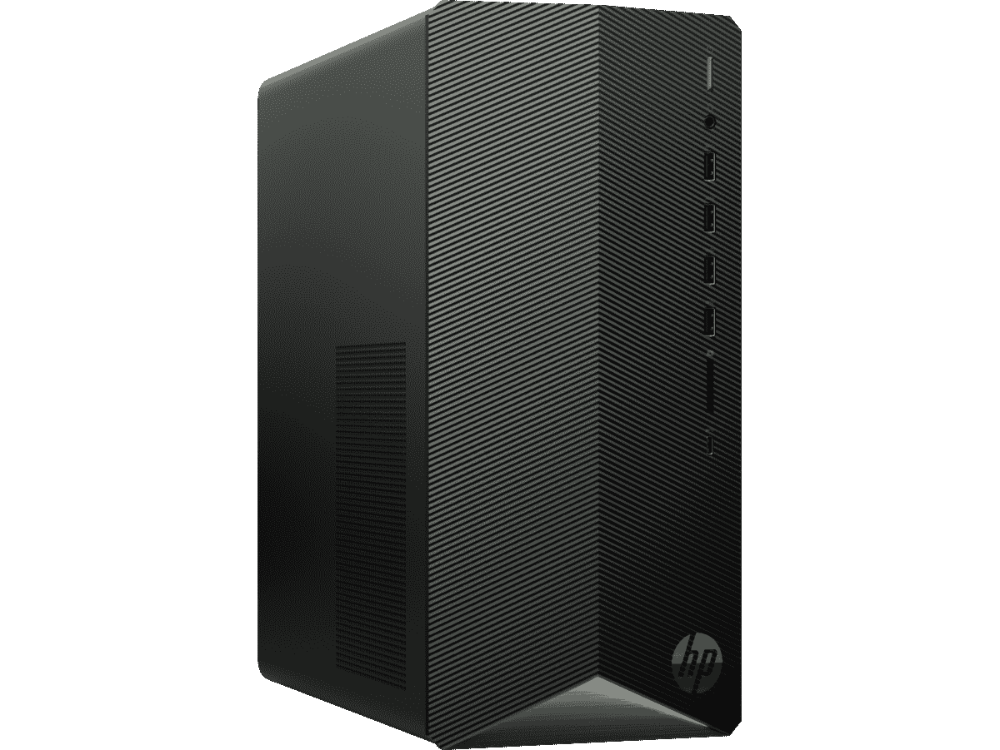</picture> 

HP Pavilion Gaming Desktop TG01-1160xt, from $649.99

##### 惠普 Pavilion 游戏台式机 TG01

惠普 Pavilion 游戏台式机更多的是游戏玩家的入门级选择，但它仍然有第 10 代英特尔处理器和 Nvidia GeForce 1650 Super 作为起点。如果你想要更高的性能，你可以升级到 RTX 3060。

 <picture>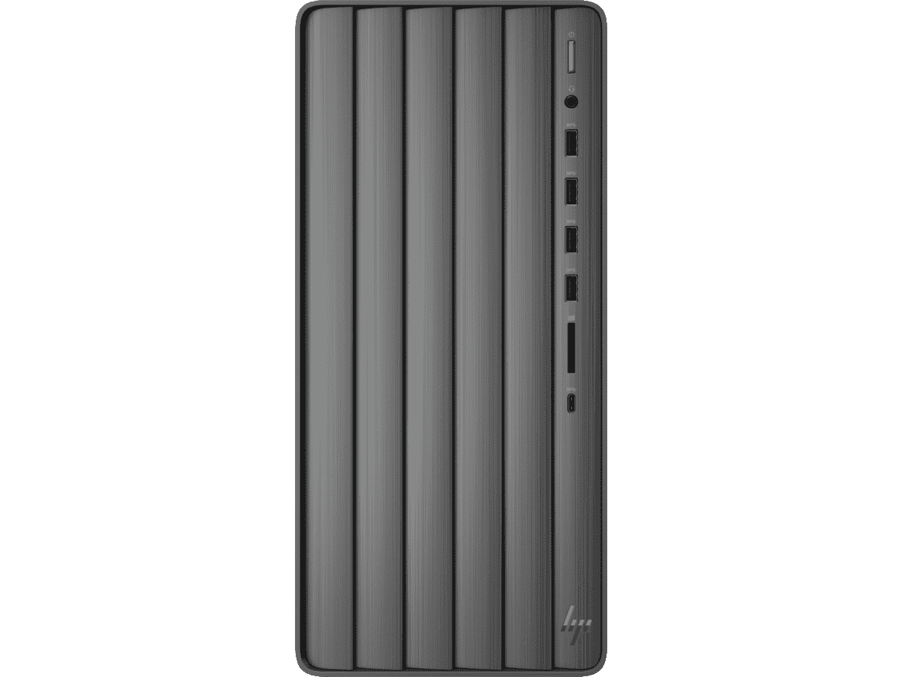</picture> 

HP Envy Desktop TE01-2250xt, from $499.99

##### 惠普 Envy 台式机 TE01-2250xt

这款 HP Envy 台式机拥有有趣的前面板设计，肯定会吸引一些眼球，同时还提供可靠的升级选项。它具有开箱即用的集成显卡，但通过高达 GeForce RTX 3060，它也可以成为一个游戏装备。

 <picture>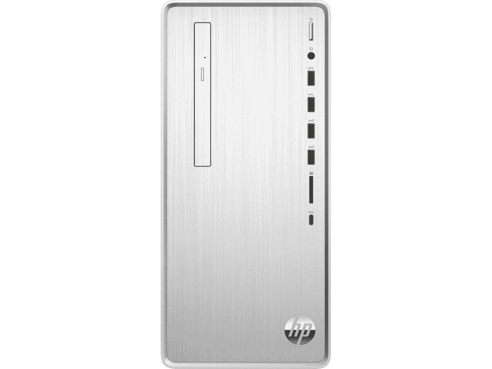</picture> 

HP Pavilion Desktop TP01-2255t, now just $849.99

##### 惠普 Pavilion 台式机 TP01

这是该列表中唯一一款已经采用英特尔第 11 代台式机处理器和 Iris Xe 显卡的传统台式机。它们不如专用显卡好，但这台电脑将为您的日常使用提供充足的性能。

 <picture>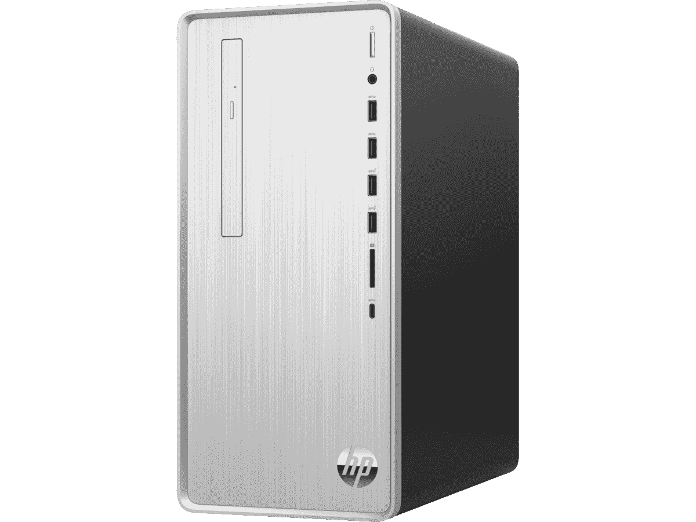</picture> 

HP Pavilion Desktop TP01-1105t, $100 off

##### 惠普 Pavilion 台式机 TP01

这款 Pavilion 台式机只有一个英特尔酷睿 i3，但它包括一个 1TB 硬盘和 256GB 固态硬盘，这为这个价格的计算机提供了相当大的存储空间。另外，对于日常使用来说，性能应该足够好。

 <picture></picture> 

HP Pavilion Desktop TP01-1105t, $100 off

##### 惠普 Pavilion 台式机 TP01

这个版本配备了 AMD 锐龙 3 5300G 处理器。它仍然是一个入门级的选择，但它来自最新的锐龙系列，所以它可能比英特尔版本更好。此外，它具有相同的内存和存储配置

 <picture>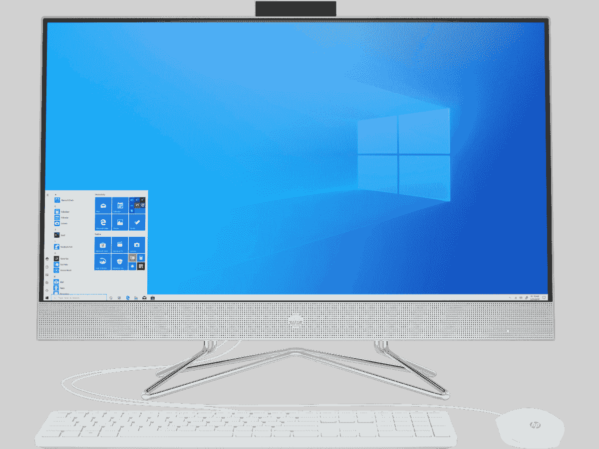</picture> 

HP Pavilion Desktop

##### 惠普多功能一体机 27 路 dp1086qe

如果一体化电脑对你来说听起来不错，这个 27 英寸的型号应该很棒。它采用第 11 代英特尔酷睿 i7 处理器，配有 Iris Xe 显卡，16GB 内存，总存储容量为 1.5TB。哦，还有全高清 27 英寸显示屏。这是全套服务。

 <picture>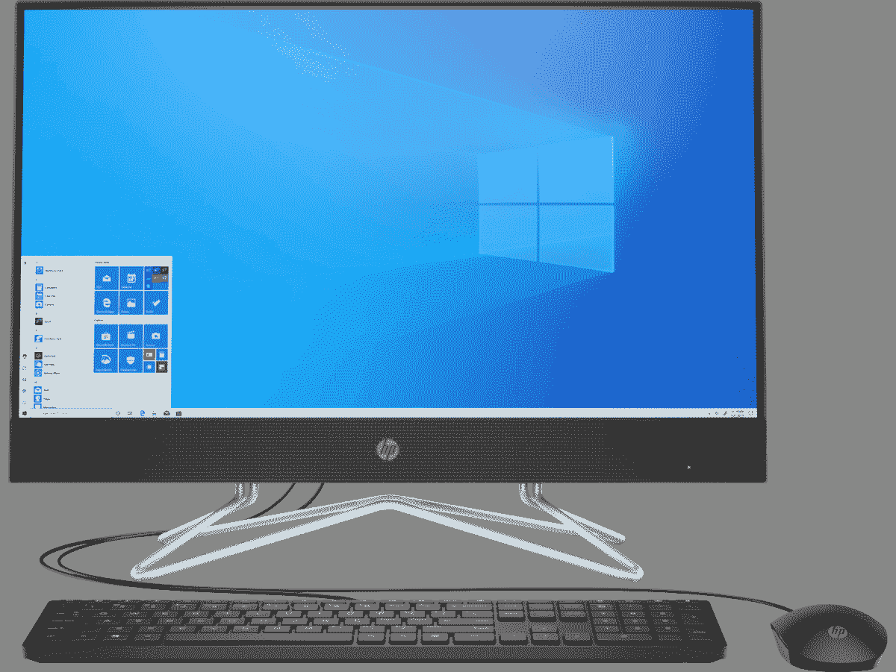</picture> 

HP All-in-One 24-df0130m PC, $100 off

##### 惠普多功能一体机 24-df0130m

这款机型的内部结构没有那么吸引人，但对于较低的价格来说，AMD 锐龙 3 3250G 和 8GB 内存可以让你很好地完成大多数日常使用。如果你只是需要一台家庭电脑来完成学校的工作，这是一个干净的选择。

## 监视器

如果你需要一台显示器来搭配你的新电脑，或者你只是想升级，惠普也有一些关于显示器的优惠活动。对于不同的使用情况，有几个选项，包括一些游戏显示器。

 <picture></picture> 

HP Omen X 27 ($145 off!)

##### OMEN X 27 240Hz 赫兹游戏显示器

如果你想要一台可以使用多年的游戏显示器，Omen X 27 可以满足你的要求。它有一个 27 英寸的 QHD 面板和高达 240 赫兹的刷新率，超过了许多电脑目前能够完全支持的水平。当你升级你的装备时，这个仍然是好的。

 <picture>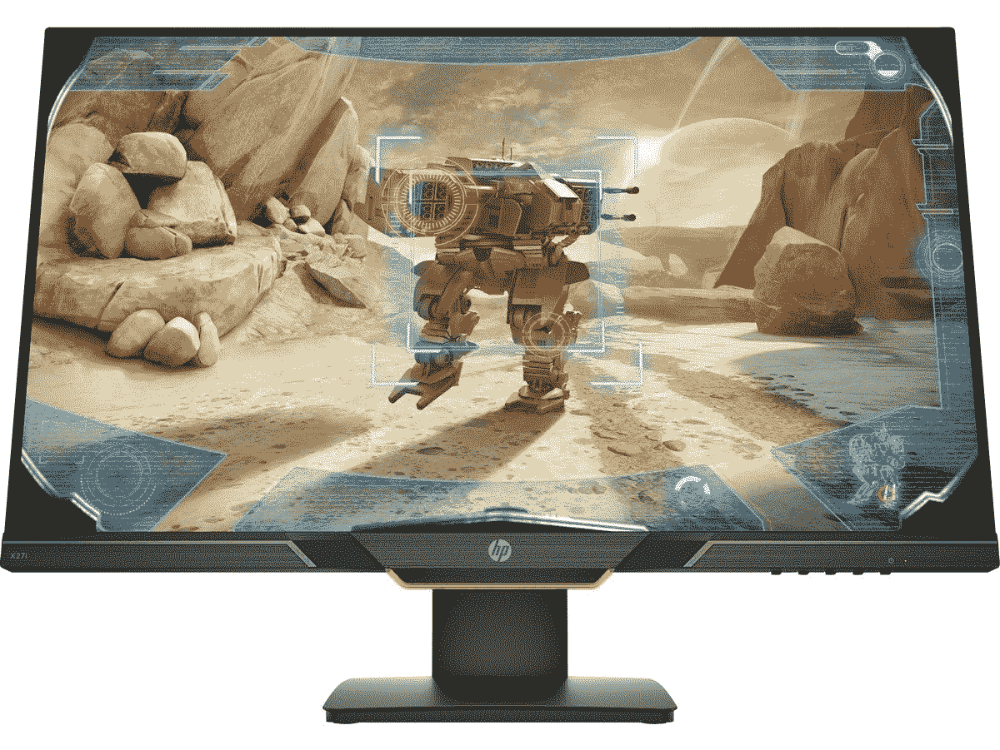</picture> 

HP X27i 2K Gaming monitor ($95 off)

##### 惠普 X27i 2K 游戏显示器

它没有那么快，但惠普 X27i 有 144Hz 的刷新率，这仍然是一个比你的普通办公室显示器更流畅的体验。您仍然可以获得 QHD 分辨率，因此对游戏和工作效率都有好处。

 <picture></picture> 

HP X27i 2K Gaming monitor ($95 off)

##### 惠普 Open 25 游戏显示器

如果您从未体验过高刷新率的流畅，这款 Omen 显示器是一款实惠的入门产品。它具有全高清显示屏和 144Hz 的刷新率，以及 1 毫秒的灰阶响应时间。

 <picture>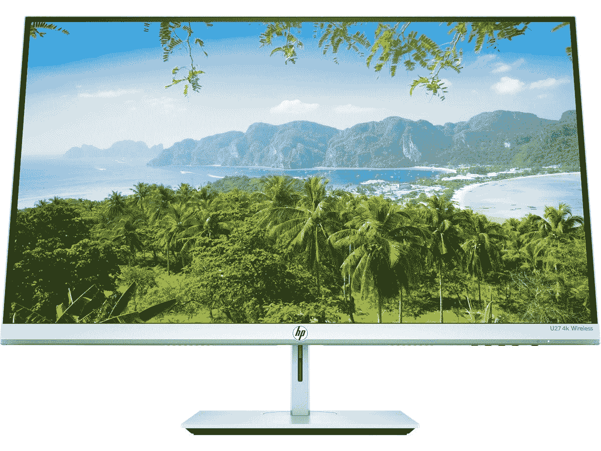</picture> 

HP U27 4K Wireless Monitor

##### 惠普 U27 4K 无线显示器

也许游戏不是你的菜，你更喜欢看电影。这款 27 英寸 4K 显示器配有 IPS 面板，非常适合观看您喜爱的内容。此外，它可以无线使用，所以你不必担心电缆。

 <picture>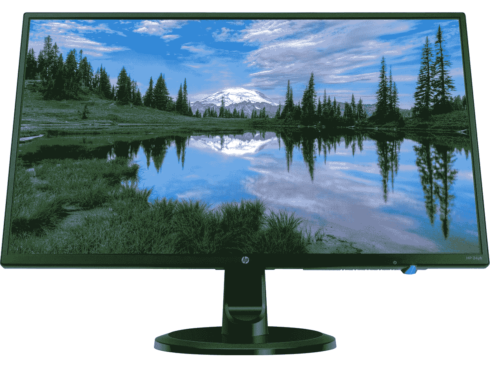</picture> 

HP 24yh 23.8-inch Monitor, just $129.99

##### HP 24yh 23.8 英寸显示器

对于那些只需要绝对必需品的人来说，这款 HP 24yh 显示器具有全高清分辨率，IPS 面板可让您从任何角度观看。如果你有一些旧设备想要连接，它有 VGA 和 DVI 端口，HDMI 用于更现代的设备。

## 配件

最后，如果您需要一些小东西来完善您的体验，惠普 Prime Day 交易中还包括一些附件。所有这些都是限量库存，但在 6 月 22 日之前每天都有库存，所以如果你错过了某个特定的交易，请随时回来查看。

 <picture></picture> 

HP Tilt Pen

##### 惠普倾斜笔

惠普倾斜笔是 Spectre x360 系列等支持笔的设备的绝佳补充。它支持倾斜以获得更精确的阴影，蓝牙支持允许它用于演示控制或通过按键快速启动应用程序。

 <picture></picture> 

HP Rechargeable MPP 2.0 Tilt Pen

##### 惠普充电 MPP 2.0 倾斜笔

这款没有蓝牙支持，但是如果你只是想用来画画，还是很棒的选择。它具有倾斜支撑，有助于遮光，可充电电池意味着您随时准备就绪。

 <picture></picture> 

HP Pen

##### 惠普笔

如果你只是希望能够在笔记本电脑上快速记笔记，这款惠普笔是你可以得到的最实惠的选择，部分原因是它缺乏倾斜支持和蓝牙。该电池不可充电，但它承诺一次充电可使用 18 个月，所以你不太可能在使用它时会变干。

 <picture>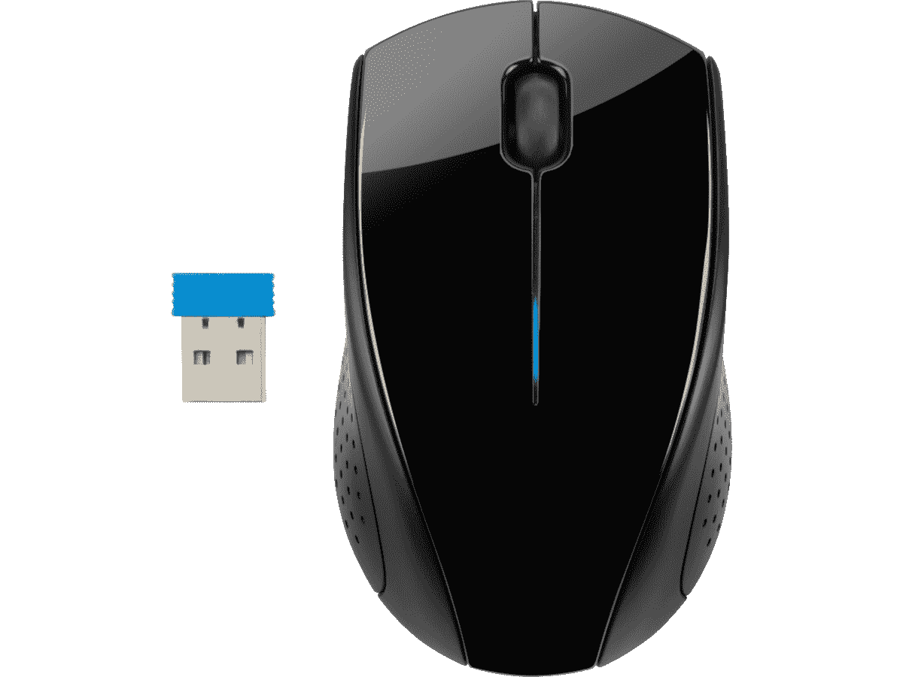</picture> 

HP Wireless Mouse 220, just $9.99

##### 惠普无线鼠标 220

无线鼠标可以帮助您完成办公室设置，或者在您不喜欢使用触摸板时提供更大的舒适性。这一款使用 2.4GHz 无线连接，附带加密狗，它有三个按钮，包括滚轮。

 <picture>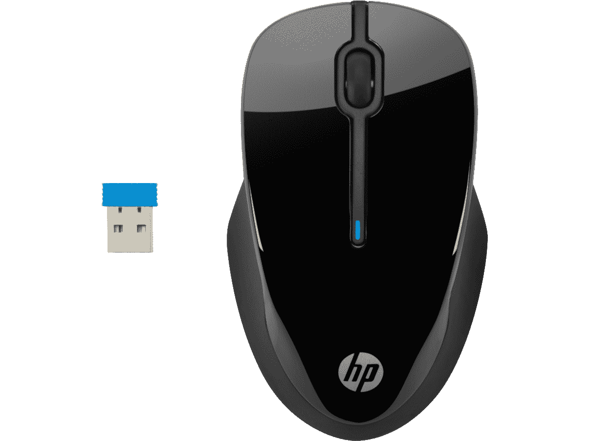</picture> 

HP X3000 G2 Wireless Mouse, just $10.74

##### 惠普 X3000 G2 无线鼠标

在规格方面，这款鼠标与上一款几乎相同，有一个 2.4GHz 无线加密狗和三个按钮。然而，这一个有稍微调整的设计可能对你来说更舒适。

 <picture></picture> 

OMEN Spacer Wireless TKL Keyboard, $45

##### 惠普预兆无线 TKL 间隔器

Omen Spacer TKL 键盘采用 Cherry MX Brown 开关，每个开关的按键次数为 1 亿次，可以无线或有线使用，tenkeyless 设计可以在桌面上释放更多空间。它也有一个额外的舒适和可定制的 RGB 照明腕托。

 <picture>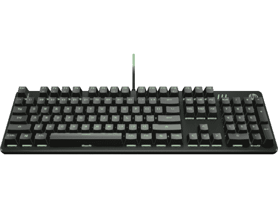</picture> 

HP Pavilion Gaming Keyboard 500, just $27.99

##### 惠普 Pavilion 游戏键盘 500

惠普 Pavilion 游戏键盘 500 是一款有线游戏键盘，配有机械红色开关，静音流畅。它具有可定制的 RGB 照明，并包括一个完整的数字键盘，这可能是有用的。

 <picture>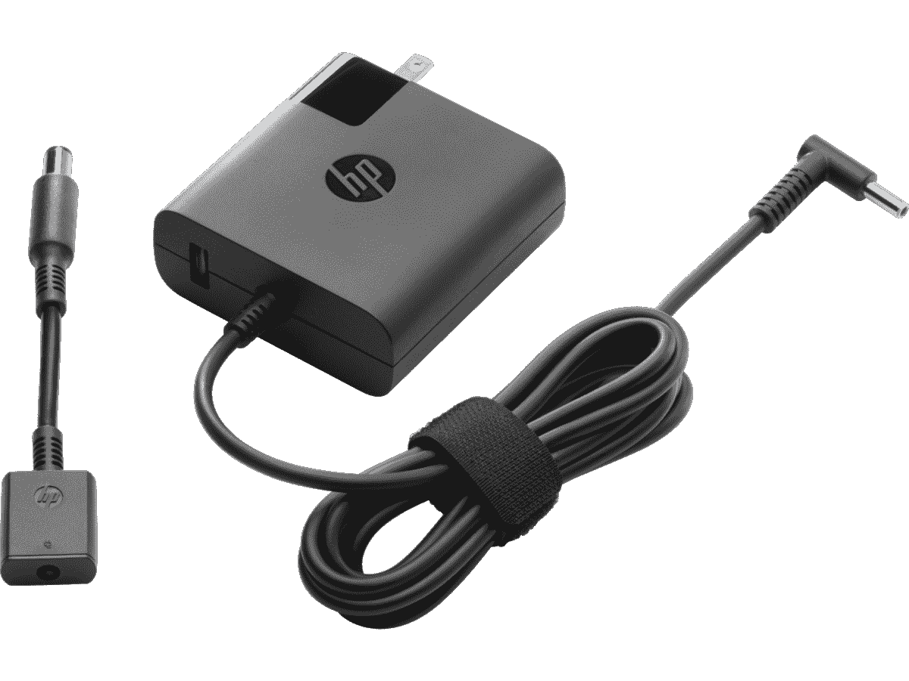</picture> 

HP 90W Travel Adapter

##### 惠普旅行适配器 90W

如果您仍然在摇晃一台带有桶式充电器的惠普笔记本电脑，并且附带的适配器对您来说太大了，这款 90W 电源适配器可以提供您需要的电源，并可以轻松放入一个纤薄的包中。它有一个 4.5 毫米的连接器，包括一个 7.4 毫米的适配器

 <picture>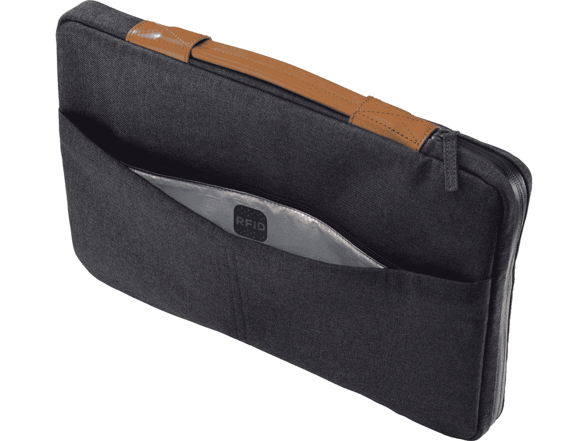</picture> 

HP Envy Urban 15.6 Sleeve, $20 off

##### 惠普 Envy Urban 15.6 套筒

在旅途中保护您的笔记本电脑至关重要，尤其是如果您经常出差。这款防水套具有吸引人的双色外观和额外的存储空间，甚至还有一个 RFID 屏蔽口袋来保护您的敏感信息。

 <picture>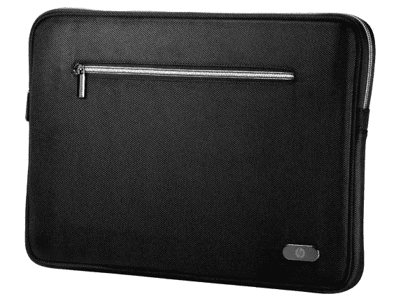</picture> 

HP 15.6-inch Standard Black Sleeve, $17 off

##### 惠普 15.6 英寸标准黑色外壳

如果你想要一个更柔和的外观，惠普标准黑色袖子是最谨慎的，但它仍然是实用的。它是防水的，额外的小口袋可以放一些额外的配件。

 <picture>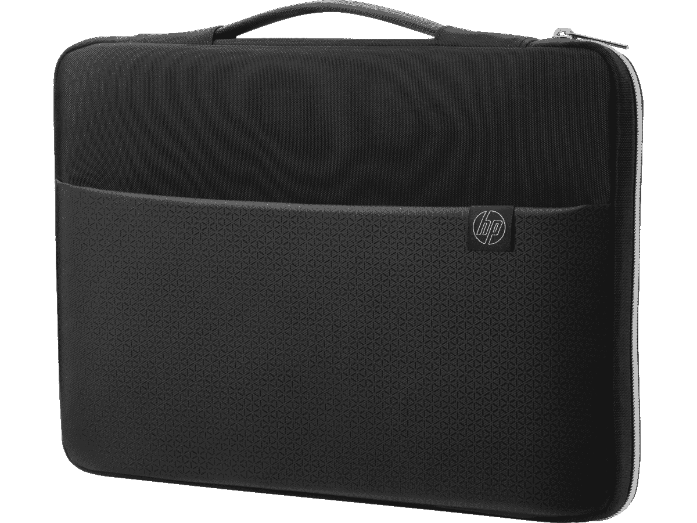</picture> 

HP Carry Sleeve 15, now just $10.99

##### 高压托架套筒 15

HP 便携包的外观依然低调，但它的提手更方便一些。前面的口袋也可以放一些配件，它仍然可以提供你需要的保护。

正如我们已经提到的，这些惠普 Prime Day 交易仅持续到 6 月 22 日，其中大多数也是限量供应的，所以如果您对某些东西感兴趣，您会希望尽快获得。这里有很多有趣的交易。例如，Spectre x360 是一款非常棒的笔记本电脑，降价让它更加诱人。惠普 25 英寸显示器的 Omen 也是进入高刷新率游戏的一个非常实惠的切入点，如果你以前曾经尝试过的话。当然，还有很多其他交易，所以有些东西可能会吸引你。