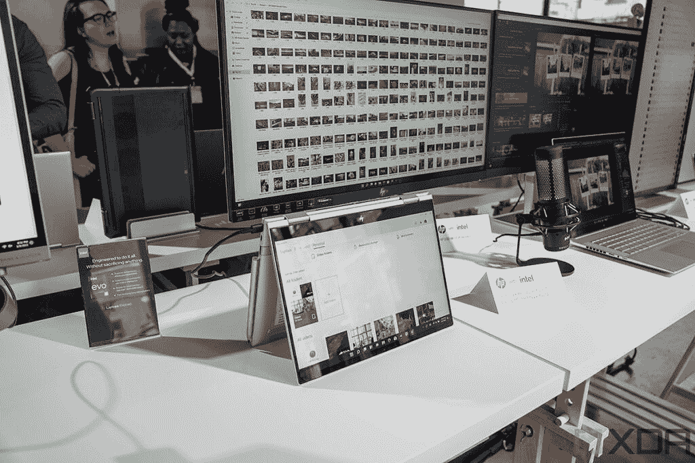
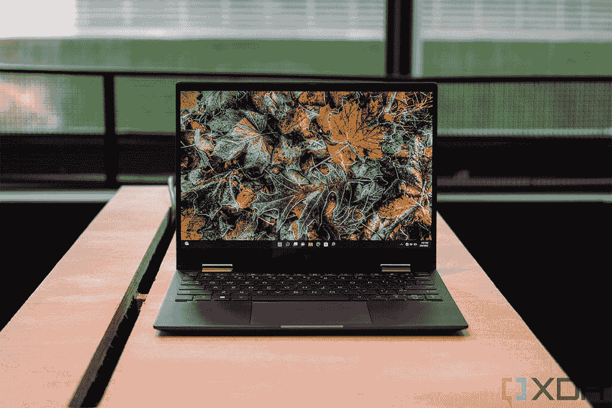
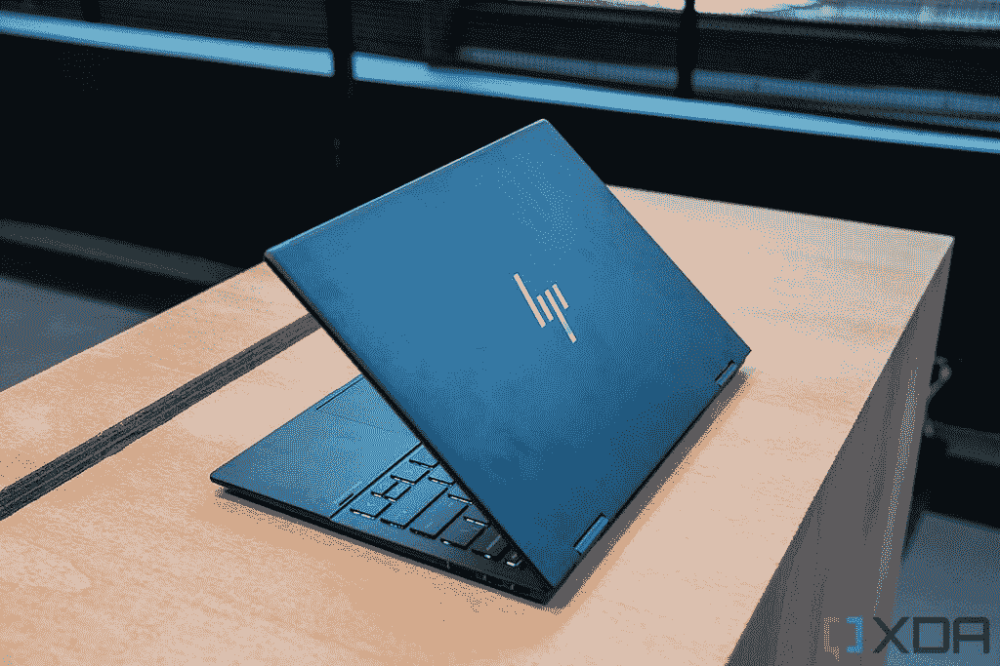
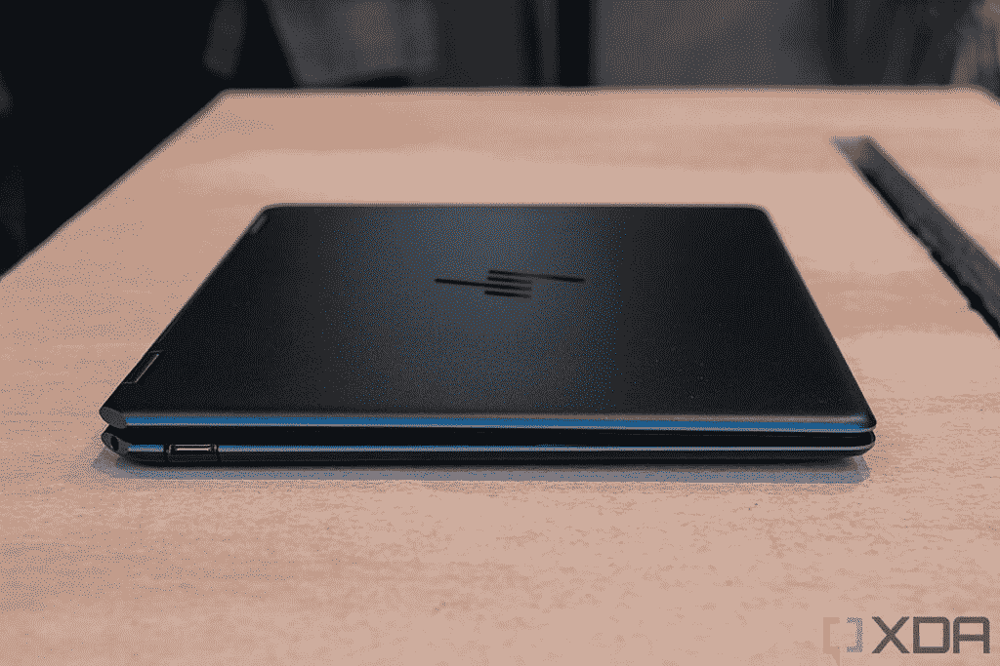
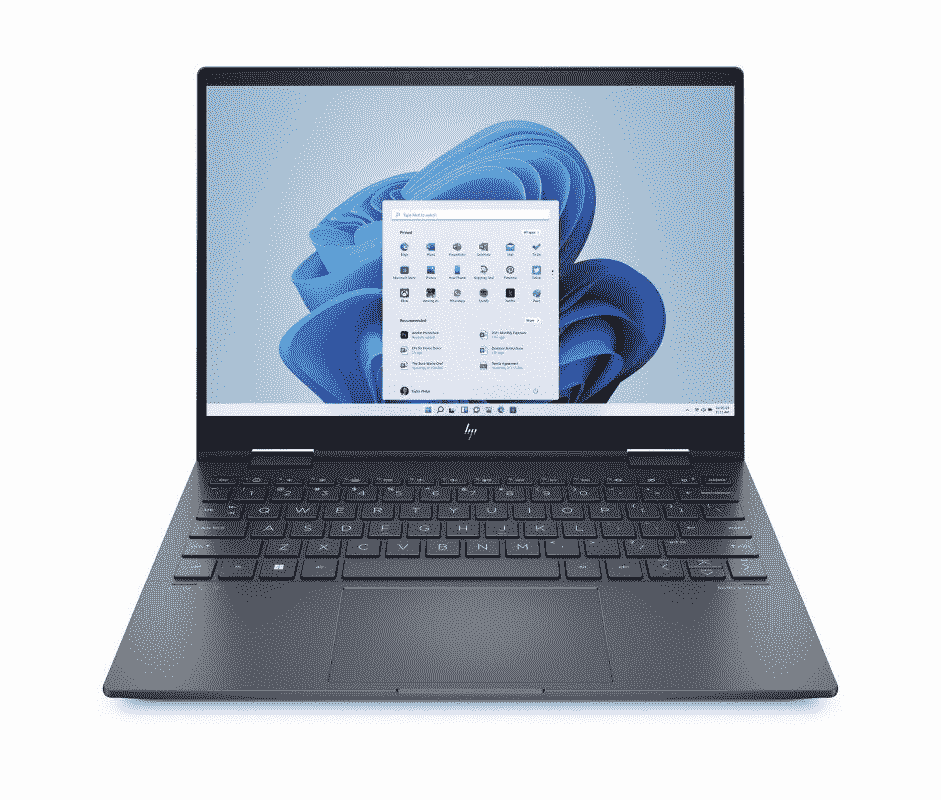

# 惠普 Spectre x360 13.5 (2022) vs 惠普 Envy x360 13 (2022):哪个更好？

> 原文：<https://www.xda-developers.com/hp-spectre-x360-13-5-2022-vs-hp-envy-x360-13-2022/>

惠普最近推出了大多数高端笔记本电脑的更新版本。当然，这包括顶级的惠普 Spectre x360 系列，但惠普也推出了新的 Envy 系列，这是一个稍微更主流，但仍然是高端系列的笔记本电脑和敞篷车。这些笔记本电脑有很多共同点，但它们确实有不同的价位，所以有必要对它们进行比较，以了解哪一款更值得您花钱。在本文中，我们将对 HP Spectre x360 13.5 和 HP Envy x360 13.3 进行比较，这两款机型都是每个系列中最便携的机型。

尽管外形相似，但这两者之间有一些值得注意的差异，不仅是在显示屏上，而且在处理器和其他规格方面也是如此。让我们仔细看看它们的内部结构，看看哪个选项更适合您。

**浏览本文:**

## 惠普 Spectre x360 13.5 (2022)与惠普 Envy x360 13.3:规格

|  | 

惠普 Spectre x360 13.5 (2022 年)

 | 

惠普 Envy x360 13.3 (2022 年)

 |
| --- | --- | --- |
| **CPU** | 

*   第 12 代英特尔酷睿 i5-1235U (15W，10 个内核，12 个线程，最高 4.4GHz，12MB 高速缓存)
*   第 12 代英特尔酷睿 i7-1255 u(15 瓦，10 个内核，12 个线程，最高 4.7GHz，12MB 高速缓存)

 | 

*   第 12 代英特尔酷睿 i5-123 处理器(9W，10 个内核，12 个线程，最高 4.4GHz，12MB 高速缓存)
*   第 12 代英特尔酷睿 i7-1250 u(9 瓦，10 个内核，12 个线程，最高 4.7GHz，12MB 高速缓存)

 |
| **图形** |  |  |
| **显示** | 

*   13.5 英寸 IPS，全高清+ (1920 x 1280)，触控，400 尼特，100% sRGB，防反射
*   13.5 英寸 IPS，全高清+ (1920 x 1280)，HP Sure View Reflect，触控，1000 尼特，100% sRGB
*   13.5 英寸有机发光二极管，3K2K (3000 x 2000)，触摸，500 尼特(HDR)，100% DCI-P3，防反射

 | 

*   13.3 英寸 IPS，全高清+ (1920 x 1200)，触摸屏，400 尼特，100% sRGB
*   13.5 英寸 IPS，四核高清+ (2560 x 1600)，触摸屏，400 尼特，100% sRGB
*   13.3 英寸有机发光二极管，2.8K (2880 x 1800)，触摸，500 尼特(HDR)，100% DCI-P3，防反射

 |
| **存储** | 

*   512GB PCIe 第四代固态硬盘
*   1TB PCIe 第四代固态硬盘
*   2TB PCIe 第四代固态硬盘

 | 

*   512GB PCIe 固态硬盘
*   512GB PCIe 第四代固态硬盘
*   1TB PCIe 固态硬盘
*   1TB PCIe 第四代固态硬盘

 |
| **闸板** | 

*   8GB LPDDR4x 4266MHz(焊接)
*   16GB LPDDR4x 4266MHz(焊接)
*   32GB LPDDR4x 4266MHz(焊接)

 | 

*   8GB LPDDR4x 4266MHz(焊接)
*   16GB LPDDR4x 4266MHz(焊接)

 |
| **电池** | 

*   4 芯 66 瓦时电池
    *   高达 65W 的 USB Type-C 电源适配器

 |  |
| **端口** | 

*   2 个 Thunderbolt 4(USB C 型)
*   1 个 USB 3.2 第 1 代 A 型
*   3.5 毫米耳机插孔
*   microSD 读卡器

 | 

*   2 个 Thunderbolt 4(USB C 型)
*   2 个 USB Type-A 3.2 Gen 2(一个带有惠普睡眠和充电功能)
*   microSD 读卡器
*   3.5 毫米耳机插孔

 |
| **音频** | 

*   Bang & Olufsen 的四声道扬声器
*   双阵列数字麦克风

 | 

*   Bang & Olufsen 的双扬声器
*   双阵列麦克风

 |
| **摄像机** | 

*   惠普 True Vision 5MP 万像素红外摄像头，带摄像头快门和瞬时降噪功能

 | 

*   惠普 True Vision 5MP 万像素红外摄像头，带摄像头快门和瞬时降噪功能

 |
| **生物认证** | 

*   红外照相机
*   指纹传感器

 |  |
| **连通性** | 

*   英特尔无线网络 6E AX211
*   蓝牙 5.2

 | 

*   英特尔无线网络 6E AX211
*   蓝牙 5.2

 |
| **颜色** | 

*   夜幕下的黑色，带着淡淡的黄铜色
*   天蓝色调的夜曲蓝
*   天然银

 | 

*   天然银
*   太空蓝

 |
| **尺寸(WxDxH)** | 

*   297.94 x 220.47 x 17.02 毫米(11.73 x 8.68 x 0.67 英寸)

 | 

*   298.45×214.88×16 毫米(11.75 × 8.46 × 0.63 英寸)

 |
| **尺寸** | 

*   起始重量为 1.37 千克(3.01 磅)

 | 

*   **有机发光二极管屏幕:**起始重量为 1.34 千克(2.95 磅)
*   **IPS 屏幕:**起始重量为 1.38 千克(3.04 磅)

 |
| **价格** | 起价 1249 美元 | 起价 899 美元 |

## 性能:一个有 15W 处理器，另一个有 9W 版本

查看规格表，您可能会认为 HP Spectre x360 和 Envy x360 在处理器方面几乎相同。它们的品牌非常相似，看起来也有相似的规格，但不仅仅如此。HP Spectre x360 13.5 使用的是英特尔的 15W 处理器，Envy x360 13.3 使用的是 9W 处理器，这带来了明显的差异，尤其是在长时间使用的情况下。

 <picture></picture> 

HP Spectre x360 13.5

更高的额定功率(或 TDP)意味着处理器通常可以在更长时间内发挥最大性能。这确实会消耗更多的能源，需要更好的冷却，但你会注意到对更多资源密集型任务的不同，如打开许多标签页浏览或试图编辑图像。有些任务可能会超出 9W 处理器的处理能力。不幸的是，我们还没有英特尔第 12 代 9W 处理器的基准测试结果，所以很难说在性能方面到底会有什么不同。

在 GPU 性能方面，两款笔记本电脑都集成了英特尔 Iris Xe 显卡，虽然它们的执行单元数量相同，但 Spectre x360 内的 15W 处理器的 GPU 时钟速度明显更快。英特尔酷睿 i7-1255U 中的 GPU 时钟速度将达到 1.25GHz，而酷睿 i7-1250U 的时钟速度仅为 950MHz (0.95GHz)。

 <picture></picture> 

HP Envy x360 13

与此相反，TDP 越低意味着电池消耗越慢，因此，HP Envy x360 的整体电池寿命应该更长。尤其是考虑到这两款笔记本电脑的电池大小相似。

Spectre x360 的内存和存储容量是 Envy 的两倍。

除了处理器之外，HP Spectre x360 还可以拥有高达 32GB 的内存(是 Envy x360 的两倍)，以及 2TB 的 PCIe 第四代存储(也是 Envy 的两倍)。同样值得注意的是 Envy x360 的基本型号具有较慢的 SSD。

## 显示和声音:惠普 Spectre x360 的屏幕更高

正如您所料，HP Spectre x360 也拥有比这两款笔记本电脑更好的显示屏。这是一个 13.5 英寸的面板，长宽比为 3:2，明显高于典型的 16:9 显示器。基本型号具有全高清+ (1920 x 1280)分辨率，如果需要，您还可以为其配备惠普 Sure View Reflect 隐私屏幕。然而，为了获得最佳的视觉体验，还有一个令人惊叹的 3K2K (3000 x 2000)有机发光二极管显示器选项，它不仅非常清晰，而且还能获得有机发光二极管面板的通常优势，如真正的黑色、鲜艳的颜色和高对比度。

坦率地说，对惠普的嫉妒并不是那么回事。它有 13.3 英寸的显示屏，长宽比为 16:10，仍然高于 16:9，但没有 3:2 高。基本型号也是全高清+ (1920 x 1200)，但你没有隐私屏幕的选项，所以如果你在乎这一点，这是 Spectre 的一点。它确实有一个 Quad HD+ (2560 x 1600)升级选项，如果你想获得更清晰的图像，而不是购买超级昂贵的 OLED 面板，它会给你一个可靠的升级途径。不过，如果你确实想要一台 OLED 面板，你可以选择 2.8K (2880 x 1800)的显示器。从技术上来说，它不如 Spectre x360 锋利，但这种差异非常小，真的不会引人注目，尤其是在这种尺寸下。两款笔记本电脑都为您提供了出色的显示选项。

 <picture></picture> 

HP Envy x360 13

惠普在其高端产品系列中使用相同的 500 万像素网络摄像头，因此实际上没有区别。两款笔记本电脑都支持 1080p 视频和一系列智能功能，如自动取景和背光调节，因此您在视频通话和会议期间总是看起来很棒。它们也都支持 Windows Hello 面部识别。

这两款笔记本电脑都有 500 万像素的网络摄像头和自动取景等功能。

至于声音，这就是惠普 Spectre x360 真正能够超越 Envy 的地方。它有一个四声道立体声扬声器设置，虽然我们不知道确切的规格，但与 Envy x360 上的双扬声器设置相比，它肯定会给你带来更身临其境的音频体验。声音捕捉方面，两者都有双阵列麦克风，所以体验应该差不多。

## 设计:Spectre x360 是惠普皇冠上的宝石

你经常可以从外观上看出一台笔记本电脑有多高端，在这里也是如此。由于这两款都是高端笔记本电脑，惠普试图用更复杂的设计来区分 Spectre x360，这一点显而易见。它有三种颜色可供选择:自然银、夜幕黑和夜曲蓝。不过，后两种是最特别的，因为它们有双重色调的美感——夜幕下的黑色型号在笔记本电脑的边缘周围有“淡黄铜”的口音，而夜曲蓝色版本则带有较淡的蓝色。此外，笔记本电脑铰链附近的角落被修剪掉，以形成更加独特的外观。

惠普 Envy x360 13.3 也是一款高端笔记本电脑，但它肯定没有表现出那么多。它仍然是一台金属笔记本电脑，但它没有双色设计或 Spectre 标志性的边角。相反，它是天然银或太空蓝，仅此而已。此外，Envy x360 没有指纹识别器，如果你打算在 Windows Hello 上使用的话。

 <picture></picture> 

HP Envy x360 13

Envy 的一个优势是它不那么宽也不那么厚(与 Spectre x360 的 17.02 毫米相比，它的厚度为 16 毫米)，所以它更便于携带。它也比 Spectre 轻，尽管差别很小，并且会根据您的配置而有所不同。

如今许多顶级笔记本电脑的一个缺点是，它们在端口选择上做出了一些牺牲。谢天谢地，惠普 Spectre x360 还不算太差——你有两个 Thunderbolt 4 端口，一个 USB Type-A 端口，一个耳机插孔和一个 microSD 读卡器。对于这种尺寸的现代超极本来说，这是非常坚实的，尽管它并没有给人留下太多印象。

 <picture></picture> 

HP Spectre x360 13.5

在这种情况下，Envy x360 的优势实际上是价格便宜。除了 HP Spectre x360 拥有的所有相同端口之外，Envy 还增加了一个 USB Type-A 端口，因此您可以插入一个额外的外围设备，如鼠标或外部存储设备。

对于无线通讯，两款笔记本电脑基本相同。都有 Wi-Fi 6E 和蓝牙 5.2 支持，都没有蜂窝支持。这是消费类笔记本电脑的预期，尽管我们过去见过一些支持 LTE 的型号。

## 定价和最终想法

所有这些比较完成后，很明显 HP Spectre x360 在技术上是更好的笔记本电脑。它拥有更快的处理器、更好的显示屏和更具视觉吸引力的设计。如果您在公共场所工作时关心隐私，HP Sure View Reflect 选项也是 Spectre x360 的一大优势。

但是这里有一点需要记住，那就是价格。惠普 Spectre x360 起价 1249 美元，比 Envy x360 贵 350 美元。多花的钱，你得到的是相对适中的性能升级，更高的屏幕，以及你可能关心也可能不关心的设计。此外，有了 Envy x360，您可以获得一个额外的 USB 型端口。如果你想要一个稍微清晰的屏幕，你可以升级到一个四高清+面板，只需 30 美元，而 Spectre x360 需要为有机发光二极管选项支付额外的 110 美元。

最终，是的，HP Spectre x360 绝对可以为您提供更优质的体验，如果您愿意为此付费的话。但是，如果您想要一个更节省预算但仍然非常强大的选项，Envy x360 是一个绝佳的选择。两者都是惠普笔记本电脑中最好的，所以这里没有真正错误的选择。

无论你搭配哪一款，都可以在下面购买你首选的笔记本电脑。

 <picture></picture> 

HP Spectre x360 13.5

##### 惠普 Spectre x360 13.5

2022 HP Spectre x360 13.5 采用 3:2 显示屏和 10 核 12 线程的第 12 代英特尔处理器。

 <picture></picture> 

HP Envy x360 13.3

##### 惠普 Envy x360 13

HP Envy x360 是一款配备第 12 代英特尔酷睿处理器和 16:10 显示屏的高级敞篷车。