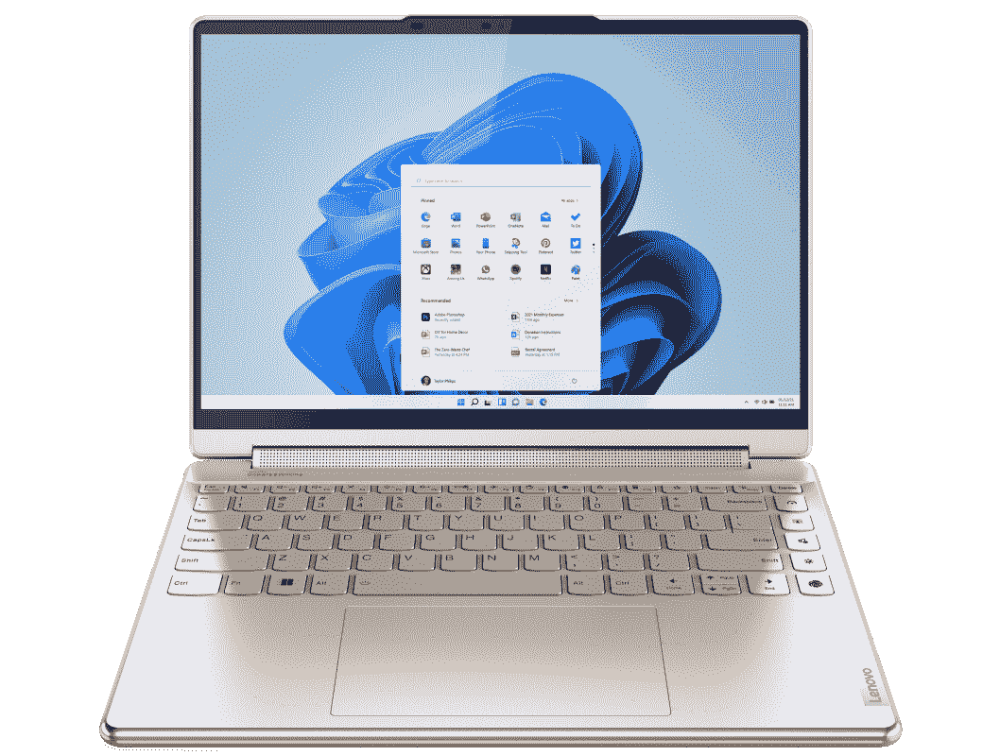

# 惠普 Spectre x360 13.5 (2022) vs 联想 Yoga 9i:最好的敞篷车是什么？

> 原文：<https://www.xda-developers.com/hp-spectre-x360-13-5-2022-vs-lenovo-yoga-9i/>

2022 年，我们已经看到一些公司推出了他们有史以来最好的笔记本电脑。其中包括惠普 Spectre x360 13.5 的 [2022 年更新版，其前身为 Spectre x360 14，是其中的一大亮点。这是惠普最顶级敞篷车的全新设计，它建立在已经是最容易推荐的设备之一的基础上。但联想今年也带来了 A-game，联想 Yoga 9i 是另一款非凡的笔记本电脑。](https://www.xda-developers.com/hp-spectre-x360-2022/)

因此，如果你今天要购买一台笔记本电脑，你应该选择惠普 Spectre x360 13.5 而不是联想 Yoga 9i 吗？联想 Yoga 9i 是我们认为的 2022 年最佳笔记本电脑。这主要取决于你的优先事项。联想 Yoga 9i 拥有更高的性能和绝对惊艳的设计，但惠普 Spectre x360 将为您提供更好的电池续航时间，而且它也有自己独特的设计。两款笔记本电脑都有很好的显示屏，但它们非常不同，惠普的笔记本电脑也有更好的网络摄像头。

*   ##### 惠普 Spectre x360 13.5

    惠普 Spectre x360 13.5 是一款顶级的可变形笔记本电脑，拥有惊艳的设计和出色的性能，适合日常工作。

*   ##### 联想 Yoga 9i

    联想 Yoga 9i 是一款漂亮的弯曲边缘可变形笔记本电脑，此外它还拥有强大的 28W 英特尔处理器和出色的显示选项，包括刷新率为 90Hz 的 2.8K OLED 面板。

## 惠普 Spectre x360 13.5 (2022)与联想 Yoga 9i:定价和可用性

联想 Yoga 9i 和惠普 Spectre x360 现在都有售，你可以在各种零售商那里找到它们，包括百思买或每个公司自己的网站。

联想 Yoga 9i 的官方定价为 1249 美元起，尽管价格差异很大，特别是在联想的网站上。目前，最便宜的型号售价为 1499.99 美元，但这不是入门级配置，因为它配备了酷睿 i7 处理器和 2.8K OLED 面板。

与此同时，惠普 SPectre x350 13.5 的起价也是 1249.99 美元，但这通常是你能找到的实际价格。其中包括英特尔酷睿 i5 处理器、8GB 内存和 512GB 固态硬盘。你偶尔可以发现它打折了，所以留意一下是个好主意。

## 惠普 Spectre x360 13.5 (2022)与联想 Yoga 9i:规格

|  | 

惠普 Spectre x360 13.5

 | 

联想 Yoga 9i

 |
| --- | --- | --- |
| **CPU** | 

*   第 12 代英特尔酷睿 i5-1235U (15W，10 个内核，12 个线程，最高 4.4GHz，12MB 高速缓存)
*   第 12 代英特尔酷睿 i7-1255 u(15 瓦，10 个内核，12 个线程，最高 4.7GHz，12MB 高速缓存)

 | 

*   英特尔酷睿 i5-1240P (28W，12 核，16 线程，最高 4.4 GHz，12MB 高速缓存)
*   英特尔酷睿 i7-1260 处理器(28W，12 核，16 线程，最高 4.7 GHz，18MB 高速缓存)
*   英特尔酷睿 i7-1280 处理器(28W，14 核，20 线程，最高 4.8 GHz，24MB 高速缓存)

 |
| **图形** |  |  |
| **显示** | 

*   13.5 英寸 IPS，全高清+ (1920 x 1280)，触摸屏，400 尼特，100% sRGB，防反射，60Hz 刷新率
*   13.5 英寸 IPS，全高清+ (1920 x 1280)，HP Sure View Reflect，触控，1000 尼特，100% sRGB，60Hz 刷新率
*   13.5 英寸有机发光二极管，3K2K (3000 x 2000)，触摸，500 尼特(HDR)，100% DCI-P3，防反射，60Hz 刷新率

 | 

*   14 英寸 FHD+ (1920 x 1200) IPS，触控，400 尼特，100% sRGB，60 赫兹刷新率
*   14 英寸 2.8K (2880 x 1800)有机发光二极管，触摸，400 尼特，100% DCI-P3，90Hz 刷新率
*   14 英寸 UHD+ (3840 x 2400)有机发光二极管，触摸，400 尼特，100% DCI-P3，60 赫兹刷新率

 |
| **储存** | 

*   512GB PCIe 第四代固态硬盘
*   1TB PCIe 第四代固态硬盘
*   2TB PCIe 第四代固态硬盘

 | 

*   256GB PCIe 第四代固态硬盘
*   512GB PCIe 第四代固态硬盘
*   1TB PCIe 第四代固态硬盘

 |
| **撞锤** | 

*   8GB LPDDR4x 4266MHz(焊接)
*   16GB LPDDR4x 4266MHz(焊接)
*   32GB LPDDR4x 4266MHz(焊接)

 | 

*   8GB LPDDR5 5200MHz(焊接)
*   16GB LPDDR5 5200MHz(焊接)

 |
| **电池** | 

*   4 芯 66 瓦时电池
    *   高达 65W 的 USB Type-C 电源适配器

 |  |
| **端口** | 

*   2 个 Thunderbolt 4(USB C 型)
*   1 个 USB 3.2 第 1 代 A 型
*   3.5 毫米耳机插孔
*   microSD 读卡器

 | 

*   2 个 Thunderbolt 4(USB C 型)
*   1 个 USB 3.2 第二代
*   1 个 USB-C 3.2 第二代
*   3.5 毫米耳机插孔

 |
| **音频** | 

*   Bang & Olufsen 的四声道扬声器
*   双阵列数字麦克风

 | 

*   Bowers & Wilkins 的四声道立体声扬声器(2 个 3W 低音扬声器，2 个 2W 高音扬声器)，杜比全景声
*   双阵列麦克风

 |
| **摄像机** | 

*   惠普 True Vision 5MP 万像素红外摄像头，带摄像头快门和瞬时降噪功能

 | 

*   带红外线的全高清 1080p 网络摄像头

 |
| **生物认证** | 

*   红外照相机
*   指纹传感器

 | 

*   红外照相机
*   指纹读取器

 |
| **连通性** | 

*   英特尔无线网络 6E AX211
*   蓝牙 5.2

 | 

*   Wi-Fi 6E (2×2)
*   蓝牙 5.2

 |
| **颜色** | 

*   夜幕下的黑色，带着淡淡的黄铜色
*   天蓝色调的夜曲蓝
*   天然银

 |  |
| **尺寸(WxDxH)** | 

*   297.94 x 220.47 x 17.02 毫米(11.73 x 8.68 x 0.67 英寸)

 | 

*   318×230×15.25 毫米(12.52 × 9.06 × 0.6 英寸)

 |
| **尺寸** | 

*   起始重量为 1.37 千克(3.01 磅)

 | 

*   **IPS 屏幕:**起始重量为 1.5 千克(3.31 磅)
*   **有机发光二极管屏幕:**起始重量为 1.4 千克(3.09 磅)

 |
| **价格** | 起价 1249 美元 | 起价 1249.99 美元 |

## 性能:28W 处理器速度更快

惠普 Spectre x360 13.5 和联想 Yoga 9i 都是面向 2022 年更新的完全现代化的笔记本电脑，这意味着它们都采用了英特尔的第 12 代处理器。然而，这并不意味着它们是一样的。在其第 12 代产品中，英特尔推出了新的 P 系列处理器，与 U 系列处理器及其 15W 相比，该系列处理器具有更高的 28W TDP(该系列现在实际上称为 U15)。更高的 TDP 意味着更高的性能，这一点在两者的对比中非常明显。

惠普 Spectre x360 13.5 最高可配英特尔酷睿 i7-1255U 处理器，该处理器具有 10 个内核(2P + 8E)和 12 个线程，能够提升至 4.7GHz。另一方面，联想 Yoga 9i 最高可配酷睿 i7-1280P 处理器，该处理器具有 14 个内核(6P + 8E)和 20 个线程，提升速度可达 4.8GHz。如果您比较这两款笔记本电脑的基准测试分数，您会发现联想 Yoga 9i 可以

|  | 

英特尔酷睿 i7-1260P 联想 Yoga 9i

 | 

英特尔酷睿 i7-1255U 惠普 Spectre x360 13.5

 |
| --- | --- | --- |
| Geekbench 5(单核/多核) | 1,736 / 9,525 | 1,682 / 7,534 |
| Cinebench R23 | 1,637 / 7,757 | 1,684 / 6,287 |
| PCMark 10 | 5,616 | 5,533 |
| 3DMark | 1,678 | 1,553 |

值得注意的是，您可以选择使用联想 Yoga 9i 获得更快的处理器，因此性能可能会更高。如果你看的是酷睿 i5，那么这两种型号的性能自然会更低，但 Yoga 9i 仍然会更快，因为它的 TDP 更高。这两款笔记本电脑还集成了英特尔 Iris Xe 显卡，性能应该相似。不过，P 系列处理器的图形处理器的时钟频率确实要高一些。

显然，更高的 TDP 可以让你获得更好的性能，但也意味着更多的功耗，根据我们对联想 Yoga 9i 的测试，考虑到电池的大小，电池寿命并不是很长。HP Spectre x360 13.5 充电后的续航时间更长，这是 TDP 更低的直接结果。

HP Spectre x360 的内存和存储容量是 Yoga 9i 的两倍。

除了处理器，HP Spectre x360 13.5 在 RAM 方面也有优势，因为您可以获得高达 32GB 的内存。不过，它仍然使用较旧的 LPDDR4x RAM，时钟频率为 4266MHz，而联想使用较新的 LPDDR5 RAM，时钟频率高达 5200MHz。对于存储，惠普提供高达 2TB 的容量，而联想 Yoga 9i 的容量为 1TB，这是另一个优势。此外，HP Spectre x360 在其基本配置中包括 512GB，因此它是最好的选择。

## 显示和声音:联想 Yoga 9i 有两种不同的有机发光二极管面板

你很难说这两款笔记本电脑的显示屏都不合格，但它们在几个方面有所不同。首先，惠普 Spectre x360 13.5 更小，屏幕为 13.5 英寸，长宽比为 3:2。基本型号具有全高清+ (1920 x 1280)分辨率，如果您想在公共场所工作时保护敏感信息的安全，您可以添加 HP Sure View 反射隐私屏幕。如果你想要最佳的观看体验，有 3K2K (3000 x 2000) OLED 面板，由于有机发光二极管技术，它既清晰又充满活力。

联想 Yoga 9i 的屏幕略大，为 14 英寸，长宽比为 16:10，没有 3:2 高，但仍高于典型的 16:9 屏幕。同样，基本型号是全高清+ (1920 x 1200)面板，但联想提供了两种不同的有机发光二极管面板来升级。首先，有一个 2.8K (2880 x 1800)的选项，它已经足够清晰，并且具有 90Hz 刷新率的额外好处，从而产生更平滑的动画、过渡等。如果你更重视分辨率，你可以选择超高清+ (3840 x 2400) OLED 面板，它甚至更清晰，但坚持更传统的 60Hz 刷新率。

不管怎样，联想 Yoga 9i 的升级选项更有吸引力。但是，就像处理器的更高 TDP 一样，这些更好的显示器是以牺牲电池寿命为代价的。更高的刷新率或更高的分辨率会消耗更多的功率，因此，如果您重视便携性，您可能会更喜欢 HP Spectre x360 13.5。此外，在这种尺寸的显示器上，惠普的 3K2K OLED 面板已经足够清晰了。

就在显示屏上方，两台笔记本电脑都有一个能够录制 1080p 视频的网络摄像头，这绝对是受欢迎的，可以说在 2022 年早就应该出现了。不过，惠普实际上可能会在这方面领先，因为它使用了一个 500 万像素的摄像头，具有一系列智能功能，包括自动取景和背光调节。即使你在笔记本电脑前走来走去，它也能让你始终保持最佳状态。无论如何，两者都应该足够满足你的视频通话和会议需求。

联想的 soundbar 铰链提供了笔记本电脑上最好的音频体验之一。

至于声音，联想 Yoga 9i 继续提供 Windows 笔记本电脑上最好的音频体验之一。这两款电脑都有四个立体声扬声器，但联想做了一些聪明的事情，在笔记本电脑的铰链中内置了一对高音扬声器，可以兼作条形音箱。这确保了扬声器始终面向用户，配合侧置低音扬声器，您将获得更加身临其境的音频体验。尽管如此，惠普 Spectre x360 的设置还算不错，而且仍然比这个尺寸的许多笔记本电脑要好。

## 设计:两款令人惊艳的顶级笔记本电脑

取决于你是谁，笔记本电脑的设计可能与它内部的规格一样重要，如果不是更重要的话。长相是主观的，但有些东西不是，就从这里开始吧。因为联想 Yoga 9i 的屏幕更大，所以它比惠普 Spectre x360 13.5 更宽更高，但也更薄，尺寸为 15.25 毫米，而不是 17.02 毫米。尽管如此，将 Spectre x360 装进包里应该会更容易一些。此外，惠普的笔记本电脑也更轻，尤其是与联想的 IPS 型号相比。总的来说，它更容易携带，但公平地说，差异并不是很大 Spectre x360 的起价为 3.01 磅，而联想 Yoga 9i 的起价为 3.31 磅，采用 IPS 面板。

也许更重要的，尽管更主观，是笔记本电脑的外观，可以说，它们看起来都棒极了。联想和惠普都比上一代产品做了一些大的改变，他们当然是受欢迎的。联想 Yoga 9i 的巨大变化是，取代了以前型号的平面单色边缘，笔记本电脑现在有了光滑的圆形边缘，如果你不认为这有很大的区别，请再想想。这款新车型看起来令人惊叹，感觉比上一款更高档。它有两种相当柔和的颜色，但边缘的光泽给了它恰到好处的天赋。

另一方面，HP Spectre x360 13.5 采用了新的设计，与前代产品相比棱角更少，但它保留了前代产品的优点。它的一些配置具有双色外观，这确实增加了高级感。夜幕黑色模型使用黑色作为其表面，但边缘以浅黄铜配色为重点，而夜曲蓝色模型使用深蓝色作为其表面，浅蓝色作为重点。双色调美学比前几年不那么突出了，但它仍然足以给这款车型带来一些天赋，而不会太分散注意力。如果你想要更柔和的颜色，没有双色外观的自然银色也是不错的选择。

## 端口和连接性:它们非常相似

最后，让我们用端口来完善一下。坦率地说，考虑到两台笔记本电脑有相似的设置，这里没有太多要说的，但有一个值得注意的区别。联想 Yoga 9i 配有两个 Thunderbolt 4/USB-C 端口，外加一个标准 USB-C 端口、一个 USB Type-A 端口和一个耳机插孔。就其本身而言，HP Spectre x360 13.5 用 microSD 读卡器取代了标准的 USB-C 端口。这为您提供了更多的开箱即用的选择，但最有用的还是由您自己决定。

这两款笔记本电脑都是你对 2022 年高端笔记本电脑的预期。种类不多，但拥有 USB Type-A 意味着如果你还没有完全过渡到 USB-C(许多外设还没有)，在必要时至少可以插入鼠标或一些外部存储设备。

至于无线通讯，这两款笔记本电脑是一样的。都支持 Wi-Fi 6E 和蓝牙 5.2，都没有蜂窝支持。对于消费者笔记本电脑来说，这是意料之中的事情，因为蜂窝支持通常更适合商业用户。

## 惠普 Spectre x360 13.5 (2022) vs 联想 Yoga 9i:最终想法

比较完之后，你应该买哪一款笔记本电脑呢？嗯，那要看你最需要什么了。联想 Yoga 9i 为您提供了最高的性能(尽管它在 RAM 或存储方面没有那么高)，此外它还拥有最优质的显示选项和更大的屏幕。此外，它有一个很棒的扬声器设置用于媒体消费，它的新设计看起来很棒(尽管这很主观)。

另一方面，HP Spectre x360 上的低功耗处理器意味着您应该获得更长的电池续航时间，同样的情况也可以适用于稍微小一点的显示器。真的，你不太可能注意到屏幕上的质量差异，但它会更有效。再加上更小更轻的设计，Spectre x360 是移动办公和在旅途中完成工作的最佳选择。此外，惠普 Spectre x360 的设计也很漂亮，这确实是两者之间的个人偏好问题。

在一天结束时，这两款笔记本电脑都会给你带来非凡的体验，所以你不必太担心选错了。如果你已经做出决定，你可以使用下面的链接购买你喜欢的笔记本电脑。如果你还不相信，也许可以看看[最佳惠普笔记本电脑](https://www.xda-developers.com/best-hp-laptops/)和[最佳联想笔记本电脑](https://www.xda-developers.com/best-lenovo-laptops/)，看看这些公司还能提供什么。

 <picture></picture> 

HP Spectre x360 13.5

##### 惠普 Spectre x360 13.5

2022 HP Spectre x360 13.5 采用 3:2 显示屏和 10 核 12 线程的第 12 代英特尔处理器。

 <picture></picture> 

Lenovo Yoga 9i

##### 联想 Yoga 9i

联想的 Yoga 9i 是该公司的旗舰可转换笔记本电脑，今年，它肯定是市场上最好的产品之一。