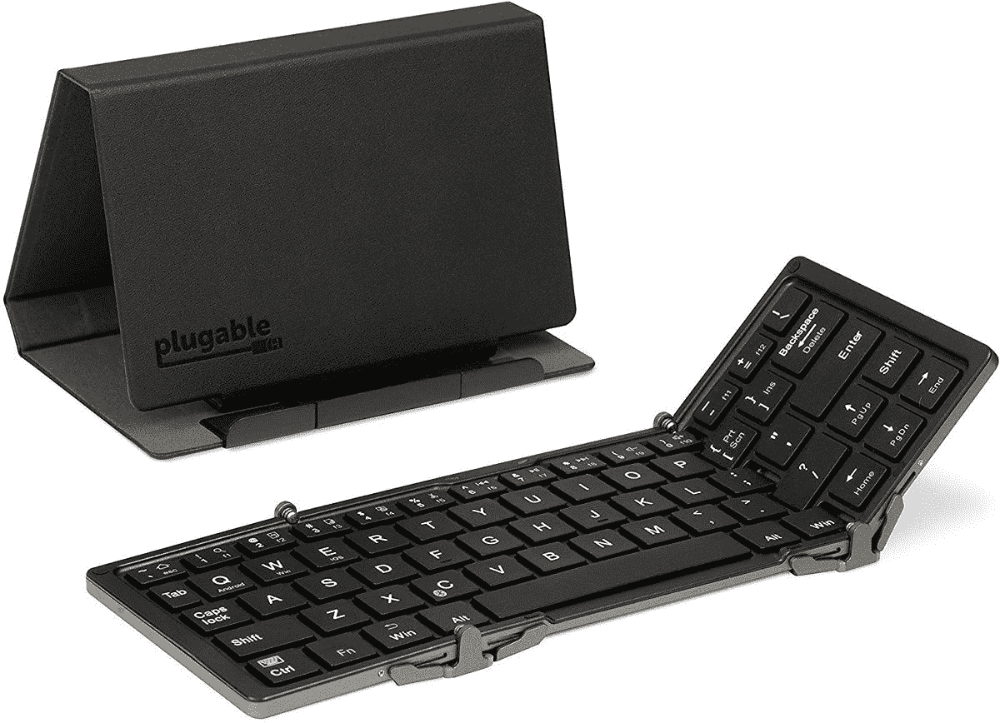
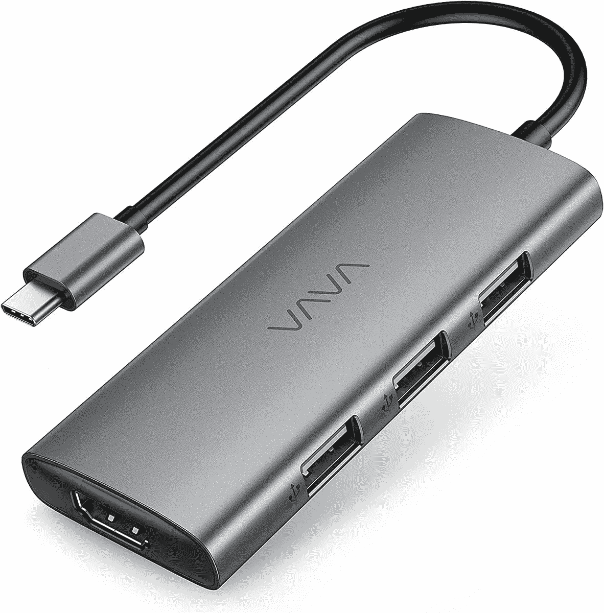
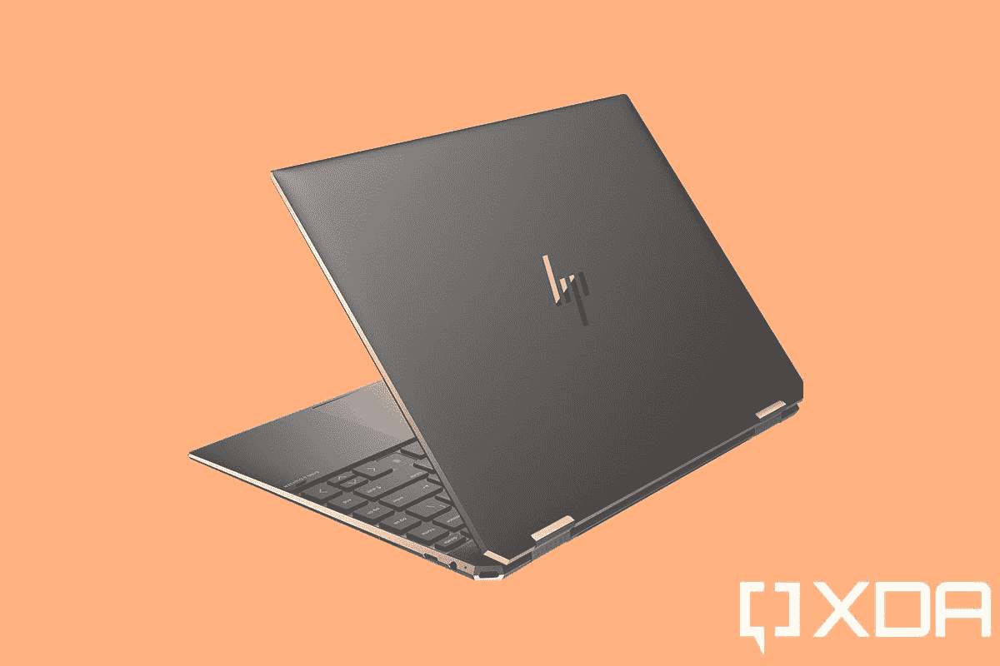

# 2023 年惠普 Spectre x360 的最佳配件

> 原文：<https://www.xda-developers.com/hp-spectre-x360-accessories/>

# 2023 年惠普 Spectre x360 的最佳配件

如果您希望改善 HP Spectre x360 的使用体验，配件可能是一个不错的选择。这里有一些你能买到的最好的。

惠普 Spectre x360 14

惠普 [Spectre x360](https://www.xda-developers.com/hp-spectre-x360-13-5-review/) 是一款出色的高端笔记本电脑，14 英寸版本是你能买到的[最好的惠普笔记本电脑之一](https://www.xda-developers.com/best-hp-laptops/)。但是，即使是[最好的笔记本电脑](https://www.xda-developers.com/best-laptops)也可以变得更好，配件在使设备更适合你的需求方面大有作为。为了帮助您，我们收集了一些您可以为 Spectre x360 购买的最佳配件，从日常外围设备到一些更专用的配件。

当我们谈论配件时，你可以寻找很多。鼠标、键盘、袖套和坞站都可能派上用场。好消息是，Spectre x360 配备了支持 Thunderbolt 4 的[，因此您可以通过一个](https://www.xda-developers.com/best-thunderbolt-4-laptops/) [Thunderbolt dock](https://www.xda-developers.com/best-thunderbolt-docks/) 来大大扩展您的可能性。您可能还需要一台额外的显示器来提高工作效率。不管你在找什么，我们都有一些很好的选择给你。这些是你能为 HP Spectre x360 买到的最好的配件。

 <picture></picture> 

HP Spectre Rechargeable Mouse

##### 惠普 Spectre 充电鼠标 700

Spectre x360 的双色外观是标志性的，这款鼠标是它的完美搭配。它是无线的，有一个可充电电池，所以你永远不会陷入困境。

 <picture></picture> 

Plugable Foldable Bluetooth Keyboard

##### 可插拔可折叠蓝牙键盘

市面上有很多键盘，但它们都不容易携带到你的笔记本电脑上。如果你想要可以在任何地方使用的东西，可插拔可折叠蓝牙键盘可以非常紧凑。

 <picture></picture> 

Jelly Comb mouse and keyboard combo

##### 果冻梳键盘和鼠标组合

如果你需要鼠标和键盘来帮助你布置你的办公室，这个 25 美元的套装可以满足你。它们也是无线的，所以你可以自由移动它们。

 <picture></picture> 

HP Rechargeable MPP 2.0 Tilt Pen

##### 惠普充电 MPP 2.0 倾斜笔

Spectre x360 通常会附带一支笔，但如果你碰巧放错了，你可以买一支替换的。这支笔支持倾斜阴影，并附带两个额外的笔尖。

 <picture></picture> 

Samsung T7 Touch

##### 三星 T7 触摸便携式固态硬盘

如果您需要额外的存储空间，三星 T7 Touch 是一款容量高达 2TB 的快速外置固态硬盘。内置的指纹识别器可以帮助您保护数据安全，即使您丢失了数据。

 <picture></picture> 

Plugable 14-in-1 Thunderbolt 3 dock

##### 可插拔的 14 合 1 雷电 3 坞站

如果你的 Spectre x360 上的端口不够用，这个可插拔的 Thunderbolt dock 提供的多达 14 个连接肯定会有所帮助。借助多个显示器和 USB 端口，您可以用一根电缆轻松连接多个设备。

 <picture></picture> 

VAVA USB-C Hub

##### VAVA USB-C 集线器

Thunderbolt 坞站非常适合办公室使用，但在旅行时，您可能只是想要一个紧凑的集线器，为您提供一些额外的端口。这款 VAVA USB-C 集线器在紧凑的封装中包含三个 USB 3.0 端口、HDMI 和电源。

 <picture></picture> 

Razer Anzu Smart Glasses

##### 雷蛇 Anzu 智能眼镜

Razer Anzu 智能眼镜将蓝光过滤镜片与一组小型扬声器相结合，将声音传递到您的耳朵。你还可以戴上太阳镜去听音乐。

 <picture></picture> 

Surface Headphones 2

##### 微软 Surface 耳机 2

Surface Headphones 2 提供了高质量的声音和噪音消除功能，并结合了直观的触摸和拨号控制。它们也有黑色的。

 <picture></picture> 

HYZUO Laptop Sleeve

##### HYZUO 笔记本电脑套

如果你的 Spectre x360 附带的黑色袖子不是你的风格，HYZUO 提供了许多颜色可供选择。它有多种尺寸，你可以选择合适的尺寸，你还可以得到一个附件袋。

 <picture></picture> 

HP Renew 15 Topload

##### HP Renew 15 最高负载

如果你想要一种简单的方式来携带你的 Spectre x360，惠普自己的 Topload 旅行包是一个好看的选择。它对于所有的 Spectre 尺寸来说都足够大，并且有足够的空间容纳临时演员。

 <picture></picture> 

Xbox Design Lab Controller

##### 微软 Xbox 无线控制器

当鼠标和键盘不是理想的游戏方式时，Xbox 无线控制器是大多数游戏的最佳选择。它有几种颜色，握起来非常舒服。

 <picture></picture> 

HP U28 4K HDR

##### 惠普 U28 4K HDR 显示器

使用两台显示器可以极大地提高工作效率，HP U28 是一个不错的选择。您还可以使用其 4K 色彩精确的显示器进行媒体查看和编辑。

 <picture></picture> 

Razer Core X

##### Razer Core X

惠普 Spectre x360 并不是开箱即用的游戏装备，但多亏了 Thunderbolt，它可以成为一个游戏装备。Razer Core X 支持大多数现代 GPU，它可以帮助您在笔记本电脑上享受最新的游戏。

 <picture></picture> 

HP Omen X 27 ($145 off!)

##### 惠普 Omen X 27 240Hz 赫兹游戏显示器

凭借 240Hz 的刷新率和 QHD 分辨率，HP Omen X 27 是 Razer Core X 的绝佳伴侣。然而，你需要一个 Thunderbolt 或 USB 底座，因为这款显示器只有 HDMI 和 DisplayPort 输入。

这些是你能为 HP Spectre x360 买到的最好的配件。最后三个项目可能会推动什么可以被认为是一个配件的限制，但它们可以大大扩展你的可能性。如果 Spectre x360 是您唯一的电脑，当您在家时，外部 GPU 可以快速将其转变为游戏电脑。对于在家工作的人来说，第二台显示器可以极大地提高工作效率，让您可以同时查看更多应用。

我是 Razer Anzu 智能眼镜的超级粉丝。在连续几个小时坐在电脑前后，它们可以极大地帮助缓解眼睛疲劳，如果我想在散步时听音乐，它们很容易变成太阳镜。它们也不会阻挡外部声音，这有助于让你意识到周围的环境。如果这些配件已经向您出售了 Spectre x360，您可以从下面的链接购买。

 <picture></picture> 

HP Spectre x360 14

##### 惠普 Spectre x360 14

Spectre x360 14 采用高分辨率 3:2 显示屏和第 11 代英特尔处理器，是一款出色的超极本。有了 Thunderbolt 4 的支持，你可以连接各种配件，甚至可以把它变成一台游戏 PC。