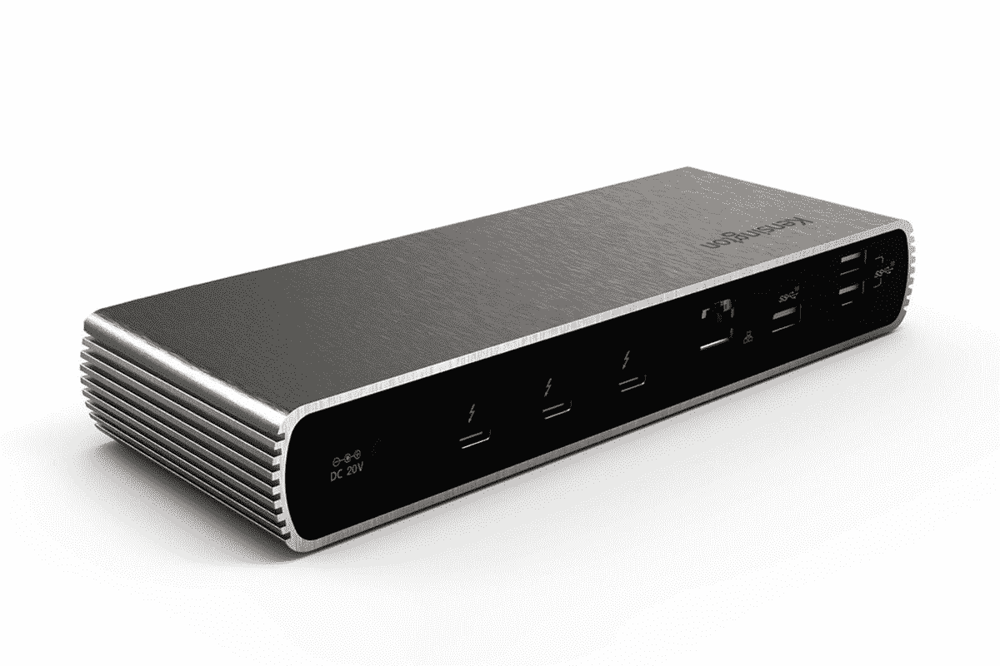
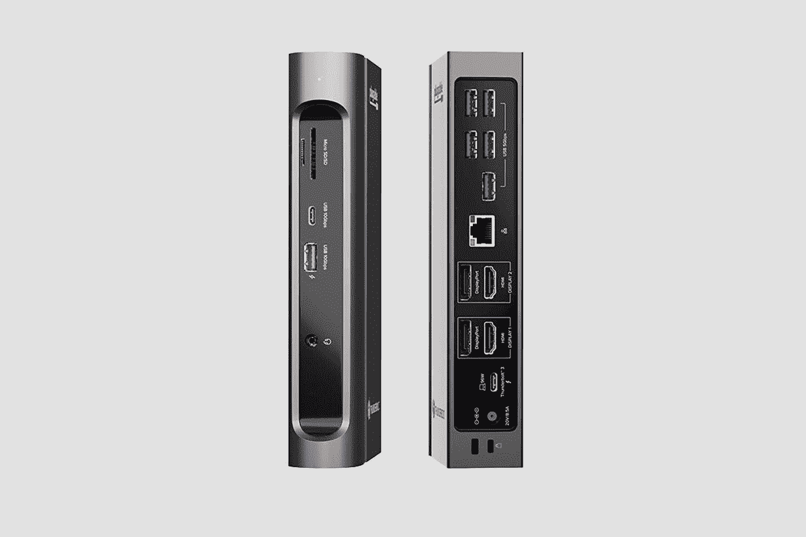
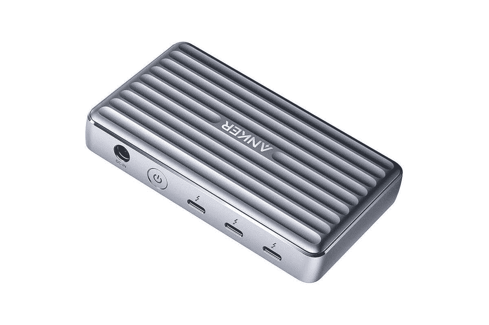

# 2023 年惠普 Spectre x360 的最佳坞站

> 原文：<https://www.xda-developers.com/hp-spectre-x360-docks/>

# 2023 年惠普 Spectre x360 的最佳坞站

HP Spectre x360 系列具有 Thunderbolt 4 端口，这使得使用简单的坞站解决方案添加各种端口成为可能

HP Spectre x360 系列最大的优点之一是它配备了最新的 Thunderbolt 4 连接。事实上，所有三种型号，包括 Spectre x360 13、Spectre x360 14 和 [Spectre x360 15](https://www.xda-developers.com/hp-spectre-x360-16-review/) ，都具有双 Thunderbolt 4 端口。随着英特尔第 11 代 CPU 的推出，在 CES 2020 上发布的 Thunderbolt 4 终于成为笔记本电脑的主流功能。它提供 40Gbps 带宽，支持双 4K 显示器，功率为 100W，能够连接大量坞站以扩展连接选项。

我们已经为 Spectre x360 列出了一些最好的外部显示器，但如果你不想牺牲 I/O 连接，投资一个好的 USB-C 或 Thunderbolt 4 坞站是明智的。以下是惠普 Spectre x360 的一些最佳坞站。

 <picture></picture> 

HP Thunderbolt Dock 120W

##### 惠普雷电坞站 G2

惠普提供了自己的 Thunderbolt 坞站解决方案，该解决方案相当紧凑，具有一系列端口，包括一个传统的 VGA 端口。

 <picture></picture> 

Belkin USB-C Hub

##### Belkin 6 合 1 USB 集线器

一个简单的 USB-C 坞站，易于携带，并通过各种端口(包括全尺寸高速千兆以太网插孔)连接到您的笔记本电脑。

 <picture></picture> 

Kensington SD5700T Thunderbolt 4 Docking Station

##### Kensington SD5700T Thunderbolt 4 扩展坞

这是目前最好的 Thunderbolt 4 坞站之一，总共有 11 个端口。它还支持 90W 功率传输，基本上允许您通过一根 Thunderbolt 电缆为 Spectre x360 充电并连接到坞站。

 <picture></picture> 

Plugable 14-in-1 USB-C and Thunderbolt 3 Dock

##### 可插拔的 14 合 1 雷电 3 坞站

一个满载的雷电 3 码头，Plugable 提供你需要的每一个港口。该坞站配有五个 USB 3.2 Type-A 端口，一个 USB 3.2 Gen 2 Type-A，一个 USB 3.2 Gen 2 Type-C，一个 Thunderbolt，两个 HDMI，两个 DisplayPort，一个 3.5 毫米组合音频，千兆以太网，并支持 96W 功率传输。

 <picture></picture> 

Anker PowerExpand 5-in-1 Thunderbolt 4 Mini Dock

##### Anker PowerExpand 5 合 1 雷电 4 迷你坞站

这个来自 Anker 的迷你坞站是最紧凑的 Thunderbolt 4 坞站之一。它支持 8K@30Hz 或双 4K@60Hz 显示屏，并为手机和笔记本电脑提供 85W 电源

 <picture></picture> 

Anker PowerExpand+

##### Anker PowerExpand 5 合 1 雷电 4 迷你坞站

Anker 的便捷 USB-C 集线器是一种扩展笔记本电脑 I/O 连接的廉价解决方案，配有 HDMI 端口、SD 卡插槽、USB-A 和 USB-C 数据端口，以及 100W 直通充电和电力传输。

这些只是 HP Spectre x360 众多坞站选项中的一部分。我们的选择将是[可插拔的 14 合 1 USB-C 和雷电 3 坞站](https://www.amazon.com/Plugable-Thunderbolt-Certification-Charging-Monitor/dp/B08HR3T837?tag=xda-2oivt1d-20&ascsubtag=UUxdaUeUpU2658&asc_refurl=https%3A%2F%2Fwww.xda-developers.com%2Fhp-spectre-x360-docks%2F&asc_campaign=Short-Term)，特别是对于那些在家里有一个永久桌面设置并且需要广泛的外围设备和其他设备连接的人。一个建议，Kensington SD5700T Thunderbolt 4 坞站和 Anker PowerExpand 5 合 1 Thunderbolt 4 迷你坞站都缺少专用的视频输出端口，如 HDMI 或 DisplayPort。然而，它们确实增加了 Thunderbolt 端口，所以你需要确保你要么有一个支持 USB-C 连接的显示器，要么投资购买正确的电缆。

你没有足够的选择？看看我们的[最佳雷电坞](https://www.xda-developers.com/best-thunderbolt-docks/)列表，包括雷电 3 和雷电 4 的选项。如果你正在[寻找配备最新 Thunderbolt 4](https://www.xda-developers.com/best-thunderbolt-4-laptops/) 连接的最佳笔记本电脑，请务必查看我们的综述，如果你特别想要一台惠普笔记本电脑，我们也有一份 2021 年最佳惠普笔记本电脑列表。

 <picture></picture> 

HP Spectre x360 13

##### 惠普 Spectre x360 13

HP Spectre x360 13 是最好的变形超极本之一，采用时尚的高端设计、最新的英特尔第 11 代 Tiger Lake 处理器和双 Thunderbolt 4 端口选项。

 <picture></picture> 

HP Spectre x360 14

##### 惠普 Spectre x360 14

HP Spectre x360 14 是 Spectre x360 系列的 13 英寸版本的更高版本，配备了一个明亮的 13.5 英寸 3K2K 分辨率显示器。

 <picture></picture> 

HP Spectre x360 16

##### 惠普 Spectre x360 15

HP Spectre x360 15 是目前您可以买到的最好的 15 英寸笔记本电脑之一，采用 2 合 1 设计，并可选择 Thunderbolt 4 端口来连接外部显示器和坞站。