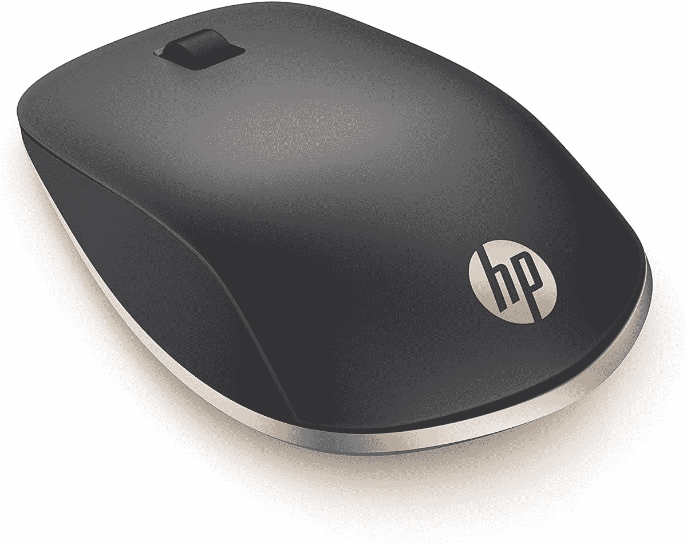
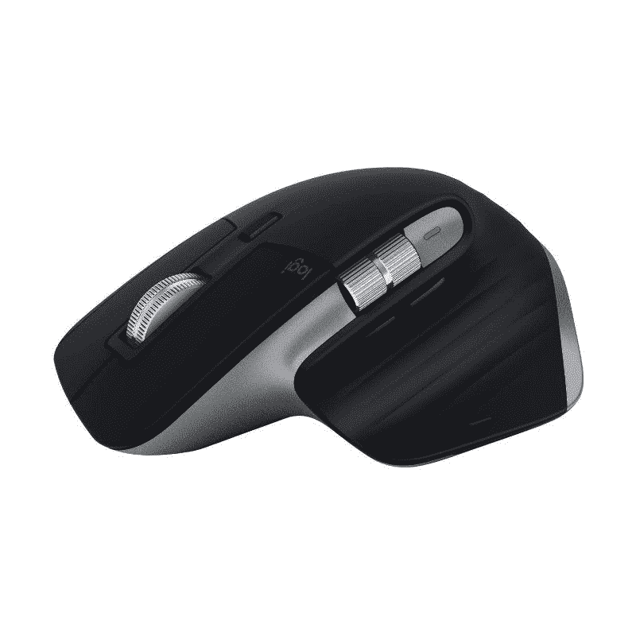
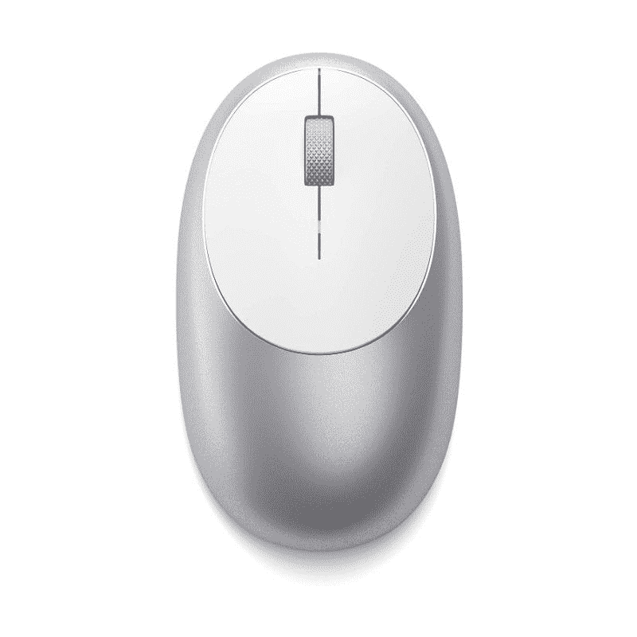

# 2023 年惠普 Spectre x360 最佳鼠标

> 原文：<https://www.xda-developers.com/hp-spectre-x360-mice/>

# 2023 年惠普 Spectre x360 最佳鼠标

正在为您的新 HP Spectre x360 笔记本电脑寻找合适的伴侣？请继续阅读一些最佳鼠标推荐。

Spectre x360 一直领先于惠普的高端可变形笔记本。在过去几年中，它已经有了改进，最新的版本有 13 英寸、14 英寸或 15 英寸。无论您选择哪一款，它们都配备了英特尔第 11 代 Tiger Lake CPUs、纤薄的机箱和高品质的设计。

这些笔记本还支持手写笔，为用户提供了一种额外的输入方式。然而，没有什么能打败这只善良的老老鼠。选择正确的一个可以是一项任务，有各种各样的选择。惠普有几个不错的选项，您可以随时依赖各种第三方选项。让我们来看看惠普 Spectre x360 的一些最佳鼠标:

 <picture></picture> 

HP Spectre Rechargeable Mouse

##### 惠普 Spectre 充电鼠标 700

遵循 Spectre x360 系列的设计美学，惠普推出了 Spectre 700。这是一款可充电鼠标，充电时间长达 11 周，设计独特。不过它用的是 micro-USB 口，不太理想。

 <picture></picture> 

HP 280 Silent Mouse

##### 惠普 2.8 亿

惠普推出的一款外观简洁的鼠标，号称能提供安静无声的体验，非常适合办公环境。据说使用一节 AA 电池可以提供 18 个月的电池寿命。

 <picture></picture> 

HP Z5000

##### 惠普 Z5000

HP Z5000 是该公司的另一个选择，它具有优雅简洁的设计，在大多数桌子上都很好看。值得注意的是，它只配有蓝牙无线连接，因此在多设备支持方面受到限制。

 <picture></picture> 

Logitech MX Master 3 for Mac

##### 罗技 MX Master 3

MX Master 3 被评为当今市场上生产力最高的鼠标之一。它采用了高级设计，带有精确滚动的双滚轮，可编程按钮，以及出色的人体工程学设计。

 <picture></picture> 

Razer Pro Click

##### Razer Pro 点击

Razer Pro Click 是该公司第一款真正的生产力鼠标，是与 Humanscale 联合制造的。它采用了高级设计，超快的 16，000 dpi 传感器，多达 8 个可编程按钮，电池续航时间长。

 <picture></picture> 

Microsoft Arc Mouse

##### 微软 Arc 鼠标

Microsoft Arc 鼠标是寻求轻薄便携设计的用户的绝佳解决方案。它还具有一个创新的垂直和水平滚动的全滚动平面，而不是使用滚轮。

 <picture></picture> 

Logitech MX Anywhere 3

##### 罗技 MX Anywhere 3

Logitech MX Anywhere 3 是遵循 MX Master 3 足迹的最紧凑和优质的鼠标。它采用了同样优秀的钢制滚轮和优雅的设计，应该很适合 Spectre x360

 <picture></picture> 

Satechi M1

##### 萨特奇 M1

Satechi M1 是惠普 Spectre x360 系列的一款价格合理的可充电无线鼠标。它有四种金属色可供选择，包括银色、太空灰、玫瑰金和金色，同时它使用 USB-C 端口进行充电。

这些是惠普 Spectre x360 笔记本电脑系列中的一些最佳鼠标选项。对于那些注重美观并希望拥有与其笔记本电脑相匹配的无缝外观的人来说，HP Spectre 700 无线充电鼠标应该是他们的首选。如果生产力是您的首要任务，那么我们建议您选择罗技 MX Master 3，因为它是最好的产品之一，提供了性能、构建质量和定制的完美结合。

惠普生产各种类别和不同价位的笔记本电脑。如果你想买一台新的笔记本电脑，在做出最终决定之前，先看看我们的 2021 年最佳惠普笔记本电脑综述。如果你想要更多的选择，我们也有一份 2021 年 T2 最佳笔记本电脑的清单。此外，查看我们对市场上支持 5G 移动连接的[最佳笔记本电脑](https://www.xda-developers.com/best-5g-laptops/)的推荐，帮助您在旅途中保持与快速移动互联网的连接。

 <picture></picture> 

HP Spectre x360 16

##### 惠普 Spectre x360 15

惠普 Spectre x360 15 配备了一个可以翻转的 15.6 英寸显示屏，该机采用了最新的英特尔第 11 代 Tiger Lake 处理器。

 <picture></picture> 

HP Spectre x360 14

##### 惠普 Spectre x360 14

HP Spectre x360 14 是一款高级可变形笔记本电脑，采用夏普 13.5 英寸面板，性能由英特尔第 11 代 Tiger lake 处理器处理。

 <picture></picture> 

HP Spectre x360 13

##### 惠普 Spectre x360 13

HP Spectre x360 13 是 Spectre x360 系列中最小的产品，是一款出色的变形超极本，采用了英特尔的高端设计和最新处理器选项。