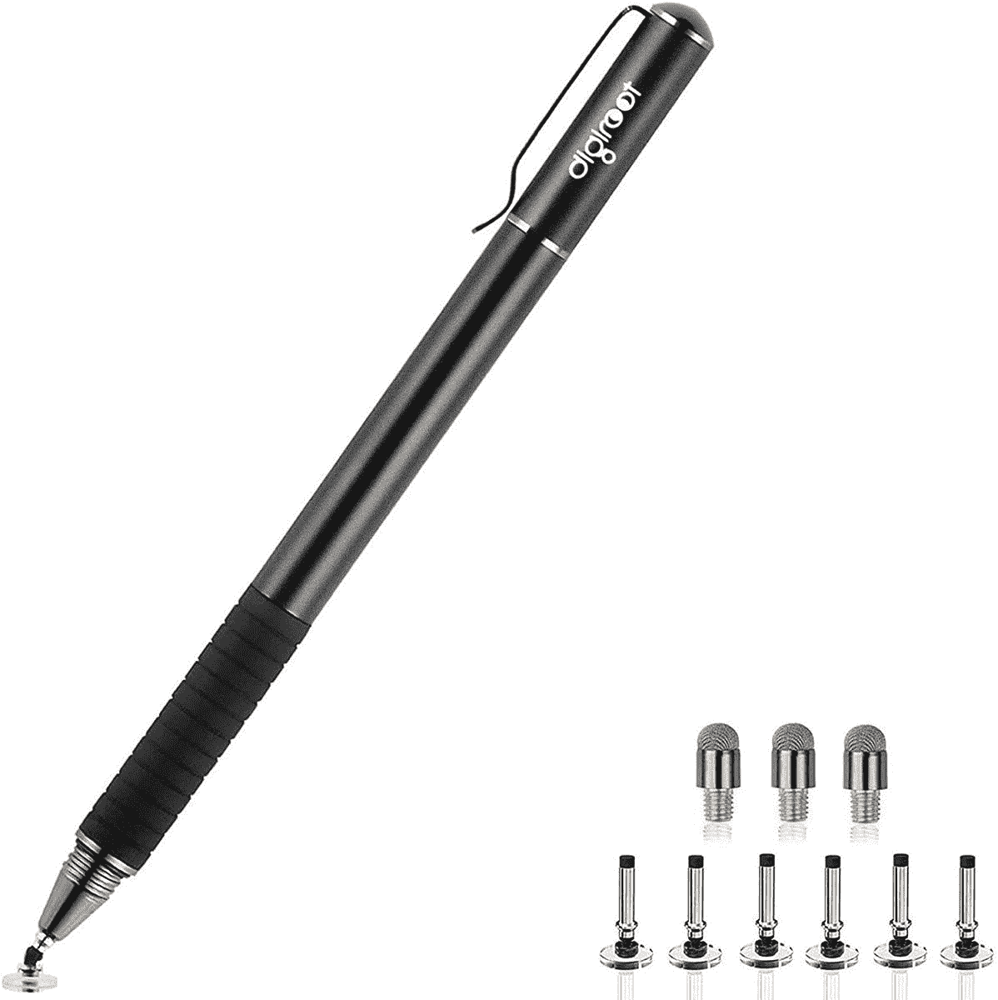
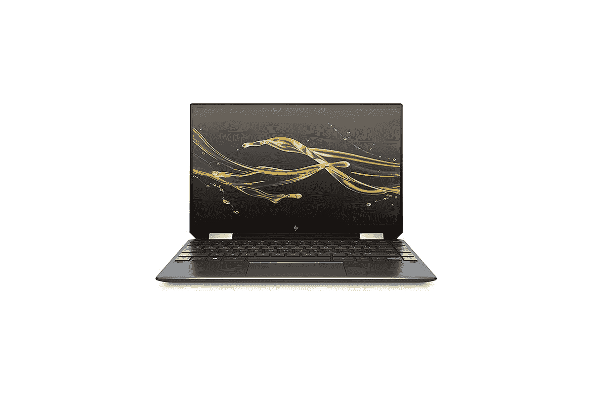

# 2023 年惠普 Spectre x360 最佳钢笔

> 原文：<https://www.xda-developers.com/hp-spectre-x360-pens/>

众所周知， [HP Spectre x360](https://www.xda-developers.com/hp-spectre-x360-13-5-review/) 是你今天能买到的最好的电脑之一。这是一款极其[高端的笔记本电脑](https://www.xda-developers.com/best-laptops/)，拥有独特的外观和顶级的性能。当然，惠普对[制造伟大的设备](https://www.xda-developers.com/best-hp-laptops/)并不陌生，所以这并不令人惊讶。Spectre x360 还附带一只开箱即用的活动笔，让您可以更自然地画画或记笔记。但是如果你碰巧弄丢了或者它因为某种原因停止工作了呢？您需要购买替代品，我们将随时为您提供帮助。这些是你能为 HP Spectre x360 买到的最好的笔。

关于 Spectre x360 和大多数惠普 Windows 电脑的笔，你需要知道的是，它们使用微软的笔协议。不是每种类型的笔都能用。比如 Wacom 做的笔很棒，但是很多只支持 Wacom 的专有协议。惠普还为 chrome book 生产[笔，这种笔也使用不同的协议。下面列出的笔应该都可以与 Spectre x360 一起使用。](https://shop-links.co/1745352259485603621?u1=97df1f9f-2807-4c13-9af3-a0f330f2103b)

 <picture></picture> 

HP Pen

##### 惠普笔

这种基本的惠普笔可以让您使用 Windows Ink 功能套件，并且它承诺使用 AAAA 电池可以有 18 个月的电池寿命。虽然它没有倾斜或蓝牙支持。

 <picture></picture> 

HP Tilt Pen

##### 惠普倾斜笔

如果你想要更多的功能，惠普倾斜笔支持倾斜，以帮助绘图应用程序中的阴影，它有 4，096 级压力。此外，通过蓝牙支持，您可以将其用作演示者控制或快速启动应用程序。

 <picture></picture> 

Wacom Bamboo Ink Plus

##### Wacom 竹墨 Plus

Wacom 可能有自己的专有协议，但 Bamboo Ink Plus 也支持 Spectre x360 上的 Microsoft Pen 协议。这是一支高级笔，盒子里有 4，096 种压力水平、倾斜度、蓝牙和可互换的笔尖。

 <picture></picture> 

Surface Pen

##### 微软 Surface Pen

它可能是为 Surface 设备设计的，但 Surface Pen 也可以在 HP Spectre x360 上使用。它也是一个高级选项，具有 4，096 种压力、倾斜和蓝牙级别。它有四种颜色，可以为您的电脑增添一丝个性。

 <picture></picture> 

RENAISSER Raphel 520BT

##### 雷纳塞拉斐尔 520BT

如果你想节省一些钱，Raphael 520BT 笔以低得多的价格提供了 4，096 压力水平、倾斜支持和蓝牙等高级功能。它还拥有圆滑时尚的设计和可充电电池。这是你能为 Spectre x360 买到的最物有所值的笔之一。

 <picture></picture> 

Digiroot Universal Stylus

##### Digiroot 通用手写笔

与这里的其他笔不同，这不是一个活动笔。它不会启用任何独特的 Windows Ink 功能，但它会模仿你的手指触摸，你可以在任何有触摸屏的设备上使用它。它也比其他的便宜得多。

这些是您应该为您的 HP Spectre x360 或其他支持笔功能的 HP Windows PCs 寻找的一些最佳笔。惠普有几个官方的，但也有一些其他品牌的很好的选择。如果你想有一天得到一个不同的绘图设备，Wacom Bamboo Ink Plus 可能是最好的选择。由于它也支持 Wacom 协议，你可以做好准备，以防你最终购买一个带有它的设备。

与此同时， [Renaisser Raphel 520BT](https://www.amazon.com/dp/B08M3JSSMQ?tag=xda-2hjkafa-20&ascsubtag=UUxdaUeUpU3483&asc_refurl=https%3A%2F%2Fwww.xda-developers.com%2Fhp-spectre-x360-pens%2F&asc_campaign=Short-Term) 非常引人注目，因为它的价格不到 50 美元，并且提供了与 Surface Pen 类似的功能。还有一个没有蓝牙的更便宜的版本，仍然具有所有的压力水平和倾斜支持。在 Spectre x360 的所有钢笔中，它是一个非常超值的选择。

如果你还没有这样做，你可以从下面的惠普网站购买惠普 Spectre x360。如果你在寻找更实惠的东西，你可能会想看看我们收集的[最实惠的笔记本电脑](https://www.xda-developers.com/best-laptops-under-600/)。我们推荐的所有笔记本电脑都可以在 Windows 11 发布时升级到 [Windows 11](https://www.xda-developers.com/windows-11/) ，因此您可以放心购买。

 <picture></picture> 

HP Spectre x360 13

##### 惠普 Spectre x360 13

HP Spectre x360 13 是一款出色的笔记本电脑，具有顶级的构造和设计、顶级的性能和高质量的显示屏。这是 Spectre x360 最便携的尺寸。

 <picture></picture> 

HP Spectre x360 14

##### 惠普 Spectre x360 14

HP Spectre x360 14 是一款出色的笔记本电脑，具有顶级的构造和设计、顶级的性能以及可提高工作效率的高显示屏。Thunderbolt 4 支持也使其易于扩展。

 <picture></picture> 

HP Spectre x360 16

##### 惠普 Spectre x360 15

HP Spectre x360 14 是一款出色的笔记本电脑，具有顶级的构造和设计、顶级的性能以及适合媒体观看的大屏幕。当然，它还有雷电 4。