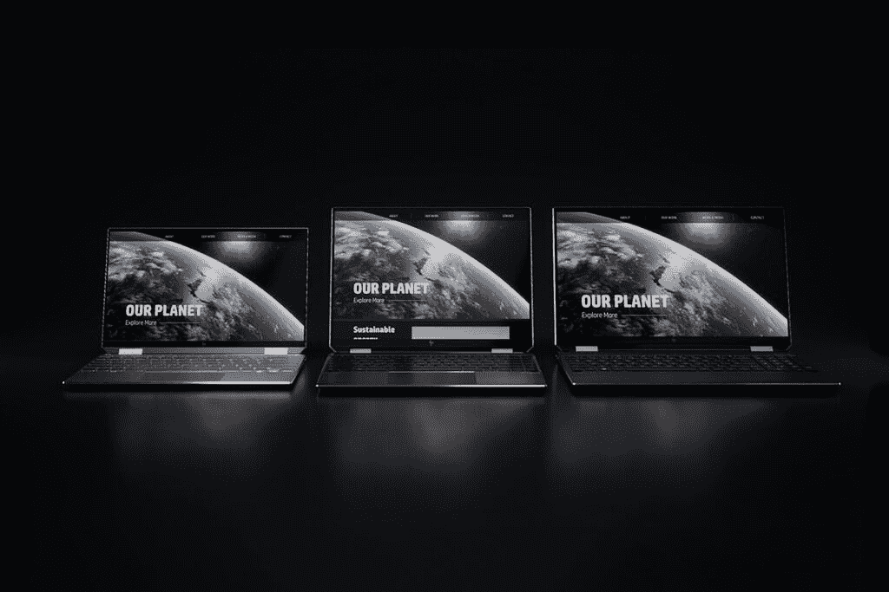

# HP Spectre x360:规格和您需要知道的一切

> 原文：<https://www.xda-developers.com/hp-spectre-x360/>

当谈到 Windows 笔记本电脑时，很少有品牌能像惠普 Spectre x360 系列一样享有盛誉。这一系列的[可转换笔记本电脑](https://www.xda-developers.com/best-convertible-laptops/)提供了您在笔记本电脑上所能找到的最高端、最漂亮的设计之一，结合了高端规格和便携性。随着 2021 款机型的推出，惠普还推出了新版本，为产品线带来了更高的显示器，使它们的工作效率更高，并重申了它们作为[最佳笔记本电脑](https://www.xda-developers.com/best-laptops)的地位。

如果您想了解关于 HP Spectre x360 的所有信息，那么您来对地方了。我们已经收集了所有关于最新型号的信息，包括所有不同的尺寸。这些型号中最新的是 SPectre x360 16，目前还不能购买，所以我们还没有关于其规格的完整细节。然而，我们已经尽可能地收集了信息，这已经足以将这款新车型与其他车型区分开来。

## 规范

### 惠普 Spectre x360 规格

|  | 

惠普 Spectre x360 13

 | 

惠普 Spectre x360 14

 | 

惠普 Spectre x360 15

 | 

惠普 Spectre x360 16

 |
| --- | --- | --- | --- | --- |
| **处理器** | 

*   英特尔酷睿 i5-1135G7(最高 4.2GHz，四核)
*   英特尔酷睿 i7-1165G7(最高 4.6GHz，四核)

 | 

*   英特尔酷睿 i5-1135G7(最高 4.2GHz，四核)
*   英特尔酷睿 i7-1165G7(最高 4.6GHz，四核)

 | 

*   英特尔酷睿 i7-1165G7(最高 4.6GHz，四核)

 | 

*   最高可配英特尔酷睿 i7-11390H(最高 5GHz，4 核)

 |
| **图形** |  |  |  | 

*   英特尔 Iris Xe 显卡
*   英伟达 GeForce RTX 3050

 |
| **撞锤** |  |  |  |  |
| **存储** |  |  |  |  |
| **显示** | 

*   13.3 英寸 IPS，全高清(1920 x 1080)，HP Sure View，触控
*   13.3 英寸 4K 有机发光二极管(3840 x 2160)，400 尼特

 | 

*   13.5 英寸 IPS，全高清+ (1920 x 1280)，触控，400 尼特
*   13.5 英寸 IPS，全高清+ (1920 x 1280)，惠普 Sure View，触控，1000 尼特
*   13.5 英寸有机发光二极管，3K2K (3000 x 2000)，触控，400 尼特

 | 

*   15.6 英寸 AMOLED，4K (3840 x 2160)，触摸屏，400 尼特

 | 

*   16 英寸 IPS，3K+ (3072 x 1920)，触摸屏，可选抗反射涂层
*   16 英寸 AMOLED，4K (3840 x 2400)，防反射，触摸

 |
| **音频** | 

*   双立体声扬声器
*   Bang & Olufsen 的音频

 | 

*   四声道立体声扬声器
*   Bang & Olufsen 的音频

 | 

*   四声道立体声扬声器
*   Bang & Olufsen 的音频

 | 

*   四声道立体声扬声器
*   Bang & Olufsen 的音频

 |
| **网络摄像头** |  |  |  | 

*   500 万像素/1080 像素 GlamCam 网络摄像头
*   自动取景、光线校正、美颜模式

 |
| **生物特征安全** | 

*   Windows Hello 红外摄像机
*   指纹读取器

 | 

*   Windows Hello 红外摄像机
*   指纹读取器

 | 

*   Windows Hello 红外摄像机
*   指纹读取器

 | 

*   Windows Hello 红外摄像机
*   指纹读取器

 |
| **电池** | 60 瓦时电池 | 66Wh 电池 | 72.9 瓦时电池 | 83Wh 电池 |
| **端口** | 

*   2 个 Thunderbolt 4 端口
*   1 个 USB 类端口
*   3.5 毫米耳机插孔
*   microSD 读卡器

 | 

*   2 个 Thunderbolt 4 端口
*   1 个 USB 类端口
*   3.5 毫米耳机插孔
*   microSD 读卡器

 | 

*   2 个 Thunderbolt 4 端口
*   1 个 USB 类端口
*   HDMI 2.0b
*   3.5 毫米耳机插孔
*   microSD 读卡器

 | 

*   2 个 Thunderbolt 4 端口
*   1 个 USB 类端口
*   HDMI 2.0b
*   3.5 毫米耳机插孔
*   microSD 读卡器

 |
| **连通性** | 

*   英特尔 Wi-Fi 6E AX210 (2×2)，蓝牙 5

 | 

*   英特尔 Wi-Fi 6E AX210 (2×2)，蓝牙 5

 | 

*   英特尔 Wi-Fi 6E AX210 (2×2)，蓝牙 5

 | 

*   英特尔 Wi-Fi 6 AX201 (2x2) +蓝牙 5
*   英特尔无线 6E (AX210) +蓝牙 5.2

 |
| **颜色** | 

*   夜幕降临
*   波塞冬蓝
*   天然银

 | 

*   夜幕降临
*   波塞冬蓝
*   天然银

 | 

*   夜幕降临
*   波塞冬蓝

 | 

*   夜幕降临
*   夜曲蓝

 |
| **尺寸(WxDxH)** | 12.08 x 7.66 x 0.67 英寸(306.8 x 194.6 x 17 毫米) | 11.75 x 8.67 x 0.67 英寸(298.5 x 220.2 x 17mm 毫米) | 14.17 x 8.91 x 0.79 英寸(359.9 x 226.3 x 20mm 毫米) | 14.09 x 9.66 x 0.78 英寸(357.89 x 245.26 x 19.81 毫米) |
| **重量** | 起始重量 2.8 磅 | 起始重量为 2.95 磅 | 起始重量为 4.23 磅 | 起始重量 4.45 磅 |
| **起始价格** | $949.99 | $1,199.99 | $1,449.99 | $1,639 |

## 惠普 Spectre x360 的发布日期是什么时候？

惠普 Spectre x360 的最新型号，特别是 13 英寸、14 英寸和 15 英寸版本，于 2020 年 10 月推出，在英特尔推出其 Tiger Lake 处理器后不久。随着英特尔最近宣布第 12 代 Alder Lake CPUs，我们可能很快就会看到这些型号的更新版本。事实上，惠普似乎已经在其网站上停止了所有这些型号，尽管你至少还可以在百思买找到 Spectre x360 14。据推测，我们将很快看到这些模型的更新。

 <picture></picture> 

Spectre x360 13, 14, and 15

然而，惠普 Spectre x360 16 最近才宣布，并将于 2021 年底推出。它拥有英特尔的 H35 系列处理器，具有 35W 的 TDP，于 2021 年首次亮相。由于这是最近的事情，所以你不应该期待很快会有更新，再加上这些处理器没有得到英特尔 Alder Lake 系列的直接更新，所以很难说惠普接下来会如何发展。

Spectre 系列包括一些惠普最好的笔记本电脑，每次有新的主要硬件出现，比如英特尔的新一代 CPU，它都会被刷新。然而，自从英特尔推出 Alder Lake CPUs 以来，没有任何官方消息宣布，所以如果你想要一个更新的版本，你需要等待一段时间。

## 惠普 Spectre x360 的价格是多少？

惠普 Spectre x360 的价格取决于你想要的尺寸。当 13 英寸、14 英寸和 15 英寸型号推出时，整个系列的起价为 1199 美元。据我们所知，惠普销售的惠普 Spectre x360 13 起价为 940.99 美元，包括英特尔酷睿 i5-1135G7、8GB 内存、256GB 存储和全高清 IPS 显示屏。正如我们提到的，该型号已经不再提供，Spectre x360 15 也不再提供，上次提供时起价为 1449.99 美元。

目前，Spectre x360 14 的唯一型号在一家大型零售商处售价为 1729 美元。它包括英特尔酷睿 i7-1195G7 处理器、16GB 内存和 3K2K 有机发光二极管显示屏，因此您的钱花得值。上次惠普还在直接销售时，惠普 Spectre x360 14 的起价为 1199.99 美元，包括英特尔酷睿 i5-1135G7，8GB 内存，256GB 固态硬盘存储，由 16GB 英特尔 Optane 内存加速，以及全高清+ (1920 x 1280)显示屏。

最后，惠普 Spectre x360 16 的官方售价为 1639 美元，但目前已经打折。如果你想要没有专用显卡、16GB 内存、512GB 固态硬盘存储和 3K+显示屏的 Nocturne Blue 型号，你可以花 1429.99 美元买下它。夜幕黑色版本完全可定制，相同配置的起价为 1499.99 美元。

## 惠普 Spectre x360 有哪些新特性？

HP Spectre x360 的最新型号有一些显著的变化，但它们主要是对以前型号的规格改进。这是最新型号增加了什么的简要介绍。

### 英特尔第 11 代处理器

正如您对任何一代更新的预期，Spectre x360 系列的最新型号都配备了英特尔第 11 代“Tiger Lake”处理器。这些新处理器带来了大量改进，在英特尔 10 纳米处理器架构的基础上有所改进，但也包括新的英特尔 Iris Xe 显卡。这种集成的 GPU 比前几代产品强大得多，它使某些以 GPU 为中心的任务变得更容易。

这些新处理器实现的其他功能是支持 Thunderbolt 4，但这并不一定有很大不同。Thunderbolt 4 本质上采用了雷电 3 的最大能力，并使它们成为标准，但惠普已经典型地使用了最大雷电 3 配置。无论如何，你可以获得 40Gbps 的带宽，这对于连接外设来说是非常好的。

### Spectre x360 14

是的，最新一代 Spectre 的新特点之一是一款全新的型号，Spectre x360 14。通常，Spectre 笔记本电脑有 13 英寸和 15 英寸两种尺寸，都有 16:9 显示屏。Spectre x360 14 不仅推出了新的尺寸，还推出了全新的外形。

Spectre x360 14 配备了 13.5 英寸的显示屏，但与它的兄弟姐妹不同，它没有使用 16:9 的纵横比，而是 3:2。这是一个通常在微软 Surface 系列中看到的更高的显示屏，它为您提供了更多的内容显示区域。阅读文章、浏览网页和写作现在变得更加方便，因为更多的行可以一次显示在屏幕上。它也很有趣，因为它的宽度与 13 英寸的型号大致相同，但高度与 15 英寸的型号相同。而且，就像它的其他兄弟一样，它有一个有机发光二极管显示器的选项，但现在是一个不寻常的 3K2K (3000 x 2000)分辨率。

### Spectre x360 16

Spectre 系列的最新成员是 Spectre x360 16，它也是该家族的一个全新成员，有一些自己的变化。Spectre x360 16 推出了另一种新的显示器类型，现在配备了 16 英寸的面板，长宽比为 16:10。16:10 比 16:9 高，但没有 3:2 高，所以它给了你一个中间点，可能是你理想的需求。当然，作为一个 16 英寸的显示器意味着它将是该系列中最高的。

Spectre x360 16 的另一个重大变化是它有一个 500 万像素的网络摄像头，可以录制 1080p 视频。这是主要的，因为 Spectre 系列的其他产品使用 720p 网络摄像头和微型传感器，这意味着图像质量不是很好。随着远程工作越来越突出，这种改进的网络摄像头有很大的不同。此外，它还具有自动取景、美颜模式和光线校正等智能功能。

Spectre x360 的内部也有所不同。它是 Spectre 家族中唯一一个封装英特尔 H35 系列处理器的成员。这些是具有四个内核和 35W TDP 的移动芯片，这意味着它们明显快于产品线中其他 15W 处理器，但它们仍然包括英特尔 Iris Xe 显卡。这也不同于典型的 H 系列处理器，后者有 45W 的 TDP 和多达 8 个内核，但没有 Iris Xe 显卡。H35 系列旨在为您提供更好的整体性能，同时保持高效率。

不仅如此，Spectre x360 16 是唯一一款为您提供配备 GeForce RTX 3050 Ti 显卡的专用 NVIDIA 显卡选项的机型。过去，Spectre x360 15 的一些型号可以配备专用显卡，但现在，这是为 16 英寸型号保留的，使其成为内容创作甚至一些游戏的理想选择。

最后一个变化是，Spectre x360 16 是设计，它对双色调外观的强调要小得多。Nightfall Black 型号只有一个不同颜色的小长条，而 Nocturne Blue 型号只使用单一颜色，这可能是一件好事或坏事，取决于您的喜好。

## 哪里可以买到惠普 Spectre x360？

Spectre x360 13、14 和 15 似乎都已经停产，所以你不能直接从惠普购买，而且它们似乎也无法在大多数零售商处买到。不过，你仍然可以在百思买找到 Spectre x360 14，Spectre x360 16 也随处可见。

 <picture></picture> 

HP Spectre x360 14

##### 惠普 Spectre x360 14

HP Spectre x360 14 为 Spectre 系列带来了 3:2 显示屏，同时保持了相同的标志性设计和高端规格。

 <picture></picture> 

HP Spectre x360 16

##### 惠普 Spectre x360 16

最大的 Spectre x360 型号通过英特尔 H35 系列处理器和专用 NVIDIA 显卡提供最高性能。

## 常见问题解答

### 惠普 Spectre x360 有专用显卡吗？

HP Spectre x360 16 附带专用 NVIDIA 显卡选项，包括 NVIDIA GeForce RTX 3050 Ti。这使得它适用于要求更高的任务，如内容创作，甚至一些游戏。

借助英特尔第 11 代处理器，整个 Spectre 系列还配备了集成的英特尔 Iris Xe 显卡，为您的某些任务提供了出色的图形处理能力。但只有 16 英寸的型号有专用显卡。

### 惠普 Spectre x360 有 5G 还是 LTE？

虽然惠普早在 2020 年 10 月就宣布了 Spectre x360 5G 型号，但它似乎并没有出现在该公司的网站上。目前，似乎没有任何形式的蜂窝网络支持可用于任何型号。然而，Spectre x360 13 已宣布支持 5G，并可能在未来推出。

### 惠普 Spectre x360 有有机发光二极管显示屏吗？

HP Spectre x360 的所有型号都提供了带有有机发光二极管显示屏的变体。在 13 英寸和 15 英寸型号的情况下，这些是分辨率为 3840 x 2160 的 4K 面板。在惠普 Spectre x360 14 中，有机发光二极管版本的分辨率为 3000 x 2000，惠普称之为 3K2K。

惠普还表示，惠普 Spectre x360 16 将采用 4K 有机发光二极管显示屏，但由于尚未上市，我们不知道该型号的确切分辨率。

### 惠普 Spectre x360 有迅雷 4 吗？

是的，最新的 Spectre x360 型号都支持 Thunderbolt 4，有两个 Thunderbolt 端口。惠普的 SPectre 系列在过去已经支持最大雷电 3 配置，因此在这方面没有任何重大差异。

### 不同尺寸的 Spectre x360 有什么区别？

除了尺寸本身，Spectre x360 的不同型号之间还有一些差异。13 英寸和 15 英寸型号的显示屏宽高比为 16:9，但 Spectre x360 14 的宽高比为 3:2，Spectre x360 16 的显示屏宽高比为 16:10。

另一个区别是端口，15 英寸和 6 英寸型号具有 HDMI，而 13 英寸和 14 英寸版本没有。更大的笔记本电脑也有更大的电池。不同尺寸的颜色选择也不尽相同。

Spectre x360 16 是该系列中最与众不同的一款，它采用了 35W 英特尔处理器、专用 NVIDIA 显卡和新设计，在一定程度上削弱了双色调外观。

### 惠普 Spectre x360 是否配有 Windows 11？

你可以直接从惠普购买的大多数型号的 HP Spectre x360 已经预装了 [Windows 11](https://www.xda-developers.com/windows-11/) 。不过，如果你从不同的零售商那里购买，你仍然可以得到 Windows 10。无论如何，目前所有的 Spectre x360 机型都将支持免费升级到 Windows 11。

### 惠普 Spectre x360 是否配有充电器？

HP Spectre x360 的所有型号都在包装盒中包含一个充电器。13 英寸和 14 英寸型号包括 65W USB Type-C 充电器。15 英寸型号配有 90W 电源适配器，使用惠普专有的筒式连接器。

目前还不知道惠普 Spectre x360 将包括什么充电器，但这款笔记本电脑也有一个充电用的筒式连接器。

### HP Spectre x360 有哪些配置？

对于每种尺寸，惠普允许您混合搭配大多数可用的配置选项。13 英寸和 14 英寸型号配备了英特尔酷睿 i5-1135G7 或酷睿 i7-1165G7 处理器，以及 8GB 或 16GB 的内存。15 英寸型号仅适用于高端配置。

在存储方面，所有型号的固态硬盘从 256GB 到 2TB 不等。14 英寸和 15 英寸型号还为您提供了将英特尔 Optane 内存添加到 256GB 和 512GB 固态硬盘配置中的选项，因此您可以为最常见的文件获得更快的性能。

在撰写本文时，关于 Spectre x360 16 的配置还知之甚少。

### 惠普 Spectre x360 有哪些颜色？

Spectre x360 的可用颜色取决于您的尺寸。13 英寸和 14 英寸型号有纯自然银、夜幕黑(结合黑色和铜色)或海神蓝(结合深蓝色和金色)。15 英寸的型号提供了相同的选项，除了自然银。

Spectre x360 16 有夜幕黑和夜曲蓝两种颜色，但这两种颜色都不会像较小的兄弟姐妹一样有双色设计。这两个都是单色设计。

### 惠普 Spectre x360 有好的网络摄像头吗？

Spectre x360 的大多数型号都使用 720p 分辨率的 2.2 毫米网络摄像头。小尺寸意味着允许更小的边框，但这意味着相机不能捕捉更多的光，因此质量不是最好的。

然而，Spectre x360 16 配备了一个 500 万像素的“GlamCam”网络摄像头。这款相机能够录制 1080p 的视频，此外它还包括自动取景、光线校正和美颜模式等功能。

### 惠普 Spectre x360 有 Windows Hello 吗？

所有尺寸的 HP Spectre x360 都支持 Windows Hello，具有用于面部识别的红外摄像头和指纹传感器。你可以选择你喜欢的解锁方式。

### 惠普 Spectre x360 运行 Android 应用吗？

目前，Windows 11 中的 Android 应用支持仅适用于在测试版渠道注册的 [Windows 内部人员，尽管你可以让它在非内部人员的](https://www.xda-developers.com/android-apps-available-windows-11-beta-channel/)电脑上[工作。](https://www.xda-developers.com/how-to-run-android-apps-on-any-windows-11-pc/)

当前的 HP Spectre x360 型号满足 Android 应用支持的最低要求。这些要求包括 8GB 内存、英特尔酷睿 i3 处理器或更高的处理器以及固态硬盘，所有这些 Spectre x360 都达到或超过了这些要求。一旦 Android 应用广泛可用，你应该能够获得可靠的体验。