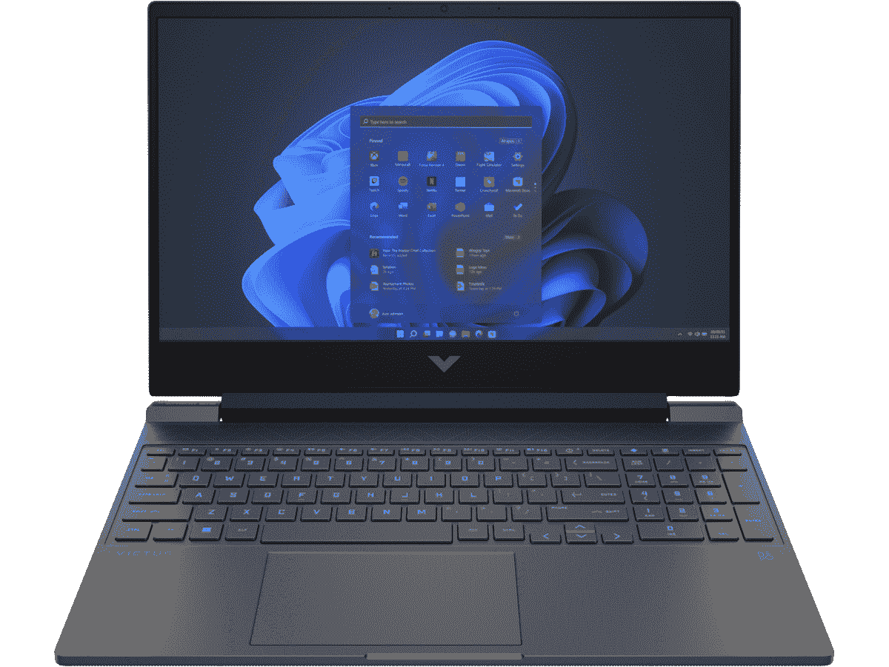

# 惠普 Victus 15 评测:可靠的主流游戏选择

> 原文：<https://www.xda-developers.com/hp-victus-15-review/>

如果你正在寻找一台价格便宜的游戏笔记本电脑，惠普 Victus 15 无疑是值得一看的。这是一款入门级游戏电脑，这意味着你不会看到任何 RGB 照明、360Hz 显示器或高端 RTX 显卡。你将会得到物有所值的东西。

它仍然有 16:9 的显示屏，这让人想起了为了更高的刷新率而牺牲色域的旧游戏笔记本电脑。但是性能比我预期的好得多，考虑到[惠普](https://www.xda-developers.com/best-hp-laptops/)给我送来的基本型号配备了酷睿 i5、GTX 1650 和 8GB 内存，价格不到 800 美元。

我实际上玩得很开心，因为游戏会根据你的硬件自动调整图形，我发现游戏玩起来实际上比一些高端游戏笔记本电脑更流畅。对于追求价值的休闲游戏玩家来说，Victus 15 是一个不错的选择。

 <picture></picture> 

HP Victus 15

##### HP Victus 15

HP Victus 15 是一款休闲游戏笔记本电脑，采用适当的游戏设计、英特尔第 12 代处理器等。

## HP Victus 15 的定价和供货情况

*   作为一款入门级游戏笔记本电脑，惠普 Victus 15 的起价为 549.99 美元，尽管英特尔型号的起价为 799.99 美元
*   现已上市，有云母银、陶瓷白和性能蓝三种颜色

惠普 Victus 15 于今年早些时候发布，现已上市。你可以选择 AMD 锐龙 5000 或英特尔第 12 代处理器，尽管像往常一样，英特尔的处理器有点贵。AMD 锐龙型号的起价为 549.99 美元，而英特尔型号的起价为 799.99 美元。

这些基本型号配备了锐龙 5 5600H 或酷睿 i5-12450H，其中任何一款都将与英伟达 GeForce GTX 1650 搭配使用。在高端，它可以配备 RTX 3050 Ti 或镭龙 RX 6500M 显卡。

它有三种颜色:云母银、陶瓷白和性能蓝。在大多数情况下，你可以在 HP.com 找到各种各样的颜色。

## 惠普 Victus 15 规格

| 

处理器

 | 英特尔酷睿 i5-12450H(最高 4.5 GHz，18 MB 三级高速缓存，12 个内核，16 个线程) |
| 

制图法

 | Nvidia GeForce GTX 1650 笔记本电脑 GPU (4 GB) |
| 

身体

 | 14.09 x 10.04 x 0.93 英寸，5.06 磅 |
| 

显示

 | 15.6 英寸对角线，FHD (1920 x 1080)，144 赫兹，9 毫秒响应时间，IPS，微边缘，防眩光，250 尼特 |
| 

随机存取存储

 | 8 GB DDR4-3200 SDRAM (2 个 4 GB) |
| 

储存；储备

 | 512 GB PCIe NVMe TLC M.2 固态硬盘(4x4 固态硬盘) |
| 

电池

 | 3 芯 52.5 瓦时锂离子方形电池 |
| 

港口

 | 1 SuperSpeed USB Type-C 5Gbps 信号速率(DisplayPort 1.4，惠普睡眠和充电)1 SuperSpeed USB Type-A 5Gbps 信号速率(惠普睡眠和充电)1 SuperSpeed USB Type-A 5Gbps 信号速率 1 HDMI 2.1 1 RJ-45 1 AC 智能引脚 1 耳机/麦克风组合 1 多格式 SD 媒体读卡器 |
| 

网络摄像头

 | HP Wide Vision 720p 高清摄像机，具有瞬时降噪功能和集成的双阵列数字麦克风 |
| 

声音的

 | 音频由 B &O;双扬声器；惠普音频增强 |
| 

键盘

 | 全尺寸背光云母银键盘，支持数字小键盘和精密触摸板 |
| 

颜色

 | 云母银 |
| 

操作系统（Operating System）

 | Windows 11 主页 |
| 

价格

 | $799.99 |

## 设计:它是为游戏而设计的，没有花里胡哨

*   它有两个 USB 类型 A 端口、以太网、全尺寸 SD 卡插槽、HDMI 和 USB 类型 C
*   云母银只是黑色

惠普 Victus 15 看起来和感觉上都像一台游戏笔记本电脑，这让我有点惊讶。鉴于它的入门级性质，可以假设购买它的客户也会将它用于其他用途，如学校。他们也可能在上面做一些照片或视频编辑。

但就像我说的，你只需要看一眼惠普 Victus 15 就知道它是为游戏玩家打造的。它的背面都有通风口，并且有倾斜的边缘，可以提升底部，使空气流通更好。当然，它的盖子上印有 Victus 徽标，而不是 HP 徽标或 HP OMEN 徽标。

惠普发给我的这款设备的颜色叫做云母银，类似于该公司以前在 Spectre 笔记本电脑上使用的深灰银。换句话说，根本不是银。它真的只是黑色，或者甚至是深灰色。它还有陶瓷白和性能蓝两种颜色，这对于这样的笔记本电脑来说非常整洁。这让它更私人化。

现在，我们来谈谈端口，因为选择很有趣。首先，我只想说，我很失望，它们都不在笔记本电脑的背面。从本质上来说，一台游戏笔记本电脑在你使用它的时候会插上一些东西；至少，你还能接通电源。当您的笔记本电脑两侧伸出电缆时，它们会碍事。这在游戏笔记本电脑上更糟糕，因为只有一个电源端口。

除此之外，我喜欢港口的选择。在左侧，你会发现电源端口、3.5 毫米音频插孔、USB Type-A 端口和全尺寸 SD 卡插槽。如果你还想用这台笔记本电脑编辑照片和视频，这个 SD 卡插槽实际上是一个非常可靠的价值指标。突然，它感觉不像是*只是*一台入门级游戏笔记本电脑。

在右侧，您会发现 HDMI、USB Type-A、USB Type-C 和以太网端口。有线互联网是另一个我不希望在这样的入门级笔记本电脑上看到的东西。显然，更稳定的连接意味着更好的游戏性能、更快的下载速度等等。

不幸的是，所有的 USB 端口都是 USB 3.2 Gen 1，这意味着它们提供 5Gbps 的数据传输速度。

## 显示器和键盘:屏幕是 144 赫兹的 FHD，但这就是全部

*   只有三个显示选项，都是 FHD

惠普发给我的型号包括一个 15.6 英寸的 1,920x1,080 显示屏，刷新率为 144Hz。显然，随着许多品牌转向 16:10，16:9 屏幕在这些日子里并不常见，但同样，这是更入门级的。事实上，有三种选择，都是 FHD。另外两个亮度分别为 250 尼特和 300 尼特。

甚至 144Hz 的刷新率也是针对休闲游戏玩家的。如果你是一名竞技游戏玩家，你会看到刷新率为 240 赫兹的 QHD 屏幕或刷新率为 360 赫兹的 FHD 屏幕。尽管如此，如果你更多地把游戏作为一种爱好，144Hz 还是很可靠的，我强烈推荐它超过 60Hz 选项。在游戏性上确实有所不同。

根据我的测试，它支持 65%的 sRGB，46%的 NTSC，48%的 Adobe RGB 和 48%的 P3。这些数字不是特别好。历史上，许多游戏笔记本电脑为了支持刷新率而牺牲了宽色域之类的东西。事实上，我们的想法是牺牲一切必要的游戏性能。游戏笔记本电脑市场已经好了很多，但这款笔记本电脑仍然是入门级的。

亮度最高达到 261.4 尼特，超过了承诺的 250 尼特，对比度是健康的 1，190:1。对于一台入门级游戏笔记本电脑来说，显示器整体来说相当不错。它对于照片和视频编辑等需要颜色准确性的事情来说并不理想，考虑到它有一个 SD 卡插槽，这是一个遗憾。

可悲的是，网络摄像头是 720p。我知道 1080p 网络摄像头往往会留给更高端的设备，但我真的不认为这是一个借口。在这个在家工作的时代，网络摄像头很重要。你可以用 Victus 15 基本款的一半价格买到一部智能手机，它的前置摄像头比这个网络摄像头好得多。不同的是，虽然自拍从第一天起就在移动设备中流行，但直到 2020 年，个人电脑上的网络摄像头才真正变得一点都不重要。

键盘有标准的 Chiclet 风格的按键和白色背光。你在这里找不到任何 RGB 灯光，这很好。惠普采用了其通常的设计，将所有按钮作为键盘的一部分，这包括电源按钮。还有一个专门的按钮来启动 OMEN Gaming Hub，你可以使用它来访问你的游戏库，或者定制照明(如果你有任何惠普 RGB 配件的话)。

## 性能:它拥有英特尔第 12 代处理器和主流 Nvidia 显卡

*   凭借酷睿 i5 和 GTX 1650，游戏性能出奇的好

当公司将笔记本电脑送去审查时，大多数情况下，它配备了酷睿 i7、16GB RAM 和 512GB 固态硬盘。这一次，惠普送来了一个基本型号，配有酷睿 i5-12450H、Nvidia GeForce GTX 1650、8GB 内存和 512GB 固态硬盘。我的第一个想法是，谁能用 8GB 内存玩游戏？

它真的起作用了。我装上了《极限竞速 5 》( Forza Horizon 5 )( T1 ),玩着漂亮的新*风火轮(Hot Wheels )( T3)资料片。默认的图形设置是中等，它播放得很好。我最近还决定再次玩遍所有的*光晕*战役，作为测试本地游戏和云游戏混合的一种手段，所以我在 Victus 15 上玩遍了作为*光晕:首席收集*一部分的一大块*光晕:战斗进化*。运行得也很好。*

显然，大多数游戏都会尽最大努力调整其图形，以匹配您的硬件。有些游戏的最低要求比这里的高，这也是意料之中的。如果你想要更好的性能，还有 RTX 3050 Ti 型号。

对于基准测试，我运行了 PCMark 10、3DMark、Geekbench、Cinebench、CrossMark 和 VRMark。我与之比较的设备实际上根本不是游戏笔记本电脑，但你可以从分数中看出有些在某些方面做得更好。

|  | 

惠普 Victus 15 酷睿 i5-12450H，GTX 1650

 | 

[宏碁 Swift X](https://www.xda-developers.com/acer-swift-x-2021-review/) 锐龙 7 5800U，RTX 3050 Ti

 | 

惠普 Pavilion Plus 酷睿 i7-12700H

 |
| --- | --- | --- | --- |
| 

PCMark 10

 | 5,988 | 6,019 | 5,682 |
| 

3DMark:时间间谍

 | 3,621 | 4,046 | 1,676 |
| 

Geekbench 5(单/多)

 | 1,584 / 6,759 | 1,447 / 8,104 | 1,747 / 8,658 |
| 

Cinebench R23(单/多)

 | 1,694 / 9,937 | 1,434 / 10,568 | 1,660 / 9,725 |
| 

交叉标记(总体/生产力/创造力/响应能力)

 | 1,454 / 1,469 / 1,486 / 1,320 |  | 1,695 / 1,664 / 1,793 / 1,512 |
| 

VRMark(橙色/青色/蓝色)

 | 5,190 / 3,332 / 1,037 |  |  |

例如，虽然 Pavilion Plus 是一款更好的照片编辑笔记本电脑，配有有机发光二极管显示屏，CPU 得分也优于其他产品，但它没有相同的图形能力，因此 3DMark 结果有很大差异。宏碁 Swift X 的整体得分更高，但正如 AMD 锐龙处理器的情况一样，单核 CPU 的得分无法击败竞争对手。

总的来说，HP Victus 15 的性能非常好，超出了我的预期。我认为酷睿 i5 和 8GB 内存将是真正的瓶颈。

## 该不该买惠普 Victus 15？

HP Victus 15 物超所值，但并不适合所有人。

**谁应该购买惠普 Victus 15:**

*   追求大量价值的节俭型游戏玩家
*   只在业余时间玩的休闲游戏玩家

**谁不应该购买 HP Victus 15:**

*   需要照片或视频编辑工作流程颜色准确性的创作者
*   竞技游戏玩家

HP Victus 15 是一款出色的入门级游戏笔记本电脑，具有很高的价值和强大的功能。然而，你可能需要更大的功率，或者更好的显示器，这方面有更高端的选择。这就是惠普拥有 OMEN 品牌的原因，该品牌面向具有竞争力的狂热游戏玩家。