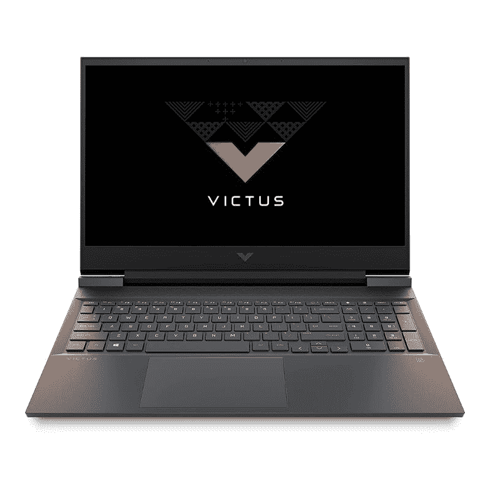

# 惠普 Victus 16 回顾:缺乏个性的预算游戏实力

> 原文：<https://www.xda-developers.com/hp-victus-16-review/>

如果你问我，惠普笔记本电脑的 Victus 为惠普的游戏笔记本电脑系列注入了新的活力。当然，Omen 系列游戏笔记本仍然广泛提供最新的硬件，但它们最近已经到处都是。Victus 系列现在位于惠普 Omen 笔记本电脑之下，提供一些预算友好的游戏笔记本电脑。另一方面，Omen 系列是包括笔记本在内的所有高端游戏产品的大本营。现在这一切都很有意义，但这些新的 Victus 游戏笔记本电脑到底有多好呢？

它是否具备游戏笔记本电脑的所有重要属性，或者只是主产品系列中的一种多余产品？好吧，我已经用一台 Victus 16 笔记本电脑作为我的日常司机将近两周了。我已经花了足够多的时间用这台机器玩游戏，消费媒体，并简单地将它作为我工作的主要笔记本电脑，所以我将在这篇评论中给你我对 Victus 16 游戏笔记本电脑的看法。

**浏览此评论:**

## 规范

Victus 16 游戏笔记本电脑有多种不同的配置，搭载英特尔和 AMD 移动芯片。GPU 选项包括英伟达的 RTX 3050Ti 和 RTX 3060 卡以及 AMD 的镭龙 5500M。您还会发现这些笔记本电脑的一系列显示器选项，从 1080p 60Hz 到 1440p 165Hz 面板。我的审查机器是锐龙 5 5600H 模型与镭龙 5500M 图形处理器。这款手机在印度的售价为₹63,000(约 850 美元)，配有 1080p 60Hz 的面板，我认为它的价格中包含了相当多的游戏功能。下面是我在这篇评论中测试的笔记本电脑的详细规格表:

| 

规格

 | 

惠普 Victus 16 16-e0162AX

 |
| --- | --- |
| **处理器** | 

*   AMD 锐龙 5 5600H (3.3GHz，最高 4.2GHz 加速，6 个内核，12 个线程，16MB 高速缓存)

 |
| **显卡** | 

*   AMD 镭龙 RX 5500M，时钟速度 1，645 MHz

 |
| **显示** | 

*   16.1 英寸 FHD (1920 x 1080) IPS，16:9，60 赫兹

 |
| **内存** |  |
| **存储** | 

*   高达 512 TB M.2 NVMe PCIe 固态硬盘

 |
| **电池&充电** | 

*   4 芯 70 瓦时锂离子聚合物&#124; 150 瓦智能交流电源适配器

 |
| **端口** | 左侧:

*   USB Type-C (USB 3.2 第二代，显示端口 1.4)
*   耳机/麦克风插孔
*   USB 类型-A
*   HDMI 2.1
*   RJ-45
*   SD 读卡器
*   动力输入

右侧: |
| **操作系统** | 

*   Windows 11 家庭版 64(Windows 10 上的测试单元)

 |
| **价格** |  |

这样一来，让我们看看所有的规格是如何配合工作的，并看看你可以从这款笔记本电脑期待的体验。

## 设计:穿得不像游戏玩家！

Victus 16 游戏笔记本电脑有三种饰面可供选择:陶瓷白、高性能蓝或云母银。如你所见，我的审查单位是后者。这种特殊的表面使它看起来非常普通，我认为白色和蓝色都是更有趣的冷却器，特别是对现代笔记本电脑来说。尤其是白色的变体，看起来非常优雅，至少在照片和渲染上是这样。这让我想起了今年早些时候我们评测过的华硕 TUF Dash F15 游戏笔记本电脑。不过，云母银变体相当简洁。我认为这是大多数人最终会选择的“安全”颜色变体。它也是一种广泛存在的变体，所以也有这种变体。

> 对我个人来说，Victus 16 游戏笔记本电脑感觉像是 premium Omen 笔记本电脑的准系统版本。

Victus 16 游戏笔记本电脑由塑料制成，但底盘仍然感觉非常坚固。近距离来看，它有一个坚固和优质的氛围，再次提醒你，它有惠普预兆的 DNA 在里面。惠普表示，这种外壳使用回收的海洋塑料，整体机箱坚如磐石。当你强行按下键盘面板和盖子时，这个机箱上几乎没有 flex 的名字，这是非常有希望的。不过，我不太喜欢铰链。这绝对是可以做得更好的事情之一。这会使盖子变得非常脆弱，稍微用力，整个盖子就会开始摇晃。

这台笔记本电脑有一个像样的端口选择，我真的很高兴。首先，你有一个千兆位以太网端口和一个 HDMI 2.1，这有利于在外部高刷新率显示器上玩游戏。此外，左侧还有一个 USB-A 3.2 Gen 1 和 USB-C 3.2 Gen 1 端口，以及一个 3.5 毫米音频插孔和一个 SD 卡插槽。右边还有两个 USB-A 接口。端口选择肯定还有更大的改进空间，但这并不一定是一个糟糕的选择。

值得注意的是，HP Victus 16 游戏笔记本电脑还配备了 Bang & Olufsen 调谐音频系统。虽然双扬声器缺乏与我们迄今为止测试的许多其他笔记本电脑扬声器相同的重低音，但即使在最大音量下，它也变得非常响亮，听起来很沉稳。当然，游戏仍然是戴着耳机的最佳体验，但当你在漫长的一天工作后想要放松时，这对于休闲游戏来说也不错。

总的来说，我认为惠普游戏笔记本电脑 Victus 看起来很不错。底盘看起来很现代，传统的锋利和方形边缘。我还喜欢它没有任何彩色的口音或浮华的 RGB 灯，只有一个反光的 Victus 标志在盖子上。也就是说，它有一些不太新颖的地方。它明显缺乏个性，对我个人来说，它感觉像是 premium Omen 笔记本电脑的准系统版本。是的，这就是表面上的真实情况，但我认为惠普本可以付出更多的努力，让它看起来不只是一款实惠的 Omen 笔记本电脑，你知道吗？

## 展示:让我想要更多

与这台机器的设计和制造质量不同，它的显示效果不那么令人印象深刻。在我讲述我的体验之前，让我们先了解一下显示器的细节。我的评测装置配备了一个 16.1 英寸的 1080p 60Hz 面板，长宽比为 16:9。这是一款带有防眩光涂层的 IPS 面板，可以更容易地在户外或直射灯下观看内容。这很好，因为这个特殊的面板只有 250 尼特的最大亮度，这是非常令人失望的。你需要所有的防眩光涂层，因为即使在室内正常的光照条件下，它看起来也非常暗淡。惠普表示，Victus 游戏笔记本电脑显示器的响应时间为 3 毫秒，覆盖了 100%的 sRGB 色彩空间，但我认为这是配有 QHD 165 赫兹面板的顶级型号。

> 惠普 Victus 16 的显示屏令人印象深刻。

退一步说，我对这次展示的体验没什么印象。我没有任何明显的问题与整体面板质量 w.r.t 颜色。但在使用了大量高质量面板后，我可以清楚地告诉你，笔记本电脑的基本版本不是最好的。这肯定是为了反映较低的单位价格标签。还有一点我不是特别喜欢的就是刷新率有限。60Hz 对于入门级或主流笔记本电脑来说已经足够好了，但我强烈认为 144Hz 应该是游戏笔记本电脑的最低要求。

是的，这款笔记本电脑不够强大，无法以高帧速率推送所有现代 AAA 游戏(稍后在性能部分会有更多介绍)，但有些游戏可以在高于 60 帧的帧速率下轻松运行。像 CS:GO 或 Valorant 这样的竞技射击游戏可以利用更高的刷新率，其他游戏如 Apex Legends 也可以。我个人知道很多人希望购买一款配备高刷新率面板的经济型游戏笔记本电脑，专门用于像这样要求不那么高的游戏，Victus 16 游戏笔记本电脑自动从我的推荐名单中删除。

是时候让制造商标准化游戏笔记本电脑上的高刷新率面板了。我知道这不是苹果之间的比较，但我不喜欢我的手机显示器的刷新率比我将要购买的笔记本电脑高，这对于“游戏”来说也是如此。在高分辨率显示器的情况下，这更容易接受，但我说的是 1080p 面板。低预算笔记本电脑的显示器低于标准并不罕见，但我们需要在这一领域投入更多努力。值得一提的是，显示屏周围的边框很薄，甚至为惠普添加 720p 高清网络摄像头留下了足够的空间。

## 键盘和触摸板:预兆 DNA

正如我之前指出的，键盘面板坚如磐石，没有任何弯曲的迹象。键盘本身的布局也很好，有一个完整的数字键盘。每个键之间有足够的空间，键本身也有足够的行程来获得令人满意的打字体验。我还喜欢所有的键都在它们应该在的地方，没有我们在许多卡片中看到的不必要的键混乱。唯一定制的钥匙是带你去预兆控制面板的那把，老实说，我不介意。它带我到我的游戏库，还允许我改变笔记本电脑的性能模式和其他许多事情。

> 键盘面板坚如磐石，没有任何弯曲的迹象。

我想指出的是，这是一个背光键盘，单级白色背光。这里没有 RGB 选项，因为它们是为更高级的 Omen 笔记本保留的。这款笔记本电脑有一个支持 Windows Precision 驱动程序的相当大的触摸板。它比联想 Legion 7 游戏笔记本电脑上的那个大，但至少这个在尺寸上更大。总的来说，如果您使用的是旧的 HP Omen 笔记本电脑或者以前用过，您会有宾至如归的感觉。它唯一缺少的是 RGB 照明，但我知道你们很多人会喜欢这一点。

## 性能:预算游戏能力

位于塞尚的锐龙 5 5600H 是我所考察的维克图斯 16 号机组的核心。这是一款基于 AMD Zen 3 微体系结构的 12 线程六核处理器。我们期待 3.3GHz 的基础时钟和高达 4.2 GHz 的睿频加速频率。锐龙 5 5600H 基于 7 纳米工艺，当然，它支持总共 12 个线程的同时多线程(SMT)。锐龙 7 5800H 肯定会更好，但锐龙 5 5600H 也不逊色。

### CPU 性能

我们的 Cinebench R23 循环显示，这款 45W TDP 芯片的性能非常好，经常与该类别中相对更强大的英特尔芯片发生冲突。处理器会在负载下自动提升至睿频，并在持续任务中提供稳定的性能。可以理解的是，与华硕 TUF Dash F15 和 ThinkPad X1 Extreme Gen 4 相比，它在 PCMark 10 测试中表现不佳，但差距并不大。事实上，当涉及到以 CPU 为中心的任务时，锐龙 5 5600H 驱动的 Victus 16 游戏能够很好地与竞争对手的笔记本电脑保持一致。它设法比四核酷睿 i7-11370H 驱动的 [Surface Laptop Studio](https://www.xda-developers.com/surface-laptop-studio-review/) 得分更高，这只是为了让你了解该芯片的潜力。

| 

基准

 | 

惠普 Victus 16 16-e0162AX

 | 

华硕 TUF Dash F15

 | 

Surface Laptop Studio

 | 

ThinkPad X1 至尊第四代

 |
| --- | --- | --- | --- | --- |
| **PCMark 10** | 6,165 | 6,247 | 5,573 | 6,403 |

### GPU 性能

这些图形由 AMD 镭龙 RX 5500M 为 Victus 16 游戏提供支持。这是一款基于 Navi 14 的中档 GPU，具有 1，408 个流处理内核，峰值时钟频率为 1，645 MHz。虽然该芯片的额定 TDP 为 85W，但它在负载下可以轻松保持在 100W 左右。我在运行 3DMark GPU 测试套件时注意到了这种行为。RX 5500M 动力惠普 Victus 16 在常规时间间谍测试中获得了 4273 分。这比 GTX 1650 Max-Q 驱动的[华硕 ROG Flow x13](https://www.xda-developers.com/asus-rog-flow-x13-review/) 在今年早些时候的测试中在没有外部 GPU 附件的情况下进行相同测试时获得的分数要高。下面是我在惠普 Victus 16 游戏笔记本电脑上获得的 3DMark 测试结果。

| 

3DMark 测试

 | 

惠普 Victus 16 16-e0162AX

 |
| --- | --- |
| **时间间谍** | 4,273 |
| **时间间谍极限** | 2,133 |
| **火力打击** | 10,621 |
| **火击极限** | 5,558 |
| **火力打击超** | 3,026 |

在测试过程中，当笔记本电脑设置为“性能”模式时，RX 5500M 在该机箱中运行得非常好。许多现代游戏确实很难达到可玩的帧率，但在下面的基准表中有一些令人惊讶的数字。以下数字是在“高”图形设置下播放上述游戏时记录的。通过调整一两个设置，你一定会得到更好的帧速率。

| 

比赛

 | 

HP Victus 16 16-e0162AX - FHD 高设置

 |
| --- | --- |
| **顶点图例** | 72 |
| **瓦朗特** | 136 |
| **古墓丽影** | 58 |
| **红色亡灵救赎 2** | 39 |
| **侠盗猎车手 5** | 53 |
| **远哭新曙光** | 52 |

我真的希望笔记本电脑有一个更高的刷新率面板，以利用它所提供的每一个小性能。有时候游戏可以推动更多的帧数，但我不得不将帧数限制在 60，因为，嗯，你浪费了所有你无法真正体验的帧数，而且没有必要将 GPU 推到极限。例如，在 Apex Legends 和 Valorant 这样的游戏中，我可以通过调整图形设置轻松获得更多的 100FPS，但显示效果不够好。你要么连接到一个外部显示器，要么将框架限制在 60，以避免屏幕撕裂。

这款笔记本电脑的基本型号还配备了 8GB 的 DDR4-3200 内存模块和 512GB 的三星制造的 M.2 NVMe SSD 模块。您可以在事后手动添加更多内存和存储空间，或者购买一个开箱即用的变种。无论哪种方式，都将花费你更多的钱，所以要小心。下面让我们快速了解一下固态硬盘在 CryalDiskMark 测试中的表现:

### 热特性

Victus 16 游戏笔记本电脑有相当多的通风口，可以将热空气排出系统。当风扇在负载下以最大转速旋转时，噪音也会变得很大。我建议您将风扇速度设置为“Auto ”,因为当您运行任何类型的资源密集型应用程序时，它们都可以很好地发挥作用。例如，游戏几乎会立即迫使风扇以最大转速旋转。这不是我在玩游戏时遇到的最大声的粉丝，但在玩游戏时最好还是用一副耳机来避免任何分心。

笔记本电脑设法处理热量出奇的好。即使在重负载下，CPU 核心温度也远低于可接受的限制。温度确实达到了 90°C，并超过了这一温度，但它设法保持在 CPU 的 TJMax 限制之下，即 105°C。

镭龙 RX 5500M 也设法在大部分时间内保持在 80°C 以下。当玩游戏或运行 3DMark 测试时，它设法保持在限制之下。在某些情况下，温度往往会在短时间内突然升高，但笔记本电脑的整体性能在任何时候都没有受到抑制。

总的来说，我认为 Victus 16 游戏笔记本电脑提供的性能水平与 RX 5500M 的经济型游戏笔记本电脑相当。这是一个入门级的移动 GPU，这并不意味着在游戏时推动极端的帧速率，所以最好保持你的期望在检查中。也就是说，你在 2021 年玩一些更现代的游戏应该没有问题。4GB 的 VRAM 有点障碍，它会迫使你玩图形保真度较低的游戏，所以如果你对游戏很认真，我建议你买一个比 RX 5500M 更强大的变体。

## 电池寿命:一般

如果有一件事是 Victus 16 游戏笔记本电脑不能从它的 Omen 兄弟姐妹那里借鉴的，那就是电池寿命。大多数惠普 Omen 笔记本电脑，至少我个人用过的那台，电池续航时间都很长。对于 Victus 16 游戏笔记本电脑，我不能说这是什么，因为我对它的体验还算不错。这台机器内部的 70 瓦时电池无法真正满足我的日常工作负载。在显示器亮度设置为 75%左右的情况下，我一次充电只能使用大约 5 个小时。将笔记本电脑模式设置为有利于延长电池寿命确实有一点帮助，但它仍然没有什么特别之处。你会发现自己经常伸手去拿 150 瓦的交流充电器。

## 惠普 Victus 16 回顾:最终想法

看，HP Victus 16 是一款不错的游戏笔记本电脑。这台机器有很多让人喜欢的地方，但实际上没有什么特别之处。考虑到 Victus 16 不是惠普的火炬手，这未必是一件坏事。它仅仅是一款试图赶上同类竞争对手的经济型笔记本电脑。对₹63,000 来说，Victus 16 是一款做工精良的笔记本电脑，配有出色的键盘和高于平均水平的音响系统。AMD CPU-GPU 组合也使其易于推荐入门级游戏。遗憾的是，这款笔记本电脑的基本型号只配备了 60Hz 的面板。大多数人也会欣赏它看起来更专业而不那么“游戏化”的事实，但这款笔记本电脑明显缺乏个性。它看起来像现有的 Omen 笔记本电脑之一，性能与该领域的任何其他预算游戏笔记本电脑一样。

我也希望看到更多的电池耐力，但你的里程可能会有所不同。总的来说，如果你正在寻找一款休闲游戏的入门级笔记本电脑，Victus 16 是一款非常好的机器。你可能想升级到更高端的高刷新面板，甚至更多的 GPU VRAM，因为 4GB 有点严重。看看竞争对手，Acer Nitro 5 是一个可靠的[游戏笔记本电脑](https://www.xda-developers.com/best-gaming-laptops/)替代品，所有型号都标配 144Hz 面板。挑选正确的硝基 5 变种可能会有点复杂，由于其变种的绝对数量，但你一定会找到这个价格范围内的东西。

HP Victus 16 是一款功能强大的镭龙游戏笔记本电脑，可以轻松完成任务。只要保持你的期望与这台笔记本电脑的基本变种检查，特别是如果你想玩一些最新的 AAA 级游戏。您可以查看下面的购买链接，立即在线查找 HP Victus 16 笔记本电脑的最佳价格。或者，如果你对购买游戏笔记本不是特别感兴趣，你也可以看看我们收集的[最好的惠普笔记本电脑](https://www.xda-developers.com/best-hp-laptops/)，

 <picture></picture> 

HP Victus 16 Gaming Laptop

##### HP Victus 16

HP Victus 16 是一款经济实惠的游戏笔记本电脑，为希望涉足游戏世界的入门级游戏玩家提供可靠的性能。