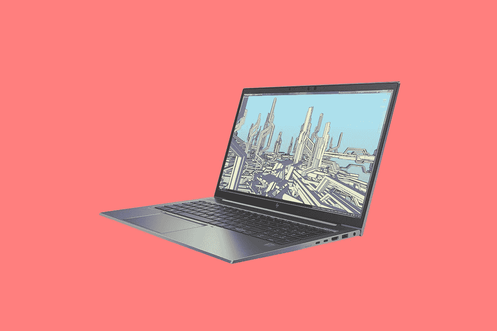

# 惠普 ZBook Firefly 14 G8 评论:对于那些需要更多

> 原文：<https://www.xda-developers.com/hp-zbook-firefly-14-g8-review/>

惠普的 ZBook Firefly 14 起价不到 3 磅，但不要让这欺骗了你。就超极本而言，这意味着强大。事实上，它是为 2D 设计，超级用户，等等。惠普说，它是为那些想推动一个

[business laptop](https://www.xda-developers.com/best-business-laptops/)

超过了临界点。如果惠普精英蜻蜓 Max 是

*almost*

对你来说足够了，但还不够，这是你结束的地方。

最终，它与惠普 EliteBook 1040 相比不会有太大的不同。它有金属底盘，B & O 扬声器，高级键盘，以及我在精英系列中习惯的额外待遇。但它也有专用的图形，梦幻色彩的显示器，等等。

**浏览此评论:**

## 规范

| 

中央处理器

 | 支持英特尔博锐技术的第 11 代英特尔酷睿 i7-1185G7 (3 GHz 主频，采用英特尔睿频加速技术时最高可达 4.80 GHz，12 高速缓存，4 核) |
| 

制图法

 | NVIDIA T500 (4GB GDDR6 专用) |
| 

身体

 | 12.73 x 8.45 x 0.71 英寸(32.3 x 21.46 x 1.79 厘米)，起始重量为 2.98 磅(1.35 千克) |
| 

显示

 | 14 英寸对角线，FHD (1920 x 1080)，IPS，防眩光，500 尼特，100% DCI-P3，惠普 DreamColor |
| 

港口

 | 左侧:1 耳机/麦克风二合一；1 超高速 USB Type-A 5Gbps 信号速率；1 个 SuperSpeed USB Type-A 5Gbps 信令速率(充电)右侧:1 个电源连接器；1 HDMI 1.4b2 Thunderbolt 4，USB4 Type-C 40Gbps 信号速率(USB 供电、DisplayPort 1.4、HP Sleepand Charge) |
| 

记忆

 | 32GB DDR4-2666 非 ECC SDRAM |
| 

储存；储备

 | 512 GB 英特尔 PCIe NVMe QLC M.2 固态硬盘，32 GB 英特尔 Optane 内存 H10 PCIe NVMe M.2 QLC 固态硬盘 |
| 

电池

 | 惠普长效 3 芯 53 瓦时锂离子聚合物 65 瓦 USB-C 充电器 |
| 

声音的

 | Bang & Olufsen 音频、双立体声扬声器、惠普面向世界的麦克风双阵列数字麦克风、音量调高和调低功能键、组合麦克风/耳机插孔、高清音频 |
| 

投入

 | HP Premium Quiet Keyboard–防泼溅全尺寸键盘，带排水键和耐久键；惠普高级静音键盘–防泼溅、全尺寸背光键盘，带排水和耐久键双指点杆；支持多点触控手势的 Clickpad，默认启用点击。支持手势的 Microsoft Precision 触摸板 |
| 

连通性

 | 英特尔 Wi-Fi 6 AX201 (2x2)和蓝牙 5 组合，非博锐 |
| 

网络摄像头

 | 720p 高清摄像头；720p 高清红外摄像机 |
| 

材料

 | 铝金属 |
| 

操作系统（Operating System）

 | Windows 10 专业版 |
| 

价格

 | $2,687 |

该产品实际上起价为 1535 美元，还有更贵的选择。你可以用 4K 显示器或 FHD 屏幕来观看。还可以配置 [4G LTE](https://www.xda-developers.com/best-4g-lte-laptops/) 或者 [5G](https://www.xda-developers.com/best-5g-laptops/) 。

## HP ZBook Firefly G8 部分由再生铝制成

HP ZBook Firefly G8 采用铝制机箱，部分由再生铝制成。它的起始重量不到 3 磅，看起来和感觉上都像一台商用超极本。它采用流线型设计，光滑而微妙，它有一种灰色，实际上不同于惠普 EliteBooks 上的传统自然银。

它也有自己的品牌，这使它有点不同。我所知道的唯一一个有自己商标的惠普品牌是 OMEN。当然，惠普有两个独立的标志，分别代表入门级和高级笔记本电脑。但不是那些，这一个有一个 Z 印在盖子上，这很好。这感觉有点奇怪，因为虽然我评论过许多[惠普笔记本电脑](https://www.xda-developers.com/best-hp-laptops/)，但我从未评论过 ZBook。

在设备的左侧，您会发现两个 USB 3.2 Gen 1 Type-A 端口，速度为 5Gbps，一个 3.5 毫米音频插孔和一个智能卡读卡器。右侧有两个 Thunderbolt 4 端口、HDMI 1.4b 和一个桶形充电器端口。自然，我从来没有使用过那个充电端口，因为我用 USB Type-C 充电。

Thunderbolt 4 的任何一个端口都可以连接到双 4K 显示器、一个 8K 显示器、一个外部 GPU 和几乎任何其他设备。对于这样的机器来说，这一点尤为重要。

z 是惠普的工作站品牌，因此这是一款为不需要 ZBook Studio 或 Fury 功能的创作者设计的移动工作站。但如果你需要更多的权力时，它的码头，你可以使用外部 GPU。

该设备的正面有倒角边缘，便于提起盖子。这是我最近评测的惠普精英蜻蜓 Max 在[上所缺少的东西，这是我从最近的惠普个人电脑上看到的一个很好的接触。](https://www.xda-developers.com/hp-elite-dragonfly-max-review/)

## 14 英寸 DreamColor 显示器

惠普承诺提供更深的黑色、更亮的白色以及更多，这种显示器能够提供您进行创造性工作所需的精确度。当然，它完成了工作。这个展示很漂亮。它也是一个哑光防眩光显示屏，这通常会导致颜色看起来褪色，但这里不是这样。令人印象深刻。

HP ZBook Firefly 拥有您通常会在 EliteBook 上找到的所有显示选项，例如 4K UHD 面板和带有惠普 Sure View Reflect privacy 屏幕的 1080p 面板。惠普发给我的 500 尼特 FHD 选项似乎是唯一一个标有 DreamColor 的选项。

从我运行的测试中可以看出，DreamColor 提供了 100%的 sRGB、86%的 NTSC、88%的 Adobe RGB 和 97%的 P3。我真的对它印象深刻，如果你正在做需要这种展示的事情，我想你也会如此。

顶部挡板包括一个红外摄像头和一个 720p 网络摄像头。是的，在随处工作的时代，它仍然有一个高清网络摄像头，而不是 1080p。对于后者，你不得不期待精英蜻蜓马克斯。

音频质量很稳定，但不比我用过的任何其他优质惠普笔记本电脑更好或更差。这是件好事。自从我开始评论惠普的产品以来，惠普就一直在音频领域与 B&O 合作。扬声器放在键盘的两边，所以它们对着你。如果你用过另一台最近的惠普笔记本电脑，键盘上有扬声器，你就知道它会发出什么样的声音。

## HP ZBook Firefly G8 上的键盘有一个指点杆

惠普表示，它用橡胶圆顶和环境光感应背光重新设计了键盘。我想这意味着它是继之前的 ZBook Firefly 之后的新键盘，我没有评论过它。键盘似乎类似于你在 EliteBook 1040 上找到的键盘，这是一件好事。这是我最喜欢的键盘之一，我强烈推荐它。我也非常高兴看到惠普将它带到更多的设备上。

坏消息是它在 G、H 和 B 键之间有一个指点杆。坦率地说，我不知道为什么这些仍然存在，因为它们是 Windows 触摸板糟糕的时代的遗物。联想在它生产的每一台 ThinkPad 上都安装了这种设备，而戴尔和惠普等公司只在特定型号上安装。

指点杆的存在也意味着在精密触摸板的顶部上方有物理按钮，这很好。当然，它确实降低了触摸板的高度。

触摸板和按钮也很安静，惠普说它在这方面下了一些功夫。这是值得赞赏的，因为有一些设备发出如此嘈杂的点击声，以至于和它们一起坐在一个安静的房间里都很尴尬。

右下角还有一个指纹传感器，这很好。它与可用的面部识别功能配合得很好。惠普一直在将指纹传感器推向其他型号的键盘，我很惊讶在这里没有看到这种变化。虽然电源按钮仍然在键盘上。

## 它有英特尔老虎湖和英伟达图形

惠普发给我的型号非常特别，配备英特尔酷睿 i7-1185G7，NVIDIA T500，具有 4GB GDDR6 内存和 32GB RAM。我前面提到过，ZBooks 是移动工作站；然而，这是惠普制造的最不强大的 ZBook。这不是三维渲染，但它绝对可以处理 2D 项目。如果你花很多时间在 Photoshop 或 Illustrator 上，这可能是你的机器。

我希望您为那些需要超极本所不能提供的东西的人考虑一款超极本。正如我在无数评论中指出的那样，英特尔的 Iris Xe 显卡非常棒。如果您喜欢玩 FHD 游戏或 FHD 视频编辑，没有这里的 T500 显卡也可以。这是一个提升，让你可以更舒适地做这样的事情，也让事情更上一层楼。

我的主要用例是生产力，但我确实经常需要在 Adobe Photoshop 和 Illustrator 等应用程序中编辑图像。这些天，我不像以前那样编辑 4K 60fps 的视频，这台机器非常适合我的使用情况。

CPU 和 GPU 的结合，以及 DreamColor 显示器，是让这个东西对创作者来说很棒的原因。当然，我也使用 PCMark 8、PCMark 10、3DMark、Geekbench 和 Cinebench 进行了基准测试。

|  | 

ZBook FireflyCore i7-1185G7，T500

 | 

精英蜻蜓 MaxCore i7-1185G7

 | 

ThinkPad T14s Gen 1Ryzen 7 PRO 4750U

 | 

戴尔 XPS 13 2 合 1 酷睿 i7-1165G7

 |
| --- | --- | --- | --- | --- |
| 

PCMark 8:主页

 | 4,406 | 3,916 | 4,298 | 4,344 |
| 

PCMark 8:创意

 | 4,682 | 4,337 | 4,568 | 4,560 |
| 

PCMark 8:工作

 | 4,168 | 3,873 | 3,857 | 3,980 |
| 

PCMark 10

 | 5,043 | 4,431 | 4,963 | 4,929 |
| 

3DMark:时间间谍

 | 2,212 | 1,320 |  |  |
| 

极客工作台

 | 1,546 / 5,386 | 1,117 / 3,663 |  | 1,526 / 5,623 |
| 

电影院长凳

 | 1,485 / 4,401 | 1,191 / 3,251 |  | 1,449 / 4,171 |

这东西的电池寿命是惊人的。在省电模式之上的电源滑动条和 50%亮度的屏幕上做常规工作，我可以正常使用八个小时。根据您的使用情况，您可以将其延长到 10 小时以上，但您可能不会这样做。独立显卡是这款电脑的一个关键卖点，如果你不需要它，你可能会更喜欢 EliteBook 1040。

## 结论:该不该买惠普 ZBook Firefly G8？

到目前为止，我已经几次试图概述该产品的使用案例，但我还是要再说一遍。这是为那些需要比标准超极本所能提供的更多的人准备的。惠普表示，这是为办公高级用户，2D 设计工作流程，并审查 2D 和 3D 内容。

除了专用显卡，它几乎是一台商用电脑。它有许多与 14 英寸 EliteBook 1000 系列 PC 相同的功能。它有 5G 选项、Sure View 显示器选项、新的橡胶圆顶键盘，甚至还有用于在手机和 PC 之间共享小文件的 HP QuickDrop。

我有两个主要抱怨。一个是它有一个高清网络摄像头。说真的，再也没有借口了。疫情揭示了这个问题，但实际上，你可以买一部 300 美元的手机，它的前置摄像头比这台笔记本电脑的摄像头好 9 倍，而这台笔记本电脑的价格是它的 9 倍。我的另一个抱怨是，它有一个指点杆用于导航，这种东西不像以前那么受欢迎了。在这一点上，我不得不相信惠普。我必须假设它有数据显示客户确实想要这个东西。

除此之外，这是一款非常棒的笔记本电脑。我绝对喜欢 DreamColor 显示器，因为我是哑光屏幕的忠实粉丝，这种屏幕实际上具有准确的颜色。当然，键盘是非凡的。对于我的用例，我仍然会选择精英蜻蜓最大，但如果这符合你的，你不能错了。

 <picture></picture> 

HP ZBook Firefly 14 G8

##### 惠普 ZBook Firefly 14 G8

HP ZBook Firefly 14 G8 是一款轻薄的笔记本电脑，仍然配备了专用显卡，可提供出色的性能。