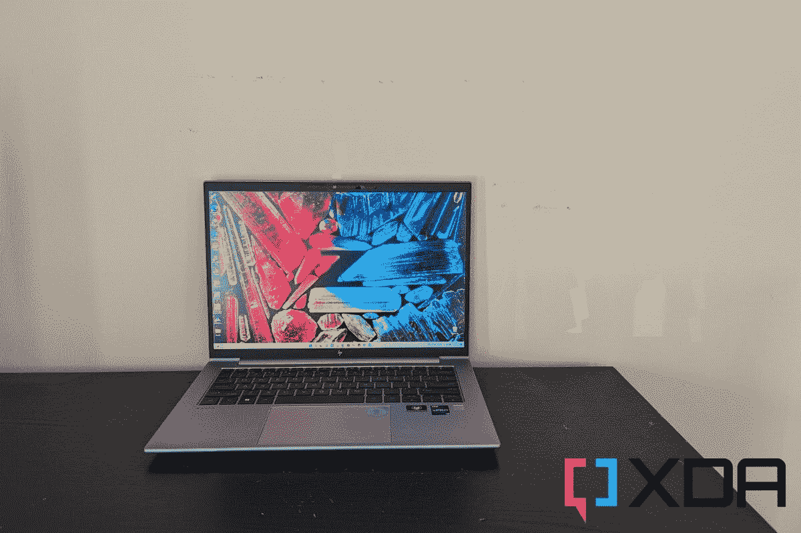

# 惠普 ZBook Firefly G9 (14 英寸)评测:小封装，大功率

> 原文：<https://www.xda-developers.com/hp-zbook-firefly-g9-14-inch-review/>

你可以花钱买到很多功能强大的笔记本电脑。大多数是为了迎合游戏玩家或那些在旅途中编辑视频的人。如果你是一名热衷于产品设计、STEM 的移动工作者，或者是一名技术和创意经理，通常很难找到一台专为你的需求而设计的笔记本电脑**。你常常不得不满足于其他不太正确的东西。**

如果你熟悉[惠普的阵容](https://www.xda-developers.com/best-hp-laptops/)，这就是 ZBook Firefly 的用武之地。公司寄给我的 ZBook Firefly G9 进行审查。这款笔记本电脑配备了第 12 代英特尔酷睿 i7-1265U 处理器、64GB 内存和 Nvidia T550 笔记本电脑 GPU，与我以前使用过的任何其他消费类笔记本电脑[都不一样。](https://www.xda-developers.com/best-laptops/)

HP ZBook Firefly G9 在一个真正时尚的封装中集成了大量原始功能和性能。除了生动的 DreamColor 显示屏和一些很酷的内置安全功能，如磁贴跟踪，这是一台非常出色的机器，但我也有一些抱怨。续航不是最好的，键盘感觉有点太浅太小。甚至冷却也不是最好的。尽管如此，这是一台很难错过的机器，尤其是如果你是一名处理 2D 内容的创作者或需要一台强大移动能力的 PC 的移动工作者。

 <picture></picture> 

HP Zbook Firefly G9

##### 惠普 Zbook Firefly G9

由于采用了 Nvidia T550 GPU 和漂亮的 DreamColor 显示屏，HP Zbook Firefly Z9 是 2D 内容创作者的绝佳笔记本电脑

**浏览此评论:**

## HP ZBook Firefly G9:定价和供货情况

*   有三种版本的 HP Zbook Firefly G9 可供购买
*   据惠普称，我正在评测的版本还没有确切的价格，但你可以买到起价 1669 美元的型号。

惠普 Zbook Firefly G9 14 英寸现已[上市](https://www.awin1.com/cread.php?awinmid=7168&awinaffid=702719&ued=https%3A%2F%2Fwww.hp.com%2Fus-en%2Fshop%2Fpdp%2Fhp-zbook-firefly-14-inch-g9-mobile-workstation-pc-wolf-pro-securityedition-p-6q426ut-aba-1)。它实际上是迄今为止最可定制的 ZBooks 之一。然而，我得到的模式审查似乎还没有最终价格。我询问了这一点，惠普向我推荐了三层的 HP ZBook Firefly 14 G9。有 1659 美元的入门级型号，2099 美元的中档型号，2600 美元的高端型号。配置上的差异包括 RAM、存储、显示类型以及 CPU 或 GPU。

## 惠普 ZBook Firefly G9:规格

| 

规范

 | 

附加说明

 |
| --- | --- |
| **CPU** | 第 12 代英特尔酷睿 i7-1265U(博锐可选)1.8 GHz 主频，最高 4.8 GHz 睿频加速 12 MB 三级高速缓存，2 个性能内核，8 个效率内核，12 个线程 |
| **图形** | **集成:**英特尔 Iris X **独立:** Nvidia T550 笔记本电脑 GPU 配 4GB GDDR6 内存 |
| **显示** | 惠普 DreamColor 14 英寸 WUXGA (2560 x 1600)，IPS，防眩光，120Hz 刷新率 |
| **尺寸&重量** | 12.42 x 8.8 x 0.78 英寸和 3.43 磅 |
| **内存** | 64GB DDR5 |
| **存储** | 2TB PCIe 第四代 x4 NVMe M.2 2280 固态硬盘 |
| **电池** | 惠普长效 3 芯 51 瓦时锂离子聚合物电池 |
| **端口** | 左侧:1 个 SuperSpeed USB Type-A 1 HDMI 2.0，2 个 Thunderbolt 4 带 USB4 Type-C，1 个智能卡读卡器右侧:1 个耳机/麦克风二合一；1 个超高速 USB Type-A 指纹读取器，位于键盘下方 |
| **音频&麦克风** | Bang & Olufsen 音频，双立体声扬声器惠普面向世界的麦克风双阵列数字麦克风 |
| **连通性** | 英特尔 Wi-Fi 6E AX211 (2x2)蓝牙 5.2 M.2，英特尔 XMM 7560 LTE Advanced Pro Cat 16；英特尔 5G 解决方案 5000 可选近场通信(NFC)模块 |
| **摄像机** | 500 万像素 Windows Hello IR 网络摄像头 |
| **颜色** | 银 |
| **材质** | 铝金属 |
| **操作系统** | Windows 11 专业版 |

## 设计:它看起来像一个惠普羡慕

*   惠普 ZBook Firefly G9 由铝制成，从外部看起来就像惠普的其他主流 Envy 或 Pavillion 笔记本电脑，除了更暗的银色。
*   对于配备专用 GPU 的笔记本电脑来说，它非常紧凑。
*   有大量的端口对创作者和移动工作者很有帮助。

当我打开 HP Zbook Firefly G9 的包装时，我并没有立即被打动。从外面看，这款笔记本电脑几乎就像一台惠普嫉妒。我注意到的第一个不同是暗银色的表面。另一个令人不快的是盖子上的大 Z 和 Zbook 品牌，它有一个很酷的反光涂层。其他惠普笔记本电脑的盖子上有传统的惠普品牌。

是的，这款笔记本电脑由铝制成，其中一些是回收的。惠普表示，50%的后工业时代的铝被用于 C&D 的外壳。这非常耐用，因为弯曲盖子和用手使劲按压键盘不会导致它弯曲。这是我对耐用性的经典测试之一。

那些只是表面的细节。该设计的亮点是笔记本电脑的整体紧凑性。创作者使用的内置 GPU 的游戏或创作者笔记本电脑通常很重或很厚。这款手机厚度为 0.78 英寸，重量不到 3.43 磅。对于非游戏笔记本电脑来说，整体屏幕尺寸比较特殊。从技术上讲，这是一款 14 英寸的设备，因此它融合了 13 英寸和 15 英寸之间的屏幕尺寸差异，正好适合那些需要大屏幕空间的人。像华硕 ROG Zephyrus 这样的游戏笔记本电脑在过去已经做到了这一点。

部分设计也有一些安全特性。底盖有一个防盗锁，如果有人试图打开系统底部，您会收到警报。还有一个内置的磁贴跟踪功能，所以你可以跟踪丢失的笔记本电脑。

作为一款惠普称创意人员和移动工作者最终会使用的笔记本电脑，我对端口选择也很满意。还有 Thunderbolt 4，还有 USB-A 和 HDMI。这意味着我能够过上没有狗的生活。对于可能会连接到显示器的创意人员来说，这是一个巨大的优势。有趣的是，惠普也在我的设备上包含了可选的 NFC，尽管我没有找到使用它的方法。我的设备上也有一个智能卡阅读器，但我没有测试它，因为我没有兼容的附件。这些更多的是商业功能，而不是创意。

## 显示和声音:丰富多彩，但不如有机发光二极管

*   惠普的 DreamColor 显示屏非常鲜艳明亮，但仍不如 OLED 面板
*   网络摄像头是 500 万像素，还有一个隐私滑块

由于这是一台专注于处理 2D 内容的创作者的笔记本电脑，显示屏是一个很大的焦点。惠普为我的设备配置了一台 [DreamColor](https://valuehub.hp.com/news/artikel/hp-dreamcolor-displays/) 显示器，这是一种特殊的显示器类型，专为媒体&娱乐设计，侧重于色彩管理。结合 120Hz 的刷新率、16:10 的宽高比和 WUXGA (2560 x 1600)分辨率，这款显示器色彩丰富、响应灵敏、清晰锐利，令人身临其境。

在网页浏览中，我确实注意到了这款 DreamColor IPS 显示器可以变得多么明亮。我把我的 ThinkPad 放在它旁边(它有一个普通的 IPS 60Hz 显示器),意识到在惠普上网页看起来更加清晰和生动。得益于 120Hz 的面板，惠普在浏览网页时也感觉反应更快了。除此之外，文本中的黑色更加突出，XDA 网站上的科技产品图片看起来比在 ThinkPad 上更生动。即使在观看 YouTube 自然视频时，场景也相当生动。我的色度计记录的高对比度和亮度(26:770:1 和 542 尼特亮度)可以解释这一点。这有助于避免屏幕上的反射，即使我把笔记本电脑带到户外。

不过，我仍然认为它没有有机发光二极管的展览好。我这么说是因为我在色度计上得到的数字。惠普 Zbook Firefly G9 获得了一些非常好的频谱，但不如带 OLED 面板的设备好。它达到了 100%的 sRGB，87%的 Adobe RGB，91%的 P3 和 82%的 NTSC 频谱。

80%的分数不错，但有机发光二极管更好。例如，与 XPS 13 有机发光二极管型号相比。这些数字是 100% sRGB、96% Adobe RGB、100% P3 和 94% NTSC。放在惠普上的数字还不错，对于 IPS 显示器上的内容编辑来说仍然是准确的，但没有什么能打败 OLED 面板的色彩准确性。

显示屏顶部是一个 500 万像素的 Windows Hello IR 网络摄像头。大多数惠普笔记本电脑都超过了 720p 和 1080p，所以这并不奇怪。惠普包括一些可以通过人工智能自动取景来增强网络摄像头的软件，我真的很喜欢它的准确性，以及我在谷歌会议通话时看起来有多干净。我的审查单位也有 Windows Hello 指纹识别器和 Windows Hello 网络摄像头，因此安全性加倍。不使用时隐藏网络摄像头的滑块也有助于保护隐私。大多数时候我把它滑到关闭位置。比起电子滑盖，我更喜欢物理滑盖，它增加了我的信心，当我不想被拍的时候，我真的不会被我的网络摄像头拍到。

至于扬声器，有双扬声器由 B&O 在船上调谐。扬声器位于设备的底部。声音还可以，但我在笔记本电脑上听得更清楚。这个位置并没有让事情听起来像是身临其境，有时候，声音听起来有点低沉。这更像是惠普将键盘上的空间用于扬声器。

## 键盘和触摸板:不是最好的

*   键盘触感不太好
*   触摸板有一种很好的柔软感

我在评测惠普 ZBook Firefly G9 的同时，也在评测惠普 Envy 16。对我来说有趣的是，由于大小的不同，键盘可以如此不同。可能只是我手指比较胖，但是惠普 ZBook Firefly G9 上的键盘似乎有点太局促了。我有时发现自己按了不止一个键，尤其是在快速输入这篇评论的时候。键帽本身有一种很好的感觉，并轻轻地放入机箱中，但不像 MacBook 甚至 Surface 那样有触感。

惠普在该键盘上配备了标准的媒体键和功能键。您可以自定义 F2 按钮，如您看到的特定功能。还有一个静音麦克风按钮，这在这个在家工作的时代总是很受欢迎。

至于触摸板，对于 14 英寸的笔记本电脑来说是相当大的。它实际上是整个键盘底部的三分之一大小。这给了我足够的空间来轻松地滚动、拖放文件。这非常容易，我真的很喜欢你点击时的柔软感。这点很难抱怨。

## 性能:如此强大的功率，如此少的电池

*   HP Zbook Firefly G9 拥有性能出色的 Nvidia GPU，专为内容创作者而设计，还搭配了英特尔的 U 系列芯片
*   CPU 和 GPU 相结合的电池寿命真的很差

惠普 ZBook Firefly G9 配备了 Nvidia 专用的 T500 GPU。这是专为从事产品设计和工程、STEM 或技术经理的专业移动工作者设计的。我习惯用 RTX 移动系列和 H 级芯片的笔记本电脑进行审查，但在试用了笔记本电脑 T550 后，我必须说它对于创造性任务来说非常强大和独特，但不是游戏的最佳选择。当搭配英特尔最新的第 12 代 U 系列芯片和我的设备上的 64GB 内存时，情况更是如此。大多数生产力任务，如在 Microsoft Edge 中浏览，在 Photoshop 中渲染带水印和无背景的图像，都是快速高效的。

看看其他的基准测试，你就能感受到这种芯片和 GPU 组合的强大。在我的许多测试中，这款英特尔 U 系列芯片和 T500 组合几乎相当于配备英特尔更高性能 H 系列芯片和英伟达 RTX 显卡的笔记本电脑的一半。它甚至接近 AMD 所提供的，并摧毁了没有 GPU 的笔记本电脑。你可以从 Crossmark 的整体创意得分中看出这一点，该得分为 1，758，接近采用 RTX 显卡的戴尔 XPS 15 笔记本电脑。

Cinebench 的得分也显示了 CPU 的能力，因为它在所有比较笔记本电脑中达到了类似的单核数字。只有当多核成为问题时，你才会看到 U 系列相对于更强大的 H 系列芯片的弱点。这是因为 2 个性能内核和 8 个效率内核以及 15 瓦的功率只能做这么多。游戏笔记本电脑的 h 级芯片同时具备这两种特性，而且运行功率更高，性能更好。

|  | 

惠普 Zbook Firefly G9/英特尔酷睿 i7-1265U/英伟达 T550

 | 

[戴尔 XPS 15](https://www.xda-developers.com/dell-xps-15-2022-review/) 酷睿 i7-12700H，RTX 3050 Ti

 | 

联想超薄 7 Pro X 锐龙 9 6900HS，RTX 3050

 | 

ThinkPad X1 Yoga Gen 7 酷睿 i7-1260P

 |
| --- | --- | --- | --- | --- |
| **PCMark 10** | 5,167 | 6,640 | 5,658 | 5,168 |
| **3DMark:时间间谍** | 2,189 | 4,535 | 4,091 | 1,458 |
| **Geekbench 5(单/多)** | 1,717/8,552 | 1,774 / 11,580 | 1,341 / 8,296 | 1,419 / 6,915 |
| **Cinebench R23(单/多)** | 1,806/6,590 | 1,797 / 11,695 | 1,293 / 10,581 | 1,375 / 6,831 |
| **交叉标记(总体/生产力/创造力/响应时间)** | 1,550/1,467/1,758/1,257 | 1,855 / 1,735 / 2,053 / 1,671 | 1,306 / 1,298 / 1,409 / 1,059 | 自然资源部 |
| **VR 标志(橙色/青色/蓝色)** | 3,126/2,102/634 | 4,745/2,753/ 1,325 | 自然资源部 | 自然资源部 |
| **3D 标记:TimeSpy 极限** | 1063 | 2,250 | 自然资源部 | 自然资源部 |

除了游戏等常见的创造性任务之外，T550 不是玩大型游戏的最佳 GPU。这不是 Zbook Firefly G9 的用途。是的，它在 TimeSpy 上的得分很高，但分数几乎是游戏笔记本电脑的一半，几乎是独立集成显卡的两倍。玩游戏时，我不得不调低图形设置。

在 ultra 1080p 的设置下，我在 Fornite 的*上设法获得了每秒 38 帧的画面。像 *GTA V* 这样要求更高的游戏在 1080p，接近 40 帧的情况下也玩得很好。*微软飞行模拟器*虽然在 1080p 的 ultra 设置下运行不佳。它冻结了很多，结果我不得不经历了很多次飞机失事。将设置调低一点到中低是一个更好的体验，我在 1080p 下达到了 30 帧。*

我确实知道许多其他采用英特尔 U 系列芯片的笔记本电脑具有良好的能效。联想 Yoga 9i 就是一个很好的例子。然而，搭配耗电的 T550 显卡，我在惠普上遇到了两个问题。一是散热，二是续航。

这款笔记本电脑很快变热，尤其是在高负载和大量浏览网页的情况下。风扇踢了很多，并试图冷却下来，这有助于保持键盘甲板和掌托触摸起来很凉。然而，冷却仍然不是惠普 Envy 最好的。当风扇运转时，我的桌子摸起来很温暖。

至于电池寿命，我确实做了一些测试。在 120Hz 和 38%亮度的屏幕下，我在谷歌会议通话、在 WordPress 中键入和网页浏览的工作流程中仅获得了 3 小时的电池寿命。调到 60Hz，我得到了略好的电池结果，接近 4 小时。所有这些都是在 Windows 设置为最佳*能效的情况下实现的。我通常会在笔记本电脑上呆上 5-6 个小时，所以这次有点失望。*

## 安全性和其他功能:确保您笔记本电脑的安全

我对笔记本电脑的评价通常以性能结束，但因为这是一台 Zbook，所以有一点额外的需要提及。惠普提供了许多东西来保护这款笔记本电脑的安全。我已经提到了防篡改，但还有两件事。瓷砖跟踪，以及惠普狼安全。

磁贴跟踪并不新鲜。惠普的其他笔记本电脑都有这种情况，尤其是 Elitebook 系列。不过在笔记本电脑上看还是挺酷的。一旦我激活它，我就能在地图上看到笔记本电脑，或者跟着磁贴信号找到它在我家的位置。对于喜欢跟踪笔记本电脑库存的企业来说，这可能是巨大的。

HP Wolf Security 也不是新的，但它就在这台笔记本电脑上，值得一提。这基本上是端点安全和一种防病毒形式。它会扫描你的系统的安全问题，也扫描你下载的文件。看到惠普认真对待安全性，真是太好了。

## 你应该购买惠普 ZBook Firefly G9 吗

除非你是一个内容创作者，一个热衷于产品设计的移动工作者，或者 STEM，或者是一个技术和创意经理，否则不行。有其他笔记本电脑有更好的 CPU 和 GPU 选项，它们更好，也可以加倍用于游戏。

**谁应该购买惠普 ZBook Firefly G9**

*   商业人士，或那些进入 STEM，或处理 2D 创意内容的人。
*   任何想要制造商提供的内置安全功能的笔记本电脑的人

**谁不应该购买惠普 ZBook Firefly G9**

*   需要原始动力进行游戏或视频编辑的普通消费者

在使用 HP ZBook Firefly G9 时，我会说这是一款适合合适的人和市场的出色笔记本电脑。我真的很喜欢日常使用，但我讨厌电池寿命和糟糕的冷却和散热。

 <picture></picture> 

HP Zbook Firefly G9

##### 惠普 Zbook Firefly G9

由于采用了 Nvidia T550 GPU 和漂亮的 DreamColor 显示屏，HP Zbook Firefly Z9 是 2D 内容创作者的绝佳笔记本电脑