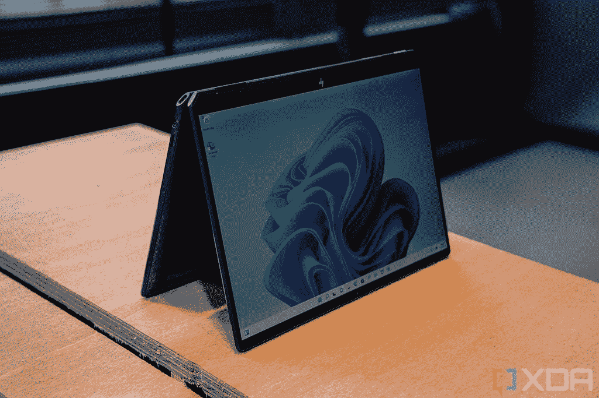
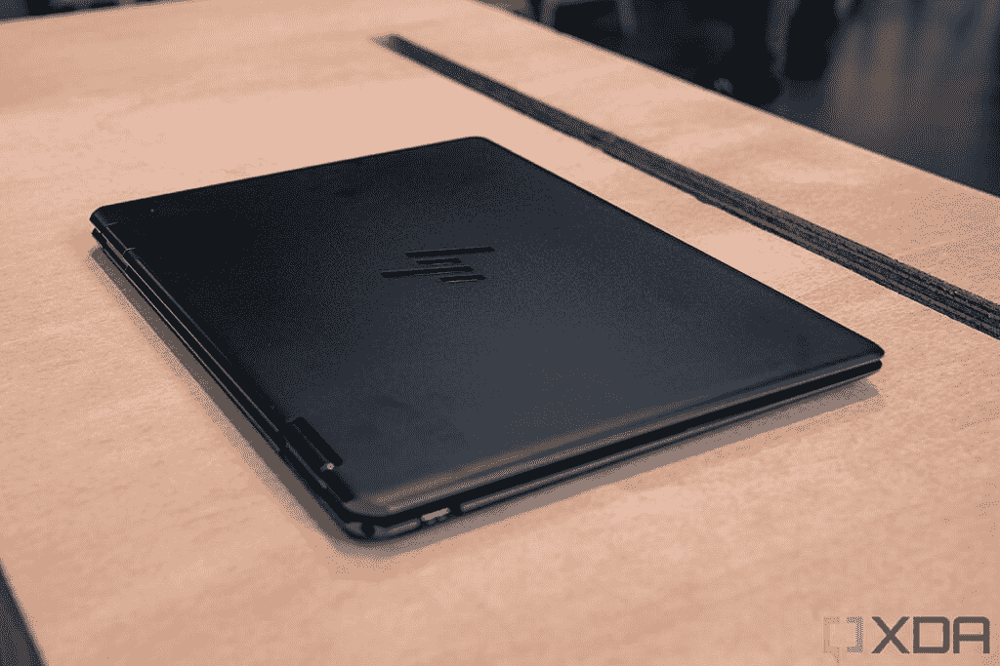
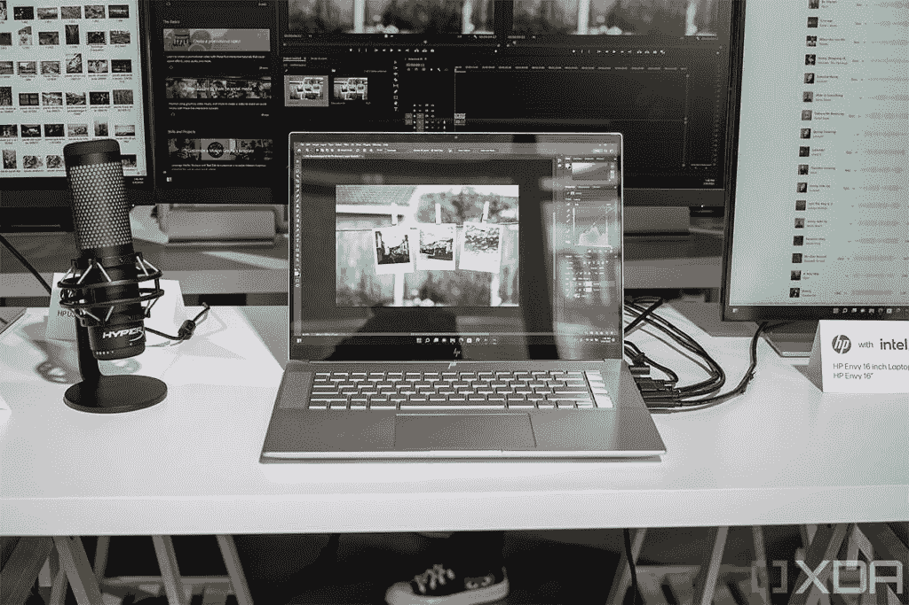

# 惠普的新 Spectre x360 13.5 完全重新设计

> 原文：<https://www.xda-developers.com/hps-new-spectre-x360-13-5-is-completely-redesigned/>

如果你想买一台新的高端笔记本电脑，这是你期待已久的一天。虽然戴尔有了新的 XPS 13 Plus，联想有了新的 Yoga 9i T1，但直到今天，[惠普](https://www.xda-developers.com/best-hp-laptops/)还没有宣布[新的 Spectre x360](https://www.xda-developers.com/hp-spectre-x360-2022/) 。该公司今天发布了整个春季的消费 PC，除了 Spectre x360 13.5，Spectre x360 16 也有一个小的更新，以及一系列新的 Envy 产品。

惠普公司消费者个人系统全球主管 Josephine Tan 表示:“创作者不仅限于专业摄影师、设计师、作曲家和编辑，每个人都是创作者，他们与朋友、家人和同事合作，在家中、工作场所以及两者之间的所有地方进行创作。今天的混合世界需要一个全新的视角来看待创作内容，这就是惠普推出其 Spectre 和 Envy 产品组合中的一系列多样化设备来实现无限制创作的原因。”

## 惠普 Spectre x360

在上一代产品中，惠普拥有 Spectre x360 13——仍然采用旧的 13.3 英寸 16:9 显示屏——和新的 Spectre x360 14——采用 13.5 英寸 3:2 显示屏。本质上，Spectre x360 14 之所以这么叫是因为 Spectre x360 13 已经被占用了。没有更多的 16:9 型号，所以今天宣布的是惠普 Spectre x360 13.5。

 <picture></picture> 

HP Spectre x360 13.5

至于设计，它遵循了我们在 Spectre x360 16 中看到的趋势。不再有带有浓重口音的 gem 0 切边。取而代之的是，有一个薄薄的口音围绕着基地。尖角被柔和的曲线取代。

 <picture></picture> 

HP Spectre x360 13.5

自然，它配备了英特尔新的第 12 代 U 系列处理器，具有 15W 的 TDP。它还配备了高达 3，000x2，000 有机发光二极管的显示屏，32GB LPDDR4x 内存，并有两个 Thunderbolt 4 端口。它还有一个 500 万像素的网络摄像头，这是我们在惠普的产品组合中看到的一个功能，非常棒。

500 万像素网络摄像头还增加了一些功能，如 HP Auto Frame 和 HP Dynamic Voice Leveling。还有背光调节，因此你在怪异的照明情况下会看起来更好，外观过滤器用于修饰你的牙齿和眼睛，双向人工智能降噪用于传入和传出的音频，等等。

惠普 Spectre x360 16 也受到了一些人的喜爱。历史上，惠普提供了两个版本的较大的 Spectre 敞篷车。一款采用强大的 H 系列处理器和 RTX 显卡，另一款采用 U 系列处理器和移动独立显卡。惠普将后者加入其中，并给予整个产品第 12 代待遇。现在，您可以通过英特尔 P 系列 CPU 和带 4GB GDDR6 的英特尔 Arc A370M 显卡获得它。

惠普 Spectre x360 13.5 今天在 HP.com 有售，起价 1249.99 美元。

 <picture></picture> 

HP Spectre x360 13.5

##### 惠普 Spectre x360 13.5

2022 HP Spectre x360 13.5 采用 3:2 显示屏和 10 核 12 线程的第 12 代英特尔处理器。

 <picture></picture> 

HP Spectre x360 16

##### 惠普 Spectre x360 16 (2022)

HP Spectre x360 配备了一个 16:10 的大显示屏，您可以根据自己的需求选择 28W 和 45W 处理器。

## 惠普 Envy x360 13、Envy x360 15、Envy 16 和 Envy 17

在旗舰层的正下方是 Envy，这是一个高端品牌，基本上与 Spectre 享有相同的待遇。今天发布的所有 Envy 笔记本电脑都配备了与 Spectre x360 相同的 500 万像素网络摄像头，以及随之而来的所有简洁功能。

 <picture></picture> 

HP Envy x360 13

HP Spectre x360 13.5 与 HP Envy x360 13 的最大区别在于后者拥有 16:10 的显示屏。事实上，所有新的 Envy 产品都有 16:10，只有一个例外。对于 13 英寸的型号，它的有机发光二极管高达 2,880x1,800，当然，它还配备了配备英特尔第 12 代 U 系列处理器的 Thunderbolt 4。

 <picture></picture> 

HP Envy 16

还有其他很酷的功能，如包内检测，这有助于避免笔记本电脑过热和电池耗尽。还有自适应电池优化器，可延长电池寿命，智能感应可优化性能和温度。

所有这些产品现在都可以买到。Envy x360 13 起价 899.99 美元，Envy x360 15 英特尔机型起价 849.99 美元，AMD 机型起价 899.99 美元，Envy 16 起价 1399.99 美元，Envy 17 起价 1099.99 美元。