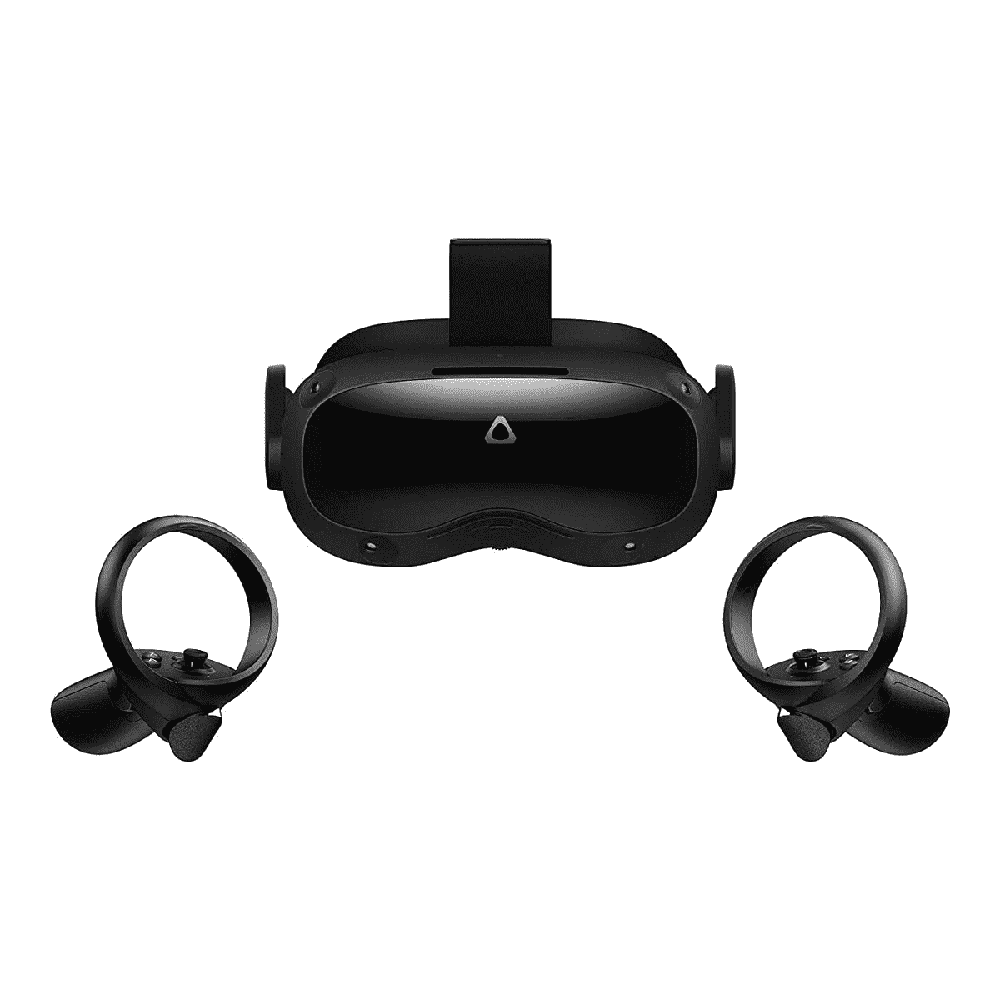

# HTC 通过新的 Vive Focus 3 配件增加了面部和眼睛跟踪功能

> 原文：<https://www.xda-developers.com/htc-announces-focus-3-facial-tracker-and-focus-3-eye-tracker/>

HTC 宣布了其 Vive Focus 3 的两款新配件，即 Focus 3 面部追踪器和 Focus 3 眼部追踪器。这两款新设备将为 VR 带来更自然的体验，通过面部和眼睛跟踪提供更身临其境的体验。

到目前为止，虚拟世界中的数字化身都相当不错，但是他们缺少的一点就是表情。用户永远无法将面部表情传递给数字朋友，因为面部和眼睛跟踪不是一个选项。使用 Focus 3 面部追踪器，用户可以传达各种情绪，这要归功于可以检测嘴唇、下巴、脸颊、下巴、牙齿等的单追踪相机。这种跟踪方法将允许相机捕捉最真实的面部表情和嘴部动作。或许更令人印象深刻的是，通过 60Hz 跟踪，用户可以将嘴部运动与他们的声音同步，因此交互在 VR 空间中看起来尽可能真实。最棒的是，安装新配件时不需要做太多工作，只需通过 USB-C 将其插入 VR 耳机即可。

与面部追踪器一样，t he Focus 3 眼球追踪器将通过眨眼和眯眼等逼真的眼球运动，为虚拟现实世界带来更多真实感。该设备将有一个双摄像头设置，带有红外照明器，能够捕捉瞳孔方向，大小，甚至位置。该装置将通过磁铁连接，便于戴上和取下 Vive Focus 3。此外，它的重量很轻。除了前面提到的好处，眼睛跟踪将允许“有凹渲染”这是一种很好的优化技术，耳机可以将最高保真度的图形指向用户当前正在观看的地方。这不仅改善了用户体验，还使 Focus 3 能够更高效地处理图形。

 <picture></picture> 

HTC Vive Focus 3

Vive Focus 3 VR 耳机的售价为 1300 美元，Vive Focus 3 面部追踪器目前的售价为 99 美元，而眼球追踪器的售价为 249 美元。对于 HTC 来说，这无疑是一个宣布这些配件的有趣时机，因为竞争对手 Meta 已经戏弄了自己的面部跟踪 VR 耳机，并将于 10 月份上市。

* * *

来源: [HTC Vive 博客](https://blog.vive.com/us/vive-focus-3-gets-facial-tracker-and-eye-tracker/)