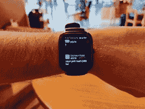

# 华米 Amazfit GTS 评测:与 Apple Watch 惊人的不同

> 原文：<https://www.xda-developers.com/huami-amazfit-gts-review-surprisingly-different-apple-watch-fitness-tracker-smartwatch/>

华米是世界上最大的可穿戴设备公司之一，通过其 Amazfit 品牌声称拥有超过 17%的全球市场份额。印度等市场的可穿戴空间在过去几年中确实有所增长，这得益于小米的 [Mi Band 系列](https://www.xda-developers.com/xiaomi-mi-band-4-review-smart-fitness-tracker/)等廉价而可靠的智能健身追踪器。这些智能健身追踪器的“健身追踪”功能恰到好处，并且由于其价格，它们是刚刚开始健身和锻炼的用户的首选。但是，如果你想要一个智能健身追踪器，拥有传统手表的更多特性，或许还拥有智能手表的一些智能，那该怎么办呢？这就是华米 Amazfit GTR 和 Amazfit GTS 等设备的用武之地。

华米 Amazfit GTS 于今年 8 月在中国[推出，随后，该设备于 10 月](https://www.xda-developers.com/huami-amazfit-gts-sports-smart-watch-3-x-launch/)进入[印度市场。Amazfit GTS 和 Amazfit GTR (](https://www.xda-developers.com/huami-amazfit-gts-india-launch/) [图沙尔最近评论了](https://www.xda-developers.com/huami-amazfit-gtr-review-affordable-smart-watch/))都位于两种设备类别之间。称它们仅仅是健身追踪器是对 GTS 和 GTR 的极大不公，这两个国家也没有足够的“智能”来称它们为智能手表。在这篇评论中，我们将探索 Amazfit GTS 如何作为健身追踪器和智能手表，以及它如何与它的兄弟姐妹 Amazfit GTR 相媲美。

**[Amazfit XDA 论坛](https://forum.xda-developers.com/smartwatch/amazfit) || [从 Amazon.in 购买 amaz fit GTS](https://www.amazon.in/Huami-Amazfit-Smart-Watch-Obsidian/dp/B07XLMY2HW/?tag=xdaportalin-21)**

| 

规范

 | 

阿马兹菲特 GTS

 |
| --- | --- |
| **尺寸和重量** | 

*   43.25 x 36.25 x 9.4mm 毫米
*   25g

 |
| **材料** | 侧面和机身采用铝合金，底盖采用聚合物材料 |
| **腕带** | 硅胶，20 毫米 |
| **兼容性** | 安卓 5.0+，iOS 10.0+ |
| **显示** | 1.65 英寸 AMOLED，分辨率 348 x 442，341ppi，100% NTSC，康宁大猩猩玻璃 3 |
| **连通性** | 蓝牙 v5 BLE |
| **GPS** | GPS + GLONASS |
| **传感器** | 

*   PPG 心率传感器
*   六轴加速度计
*   三轴地磁传感器
*   晴雨表
*   电子罗盘
*   环境光传感器

 |
| **NFC 支付** | 不 |
| **电池** | 220 毫安时 |
| **耐水性** | 5 ATM |

注:Amazfit 借给我们 Amazfit GTS(黑曜石黑色)。这个评测是在超过四周的日常使用之后。

* * *

## 设计

华米 Amazfit GTS 乍一看像苹果手表。不出所料，“*那是苹果手表吗？*“每当我带着这只手表外出时，这是我最常被问到的问题。然而，相似之处只存在于最初几个短暂的瞬间，因为更敏锐的观察会发现，Amazfit GTS 与 Apple Watch 唯一的共同点是显示屏的圆角方形。

Amazfit GTS 配有金属外壳，由轻质铝合金制成，构成了智能手表/健身追踪器的主体。手表底部有一个聚合物盖，当与相对较小的 220 毫安时电池结合时，主手表单元的重量只有 25 克。这与 47 毫米的 Amazfit GTR 的铝制版本的 36 克重量和最轻的 Apple Watch 5 的 31 克重量形成了对比。考虑到表带，手表的重量变得更加明显，因为 Amazfit GTS 配备了简单的硅表带，不像 GTR 配备的硅强化皮革。这种组合的最终结果是，手表只是看起来似乎比实际更重。它在手腕上的感觉非常轻，以至于你可以忘记它在那里，这种感觉与 Mi Band 4 等较小的健身追踪器相同。至少就我自己的喜好而言，我更喜欢我的手表有一定的重量和分量，所以重量和尺寸的不匹配需要一些时间来适应。

GTR 的显示屏周围有一个金属唇，而 GTS 的显示屏四周都有弯曲/圆形的边缘。这给了手表一个干净无缝的外观，也是给人以 Apple Watch 的氛围和印象的因素之一。

当你仔细观察时，你会注意到 GTS 的表带侧面有延伸的凸耳，这与 Apple Watch 用来连接手表模块和表带的凹口形成了对比。Amazfit GTS 还有一个以一侧为中心的圆形轮子，与 Apple Watch 的按钮和偏移表冠不同。Amazfit GTS 的圆形转盘确实会转动，但这样做毫无意义，因为它没有任何功能——你只能按下按钮来引发手表的任何反应。

硅带虽然质量很好，但相当简单和基础。这种简单性削弱了这个小玩意“手表”的魅力。华米确实在全球销售更多的乐队选择，但不是专门通过官方渠道在印度销售。值得庆幸的是，表带可以轻松拆卸，所以你可以用更高质量和不同材料的表带替换 20 毫米的表带。我建议你这样做，主要是因为手表模块本身在搭配更高级的表带时会更好看。虽然硅带质量很好，但基础材料本身感觉很薄，与₹9,999 的价格不符。我希望华米在默认情况下将手表与我们在 GTR 47 毫米手表上看到的皮革表带结合起来，因为这为手表增加了一种更高级的触感，这是它目前所缺乏的。如果没有高级感，GTS 最终会成为一个更大显示屏的荣耀 Mi Band 4-尽管考虑到我们对 Mi Band 4 的印象如何，这可能不是一个坏的说法，但你仍然希望你的手表在你的手腕上看起来很好。Mi Band 4 因其较低的价格标签而看起来温和而谦逊；对于 Amazfit GTS，期望要高得多，在这方面它不如 amaz fit GTR 47 毫米。

我对 Amazfit GTS 有一个较小的抱怨，那就是环绕显示屏边缘的常见边框。这是一个小问题，只有当你使用非黑色背景的表盘时才会暴露出来。由于 Amazfit GTS 配备了 AMOLED 显示屏，因此 AMOLED 黑色背景的表盘看起来更漂亮，因为人们不会注意到设备上的边框，使其看起来无缝。当你切换到不同的背景颜色，例如，你在上面的照片中看到的白色表盘，你会想起表圈的存在。无论如何，这不是一个交易破坏者，但这是我不能忽视的事情。

说到保护，显示器顶部配有大猩猩玻璃 3，这应该可以保护它免受划伤，还有一层防指纹涂层(你在一些图片中看到的污迹是因为我的防晒霜)。至于防水性，Amazfit GTS 没有任何官方的 IP 等级或防液体损坏的担保，但华米声称这款手表可以承受 5 个大气压的压力。这只适用于淡水，因此您可以在游泳池游泳时佩戴手表，但不能在海里佩戴。

* * *

## 显示

Amazfit GTS 有一个 1.65 英寸的矩形 AMOLED 显示屏，分辨率为 348 x 442，像素密度为 341 ppi(高于 GTR 47 毫米的 326ppi)。即使在近距离，您也不太可能注意到任何单个像素，因此显示总是清晰明了。在其官方规格表中，Amazfit 声称 [100% NTSC 覆盖率](https://en.amazfit.com/gts.html)，这意味着显示器上的色彩还原应该符合标准——尽管它仍然是你手腕上的 1.65 英寸显示器，而不是你桌子上的显示器，所以即使它是劣质的，这个规格也不会成为问题。

非常像亚马逊 GTR 47 毫米，亚马逊 GTS 可以变得非常明亮，并在阳光下保持可读。这款手表还配有环境光传感器，允许手表自动控制亮度，并对环境照明条件做出快速反应。当你从一个角度观察手表时，颜色也没有明显的变化。

Amazfit GTS 还配备了永远显示(AOD)功能，可以在模拟表盘或数字表盘上显示时间、日期和步数等基本信息。你只能从这两个预设的面孔中选择(或者关闭 AOD)，所以在这里没有进一步的定制是可能的，这是一个令人失望的。AOD 也有消耗电池寿命的巨大缺点，但这是我们在整个显示器领域目睹的事情，因此，无论如何不是 GTS 独有的问题。我觉得 AOD 不值得我去交换。

虽然我个人并不喜欢手表上的方形显示屏/表盘，但 Amazfit GTS 的显示屏客观上没有任何问题。Amazfit 使用的 UX 与矩形显示器完美融合，比在圆形的 Amazfit GTR 上更是如此，我认为这是因为滚动列表在整个 UX 占据主导地位。显示屏明亮、清晰、饱和，对触摸有预期的反应。大猩猩玻璃 3 是顶部的樱桃，这意味着你可以更放心地佩戴手表。在大约三周的使用中，我没有设法以任何方式磨损我的手表或它的显示屏，这是它的制造质量的证明。表圈是一个不可或缺的东西，GTR 通过使用顶部的圆形表盘来掩盖它。但由于 GTS 没有表盘，它反而拥有无缝的体验，对刷卡导向的 UX 没有任何障碍。

* * *

## 硬件和连接

华米没有透露任何关于 Amazfit GTR 板载处理器的信息，也没有透露 GTS 板载处理器的信息。智能手表上既没有 RAM 的信息，也没有关于板载存储的信息。由于 GTR 和 GTS 更像是智能手表和健身追踪器的混合体，它们也缺乏我们在正确的智能手表上看到的一些硬件功能，如 [Mi Watch](https://www.xda-developers.com/xiaomi-mi-watch-miui-google-wearos/) -因此没有扬声器，没有麦克风，没有 NFC，没有 USB 端口，当然也没有蓝牙之外的网络连接功能。更少的功能意味着更长的电池寿命和更便宜的价格，所以这无论如何都不是一个纯粹的负面影响。

对于其传感器，Amazfit GTS 配备了 PPG(光电容积描记术)心率传感器，通常被称为光学心率传感器。这种 PPG 传感器由 6 轴加速度计、3 轴地磁传感器、用于测量气压的气压计和环境光传感器补充。它还配备了 GPS 和 GLONASS 定位。

就像 Amazfit GTR 一样，Amazfit GTS 上的硬件并不令人兴奋或奇特，当涉及到跟踪与锻炼和睡眠相关的统计数据时，它表现很好。这款手表的 UX 也不是很费力，因此适中的处理能力足以完成该设备要完成的任务。

GTS 使用蓝牙 5.0 BLE 连接到您的智能手机。没有其他选项可以将手表连接到手机，或将手表连接到蓝牙耳机等其他配件。既然你不能在手表上存储任何音乐，那么将音频附件直接连接到手表上就没有什么意义了。不过，你可以通过手表控制智能手机上的音乐播放，音乐可以通过蓝牙音频配件播放。我希望华米考虑在一些存储中烘焙，基本的音乐播放功能，以及连接蓝牙音频外设的能力，以便未来在这个范围内的智能手表，因为这样人们就可以在健身时舒适地离开他们的智能手机。

* * *

## 用户体验-手表和配套应用

Amazfit GTS 上的 UX 与 Amazfit GTR 上的完全相同，这要归功于华米在其更新的设备上采用的标准 UX。大多数导航是通过上下滚动呈现给你的列表来完成的，而从左向右滑动可以返回到上一个菜单屏幕。按下物理按钮会将你带回到主表盘，再次按下按钮会关闭显示屏，再按下按钮或轻触显示屏会点亮显示屏。在主表盘上，你可以向右或向左滑动来访问你的每日步数和心率数据。您可以向下滑动以显示快速设置面板，该面板允许您切换手电筒、免打扰、亮度和显示锁定。

现在，我们进入了亚马逊 GTS 与图沙尔评论的亚马逊 GTR 一模一样的领域。这涉及到 UX，健身跟踪方面，以及配套的 Amazfit 应用程序。我建议阅读相关部分(功能-用户体验、功能-健身跟踪和 Amazfit 配套应用)，因为这些部分中的所有内容在两款手表上都完全相同。

Amazfit GTS 与 GTR 非常相似，也支持显示您在手机上收到的通知。您可以选择哪些应用程序可以在手表上显示通知，从而有效地允许您只过滤手表上的重要应用程序，以便立即引起注意。然而，如果你从一个应用程序收到多个通知，最早的(而不是最新的)会显示在顶部，你必须导航才能查看最新的通知。例如，如果你正在与 WhatsApp 聊天，这很快就会变得令人讨厌，因为你必须与手表互动，才能跟上通知的洪流。您可以清除通知，但不能通过观察器响应它们。GTS 和 GTR 在使用英文以外的文字时也有困难——表情符号和印地语等文字只会显示一个“？”，表示缺少 Unicode 字符支持。

 <picture></picture> 

Emojis and special characters are displayed as ?

Amazfit GTS 和 GTR 比便宜的健身追踪器有一个优势，那就是手表内置了 GPS。这使它们成为跟踪位移锻炼(如步行和跑步)的更好伙伴，因为现在即使你没有带着智能手机，你也可以记录 GPS 数据。手表上的 GPS 在户外空地上大约需要 10-15 秒才能锁定，如果你很匆忙，这可以考验你的耐心。一旦 GPS 被锁定，只要你在一个相当开阔的地方，它就是准确的。如果你在室内冒险，你将很快失去 GPS，恢复连接将迫使你等待 10-15 秒，或者让你继续而不等待锁定-它会自己回来。

同样的 GPS 数据也同步到配套的 Amazfit 应用程序，在那里可以更好地显示。您可以选择在空白画布上只显示路线，或者在地图上显示路线，并选择切换到卫星视图。除了 GPS 数据，您还可以获得更多关于锻炼的信息。我发现步数跟踪很准确，但要小心“自动暂停”功能，因为当我只是放慢速度(但没有完全停止)时，它会暂停我的锻炼——锻炼跟踪不会立即恢复，所以这个好主意感觉执行得不好。

Amazfit GTS 还能够跟踪睡眠。但由于这款手表的尺寸比不显眼的健身追踪器大，我主观上觉得戴着它睡着很不舒服。我还发现手表在检测我何时醒来时不太准确，因为我经常在床上躺 10-15 分钟，即使在醒来后，手表也无法检测到我已经醒来并有一些非常轻微的手部运动。我试图通过佩戴 Mi Band 4 和 Amazfit GTS 来收集偏差数据，但两者都戴在手腕上时，我根本无法入睡，因此无法提供进一步的信息。

Tushar 在他的 GTR 评论中没有提到的一个特性是 PAI，因为它是在 11 月下旬发布到 GTS 和 GTR 的，在评论时还没有在 GTR 上出现。PAI 是[个性化活动智能](https://www.paihealth.com/)的缩写，它声称是一种经过科学验证的指标，可以洞察你所做的运动如何有助于你的健康。PAI 因此声称要弥合活动数据和你自己的健康如何受到影响之间的差距，本质上是根据你的个人心率数据告诉你你做得够不够。

PAI 使用在身体活动期间收集的心率数据来提供 PAI 分数。总 PAI 分数是基于一个滚动的 7 天窗口，目标是保持 100 或以上的 PAI 分数，这显然已经证明提供最大的健康益处。100 PAI 的目标被选为标准值，但是每个人要达到 100 PAI 所需要做的事情对他们来说显然也是独特的。随着你变得越来越健康，达到 100 PAI 也变得越来越困难，这使得它对所有级别都具有挑战性。可耻的是，在该功能推出后的几周内，我从未超过 11 PAI，这反映了我生活中缺乏锻炼。

要了解手表上运动和健身跟踪的更多信息，以及 Amazfit 应用程序中的功能，如改变表盘等，请查看[图沙尔对 Amazfit GTR](https://www.xda-developers.com/huami-amazfit-gtr-review-affordable-smart-watch/) 的评论。请注意，您也可以在 GTR 和 GTS 上下载 watchface，这个过程相当简单，前提是您已经准备好了一个. bin watchface 文件。

* * *

## 电池

Mi Band 4 让我对健身追踪器的电池续航时间抱有很高的期望，因此自然地，华米在能效方面的声明引起了我的兴趣。在很大程度上，Amazfit GTS 实现了营销主张。尽管只有一个 220 毫安时的小电池，与 amaz fit GTR 47 毫米的 410 毫安时电池相比，Amazfit GTS 的电池寿命可以达到 14 天。随着更频繁的心率测量，更多的锻炼，更多的通知和振动，我可以轻松达到 12 天的电池寿命。请记住，这是没有 AOD，因为打开 AOD 绝对屠杀电池寿命。配备 AOD 的 Amazfit GTS 电池续航时间不到四天，不到你用其他方式可以获得的电池续航时间的四分之一。看到你如何抬起手表来唤醒它，这种权衡对 AOD 来说是不必要的。

Amazfit GTS 需要大约一个小时才能充满电，它是通过包装盒中包含的磁性充电器夹来完成的。由于充电器在合适的磁铁的帮助下将手表固定在适当的位置，因此您不必以任何方式与手表搏斗来让它充电。这解决了我对 Mi Band 4 及其可怕的充电支架的最大烦恼，并重申了基于磁体的解决方案是为这些智能配件充电的方式。与 GTR 一样，智能手表的最大充电速率为 2.5W (5V @ 0.5A)。你只能在盒子里得到 USB 充电线-不包括充电砖，但这是一个相当标准的配件情况。

* * *

## 华米 Amazfit GTS:超越苹果手表般的个性

我戴 Amazfit GTS 的时间越长，就越觉得拿它和 Apple Watch 相比是不公平的，这种不公平实际上是双向的。Apple Watch 是一款真正的智能手表，它的功能和价格在这方面毫无疑问。另一方面，Amazfit GTS 的个性与腕表截然不同，两者之间唯一的联系就是腕表模块的形状。

GTS 还介于真正的智能手表和健身追踪器之间，采取平衡的方法来实现这两个目标。这是一个实用的解决方案，为那些也在寻找一个健身追踪器，使自己的风格声明。然而，我确实觉得华米可以做得更好，让手表更时尚。简单地提供更多的表带材料选择将缓解手表成为一个更好的伴侣的场合，需要更多的形式和不太关心功能。

印度的 Amazfit GTS 有[黑曜石黑](https://www.amazon.in/Huami-Amazfit-Smart-Watch-Obsidian/dp/B07XLMY2HW/?tag=xdaportalin-21)、[熔岩灰](http://amazon.in/Huami-Amazfit-Smart-Watch-Lava/dp/B07XTV742N/?tag=xdaportalin-21)、[沙漠金](https://www.amazon.in/Huami-Amazfit-Smart-Watch-Desert/dp/B07XTSH7JX/?tag=xdaportalin-21)、[钢蓝](https://www.amazon.in/Huami-Amazfit-Smart-Watch-Steel/dp/B07XLMXN8X/?tag=xdaportalin-21)和[朱红橙](https://www.amazon.in/Huami-Amazfit-Smart-Vermillion-Orange/dp/B07XTTFQ8P?tag=xdaportalin-21)三种颜色可选。除了朱红色之外，其他所有颜色均与腕表模块和表带的颜色相匹配，而朱红色则与银色腕表模块和橙色表带相匹配。Amazfit GTS 在中国也有钛版可选，钛版取代了铝制机身，氟橡胶表带取代了硅胶表带。额外的钛重量加上大概优质的表带应该足以带来标准版本所缺乏的活力。我希望华米将钛版 Amazfit GTS 带到印度，因为这更符合我戴在手腕上的东西，而不仅仅是一个轻量级的健身追踪器。如果你不太喜欢手表的形状，亚马逊 GTR 47 毫米手表是一个更时尚的选择。

**[Amazfit XDA 论坛](https://forum.xda-developers.com/smartwatch/amazfit) || [从 Amazon.in](https://www.amazon.in/Huami-Amazfit-Smart-Watch-Obsidian/dp/B07XLMY2HW/?tag=xdaportalin-21)** 购买 Amazfit GTS

###### *披露:本文包含附属链接。这意味着，如果你点击一个链接后进行购买，XDA 开发商可能会赚取一小笔佣金，而不会增加你的额外成本。这有助于我们支付与运行 XDA 开发者相关的许多成本，包括服务器成本、全职开发者、新闻作者等等，并使我们有可能继续为您服务。*