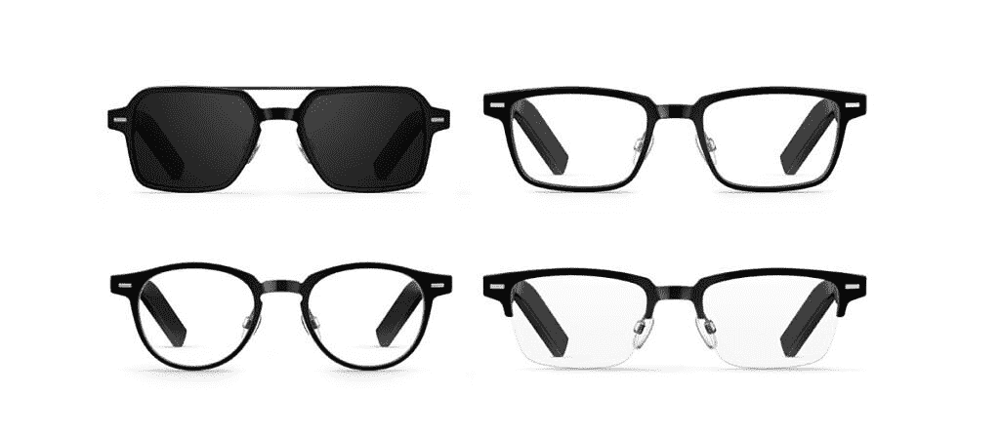

# 华为眼镜实践:轻量级音频眼镜，音质卓越

> 原文：<https://www.xda-developers.com/huawei-eyewear-hands-on/>

上周末，华为在柏林的 IFA 贸易展上推出了一系列华而不实的产品，包括一款配备巨大 6000 万像素自拍摄像头的中端手机，一款运行英特尔第 12 代英特尔处理器的新款旗舰笔记本电脑，以及可以通过腕带内的微型泵测量血压的[华为 Watch Fit D](https://www.xda-developers.com/huawei-announces-wearables-eu/) 。然而，有一款产品没有获得任何舞台或展台时间，那就是华为眼镜。这是一副“智能眼镜”，带有开放式音响系统和内置在手臂上的麦克风，因此佩戴者可以在佩戴眼镜的同时听音频或接电话，而无需访问他们的[智能手机](https://www.xda-developers.com/best-phones/)。

需要说明的是，这并不是华为第一次涉足这一领域。这家中国科技巨头已经与韩国眼镜品牌 Gentle Monster 合作了至少两个版本的智能太阳镜。然而，这双新鞋不再带有温和的怪兽印记。据一位华为代表称，“这款只是华为制造的。”眼镜没有在 IFA 展出的原因是，华为显然还没有决定这些产品是否会在全球推出。作为媒体人，我们没有得到任何关于它们的新闻信息——我和 Ben Sin 只是得到了一对未经宣布的测试。然而，快速的在线搜索显示，这些产品已经在日本和马来西亚出售，并在华为的国际英语网站上列出。本和我收到的测试模型是矩形半框眼镜，还有三种其他样式，如下所示。

 <picture></picture> 

The Huawei Eyewear comes in four styles: Aviator Full-Frame Sunglasses (upper left); Rectangle Full-Frame glasses (upper right); Rectangle Half-Frame; Circular Full-Frame glasses (bottom left); Rectangular Semi-Frame glasses (bottom right)

***关于这篇文章*** *:华为给我和 [Ben Sin](https://xda-developers.com/author/bensin) 都提供了一副华为的眼镜进行评测。该公司对这篇文章的内容没有任何意见。华为确实赞助了我和其他媒体人员参加 IFA 贸易展的旅行和住宿。这篇文章是我和本辛共同写的。*

华为以前的眼镜产品都有一个更大的外壳，同时也是眼镜的充电底座。这次不会，因为新的眼镜装在一个柔软的织物盒子里，还有一根充电线。

充电电缆在实践中有点笨重:这是一条母到母的电缆，一端接受 USB-C 输入，另一端分成两个 pogo 引脚插头，连接到手臂的末端。充满电后，眼镜可以播放大约五个小时的音频或打四个小时的电话，还有大约 16 个小时的待机时间。到目前为止，我只测试了这款眼镜半天，但听音乐一个小时只消耗了大约 23%的电池，所以这些数字似乎可以加起来。我发现电缆很容易断开，这使得给这些眼镜充电有时很困难，尤其是在插上电源后需要移动它们的时候。

眼镜重 38.8 克，镜片可以换成处方镜片。双臂都有触摸板，就在华为 logo 旁边。你可以点击或滑动它们来控制音频播放、音量、接听电话和语音助手。

这款眼镜在每只手臂上都有两个扬声器和一个麦克风，它们一起工作来产生音频，这对于开放式耳朵设计来说听起来非常好。音频质量当然不会击败任何知名的有线或无线耳塞，因为扬声器系统缺乏低音来提供额外的动力。然而，高音清脆，中音紧凑——本发现轻快的流行歌曲和 Ziggy Stardust 时代的大卫·鲍依透过眼镜播放得很好。麦克风用于减少通话时的风噪。华为的网站称，它设计了一种智能算法来减少噪音泄漏，以便佩戴者旁边的人更难听到音频。

我的同事 Ben Sin 说他只用了半天时间来测试这些，但前 XDA 撰稿人 TK Bay 证实，尽管坐在他旁边，他听不到眼镜发出的音频。本也试着接了个电话，对方说他在室内的时候她听得很清楚，但是在室外人群中，她和本很难听到对方说话。这只是这些露天音响系统的一个缺点，我们将不得不接受。当我和 XDA 电视台主持人 Alex Dobie 在室外测试时，他能够听到我在音频水平高于 75%时听的音乐。我还注意到，眼镜会在更大的音量下振动很多，尽管它不是非常明显。

在大多数情况下，当在安静的户外环境中戴着这些耳机时，比如周日早上的柏林，本说他能够很好地听到播客和音乐，即使他骑着电动自行车以相对较高的速度飞驰。然而，在一个更嘈杂的城市，也就是几乎全天的香港，他听不到太多的声音。我们都无法用长按手势触发谷歌助手，但这可能是一个稍后将被修复的错误，因为 Ben 说他可以用 2020 年发布的上一副华为眼镜访问谷歌助手和 Siri。

就功能而言，这些眼镜没有太多其他功能。AI Life 应用程序可以与它们配对，尽管我发现唯一有趣的功能是“问候”。这一功能将使眼镜能够全天与您通话，这可以是...奇怪。它解释了为什么当我戴上眼镜时，眼镜会用美国口音对我说“下午好”，但我并不真正理解该功能存在的原因。也许是为了帮你掌握时间？

这款眼镜还配备了三个传感器——加速度计、陀螺仪、电容传感器——允许眼镜自动打开或关闭，并在戴上或摘下时停止或开始音乐播放。以我的经验来看，我发现这个工作得相当好，当检测被放在我头上时，我惊讶于它的准确性。它们长时间佩戴也很舒服，我在听音乐的时候戴了很长时间，只是为了试试。我特别喜欢的是它们是如何打开的，因为你可以听到你周围的声音，同时还可以在一个(相对)私密的环境中听你的音乐。

如前所述，华为没有给媒体任何关于该产品的官方新闻信息，所以我们不知道这些产品何时或是否会在日本和马来西亚以外发布，我也没有官方定价。在马来西亚，谷歌搜索显示的正是我测试过的那双，零售价大约相当于 240 美元。如果这些在其他市场发布，我希望价格在这个范围内。需要澄清的是，这些不一定是类似于[联想眼镜 T1](https://www.xda-developers.com/lenovos-glasses-t1-announcement/) 的“智能眼镜”。它们只能播放音频，更像是耳机或无线耳机的一种新形式。