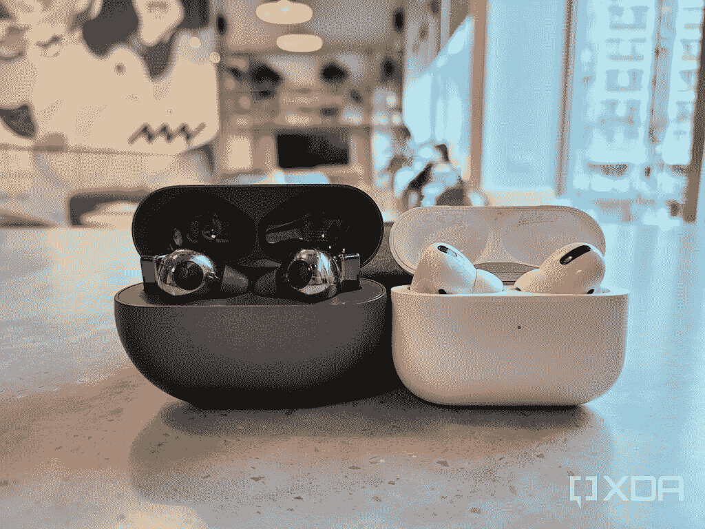
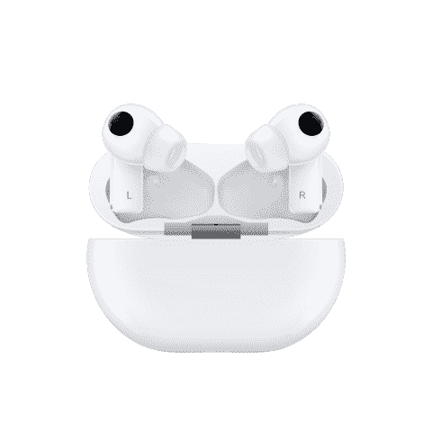

# 华为 FreeBuds Pro vs 苹果 AirPods Pro:两款最好的无线耳塞

> 原文：<https://www.xda-developers.com/huawei-freebuds-pro-vs-airpods/>

虽然华为的智能手机软件多年来一直时好时坏，但不可否认的是，它的智能手机硬件一直是一流的——可以说是业内最好的。在过去的几年里，作为该公司“1+8+N”计划的一部分，这家中国科技巨头一直专注于将同样的硬件实力带到其他消费产品中。这些产品之一是真正的无线耳机。华为之前发布过一些这样的产品，虽然它们是可靠的产品，但它们缺乏苹果 AirPods Pro 的时尚设计或全套智能功能，如噪音消除*和*主动透明模式——直到现在，华为 FreeBuds Pro 才推出。

华为两个月前在该公司的开发者大会上推出了这些耳机，它们无疑是华为有史以来最好的真正无线耳机。我在 XDA 的同事亚当·康威已经在一篇评论中表达了他对[的喜爱，但我想和 FreeBuds Pro 最明显的挑战者苹果的 AirPods Pro 做一个直接的比较。](https://www.xda-developers.com/huawei-freebuds-pro-review/)

## 华为 Freebuds Pro vs 苹果 AirPods Pro:规格对比

| 

规范

 | 

华为 FreeBuds Pro

 | 

苹果 AirPods Pro

 |
| --- | --- | --- |
| **尺寸&重量** | 

*   每个花蕾:26 毫米 x 29.6mm 毫米 x 21.7mm 毫米
*   每个花蕾:6.1 克
*   充电盒:70 毫米 x 51.3 毫米 x 21.7 毫米
*   充电箱:60 克

 | 

*   每个花蕾:24 毫米 x 30.9 x 21.8 毫米
*   每个花蕾:5.4 克
*   充电盒:60.6 毫米 x 45.2mm 毫米 x 21.7mm 毫米
*   充电盒:45.6 克

 |
| **芯片** |  |  |
| **电池&充电** | 

*   ANC 关闭时 7 小时
*   打开 ANC 4.5 小时
*   案件包含另外五项指控
*   USB-C 有线充电
*   Qi 无线充电

 | 

*   5 小时
*   案件包含另外六项指控
*   闪电有线充电
*   Qi 无线充电

 |
| **连通性** |  |  |
| **其他特性** | 

*   IPX5
*   “智能动态”主动噪声消除
*   透明模式
*   动态的

 | 

*   IPX4
*   主动噪声消除
*   透明模式
*   自适应情商

 |

## 设计:外观、合身和舒适

这对华为的设计团队来说可能有点不公平，但考虑到 AirPods Pro 首先上市，AirPods 本身在世界各地无处不在，很难将 FreeBuds Pro 描述为除 AirPods 之外的任何东西。充电盒形状相似，打开方式相同。华为的外壳略重、略高，但都非常便携，可以与钱包和钥匙一起放入我的裤子口袋，而不会产生难看的凸起。

 <picture></picture> 

Huawei FreeBuds Pro and Apple AirPods Pro

FreeBuds Pro 比市场上的大多数无线耳塞更粗、更方。这种设计让华为有更多的空间来放置传感器和驱动器，这些都是尖端、顶级的组件。就个人而言，我也喜欢这种更方正的外观(加上我的设备的深灰色)让耳塞看起来与苹果的 AirPods 截然不同。我并不喜欢来自[和其他手机品牌](https://www.xda-developers.com/oneplus-buds-review/)的真正无线耳塞，它们看起来像 AirPod 的克隆品。

我也喜欢两个茎都不太长的事实

两款耳塞都有硅胶耳塞头，旨在为佩戴者的耳道提供密封。这两种吸头都很容易取下，可以换成包装中包含的更小或更大的吸头。我发现 FreeBuds Pro 和 AirPods Pro 对我的耳朵来说都是舒适、安全的。我也喜欢两个茎都不太长的事实。相比非 pro 的普通 AirPods 或者华为的老款无线耳塞，这些在我的耳朵里要谨慎得多。事实上，如果你在我穿着它们的时候直视我，它们很难被注意到。你当然不能说小米或 Vivo 最近的其他无线耳塞。

 <picture></picture> 

I have the AirPods Pro on my left ear and FreeBuds Pro on my right ear.

## 控制

两个耳塞上的耳塞柄提供了压力激活的触摸控制。我喜欢这两种耳机都只需要一点点力——就好像我在按一个按钮——而不是像其他真正的无线耳塞一样只需要轻轻一点。仅仅轻轻敲击经常会导致意外或不必要的触摸，FreeBuds Pro 和 AirPods Pro 都被设计成不会将耳塞压到耳朵里——这是我从许多耳塞中看到的另一个问题。所以控制这两个耳塞需要有意识，这很好。

控制键也非常相似:FreeBuds Pro 和 AirPods Pro 都可以播放或暂停音乐，只需按一下任一手柄。按两下可向前跳过一首曲目，而按三下可倒回该曲目。按住可在噪声消除或透明模式之间循环。

然而，华为 one 通过滑动提供音量控制，超越了苹果——它们非常好用

然而，华为 one 通过滑动提供音量控制超越了苹果——它们非常好用。您不能在 AirPods Pro 上直接调节音量。

## 性能:音频质量、噪音消除、透明度

在音质方面，我的同事 Adam [在他的评论](https://www.xda-developers.com/huawei-freebuds-pro-review/)中宣称 FreeBuds Pro 是他测试过的最好的无线耳塞。我还没准备好走那么远——但我确实认为 FreeBuds Pro 是听起来最好的。对于我的音乐品味来说——很多 90 年代嘻哈(Nas，Dr Dre)，90 年代加州流行摇滚(Green Day，Blink 182)，经典摇滚(披头士，滚石，大卫·鲍依)——我通常觉得 AirPods Pro 更平衡一些，中频清脆，高音清晰。华为的 FreeBuds Pro 似乎更强调低端。

在我看来，FreeBuds Pro 的优势在于噪音消除和透明度

在我看来，FreeBuds Pro 的优势在于噪音消除和透明度。对我来说，这是一个重要的声明，因为 AirPods Pro 此前是我在这一类别中的最爱。虽然 FreeBuds Pro 和 AirPods Pro 都可以很好地消除典型的城市交通噪音，但 FreeBuds Pro 独树一帜的是它动态分析环境并相应调整噪音消除类型的能力。华为称之为“智能动态 ANC”，它确实有效。它可以隔离空调的低嗡嗡声或拥挤的咖啡店里大声说话的人。

相反，华为的智能算法也可以增强人类的声音，这对于透明模式很有用。我已经测试了十几个真正的无线耳塞，FreeBuds Pro 是唯一一个我可以在播放音乐的同时继续佩戴，并且仍然可以清晰地听到对方说话的耳塞。

AirPods Pro 的透明模式很好，但它不仅让所有的声音进来，还放大了噪音水平——所以在香港这样一个非常嘈杂的城市，在繁忙的地方打开透明模式几乎会伤害我的耳朵。

## 性能:电话呼叫、连接、延迟

两个耳塞的连接性都很强——在第一次设置后，它们会自动与我的手机配对，从那以后，它们很少会出现掉线的情况。公平地说，真正的无线耳塞通常会在广阔的开放空间中受到影响，因为没有建筑物或墙壁来反射无线信号。超高密度的香港离“广阔的开放空间”越远越好，所以两种耳塞都没有在这里进行太多的连接测试。在测试中，我把手机(作为参考，是一款 [Galaxy Z Fold 2](https://www.xda-developers.com/samsung-galaxy-z-fold-2-review/) )放在一个共同工作空间的一端，然后走到另一端——40 英尺远——两个耳塞都保持着稳定的连接。

对于电话，FreeBuds Pro 有三个麦克风，而 AirPods Pro 只有两个麦克风，虽然我不知道这是否真的有所不同，但我可以说 FreeBuds Pro 在语音通话中一直听起来更好。我在不同的条件下测试了十几次电话，电话的另一端是两个不同的人。每一次，他们都告诉我，我的声音在 FreeBuds Pro 上听起来更清晰，不那么低沉。

这两种耳塞在减少延迟方面做得非常好，几乎很难注意到。在过去的几个月里，我戴着两只耳塞观看了几十个小时的视频，我很少注意到声音与人的嘴唇不同步。

## 附加功能

无论是 FreeBuds Pro 还是 AirPods Pro，下雨时你都不必紧张，因为它们分别被评为 IPX5 和 IPX4。更强的评级确实意味着 FreeBuds Pro 可以承受比 AirPods Pro 更强的水花，但很难在现实世界的使用中找到例子——我想 FreeBuds Pro 在暴雨中幸存的几率更高？重点是这两个耳塞都不能带去游泳，但你可以在大雨中戴着它们。

FreeBuds Pro 在跨平台或跨品牌使用方面也更加灵活。华为的 buds 可以同时连接最多两台设备，不管是什么设备，都可以是索尼笔记本电脑和三星 Galaxy 手机，或者 iPhone 和 iPad。与此同时，AirPods Pro 只能连接两台 iOS 设备。此外，AirPods Pro 在一些三星设备上遇到了低音量问题，需要用户进入开发者选项并“禁用绝对音量”来解决。

## 电池寿命

作为一款华为产品，FreeBuds Pro 拥有令人瞠目结舌的续航能力并不奇怪。华为广告称，在一次充电的情况下，如果耳塞同时关闭透明和主动噪音消除功能，音频播放时间为 7 小时，而开启其中一项功能则为 5 小时。根据我的测试，这些数字是准确的。与此同时，AirPods Pro 一次充电可以运行大约五个小时。

这两种耳塞都可以无线充电或有线充电:FreeBuds Pro 采用 USB-C，而 AirPods Pro 采用 Lightning。

## 结论:两个无线音频发电站-但你必须付出代价

在过去的几年里，我测试了许多无线耳塞——特别是在 2020 年，当时似乎每个手机品牌都推出了一个——我可以自信地说，FreeBuds Pro 和 AirPods Pro 是拥有所有功能的两个最佳产品(然而，我确实对三星 Galaxy Buds Live 的独特形状和适合度情有独钟)。

但这也是附近最贵的两个。FreeBuds Pro 在€的零售价为 199 英镑(235 美元)，而 AirPods Pro 的售价为 249 美元。在 2020 年末，你可以找到不到 100 美元的功能强大的无线耳塞。售价 90 美元的 TicPods ANC 几乎提供了华为和苹果耳塞的所有功能，包括噪音消除和透明模式，只是它们的效果不太好，而且耳塞本身又长又粗。

如果你有钱花，并且你现在想要最好的无线音频技术，苹果和华为有两个最好的选择是有道理的。我认为 FreeBuds Pro 整体更好，因为它的电池寿命更长，透明模式更好，跨设备和平台的兼容性更好。但是，如果你完全沉浸在苹果的生态系统中，AirPods 带来了通过语音召唤 Siri 的能力(你不能用华为的 buds 触发任何数字助理)。

 <picture></picture> 

Huawei FreeBuds Pro

华为的 FreeBuds Pro 是该公司最近音频产品的一个重大改进，它甚至在许多关键领域击败了 AirPods Pro。

 <picture></picture> 

Apple AirPods Pro

##### 苹果 AirPods Pro

AirPods Pro 无处不在是有原因的——它们听起来很棒，如果你使用 iPhone、MacBook 和 iPad，AirPods Pro 将很好地融入生态系统。

###### 我们感谢华为赞助这篇文章。我们的赞助商帮助我们支付与运行 XDA 相关的许多费用，包括服务器成本、全职开发人员、新闻撰稿人等等。虽然您可能会在门户内容旁边看到赞助内容(这些内容将始终被标记为赞助内容),但门户团队对这些帖子不承担任何责任。赞助内容、广告和 XDA 仓库完全由一个独立的团队管理。XDA 绝不会通过接受金钱来赞扬一家公司，或以任何方式改变我们的观点或看法，从而损害其新闻诚信。我们的意见不能被收买。