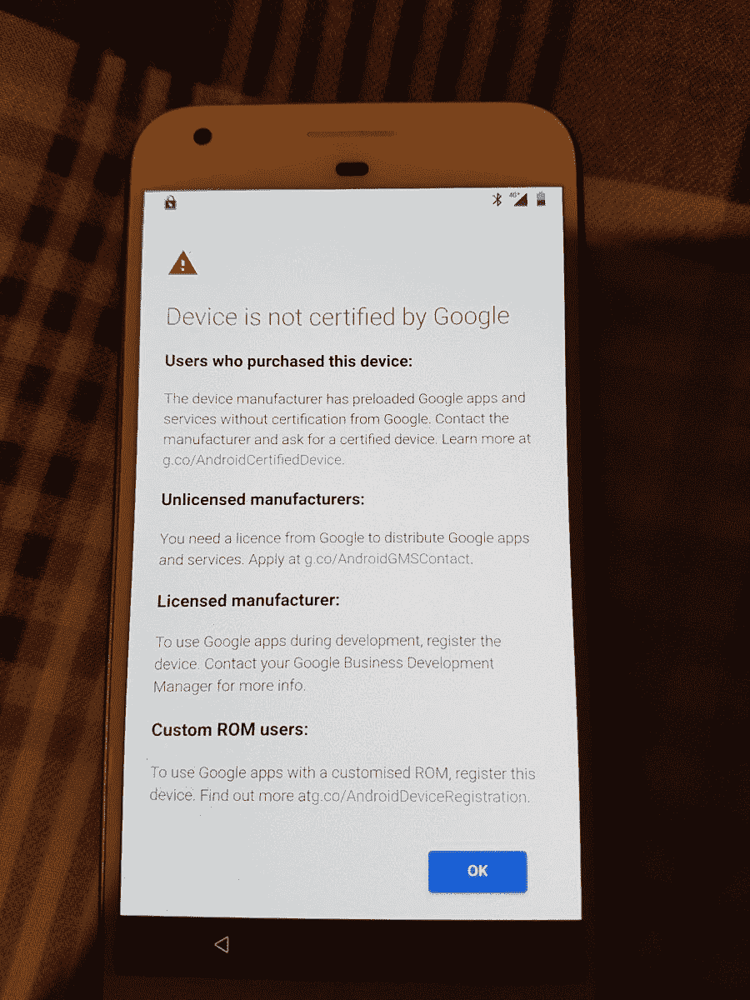

# 华为在华为 Mate 30 上安装谷歌应用面临的挑战

> 原文：<https://www.xda-developers.com/huawei-mate-30-google-play-store-challenges/>

明天，来自世界各地的记者将聚集在德国慕尼黑[的一个会场](https://www.xda-developers.com/huawei-mate-30-september-19th/)观看华为消费者业务集团首席执行官 Richard Yu 宣布他的公司最新的消费者产品。该公司预计将推出[两款可穿戴配件、](https://www.xda-developers.com/huawei-watch-gt-2-huawei-band-4-huawei-tv-harmony-os-mate-30-event)一台电视、[四款智能手机](https://www.xda-developers.com/huawei-mate-30-pro-porsche-design-lite-leak-renders/)。焦点将主要集中在新的华为 Mate 30 系列智能手机上，谷歌[证实该系列智能手机不能与 Google Play 应用和服务一起销售](https://www.xda-developers.com/huawei-mate-30-without-google-play-apps-services/)。没有谷歌的应用套件，新的华为手机在欧洲、印度和其他市场将会很艰难。但 Richard Yu [在 2019 年 IFA 上暗示](https://www.androidauthority.com/huawei-mate-30-install-google-1026829/)该公司有一个变通办法，允许用户在 Mate 30 上安装谷歌应用程序，并指出这一过程对用户来说“相当容易”。我们对在 XDA 下载 Google Play 应用和服务并不陌生，但鉴于华为的独特情况，我们认为可能值得探索该公司有哪些选择，以及它们是否真的可以为用户提供下载谷歌应用套件的方式。

## MADA、GMS 和 Android 认证

为了在 Android 设备上预装谷歌移动服务(GMS)，即 Play Store 和 Play Services 等谷歌应用和服务的集合，设备制造商必须签署移动应用分发协议(MADA)才能成为[授权的 Android 合作伙伴](https://www.android.com/certified/partners/)。然后，设备制造商必须构建满足所有要求的软件，以被视为与 [Android 兼容](https://source.android.com/compatibility/)，包括但不限于遵循[兼容性定义文件](https://source.android.com/compatibility/cdd) (CDD)中规定的规则，并通过[兼容性测试套件](https://source.android.com/compatibility/cts) (CTS)。[根据谷歌](https://arxiv.org/pdf/1904.05572.pdf)，“使用 Android 作为商标名称来宣传其与 Android 应用程序兼容性的设备需要通过兼容性测试套件(CTS)。”最后，该软件必须通过谷歌测试套件(GTS)才能被视为与谷歌移动服务兼容。

我们查看了提供给设备制造商的“地理可用性图表”的副本，这些设备制造商签署了在欧洲经济区(EEA)的 31 个国家分发 GMS 应用程序的 MADA。该图表的日期是 2018 年 10 月，因此它可能没有反映出谷歌为在欧洲经济区分发 GMS 应用程序的合作伙伴制定的最新要求。不过，我们可以大致了解一下欧洲要求发布哪些谷歌应用。

“地理可用性图表”根据重要性区分了 Google apps:

*   **普通 GMS 应用**:普通 Android 设备必须附带的核心应用。
*   **Go GMS 应用**:Android(Go 版)设备必须搭载的核心应用。
*   **核心服务**:所有设备都必须附带的 GMS 软件组件。这些被其他 Google 应用程序使用，不会在启动器中显示给用户。
*   **可选 GMS 应用**:设备制造商可以选择预装的其他 GMS 应用。

对于欧洲经济区，以下 GMS 应用程序被视为“常规 GMS 应用程序”

*   谷歌应用*
*   谷歌浏览器*
*   谷歌邮箱
*   谷歌地图
*   油管（国外视频网站）
*   谷歌 Play 商店
*   Google Drive
*   Google Play 音乐
*   Google Play 电影
*   谷歌二重奏
*   Google 相册

*继欧盟委员会因违反反垄断法对€处以 43.4 亿美元的罚款后，谷歌现在要求设备制造商签署一份额外的许可，以便在欧洲经济区销售谷歌应用程序和谷歌浏览器。

“核心服务”包括系统应用和库，如 GMSCore(也称为 Google Play 服务)、Google Services Framework、ConfigUpdater、AndroidPlatformServices、GoogleBackupTransport、Widevine DRM 等。“可选的 GMS 应用程序”包括谷歌应用程序，如谷歌日历、谷歌 Keep、谷歌翻译、信息、谷歌手机等等。Google Pay 是一个可选的 GMS 应用程序，如果它已经在该国推出，合作伙伴可以分发该应用程序。例如，在分发这张“地理可用性图表”时，Google Pay 尚未在法国推出，因此 Google 警告称，Pay“不得”在该国发售或用于任何营销活动。

由于华为无法与谷歌签署新的 MADA，华为 Mate 30、华为 Mate 30 Pro 和华为 Mate 30 Lite 将不允许附带任何 GMS 应用程序的完整版本，包括核心服务。那么华为和用户可以做些什么来解决这一限制呢？

* * *

## 侧装 Google Play 应用和服务

即使设备制造商没有从谷歌获得在任何给定设备上发布 GMS 应用程序和组件的认证，用户仍有可能手动下载这些应用程序和组件。

**场景 1**

了解核心服务，如谷歌 Play 商店和 Google Play 服务非常强大，通常拥有不能授予标准用户应用程序的权限。因此，这并不像从网上下载一个 APK 文件(Android 应用程序的容器)然后安装它那么简单。这些应用程序*必须*安装为具有特权许可的[系统应用程序。](https://source.android.com/devices/tech/config/perms-whitelist)

一些设备制造商，如华为本身、华为的子品牌 Honor、小米和其他公司，预装了我喜欢称之为所需应用程序的“存根”版本。他们还提前将这些应用程序列入白名单，并授予必要的特权权限。这些“存根”apk 基本上是休眠版本，只是等待更新；这里的技巧是，虽然*你*不能只插入谷歌 Play 商店并作为系统应用程序播放服务，但你可以*在这些“存根”apk 上安装一个“更新”*来激活它们，并将其转换为完整版本。用户可以从第三方平台如 [*APKMirror*](https://www.apkmirror.com/) 下载谷歌 Play 商店、Google Play 服务和其他谷歌应用的最新完整版本。

*Honor Magic 2 是由华为子品牌 Honor 制造的设备，仅在中国市场型号中可用，因此不与谷歌 Play 商店一起发货。然而，正如华为的亚马逊列表中所提到的，你可以毫无问题地下载 Google Play 应用。这是因为，如 Honor Magic 2 固件转储左侧的截图所示，必要的“核心服务”已经预装。此外，如右边的屏幕截图所示，核心服务应用程序已被授予必要的操作权限。*

据我所知，华为、Honor 和小米对他们在中国独家销售的手机采取了这种做法，因为他们的 Android 许可协议要求他们为他们在国际市场销售的手机预装完整的 Google Play 应用程序和服务。我怀疑华为、Honor 和小米这样做是因为他们知道他们的中国市场设备经常出口到其他国家。

**场景二**

为了构建场景 1，设备制造商可能会在自己的应用商店中提供 Google Play 应用和服务的下载器。例如，中国设备制造商魅族[就采取了这种方式](http://forum.flymeos.com/thread-17454-1-1.html)。在过去的几天里，我看到了关于“[谷歌服务助手](https://community.hihonor.com/fi/topic/6869/detail.htm)”应用程序的讨论，经检查，该应用程序似乎使用华为企业 API 来安装 Google Play 应用程序和服务。用户已经在像 [Honor 9X 和 Honor 9X Pro](https://www.xda-developers.com/honor-9x-pro-announced-kirin-810/) 这样的设备上使用了这款应用，这两款设备目前都只在中国销售。我不知道 Honor 是否批准使用这个应用程序，所以我们联系了 Honor 的联系人进行确认。这款应用目前在华为 AppGallery 上不可用，不管它值不值得。

**场景 3**

如果设备制造商没有在他们的软件中预装“存根”apk，那么用户可以启动和运行谷歌 Play 商店和 Google Play 服务的唯一方法就是手动安装这些应用程序，并授予他们所请求的特权权限。如果不在被称为“寻根”的过程中修改设备上的软件，就无法做到这一点 Root 访问权限授予用户修改他们通常不被允许访问的文件的能力。可以把它想象成 Windows 上的“管理员”帐户。通过 root 访问，用户可以使用来自 [Open GApps 项目](https://opengapps.org/)的社区成员制作的预打包容器轻松安装 Google Play 应用和服务。

*OpenGapps 提供了你需要的所有 GMS 应用的一个漂亮的、高度压缩的包。上面显示的是“pico”包，它只包含必要的核心服务。*

然而,“扎根”你的设备并不是没有缺点的。获得 root 访问权限的过程是特定于设备的，对于普通用户来说，有时可能太难执行。获得 root 访问权限还需要设备制造商提供“解锁引导加载程序”的方法，或者禁用获得 root 访问权限所需的引导级保护，设备制造商可能允许也可能不允许。例如，华为[不允许这种做法](https://www.xda-developers.com/huawei-stop-providing-bootloader-unlock-codes/)。最后，如果用户解锁引导程序，许多设备制造商会取消保修，尽管这种做法在消费者保护法更宽松的国家可能不成立。

我们刚刚谈到的一切都只涉及安装谷歌 Play 商店和 Google Play 服务。实际上还有*运行*这些应用的步骤，这可能不像点击启动器中的应用图标那么简单。

* * *

## 谷歌对未认证设备的打击

2018 年 3 月，谷歌开始向一些设备没有通过谷歌认证的用户显示“[设备没有通过谷歌](https://www.xda-developers.com/google-blocks-gapps-uncertified-devices-custom-rom-whitelist/)认证”的消息。该消息警告用户，设备制造商“未经谷歌认证就预装了谷歌应用和服务”，并警告设备制造商“需要谷歌的许可才能分发应用和服务。”在此消息得到处理之前，您不能使用任何 Google apps。用户可以绕过这条消息的唯一方法是[手动向谷歌](https://www.xda-developers.com/how-to-fix-device-not-certified-by-google-error/)注册他们的设备，但这只能由运行“定制 ROM”(售后软件)的用户使用。

 <picture></picture> 

Photo by XDA Senior Member [liam_davenport](https://forum.xda-developers.com/member.php?u=5823687)

谷歌不关心定制 ROM 社区中的个人用户是否安装了 Google Play 应用和服务，这就是为什么谷歌这么长时间以来对 GApps 包的分发视而不见，尽管他们完全有权利关闭它。另一方面，谷歌*确实*关心未经许可的制造商是否在分发他们的应用，因此他们去年开始显示这一警告。

在我们发表了我们的文章之后，魅族的一位代表联系了我们，询问他们是否可以重新发布我关于此事的解决方法教程，因此似乎这个警告已经击中了许多在中国销售的设备。我不知道这个警告截至今天有多广泛，但我个人上一次遇到这个警告是在一个 Pixel 3 XL 上闪现一个[泄露的 Android 10 系统映像](https://www.xda-developers.com/android-q-dark-theme-desktop-mode-permission-revamp/)时。

*如果谷歌没有将华为设备列入警告白名单，那么用户将不得不按照该页面上的说明使用 Google Play 应用和服务。*

如果你在目前在中国销售的华为、Honor 和小米设备上下载场景 1 或 2 中概述的 Google Play 应用和服务，你可能不会看到这条消息。原因是，即使这些中国市场的手机不需要满足谷歌的 Android 认证要求，但这些设备制造商*无论如何都满足要求**。遵守 CDD 并通过 CTS 已经是他们工程师工作流程的一部分，这些公司已经遵循谷歌对他们大多数其他设备的要求。我已经在 [Honor Magic 2](https://forum.xda-developers.com/magic-2) 、 [Honor Note 8](https://forum.xda-developers.com/honor-note-8) 、 [Honor Note 10](https://forum.xda-developers.com/note-10) 和腾讯[华硕 ROG Phone II](https://forum.xda-developers.com/rog-phone-2) 上下载了 Google Play 应用和服务，没有出现任何问题。*

 **Honor Magic 2 通过了 CTS，尽管它从未在中国以外的地区推出，也没有附带 GMS 应用程序。不过，由于华为在亚马逊上销售这款手机，他们知道进口商会希望获得 Google Play 应用和服务。*

* * *

## **华为 Mate 30 的问题**

*免责声明:我不知道华为是否与谷歌达成了任何协议，所以我提出以下我自己对可能发生的事情的分析。*

因为美国的贸易禁令限制谷歌将安卓授权给华为的新产品，如华为 Mate 30 系列，华为 Mate 30 不能搭载谷歌移动服务。华为*可能*能够预装“存根”apk 以方便侧装，但他们实际上无法在自己的应用商店(即[华为 AppGallery](https://www.xda-developers.com/huawei-request-developers-publish-appgallery/) )上托管完整的 GMS 应用。)正如来自 *ArsTechnica* 的 [Ron Amadeo 所指出的，美国公司制作的应用也受到美国禁令的限制，因此谷歌不能在华为 AppGallery 上分发自己的应用。华为*可能*能够为 GMS 应用程序托管一个安装程序——同样，我们已经接触荣誉，看看“谷歌服务助手”应用程序是否是他们正式推荐的——但我不确定如果安装程序是由华为制作的，这种情况会持续下去。](https://arstechnica.com/gadgets/2019/05/huaweis-us-ban-a-look-at-the-hardware-and-software-supply-problems/)

即便如此，在华为 Mate 30 和华为和 Honor 的其他新设备上侧装 GMS 应用程序可能会触发“设备未经谷歌认证”的错误消息出现。对于普通用户来说，克服这一信息将是一个重大的进入障碍，我很好奇华为将如何处理这一问题。从现在起大约 24 小时后，当华为 Mate 30 系列在德国慕尼黑正式亮相时，我们就会知道了。你可以在这里观看活动[的直播，活动将于 CEST 时间下午 2 点/美国东部时间上午 8 点开始。我怀疑华为不会让 Mate 30 系列立即在欧洲上市，事实上，](https://consumer.huawei.com/en/campaign/mate30/?utm_medium=fsm&utm_source=facebook&utm_campaign=mate30_global_teaser)[*LetsGoDigital*](https://nl.letsgodigital.org/smartphones/huawei-mate-30-modellen/)正在报道这一点。尽管如此，华为最终可能会披露他们与谷歌秘密达成的协议，让我们大吃一惊。

[**华为 Mate 30 论坛**](https://forum.xda-developers.com/mate-30) ||| [**华为 Mate 30 Pro 论坛**](https://forum.xda-developers.com/mate-30-pro) ||| [**华为 Mate 30 Lite 论坛**](https://forum.xda-developers.com/mate-30-lite)

* * *

*特色图片致谢:埃文·布拉斯(@ [evleaks](https://twitter.com/evleaks) )**