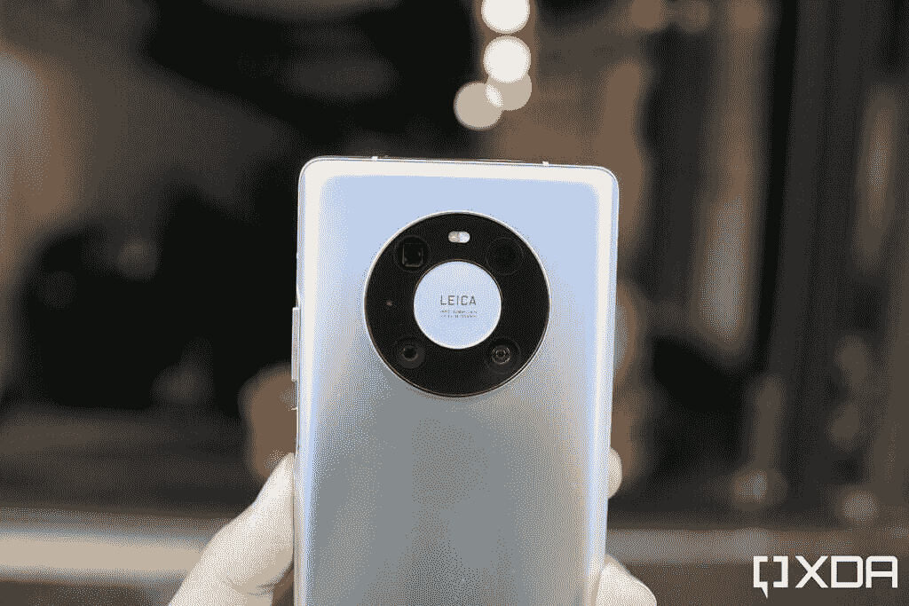

# 华为 Mate 40 Pro 手动操作:另一个弱光和变焦发电站

> 原文：<https://www.xda-developers.com/huawei-mate-40-pro-hands-on-preview/>

华为 Mate 40 Pro 可以说是今年最有趣的智能手机发布会，因为它可能是最后一款使用麒麟芯片的华为手机，因为美国正在进行的制裁阻止了世界上大多数芯片制造商，包括华为的长期合作伙伴 TSMC，为华为提供硅。

但即使没有美国的审查，华为 Mate 40 Pro 仍然会是今年最有趣的发布会之一。自 2018 年华为 P20 Pro 以来，每一款华为旗舰都带来了相机硬件的突破，无论是在谷歌和苹果之前可以在黑暗中看到的 [RYYB 传感器](https://www.xda-developers.com/huawei-p30-pro-camera-review/)，真正的 10 倍无损光学变焦镜头[，还是计算型](https://www.xda-developers.com/huawei-p40-pro-plus-outside-china-pre-order/)[夜间模式摄影](https://www.xda-developers.com/huawei-p20-pro-review/)。

我已经对华为 Mate 40 Pro 的一个预生产单元进行了大约一天半的测试。以下是我的第一印象。

## 华为 Mate 40 Pro:规格

| 

规格

 | 

华为 Mate 40 Pro

 |
| --- | --- |
| **尺寸&重量** | 

*   162.9 x 75.5 x 9.1mm 毫米
*   212 克

 |
| **显示** | 

*   6.76 英寸柔性有机发光二极管
*   2772 x 1344 分辨率
*   456ppi
*   90Hz 刷新率

 |
| **SoC** | 

*   海思麒麟 9000
    *   1x ARM Cortex A-77 @ 3.13GHz
    *   3 个 ARM Cortex A-77 @2.54GHz
    *   4x ARM Cortex A-55 @2.04GHz
*   5 纳米 TSMC 工艺
*   ARM Mali-G78MP24 GPU

 |
| **闸板&存放** | 

*   8GB 内存
*   256GB UFS 3.1 存储空间
*   华为专有的 NM 卡扩展槽

 |
| **电池&充电** | 

*   4，400 毫安时双芯电池
*   66W 超级充电有线快充
*   50W 无线快速充电
*   反向无线充电

 |
| **安全** | 

*   3D 人脸解锁
*   显示指纹扫描仪

 |
| **后置摄像头** | 

*   50MP f/1.9，RYYB 主摄像头，带 OIS
*   20MP f/1.8，广角摄像头
*   12MP f/3.4，5 倍潜望镜长焦相机
*   激光传感器

 |
| **前置摄像头** | 

*   1300 万像素 f/2.4 广角摄像头
*   三维 ToF 传感器

 |
| **端口** | USB 3.1 类端口 |
| **音频** | 双立体声扬声器 |
| **连通性** | 

*   5G
*   蓝牙 5.2
*   无线网络 6
*   国家足球联盟

 |

## 设计:既定外观的演变

华为 Mate 40 Pro 延续了 Mate 20 系列建立的设计美学:中央放置的摄像头模块，具有 2x2 摄像头布局，曲面屏幕和真正的 3D 人脸扫描——这在 Android 领域很少见。谢天谢地，Mate 30 棱角分明、不好看的缺口不见了。取而代之的是一个打孔的切口，里面有一个自拍相机，一个 TOF 传感器和一个红外相机，类似于我们在 P40 系列中看到的。

“瀑布”弯曲显示屏首次出现在去年的 Mate 30 Pro 上，这意味着屏幕两侧以更大的 88 度角倾斜，并在手机两侧进一步弯曲。去年，科技领域的许多人批评了这种设计(主要是通过查看产品照片)，但那些实际评估 Mate 30 Pro 的人报告说，所有人都没有错误触摸问题。这里也可以这么说——即使我的手掌在整个侧面摩擦，也不会妨碍滚动或敲击。6.67 英寸的 OLED 面板“仅仅”是 90 赫兹，所以它在技术上比竞争对手的 120 赫兹慢，但在我看来动画看起来非常流畅。我认为一加 8T 的动画更加流畅，但我不认为很多人会看着这个 90Hz 的面板抱怨。

华为 Mate 40 Pro 的背面是玻璃，覆盖着这种触感柔软的哑光涂层，可以很好地抵御指纹。我的单元有这种银色，根据光线照射到背面的方式微妙地改变阴影。从去年的 Mate 30 系列中删除的音量摇杆又回来了，但它比平时更靠近后边缘，因为瀑布显示曲线明显。然而，双击屏幕侧边来触发屏幕上的音量控制技巧仍然存在。

## 麒麟 9000 系统芯片:5 纳米和 5G

华为 Mate 40 Pro 配备了海思麒麟 9000，这是一款 5 纳米芯片，内置 5G 调制解调器。这是一个令人印象深刻的工程壮举，因为即使是苹果的 5 纳米 A14 仿生也需要一个单独的 5G 无线电。

因为这部手机正在运行预生产软件，我无法安装许多基准应用程序，如 Geekbench 5、PCMark 和 GFX Bench。不过，我确实成功安装了 3D Mark，并且在基准测试图形性能的“狂野人生”测试中，麒麟 9000 以 6505 比 3723 的成绩击败了在 Galaxy S20 FE 中运行的骁龙 865。Mate 40 Pro 的得分是华为 P40 Pro 上麒麟 990 的大约 2 倍，是 ROG 手机 3 中骁龙 865+的大约 1.5 倍。现在下结论还为时过早，但就 GPU 性能的改善而言，麒麟 9000 展示了巨大的潜力。在不久的将来，我们将进行更多的基准测试。

*华为 Mate 40 Pro 配麒麟 9000 vs 三星 Galaxy S20 FE 配骁龙 865*

我在香港测试了 5G，在 Ookla 应用程序的速度测试中，数据速度与 iPhone 12 的速度非常接近。

## 相机:另一个变焦和微光猛兽

无论你是否喜欢 Mate 系列位于中央的摄像头模块的外观，你都不能否认它是相当独特的，从市场上外观相似的摄像头模块中脱颖而出。今年的设计被称为“太空环”，包含一个 50MP，f/1.9，RYYB 主相机和一个 12MP，f/3.4 潜望镜变焦镜头。这两个传感器似乎与今年早些时候 P40 Pro 中使用的传感器完全相同。另外两个摄像头由一个 3D ToF 传感器和一个 20MP 超广角摄像头组成。

 <picture></picture> 

The Mate 40 Pro module houses a 50MP main camera (bottom left), 20MP ultra-wide angle camera (bottom right), a 12MP Periscope zoom lens (upper left), and a 3D ToF sensor (upper right).

后一种相机——超宽——很有趣。它仍然是一个 18 毫米的镜头(这意味着视野是 100 度，与其他手机的超宽传感器相比相对较窄)，但像素数量比 Mate 30 Pro 和 P40 Pro 中使用的 40MP 镜头减少了一半。在我写这篇文章的时候，华为还没有发布规格表或早期信息，所以我不知道为什么会发生这种变化，但我可以说超宽相机仍然是移动领域中最清晰的(但取景有点太紧)，甚至在极端弱光条件下也表现得更好。参见下面的超宽样品。Mate 40 Pro 的超宽镜头更清晰，在晚上，它们比 iPhone 12 的超宽镜头表现出更少的噪音。

*超广:华为 Mate 40 Pro vs iPhone 12*

在下面的一组中，我用华为 Mate 40 Pro 和苹果 iPhone 12 Pro 拍摄了超宽、1 倍和 10 倍变焦的照片，在我看来，华为赢得了超宽和 10 倍变焦，但 1 倍变焦输给了苹果的新射手。

*超宽，1x，10x:华为 Mate 40 Pro vs iPhone 12*

在夜间摄影中，我喜欢 Mate 40 Pro 的对比氛围。例如，下图中的霓虹灯看起来比 iPhone 12 的照片干净得多。

*夜拍:华为 Mate 40 Pro vs iPhone 12*

华为今年在其前置摄像头中添加了一个类似的超宽摄像头，使其拥有 100 度的视野。在大多数情况下，华为 Mate 40 Pro 上的自拍看起来很棒。在下面的一组照片中，Mate 40 Pro 的自拍相机拥有最宽的视野，是 iPhone 12 的全自然外观和三星过度美化的皮肤光滑美学之间的一个令人满意的中间点。请注意，Mate 40 Pro 的照片是唯一一张没有完全遮住我身后天空的照片——你实际上可以看到一些云彩。

*自拍:华为 Mate 40 Pro vs iPhone 12 vs 三星 Galaxy S20 FE*

## 软件—您已经知道问题在哪里

华为 Mate 40 Pro 在 Android 10 上运行 [EMUI 11](https://www.xda-developers.com/emui-11-huawei-honor-android-update-hands-on/) 。我还没有时间深入了解这款软件，但我的初步印象是，它的用户界面与以前的华为手机基本相同，最显著的变化是以滑动菜单的形式改善了多任务处理，允许用户在浮动窗口中启动应用程序。

还有一个新的永远在线显示屏，只有当你把头转向屏幕时，它才会智能地打开。它像魔法一样起作用——每当我把头斜向手机屏幕时，AOD 就会亮起。在写这篇文章的时候，华为还没有解释它到底是如何做到这一点的，但我假设它正在使用 3D 面部扫描系统来检测头部运动，也许？

但当然，房间里的大象:华为 Mate 40 Pro 没有搭载谷歌的移动服务核心，如果没有某种黑客或非官方的方法，它们无法安装。我已经使用了最后两款非 GMS 华为设备，所以我已经非常熟悉哪些应用程序我可以使用，哪些不能使用:YouTube、Drive、Docs、Keep 等关键谷歌服务都不行。但是谷歌地图和 Chrome 可以用。其他广泛使用的应用程序(对我来说)如 WhatsApp、Instagram、Twitter 都可以使用。

## 目前为止的想法

正如过去四五款华为旗舰一样，华为 Mate 40 Pro 拥有绝对顶级的硬件——可以说是 Android 中最好的。但是软件问题需要全世界许多人在使用习惯上做出妥协。在接下来的几天里，我将彻底测试这款手机，请关注更多报道。

**华为 Mate 40 Pro 论坛 **