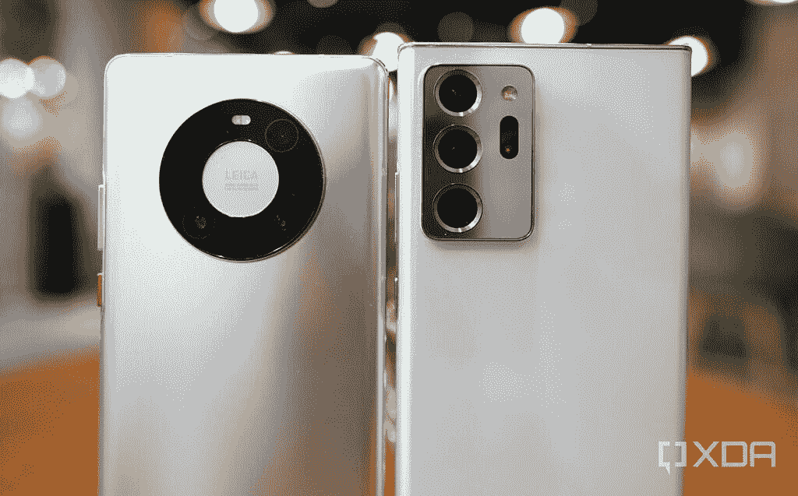
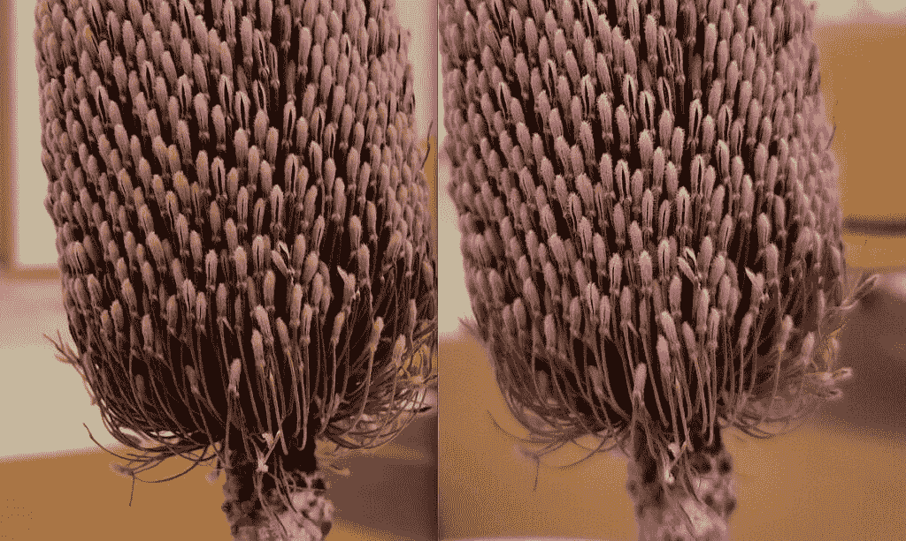

# Mate 40 Pro vs Galaxy Note 20 Ultra 相机枪战:硬件过度杀伤

> 原文：<https://www.xda-developers.com/huawei-mate-40-pro-vs-samsung-galaxy-note-20-ultra-camera-shootout/>

[谷歌 Pixel 5](https://www.xda-developers.com/google-pixel-5-review/) 可能仍然是标准指向和拍摄镜头的整体最佳相机， [iPhone 12](https://www.xda-developers.com/apple-iphone-12-review/) 的视频性能也是无与伦比的，但能够*做最多*的两个最有能力的相机系统仍然是[三星 Galaxy Note 20 Ultra](https://www.xda-developers.com/samsung-galaxy-note-20-ultra-review-exynos/) 和[华为 Mate 40 Pro。](https://www.xda-developers.com/huawei-mate-40-pro-hands-on-preview/)

这是因为韩国和中国的科技巨头不仅仅依赖于谷歌这样的软件计算摄影(在较小程度上也依赖于苹果)。相反，三星和华为仍然相信硬件实力的价值——更多像素和更大的传感器与软件一起发挥着非常重要的作用。这两款设备的数码成像方式相似:都有一个巨大的传感器和一个潜望镜变焦镜头。它们的不同之处在于超广角摄像系统。但是哪个系统更有能力呢？是时候来一场经典的相机枪战了。

## 华为 Mate 40 Pro vs 三星 Galaxy Note 20 Ultra:规格对比

| 

规范

 | 

华为 Mate 40 Pro

 | 

三星 Galaxy Note 20 Ultra

 |
| --- | --- | --- |
| **构建** | 

*   铝制中框
*   玻璃正面和玻璃或皮革背面

 | 

*   铝制中框
*   玻璃正面和背面

 |
| **尺寸&重量** | 

*   162.9 x 75.5 x 9.1 毫米
*   212 克

 | 

*   164.8 x 77.2 x 8.1 毫米
*   208 克

 |
| **显示** | 

*   6.76 英寸有机发光二极管显示屏
*   1344 x 2772 分辨率
*   90Hz 刷新率

 | 

*   6.9 英寸有机发光二极管显示屏
*   1440 x 3088 分辨率
*   高达 120Hz 的刷新率

 |
| **SoC** |  | 

*   骁龙 865+或 Exynos 990

 |
| **存储选项** |  | 

*   128GB
*   256GB
*   512GB
*   UFS 3.1

 |
| **电池&充电** | 

*   4，400 毫安时电池
*   66W 有线充电
*   50W Qi 无线充电

 | 

*   4，500 毫安时电池
*   25W 有线充电
*   15W 无线充电

 |
| **安全** | 

*   3D 人脸解锁
*   显示指纹扫描仪

 | 

*   显示指纹扫描仪

 |
| **后置摄像头** | 

*   **主** 50MP f/1.9，RYYB 主摄像头带 OIS
*   **二级** 20MP f/1.8，广角相机
*   **第三:** 12MP f/3.4，5x 潜望镜长焦相机
*   激光传感器

 | 

*   **主要:** 108MP，f/1.8，PDAF，激光自动对焦，OIS，1/33”传感器
*   **次要:** 12MP，f/2.2，超广角，120 FoV
*   **第三:** 12MP，f/3.0，5 倍潜望镜变焦
*   激光传感器

 |
| **前置摄像头** | 

*   1300 万像素 f/2.4 广角摄像头
*   三维 ToF 传感器

 |  |
| **端口** | USB-C | USB-C |
| **连通性** | 

*   5G:低于 6GHz
*   支持 2x2 MIMO 的 wi-Fi 6(802.11 ax)
*   蓝牙 5.2

 | 

*   5G:低于 6GHz
*   超宽带
*   wi-Fi 5(802.11 AC)
*   蓝牙 5.0

 |
| **软件** | 安卓 10 | 安卓 11 |
| **其他特征** |  |  |

## 华为 Mate 40 Pro vs 三星 Galaxy Note 20 Ultra:相机硬件和设计

华为 Mate 40 Pro 和三星 Galaxy Note 20 Ultra 都提供了一个更精致、更完美的新相机系统版本，这是两家公司在今年春天分别与华为 P40 和三星 Galaxy S20 系列一起推出的。对于华为来说，这包括一个 50MP 主摄像头，配有 1/1.28 英寸传感器(智能手机领域最大的传感器)，以及一个 RYYB 亚像素布局，允许传感器接收额外的光线信息。对于三星来说，主镜头是三星 Galaxy S20 Ultra 中首次出现的 108MP 传感器，带有 1/1.28 英寸图像传感器(适用于智能手机中的第二大传感器)。

 <picture></picture> 

The camera modules of the Mate 40 Pro and Note 20 Ultra.

两款设备上的潜望镜变焦镜头技术相似，都是 12MP，光学变焦范围是 5 倍，数码变焦能力高达 50 倍。如前所述，他们的视觉分歧在于超宽传感器。对于华为来说，Mate 40 Pro 配备了 200 万像素的“电影镜头”，它重视图像清晰度和自动对焦能力，而不是真正的广角(视野仅略超过 100 度)。与此同时，三星的 Galaxy Note 20 Ultra 拥有约 120 度的最宽 FoV，但它是一个固定焦距镜头。

Mate 40 Pro 和 Galaxy Note 20 Ultra 都提供了一种精致、抛光的相机设置

有趣的是，两家公司都放弃了华为 P40 Pro 和三星 Galaxy S20 Ultra 中的第四个 ToF 摄像头设置。相反，这已经被激光自动对焦取代，以进一步提高主摄像头的对焦速度。这是 Galaxy Note 20 Ultra 非常需要的，因为 Galaxy S20 Ultra 遭受了聚焦问题。

就外观而言，我认为两种设计都很棒。华为的圆环布局更为独特，因为它不同于市场上矩形相机模块的海洋，但三星的模块看起来非常引人注目，尤其是在我测试的这个白色和银色变体中。值得注意的是，华为的模块没有 Galaxy Note 20 Ultra 的笨重模块突出得多。

在正面周围，Mate 40 Pro 有一个相对较大的打孔切口，而 Galaxy Note 20 Ultra 的切口是一个微小的点。从美学角度来看，三星在这方面明显胜出，但华为更大的切口有一个真正的目的:它包括一个 3D 面部扫描系统，理论上应该比三星的 2D 面部解锁更安全(如果你选择打开它)。华为的自拍相机在 100 度时具有更宽的 FoV，这使得它成为一款优秀的自拍相机，用于团体拍摄或 vlogs，而不会有太多的运动(镜头没有 OIS)。

## 相机测试 1:主相机，白天拍摄

在第一次测试中，我们看的是白天主摄像头拍摄的照片。这两款相机都具有出色的动态范围和图像清晰度。

*华为 Mate 40 Pro(左)和萨斯蒙 Galaxy Note 20 Ultra(右)*

我首先注意到的一件事是，华为的相机比三星的相机更倾向于上调对比度，并展示出更宽的动态范围。阴影区域更暗，黄色更突出(这可能也是由于 RYYB 传感器)。例如，在第三组黄色长凳中，Mate 40 Pro 的颜色看起来过于黄色，最后一组以摩天大楼为特色的照片也是如此。

 <picture></picture> 

Huawei Mate 40 Pro sample (left) and Galaxy Note 20 Ultra (right)

然而，在同一组中，如果你放大到 100%，Mate 40 Pro 的镜头明显更清晰。

 <picture></picture> 

Mate 40 Pro (left) and Galaxy Note 20 Ultra (right)

如前所述，S20 Ultra 的主 108MP 镜头由于其较窄的焦平面而存在对焦问题，虽然 Galaxy Note 20 Ultra 由于激光自动对焦而大大改善了这个问题，但我仍然注意到，如果我近距离拍摄物体，边缘仍然倾向于细节柔和，有时会失焦，就像下面的例子一样。

在第二组中，可以清楚地看到 Note 20 Ultra 失去焦点的地方。在第一组中，很难判断——直到你放大看植物的底部。

 <picture></picture> 

Mate 40 Pro (left), Galaxy Note 20 Ultra (right).

总的来说，Mate 40 Pro 可以更好地平衡拍摄，尤其是在像第一组逆光拍摄这样的挑战性场景中。

*华为 Mate 40 Pro(左)和萨斯蒙 Galaxy Note 20 Ultra(右)*

## 相机测试 2:主相机，夜间或弱光场景

凭借其大型传感器和像素宁滨技术，Mate 40 Pro 和 Galaxy Note 20 Ultra 都是弱光发电站。以下样本是在没有夜间模式的情况下拍摄的-考虑到 iPhone 12 Pro Max 必须为这个场景自动打开夜间模式，这令人印象深刻。

Mate 40 Pro 和 Galaxy Note 20 Ultra 都是弱光发电站

在接下来的拍摄中，我去了一个非常暗的小巷，在那里我的眼睛看不到尽头的光线。正是在这一点上，华为的 RYYB 传感器(当与 P30 Pro 一起推出时，由于其弱光能力而下降)赋予了它一点优势。对于 Galaxy Note 20 Ultra，它需要打开夜间模式才能拍摄出可信的照片。但有了 Mate 40 Pro，标准的傻瓜相机拍摄看起来和夜间拍摄一样好。这是一个有趣的发展，因为 P40 Pro -华为的主 50MP RYYB 传感器在无中生有地吸收光线方面非常出色，这使得夜间模式在很大程度上变得多余。

## 相机测试 3:超广角镜头

从去年的 Mate 30 系列开始，华为一直非常重视超广角摄像头，为其提供更大的传感器和更多的像素，同时缩小 FoV 以产生更清晰的图像。这一理念延续到了今年，只是传感器升级到了 20MP，像素更大。这意味着，如果你通过照片清晰度、动态范围和平衡等传统指标来判断这两款手机的超广角摄像头，Mate 40 Pro 的超广角不仅将击败 Galaxy Note 20 Ultra，还将击败移动领域的所有其他非华为超广角镜头。

然而，值得一问的是，如果超广角相机不能获得那么宽的拍摄范围，那么它有什么意义？使用 Galaxy Note 20 Ultra 的超宽镜头，您可以获得清晰的宽视角，提供更多背景和独特的视角。Mate 40 Pro 的超广角镜头相比之下看起来像一张正常的照片，此时你必须要问，为什么不直接使用主摄像头呢？

*华为 Mate 40 Pro(左)和萨斯蒙 Galaxy Note 20 Ultra(右)*

我认为 Galaxy Note 20 Ultra 的照片更引人注目，更具视觉吸引力——如果我在手机上或以缩小的形式看它们的话。但如果我放大像素窥视，华为的照片明显更清晰。

 <picture></picture> 

A closer crop of two Huawei and Samsung's ultra-wide angle shots.

*Mate 40 Pro(左)和 Galaxy Note 20 Ultra(右)*

华为在超宽相机上投入额外努力的决定在晚上更加引人注目。同样，Galaxy Note 20 Ultra 的镜头要宽得多，提供了更全面的视野，但 Mate 40 Pro 的镜头光线更好，如果放大，它甚至不近。

Mate 40 Pro 的超宽镜头还有一个锦囊妙计:它具有自动对焦功能，而 Galaxy Note 20 Ultra 的超宽镜头是固定对焦的。这使得华为的智能手机可以拍摄专注于特定主题的照片，而其余部分则获得自然的奶油散景。

所以你需要弄清楚你想要超广角的目的到底是什么。华为在质量上有明显的优势，但如果你需要超宽的镜头，Galaxy Note 20 Ultra 可以提供这一点，但有所取舍。

## 相机测试 4:变焦镜头

在白天，Mate 40 Pro 和 Galaxy Note 20 Ultra 都可以拍摄出出色的变焦镜头，10 倍及以下的任何东西看起来都很清晰，几乎没有损耗。然而，一旦我将变焦调到最大 50 倍，它就变成了一个垃圾镜头:有时 Note 20 Ultra 的 50 倍看起来远超，有时 Mate 40 Pro 的 50 倍更胜一筹。看到下面的例子我的意思。

让我们从这个参考镜头开始。我将放大红色方块:

 <picture></picture> 

Reference 1x image.

下一集:

 <picture></picture> 

Reference image, 1x

另一套:

 <picture></picture> 

A 1x reference shot.

在变焦方面，很难在 Mate 40 Pro 和 Note 20 Ultra 之间选出一个赢家，但有一点是肯定的:这两款手机都将在变焦镜头方面轻松击败 iPhone 12 Pro Max 或谷歌 Pixel 5。

## 相机测试 5:自拍

总的来说，我觉得华为 Mate 40 Pro 的自拍相机更好——它不仅在黑暗的场景中拍摄出更好的自拍，还可以选择非常宽的(对于前置相机)100 度 FoV，而不会丢失太多细节。这也无助于三星的非常强硬的皮肤光滑，皮肤美白美容功能再次罢工，这不是我的茶。

*Mate 40 Pro(左)和 Galaxy Note 20 Ultra(右)*

## 相机测试 6:视频

从去年的华为 Mate 30 Pro 开始，华为决定将其超广角摄像头作为默认摄像头。现在，正如超宽部分提到的那样，华为已经花了很大力气让其超宽摄像头与主传感器一样好，所以白天的视频看起来与 Galaxy Note 20 Ultra 用主摄像头拍摄的视频一样好。事实上，我甚至更喜欢 Mate 40 Pro 视频中对比更强烈的颜色。然而，在晚上，三星卓越的稳定功能开始发挥作用，拍摄出更流畅、噪音更小的照片。

## 结论:两个最有能力和多样化的相机设置

我最近做了很多相机测试——[Pixel 5 vs iPhone 12，](https://www.xda-developers.com/apple-iphone-12-vs-google-pixel-5-camera-shootout-comparison/)[iPhone 12 Pro vs 12 Pro Max](https://www.xda-developers.com/apple-iphone-12-pro-max-hands-on-preview/)——我印象深刻的一件事是苹果和谷歌的计算摄影和软件实力可以在多大程度上弥补劣质硬件。Pixel 5 的摄像头传感器已经使用了四年，但它在 iPhone 12 面前表现良好，iPhone 12 的夜间拍摄在 iPhone 12 Pro Max 面前也表现良好。

然而，有些东西是硬件最终可以完成的，而软件可以伪造。因为 Galaxy Note 20 Ultra 和 Mate 40 Pro 配备了如此大的传感器，它们在黑暗的场景中可以吸收大量的光线，而不需要夜间模式。当靠近拍摄对象时，这两个相机还会产生自然和乳脂状的散景效果。这两款相机的 10 倍变焦看起来非常清晰，可以上传到 Instagram。

值得一提的是，这些相机硬件的大部分举措——潜望镜变焦相机，使用更大的传感器，使用更高的像素传感器，仅用于像素宁滨——在过去几年里由华为首先启动。在许多方面，三星 2020 年的智能手机摄像头只是在遵循华为的剧本。

无论如何，这两款相机都是高度通用的，几乎可以满足任何一般需求。如果你有一个特定的要求，比如超广角传感器上的更好的透视扭曲，那么你需要找出发挥这一优势的选项。在很大程度上，就相机而言，你两者都不会错。

 <picture></picture> 

Samsung Galaxy Note 20 Ultra

##### 三星 Galaxy Note 20 Ultra

三星 Galaxy Note 20 Ultra 拥有市场上最好的屏幕和最好的相机之一。它的 108 百万像素摄像头可以拍摄出清晰明亮的照片，而潜望镜变焦镜头可以达到 50 倍。