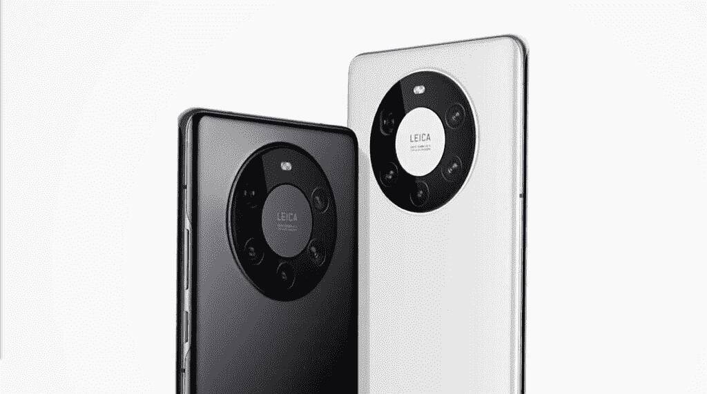

# 华为发布搭载 5 纳米麒麟 9000 的 Mate 40 系列

> 原文：<https://www.xda-developers.com/huawei-mate-40-series-5nm-kirin-9000/>

尽管困难重重，华为最近举办了 2020 年智能生活活动，并在会上推出了一系列新设备。在活动期间，该公司推出了新的[华为眼镜 II、FreeBuds Studio、保时捷设计华为手表 GT2](https://www.xda-developers.com/huawei-porsche-design-watch-gt-2-freebuds-studio-eyewear-ii-launch/) 和华为 Mate 40 系列。华为 Mate 40 系列由 4 款新设备组成，包括华为 Mate 40、Mate 40 Pro、Mate 40 Pro+和保时捷设计 Mate 40 RS。这里是你需要知道的关于中国 OEM 厂商最新旗舰智能手机的一切。

## 华为 Mate 40 系列:规格

| 

规格

 | 

华为 Mate 40

 | 

华为 Mate 40 Pro

 | 

华为 Mate 40 Pro+

 |
| --- | --- | --- | --- |
| **尺寸&重量** | 

*   158.6 x 72.5 x 8.8mm 毫米
*   188 克

 | 

*   162.9 x 75.5 x 9.1mm 毫米
*   212 克

 | 

*   Mate 40 Pro+
    *   162.9 x 75.5 x 8.8 毫米
    *   230 克
*   保时捷设计伴侣 40 RS
    *   162.9 x 75.5 x 10.1 毫米
    *   234 克

 |
| **显示** | 

*   6.5 英寸柔性有机发光二极管
*   2376 x 1080p 像素
*   90Hz 刷新率
*   240Hz 触摸采样率

 | 

*   6.76 英寸柔性有机发光二极管
*   2772 x 1344p
*   456ppi
*   90Hz 刷新率
*   240Hz 触摸采样率

 | 

*   6.76 英寸柔性有机发光二极管
*   2772 x 1344p
*   456ppi
*   90Hz 刷新率
*   240Hz 触摸采样率

 |
| **SoC** | 

*   海思麒麟 9000E
    *   1x ARM Cortex A-77 @ 3.13GHz
    *   3 个 ARM Cortex A-77 @2.54GHz
    *   4x ARM Cortex A-55 @2.04GHz
*   5 纳米 TSMC 工艺
*   ARM Mali-G78MP24 GPU

 | 

*   海思麒麟 9000
    *   1x ARM Cortex A-77 @ 3.13GHz
    *   3 个 ARM Cortex A-77 @2.54GHz
    *   4x ARM Cortex A-55 @2.04GHz
*   5 纳米 TSMC 工艺
*   ARM Mali-G78MP24 GPU

 | 

*   海思麒麟 9000
    *   1x ARM Cortex A-77 @ 3.13GHz
    *   3 个 ARM Cortex A-77 @2.54GHz
    *   4x ARM Cortex A-55 @2.04GHz
*   5 纳米 TSMC 工艺
*   ARM Mali-G78MP24 GPU

 |
| **内存&存储** | 

*   8GB 内存
*   128GB UFS 3.1 存储

 | 

*   8GB 内存
*   256GB UFS 3.1 存储空间
*   华为的 NM 卡扩展槽

 | 

*   12GB 内存
*   256GB UFS 3.1 存储空间(保时捷版为 512GB)
*   华为的 NM 卡扩展槽

 |
| **电池&充电** | 

*   4，200 毫安时电池
*   40W 超级充电有线快充

 | 

*   4，400 毫安时双电池
*   66W 超级充电有线快充
*   50W 无线快速充电
*   反向无线充电

 | 

*   4，400 毫安时双电池
*   66W 超级充电有线快充
*   50W 无线快速充电
*   反向无线充电

 |
| **安全** | 

*   显示指纹扫描仪

 | 

*   3D 人脸解锁
*   显示指纹扫描仪

 | 

*   3D 人脸解锁
*   显示指纹扫描仪

 |
| **后置摄像头** | 

*   50MP f/1.9，RYYB 主摄像头，带 OIS
*   1600 万像素 f/2.2，广角摄像头
*   800 万像素 f/2.4，带 OIS 的长焦相机

 | 

*   50MP f/1.9，RYYB 主摄像头，带 OIS
*   20MP f/1.8，广角摄像头
*   12MP f/3.4，5 倍潜望镜长焦相机

 | 

*   50MP f/1.9，RYYB 主摄像头，带 OIS
*   20MP f/2.4，广角摄像头
*   1200 万像素 f/2.4，3 倍远摄相机，带 OIS
*   800 万像素 f/4.4，10 倍潜望镜长焦相机
*   ToF 传感器
*   色温传感器(仅限保时捷版)

 |
| **前置摄像头** |  |  |  |
| **港口** | USB 3.1 类端口 | USB 3.1 类端口 | USB 3.1 类端口 |
| **音频** | 单声道扬声器 | 双立体声扬声器 | 双立体声扬声器 |
| **连通性** |  |  |  |
| **软件** | 基于 Android 10 和华为移动服务的 EMUI 11 | 基于 Android 10 和华为移动服务的 EMUI 11 | 基于 Android 10 和华为移动服务的 EMUI 11 |
| **其他功能** |  |  |  |

* * *

正如在[之前的泄露](https://www.xda-developers.com/huawei-mate-40-pro-leak-reveals-5nm-kirin-9000-soc-circular-camera-bump-curved-display/)中看到的，华为 Mate 40 系列在背面为摄像头模块采用了新的圆环设计。华为称之为“太空环设计”，因为它呼应了探索和揭开宇宙奥秘的精神。).在正面，Mate 40 Pro 和 Mate 40 Pro+采用了 6.67 英寸的柔性有机发光二极管显示屏，边缘弯曲 88 度。该显示器的分辨率为 2772x1344 像素，刷新率为 90Hz，像素密度为 456ppi。它在顶部和底部边缘有最小的边框，在两个高端型号上有一个药丸形状的打孔切口，用于前置摄像头模块。然而，普通的 Mate 40 采用了更小的 6.5 英寸 FHD+有机发光二极管显示屏，分辨率为 2376 x 1080 像素，刷新率为 90 赫兹。与 Pro 版本不同，Mate 40 的显示屏边缘弯曲了 68 度。

华为 Mate 40 系列是该公司第一款采用麒麟 9000 SoC 的产品，这是一款基于 5 纳米工艺的八核芯片。该芯片有 4 个大 ARM Cortex A-77 核心，其中一个核心主频为 3.13GHz，三个核心主频为 2.54GHz，还有 4 个小 ARM Cortex A-55 核心主频为 2.04GHz。这是世界上第一个集成 5G 调制解调器的 5 纳米芯片，它包括 ARM 的 Mali-G78MP24 GPU。该 SoC 在 Mate 40 Pro 上配有 8GB 内存和 256 GB UFS 3.1 存储，在 Mate 40 Pro+上配有 12GB 内存，并配有专用的华为 NM 卡扩展槽。保时捷设计变型具有 512GB 的存储空间。

 <picture></picture> 

Huawei Mate 40 Pro

在摄像头方面，华为 Mate 40 配备了 50MP f/1.9 主摄像头、16MP f/2.2 广角摄像头和 8MP f/2.4 长焦摄像头。Mate 40 Pro 采用了相同的主摄像头，但它包括一个 20MP f/1.8 广角摄像头和一个 12MP f/3.4 5 倍潜望镜摄像头。最高端的 Mate 40 Pro+也采用了相同的主摄像头，但它包括一个 20MP f/2.4 广角摄像头，一个 8MP f/4.4 10x OIS 潜望镜摄像头，一个 12MP f/2.4 长焦摄像头和一个 ToF 传感器。保时捷设计 Mate 40 RS 的摄像头设置与 Mate 40 Pro+相同，但它包括一个额外的色温传感器。

 <picture></picture> 

Huawei Mate 40 Pro Plus

Mate 40 Pro 和 Mate 40 Pro+上的前置摄像头模块包括 13MP f/2.4 广角自拍相机和 3D ToF 传感器。该设备上的自拍相机提供了一种称为智能视野的功能，它可以自动检测帧中是否有多个人，并调整视野以适应所有人。

两个 Pro 版本的硬件都配备了 4,400mAh 双芯电池，支持 66W 有线快速充电和 50W 无线快速充电。这些设备还支持反向无线充电，用户可以将其他设备放在背板上进行无线充电。

软件方面，华为 Mate 40 系列运行基于 Android 10 的华为定制 Android 皮肤 EMUI 11。正如预期的那样，该设备包括内置华为 AppGallery、花瓣地图和其他华为服务的华为移动服务。

虽然该软件仍然停留在 Android 10 上，但华为已经为华为 Mate 40 系列增加了几个新功能，包括新的 EOD(Eyes on Display)功能，仅当你看着手机时才显示 AOD 内容，空中手势控制，多屏协作，电子邮件对话模式和智能多窗口模式。

## 定价和可用性

华为 Mate 40 系列定价如下:

*   华为 Mate 40 (8GB+128GB): €899
*   华为 Mate 40 Pro(8GB+256 GB):€1199
*   华为 Mate 40 Pro+(12GB+256 GB):€1399
*   保时捷设计华为 Mate 40 RS(12GB+512 GB):€2295

华为 Mate 40 和 Mate 40 Pro 将有 5 种颜色可供选择:黑色、白色、神秘银、绿色和黄色。华为 Mate 40 Pro+将有两种颜色可供选择:陶瓷白和陶瓷黑。截至目前，华为尚未分享任何关于这些新设备可用性的信息。我们将尽快更新帖子中缺失的信息。