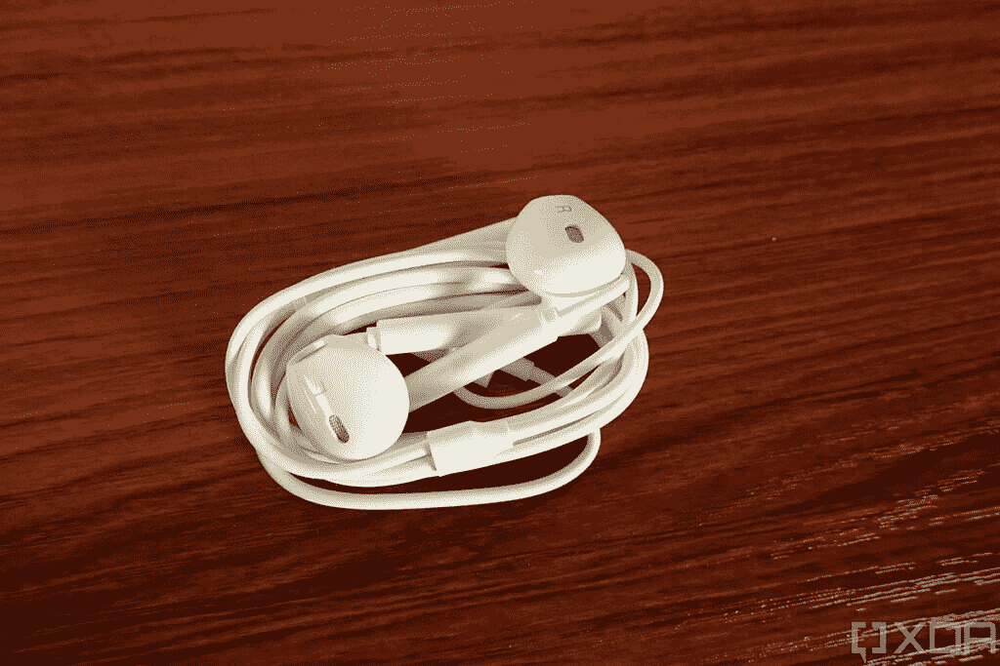

# 华为 Mate X2 让我意识到我错过了多少

> 原文：<https://www.xda-developers.com/huawei-mate-x2-review/>

智能手机的未来是可折叠的。这不是一个如果的问题，而是当可折叠手机的价格足够低，在受欢迎程度上超过传统旗舰产品的时候。问问任何用过可折叠手机的人，他们都会告诉你同样的事情:它们是未来。不过，直到本周，如果你问我关于可折叠手机的问题，我只能转述 XDA 团队的其他人对它们的看法。在用了我的第一部可折叠手机华为 Mate X2 一周后，我现在完全接受了可折叠智能手机。如果我第一次使用可折叠设备是在第一代设备上，我可能不会对未来充满热情。但我很幸运，有机会试用[华为的中国独家伴侣 X2](https://www.xda-developers.com/huawei-mate-x2-launched-china/) 一周，我现在渴望得到一部可折叠手机作为日常司机。他们很棒。

几周前，华为给了我一个机会，让我评估其超高端旗舰产品 foldable，我抓住了这个机会，第一次尝试了一款 foldable。然而，我从一开始就知道，我无法对 XDA 的伴侣 X2 进行传统的评论。首先，这款手机只在中国销售，起价高达 17999 英镑(~ *、2750 美元*)。对于我们的大多数读者来说，这太难得到，也太贵了，所以我们审查这款设备以提供购买建议没有什么意义。其次，Mate X2 没有搭载谷歌应用或服务，普通用户很难下载和使用许多应用。最后，这款手机无法与大多数美国运营商完全兼容，所以我无法将它作为日常驾驶专用。出于这些原因，我把重点放在了使用华为 Mate X2 的体验上，它更像是一个可折叠的*平板电脑*，而不是可折叠的*手机*。作为严格意义上的家用媒体消费设备。下面是我使用一周后的感想。

### 华为 Mate X2 规格-点击展开

| 

规格

 | 

华为 Mate X2

 |
| --- | --- |
| **尺寸&重量** | 

*   161.8 x 74.6 x 13.6-14.7 毫米(折叠)
*   161.8 x 145.8 x 4.4-8.2 毫米(未折叠)
*   295 克

 |
| **显示** | 

*   8 英寸可折叠有机发光二极管显示屏
    *   2480 x 2200 分辨率
    *   90Hz 刷新率
    *   180Hz 触摸采样速率
    *   413ppi
    *   10.141:9 宽高比
*   6.45 英寸有机发光二极管显示屏
    *   2700 x 1160 像素
    *   90Hz 刷新率
    *   270Hz 触摸采样率
    *   456ppi
    *   21:9 宽高比

 |
| **SoC** | 

*   华为海思麒麟 9000
    *   CPU:
        *   1x ARM Cortex-A77 @3.13GHz
        *   3 个 ARM Cortex-A77 @2.54GHz
        *   4x ARM Cortex-A55 @2.05GHz
    *   GPU: ARM Mali-G78MP24
    *   NPU:双大核+微核
    *   5 纳米制造工艺

 |
| **闸板&存放** | 

*   8GB 内存
*   256GB/512GB 存储空间

 |
| **电池&充电** | 

*   4500 毫安时电池
*   55W 华为 SuperCharge(含充电器)

 |
| **安全** | 侧装式指纹扫描仪 |
| **后置摄像头** | 

*   50MP 超视野广角主摄像头，带 OIS，f/1.9
*   1600 万像素电影超广角摄像机，f/2.2
*   带 OIS 的 1200 万像素长焦相机，3 倍光学变焦，f/2.4
*   800 万像素超变焦相机，带 OIS，10 倍光学变焦，f/4.4
*   LED 闪光灯

 |
| **前置摄像头** | 16MP 广角自拍相机，f/2.2 |
| **港口** | USB 3.1 第 1 代 C 类端口 |
| **连通性** | 

*   5G NR
*   无线网络 6
*   蓝牙 5.2
*   GPS、AGPS、GLONASS、北斗、伽利略、QZSS、NavIC
*   红外线增强器

 |
| **软件** | 基于 Android 10 的 EMUI 11 |

*关于本次评测:*我于 2021 年 4 月 1 日(星期四)收到华为提供的 8GB RAM/256GB 存储配置的华为 Mate X2，并已使用该设备约 1 周。华为没有预览或提供任何关于此次审查内容的信息。

**华为 Mate X2 论坛 **

* * *

## **华为 Mate X2 评测集锦**

*   转向向内折叠设计，提高了可折叠显示屏的耐用性
*   牢固的铰链运动扣合到位
*   由于不对称楔形设计，折叠时两块显示屏之间几乎没有间隙
*   重心移动设计，握持舒适
*   附带的包具有类似皮革的抓地力和支架
*   塑料有机发光二极管显示器摸起来非常光滑和流畅
*   整体建筑结构感觉非常优质
*   清晰、响亮的立体声扬声器，放置合理，失真最小
*   通过 NM 卡实现可扩展存储
*   漂亮、宽大的 8 英寸可折叠有机发光二极管显示屏，没有视觉干扰
*   不算太窄的 6.45 英寸外有机发光二极管显示屏
*   应用在显示器之间无缝过渡
*   增加的屏幕空间让您可以在屏幕上显示更多内容
*   麒麟 9000 轻松应对任何高端游戏或仿真需求
*   快速 55W 超级充电支持，附带 66W 适配器
*   EMUI 11 提供了大量的定制、流畅的动画、多任务、多屏功能和第一方谷歌替代品

*   难以单手折叠和展开
*   左手使用者难以用一只手握住
*   半开时难以使用
*   折叠时非常厚
*   整体非常重
*   光滑的玻璃背面是一个脏污的指纹磁铁
*   没有 3.5 毫米耳机插孔
*   没有无线充电
*   EMUI 11 基于过时的 Android 10 版本，不支持 GMS
*   非常昂贵，很难买到

* * *

## 浏览此评论

1.  **[设计](#huaweimatex2design)** :是什么让华为 Mate X2 成为一款可折叠的好手机？
2.  **[人体工程学](#huaweimatex2ergonomics)** :手持华为 Mate X2 有多容易？
3.  **[音频体验](#huaweimatex2audio)** :音箱有多好？
4.  **[视觉体验](#huaweimatex2display)** :显示器有多好？
5.  **[性能](#huaweimatex2performance)** :华为 Mate X2 有多快？
    1.  [游戏性能](#huaweimatex2gamingperformance)
    2.  [真实世界性能](#huaweimatex2realperformance)
6.  **[摄像机](#huaweimatex2camera)**
7.  **[续航&充电](#huaweimatex2batterycharging)**
8.  **[软件](#huaweimatex2software)** :华为 Mate X2 上的安卓是什么样子的？
    1.  [基于 Android 10 的 EMUI 11](#huaweimatex2emui11)
    2.  [缺乏谷歌移动服务](#huaweimatex2nogms)
9.  **[结论](#huaweimatex2conclusion)**

* * *

## 设计:是什么让华为 Mate X2 具有良好的可折叠性？

继 [Mate X](https://www.xda-developers.com/huawei-mate-x-5g-foldable-smartphone-specifications/) 和 [Mate Xs](https://www.xda-developers.com/huawei-mate-xs-matepad-pro-5g-tablet-announced/) 之后，华为 Mate X2 是华为在可折叠方面的第三次尝试。Mate X2 在整体设计上与华为之前的两款可折叠手机大相径庭。Mate X2 没有向外折叠的单一显示屏，而是有一个向内折叠的主显示屏和一个不折叠的外部辅助显示屏。如果这听起来很熟悉，那是因为它与上两款三星 Galaxy Z Fold 设备的设计相似。

有些人会说，这种设计上的转变证明了三星从一开始就做得很好，但我认为谁先做并不重要，重要的是谁做得更好。由于我没有使用过 Galaxy Z Fold 2，我实际上无法将其与华为 Mate X2 进行比较，以告诉你哪种可折叠整体设计更好。不过，我可以告诉你的是，华为已经基本上解决了硬件的每个方面。他们已经证明了他们的工程至少和三星的一样好，甚至更好。在我们的[2020 年最佳产品](https://www.xda-developers.com/best-of-2020/)文章中，我们说三星的第二代可折叠产品让其他可折叠产品感觉像第一代产品。我现在可以肯定地说，这一评论已经过时。

那么，是什么让 Mate X2 成为一款优秀的可折叠手机呢？从铰链开始。华为将这种新设计称为“泪滴”,它描述了屏幕如何弯曲以避免出现折痕。它由锆基液态金属制成，华为称其强度是 Mate Xs 的两倍。铰链运动感觉很坚固，但不允许你以任何角度固定手机。相反，当铰链角度接近 0°或 90°时，它会迅速恢复到完全展开或完全折叠的状态。卡扣确实有助于完全折叠和展开设备，并且减轻了用户在试图使设备完全折叠或展开时可能施加在设备上的一些压力。

当这两部分合上时，它们被磁力吸在一起。因此，需要克服一些明显的张力才能将两半分开。我发现单手折叠和展开华为 Mate X2 非常困难，所以我总是用双手。

\ r \ nht TPS://www . YouTube . com/watch？v=noYg3r6evm0\r\n

关闭 Mate X2 后，我们可以开始欣赏其设计背后的匠心。首先，正如华为所宣称的那样，两块显示屏之间实际上没有缝隙。相比之下，三星的可折叠手机在两个屏幕之间有一个空气间隙，因为它们不能完美地叠放在一起。华为解决这个问题的方法是不对称楔形设计。华为 Mate X2 的形状像一个楔子，意味着一半比另一半略厚。这允许两个半部在彼此之上堆叠，在它们之间没有间隙。

较厚的一半容纳了主要的内部组件，包括华为 Mate X2 的单个 4500 毫安时大电池、四摄像头设置、SoC、按钮和 USB-C 端口。(补充说明:还有一个红外发射器，这在最近很少见，还有一个嵌入电源按钮的指纹扫描仪，响应速度非常快。)较薄的一半具有外部显示器、两个扬声器和混合 nano-SIM 卡+ NM 卡托盘。

* * *

## 人体工程学:手持华为 Mate X2 有多容易？

通常情况下，我不喜欢重量分布不均匀的手机，但它肯定对 X2 有利。这是因为该设备的巨大尺寸迫使你在打开手机时用双手握住它。我发现当厚的一半的两个角都在我的手掌中心时，手机在手中最舒服。奇怪的是，以相反的方式握着它对我也有效，尽管我很快就停止了，因为这需要我抓住外部显示屏(我不喜欢光滑的玻璃)。

通常情况下，我不喜欢重量分布不均匀的手机，但它肯定对 X2 有利。

该设备难以置信的薄度确实有助于人体工程学。Mate X2 最薄处为 4.4 毫米，展开后最厚处为 8.2 毫米，可以轻松放在手掌中。不过，当它折叠起来时，它是你用过的最厚的手机之一，厚度为 13.6-14.7 毫米。再加上 295 克的重量，如果你想长时间使用它，这款手机肯定需要两只手。

不过，不对称楔形设计也有一些缺点。因为我是右撇子，所以我可以在 Mate X2 打开并直立时使用它，但左撇子可能会发现很难做到这一点，因为右半边比左半边重。无论如何，这款手机本身的重量高达 295 克，所以我认为长时间单手使用而不感到不舒服是不可行的。其次，由于这种设计，当手机在桌子上半开时，华为 Mate X2 无法轻松使用。不均匀的重量分布导致铰链迫使一半扣合到另一半或完全展开的位置。如果你让它半开，而没有强制关闭或打开，那么你会注意到伴侣 X2 在使用时只会摇晃。这意味着你不能像笔记本电脑一样有效地使用 Mate X2 在一半上打字，也意味着你不能随意调整角度来拍照。我不认为这些是功能的巨大损失，但它们是华为必须做出的权衡，用户应该意识到这一点。不过总的来说，不对称的楔形设计是华为 Mate X2 的亮点之一。

幸运的是，随附的保护套有一个支架，可以让你将华为 Mate X2 支撑在桌子上。外壳很好地覆盖了背部，并高出相机凸起，使其更容易握住 Mate X2，而不会弄脏相机镜头。我还喜欢这种外壳具有类似皮革的纹理，这使它比令人难以置信的光滑玻璃背面更容易抓握，更不容易留下指纹。对我来说，保护套是任何时候都必须的，因为我在背面留下的污迹让手机在我手中感觉太滑了。我不准备放弃一部将近 3000 美元的手机！

不过总的来说，不对称的楔形设计是华为 Mate X2 的亮点之一。

正如人们对这款售价约 3000 美元的超高端手机的预期，华为 Mate X2 采用了金属外框和铰链。正面和背面都由玻璃制成，并由防刮擦和防摔层保护(可能是大猩猩玻璃)。前面还有一个预先应用的屏幕保护。在内部，可折叠显示屏周围的框架是塑料的。说到这里，可折叠有机发光二极管显示器本身是由塑料而不是玻璃制成的，并且它上面没有一层超薄玻璃(UTG)。尽管如此，显示屏摸起来还是很光滑——不像玻璃那么光滑，但还是很光滑。当你将手指滑过折痕时，你可以明显感觉到轻微的缩进。我敢打赌，它不会打扰你，除非你经常执行滑动动作，穿越显示器的中心。由于折痕几乎不可见，如果你只是浏览网页或观看视频，它肯定不会打扰你。

* * *

## 音频体验:音箱有多好？

华为为 Mate X2 配备了两个扬声器，这两个扬声器都位于设备较薄的一半。它们在扬声器输出音量方面不是很平衡，无论如何也没有那么大声，但音频输出对我来说听起来真的很好。声音输出清晰，失真最小。据华为称，该设备采用超薄大振幅扬声器，与 Mate Xs 相比，低音增加了 180%，高频响应性能提高了 40%。

 <picture></picture> 

The Huawei Mate X2 comes with a pair of USB Type-C earbuds

由于 Mate X2 的设计方式，当你以横向方式将手机展开时，两个扬声器都将面向左右。像 ROG Phone 5 这样的扬声器硬件很棒的手机在边框上安装了前置扬声器，以避免用户的手遮住它们的可能性，但 Mate X2 的设计自然会将扬声器放在远离用户手的地方。当然，当你拿着完全折叠的手机时，这一切都消失了，因为你会很容易地把它盖住。

...Mate X2 的设计很自然地将扬声器放在远离用户双手的地方。

Mate X2 没有 3.5 毫米耳机插孔，但华为在盒子里有一对基本的 USB-C 耳塞。我还没有用过它们，但是你最好使用任何更高端的有线或无线音频附件。华为提供了一对耳机，这很好，这样看起来他们不会在包装盒内的配件上降价，但如果你花了近 3000 美元买一部手机，你可能已经拥有或有能力拥有更好的音频硬件。

* * *

## 视觉体验:显示器有多好？

在外面，华为 Mate X2 的 6.45 英寸外显示屏有一个 2700x1160 分辨率的 OLED 面板，像素密度为 456ppi，纵横比为 21:9。这很高，但没有 Galaxy Z Fold 2 的 25:9 外部显示屏那么窄。这是一个非常标准的高品质 OLED 面板，只是在左上角有一个大的打孔切口。说到这里，主显示屏没有任何切口、凹口或显示不足的摄像头。事实上，在主显示屏的周围、下方或附近根本没有前置摄像头。这使它真正身临其境，但在手机打开时无法进行视频通话。

在内部，华为 Mate X2 有一个 8 英寸的可折叠 OLED 面板，分辨率为 2480x2200，像素密度为 413ppi。显示屏清晰易读，屏幕以 90Hz 的频率刷新，带来流畅的视觉体验。(顺便说一下，外部显示器也以高达 90Hz 的频率刷新)。如前所述，这里的显示器由塑料制成，但仍然感觉非常光滑和流畅。正面观看时，折痕不可见，因此内容不会被光线中难看的弯曲损坏。为了减少眩光和反射，华为应用了纳米光学层。我还没有在户外使用过这款手机，但我可以说它的亮度不足以在阳光直射下清晰易读。

正面观看时，折痕不可见，因此内容不会被光线中难看的弯曲损坏。

由于时间和设备的限制，我们无法对华为 Mate X2 进行全面的展示分析。主观上，两款显示器看起来都很不错。华为提供了在正常、生动和定制颜色模式之间切换的选项。生动的个人资料有强烈的，冷的颜色，而正常的个人资料根据内容在 sRGB 和 P3 之间切换。我从未真正注意到这两种显示器在质量、亮度或校准方面有任何实质性的差异，这表明华为做了很好的工作，使两者之间的过渡看起来无缝。我也没有注意到自动刷新率在 60 和 90Hz 之间切换的任何问题。由于两个显示器都没有 LTPO 背板和/或[可变刷新率](https://www.xda-developers.com/smartphone-display-refresh-rates-explained/)实现，它们改为在离散显示模式之间切换。过渡是无缝的，由操作系统根据内容进行控制，但仅当刷新率模式设置为“动态”时。为了简单起见，华为 Mate X2 同步了两个显示器的亮度、显示模式和刷新率。

我们无法测试的一个功能是 HDR，但如果没有 Google Play 服务和 [Widevine](https://www.xda-developers.com/check-widevine-drm-status-android/) L1 支持，我们无法在 YouTube 或网飞播放高清或 HDR 内容。

讨论了整体显示质量和功能后，我认为接下来值得谈谈使用更大的主显示器的体验。首先，外部和主显示器之间的内容转换是无缝的——没有任何重绘。其次，主显示屏提供的额外垂直空间对于游戏和阅读来说是一个巨大的福音。对于像 *Genshin Impact* 这样有很多屏幕按钮的游戏，事情就不会那么拥挤了。阅读漫画时，整个页面可以轻松地适应屏幕，无需平移和缩放。然而，视频具有固定的纵横比，因此不会从增加的屏幕空间中受益太多。唯一的例外是看带字幕的视频，因为字幕可以移到视频下面，而不是放在上面。

...主显示屏提供的额外垂直空间对于游戏和阅读来说是一个巨大的福音

许多应用程序将展开状态视为平板电脑，为您提供双面板布局。然而，默认的显示密度太大，无法真正利用这一点，所以如果你想在屏幕上看到更多，你需要调整设置。基本上，华为 Mate X2 是口袋里的智能手机和手中的平板电脑。这正是你所期待的那种手机体验，当它展开时，显示屏会变得更大。不难理解它为什么有用，但直到你亲自尝试，你才真正体会到它的好处。

* * *

## 性能:华为 Mate X2 有多快？

为华为 Mate X2 提供动力的是海思的麒麟 9000 芯片。这是华为最新的——也是[看似最终的](https://www.xda-developers.com/us-government-blocks-chip-makers-huawei-hisilicon-kirin-soc/)——基于 ARM 的 SoC，与上一代[麒麟 990](https://www.xda-developers.com/huawei-hisilicon-kirin-990-5g-integrated-modem/) 相比有显著改进。麒麟 9000 基于 TSMC 的 5 纳米工艺节点技术，由一个八核 CPU 组成，其中 1 个 ARM Cortex-A77 内核的主频高达 3.13GHz，3 个 ARM Cortex-A77 内核的主频高达 2.54GHz，4 个 ARM Cortex-A55 内核的主频高达 2.05GHz。对于图形处理，麒麟 9000 具有一个集成的 24 核 ARM Mali-G78 GPU。在连接方面，麒麟 9000 采用了华为集成的 Balong [5G 调制解调器](http://xda-developers.com/5g)，支持 NSA 和 SA 网络上的亚 6GHz 和毫米波频率。

目前尚不清楚在美国政府阻止芯片制造商向华为供应之前，麒麟 9000 芯片的产量是多少，但该芯片的有限供应可能会导致由其驱动的手机的有限供应，其中包括 Mate X2。无论如何，我们不能错过测试麒麟 9000 在一个领域性能的机会，麒麟芯片传统上落后于高通骁龙芯片:游戏。

### 游戏性能

与华为上一代麒麟 990 的 16 核 Mali-G76 GPU 相比，麒麟 9000 中的新 24 核 Mali-G78 GPU 在图形密集型游戏中的性能应该会好得多。虽然高通对骁龙 888 的 GPU 知识产权相当不透明，但我们知道三星的 Exynos 2100 配备了 14 核 Mali-G78 GPU。尽管潜在的热节流问题，我们因此预计华为 Mate X2 的新麒麟 9000 在高要求的 Android 游戏中表现非常好。为了测试这一点，我们安装了 *Genshin Impact* 并玩了 30 分钟，所有图形设置都设置为最大值，Mate X2 的性能模式关闭。

正如你所看到的， *Genshin Impact* 在我的华为 Mate X2 评测单元上完美运行。事实上，这款游戏甚至比在专用于游戏的手机[华硕 ROG 手机 5](https://www.xda-developers.com/asus-rog-phone-5-review/#gamingperformancebatterylife) 上运行得更好。我没有遇到任何热节流问题，在 30 分钟的会话后，手机也没有变得不舒服。(作为参考，我的 30 分钟 GI 测试总是从一个全新的账户开始，一直玩到过去的任务的*风过后一点点。我这样做是为了保持一致性，并确保游戏始终包含室内和室外运动、战斗和过场动画的良好混合。)*

... *Genshin Impact* 在我的华为 Mate X2 评测单元上完美运行。

虽然由于时间限制，我没有收集我玩的其他游戏的任何数据，但我可以透露，华为 Mate X2 在其他 Android 游戏中的表现几乎完美无缺，如*使命召唤手机*和*英雄联盟:荒野大裂谷*，当然，这两个游戏都是在最大设置下进行的。

更令人兴奋的是，Mate X2 在复古控制台仿真中表现出色。如果你以前曾经涉足过 Android 上的仿真，那么你会知道非骁龙芯片在仿真器中的表现往往更差，主要是因为驱动程序不兼容的问题。使用广受欢迎的[任天堂 3DS 模拟器](https://www.xda-developers.com/official-citra-for-android-released/)的 Citra-MMJ 分支，我能够在建立着色器缓存后，以几乎恒定的 60fps 和 3 倍的内部分辨率(1200x720)运行*超级马里奥 3D 陆地*30 分钟。使用任天堂 GameCube/Wii 流行的 Dolphin 模拟器的最新官方版本，我能够以恒定的 30fps 运行*超级马里奥阳光*超过 30 分钟，内部分辨率为 2 倍(1280x1056)。我尝试以 3 倍的内部分辨率(1920x1584)运行*超级马里奥阳光*，但即使有性能更好的 Vulkan 图形后端，游戏的表现对我来说也无法接受(在 Bianco Hills 徘徊在 20-23fps 左右)。虽然配备骁龙 888 的 ROG Phone 5 在这方面确实有一点优势，但它也很难在内部分辨率为 3 倍的超级马里奥阳光 T21 中保持 30fps。然而，任天堂 3DS 和 GameCube 游戏在 2 倍或以上的内部分辨率下看起来非常棒，所以我很高兴地说，华为 Mate X2 及其麒麟 9000 在复古主机仿真中表现得像冠军一样。

...华为 Mate X2 及其麒麟 9000 在复古控制台仿真中表现得像冠军一样

### 真实世界的性能

游戏并不是华为 Mate X2 擅长的全部。华为在优化其设备以尽快运行 Android 方面往往做得很好。在我使用 Mate X2 的一周时间里，我在使用 Twitter 或脸书等以图像和视频为主的社交媒体应用程序时，很少遇到丢帧或口吃的情况。在 Discord、Reddit、Telegram 和 Slack 等应用之间切换非常快。这款手机的 8GB 内存足以将应用程序保存在内存中，尽管正如你在上面看到的，如果你运行像 *Genshin Impact* 这样占用内存的游戏，你可能会遇到应用程序重绘。

我很高兴华为为两个屏幕都配备了 90Hz 的刷新率，但我希望它们能有更快的 120Hz 刷新率。对我来说，90Hz 和 120Hz 之间仍然有明显的差异，但之后，视觉差异对我来说是察觉不到的。在使用了大量刷新率达到或超过 120 赫兹的手机后，华为 Mate X2 感觉不太流畅，尽管实际上并不是这样。但是，如果你用的是 60 或 90Hz 刷新率的手机，你可能会和我有不同的感受。

我在使用手机时没有发现任何存储瓶颈，尽管我没有尝试过测试速度。华为使用一个[定制文件系统](https://www.xda-developers.com/huawei-erofs-linux-file-system-android/)来提升加载系统应用的性能。该公司还继续推出带有纳米(Nano-Memory)卡插槽的 SIM 卡托盘，很少有供应商生产这种托盘。

* * *

## 照相机

鉴于手机出色的相机硬件，我预计 Mate X2 的表现会非常好。它有一个 50MP 主 RYYB 传感器，一个 16MP 超广角传感器，一个 12MP 长焦传感器用于 3 倍光学变焦，一个 8MP 长焦传感器用于令人难以置信的 10 倍光学变焦。华为设法将 10 倍光学变焦镜头装入手机，同时保持手机在展开时的轻薄，这是这款设备所采用的恒星工程的证明。华为 Mate X2 中的麒麟 9000 采用了一个具有两个大内核的新 NPU 和一个新的 ISP，具有改进的静止图像和视频 HDR 处理能力，因此实时图像和视频处理应该比 P40 Pro+有所改进，P40 Pro+还具有令人印象深刻的 10 倍光学变焦摄像头。

不幸的是，由于恶劣的天气条件(过去一周，我一直*幸运地*遇到黑暗、阴沉和多云的天气)，我无法使用 Mate X2 进行适当的相机测试。不过，我还是设法拍了几张照片，你可以在谷歌相册中看到[。该相机的一个亮点是，您可以通过查看外部显示器上的取景器来使用主后置摄像头进行自拍。与嵌入外部显示器下方的前置摄像头拍摄的照片相比，这种方式可以拍摄出更清晰的自拍照。另一个亮点是，华为的相机即使在低光照条件下也能吸收大量光线，这可以通过使用相机应用程序的夜间模式进一步增强。当与主相机一起使用时，夜间模式效果最佳，但当与超广角和 3 倍长焦相机一起使用时，它还可以。](https://photos.google.com/u/1/share/AF1QipMngf-teXSWynMQ_Sb-QeoM0UP03ZpwTi1vPjntATTzLrl8lqLhOmINn52qrCsGPw?key=b0Z6V2NVLVB6MkZDSnlWTGtCLWM4NmMzS1lKNkNB)

* * *

## 电池寿命和充电

至于续航，我无法提供任何评论或数据。由于这款手机没有 Google Play 服务，我无法使用我通常使用的所有应用程序。另外，我使用的几乎所有应用程序都无法发送推送通知。此外，由于网络问题，我没有在家外面使用电话。因此，我得出结论，有太多不同的因素在起作用，会使任何电池寿命的判断不准确。

至于充电，华为 Mate X2 支持华为的 55W SuperCharge 协议，但不支持任何类型的无线充电。盒子里的实际适配器是一个 66W 的超级充电砖，但手机本身不会在超过 55W 的功率下充电。Mate X2 没有双电池设计，因此让它充电更快可能会给电池带来严重压力，并缩短其寿命。从 0 到 100%，Mate X2 需要大约一个小时才能充满电。

从 0 到 100%，Mate X2 需要大约一个小时才能充满电。

* * *

## 软件:华为 Mate X2 上的安卓是什么样的？

华为手机上运行的软件现在处于一种有点奇怪的状态。虽然华为的手机目前都运行 Android，但它们运行的操作系统版本是过时的 Android 10 版本。再过几个月，我们就要推出 Android 12 了，但看起来华为对进一步升级其设备上的 Android 操作系统没有兴趣。相反，华为正在将其手机过渡到其在[的内部鸿蒙系统软件](https://www.xda-developers.com/huawei-transition-from-android-harmony-os-beta/)，尽管[目前尚不清楚当前的测试版与安卓的](https://www.xda-developers.com/harmony-os-2-0-initial-version-based-on-android/)有何不同。无论如何，华为 Mate X2 还没有运行鸿蒙系统*——该公司告诉我们，它计划在本月的某个时候发布可折叠[的软件](https://www.xda-developers.com/a-closer-look-at-what-makes-huawei-mate-x2-unique/#caption-attachment-400971:~:text=Upgrade%20to%20HarmonyOS%20later)。目前，华为 Mate X2 运行基于 Android 10 的 EMUI 11，这是一个我们在过去广泛报道过的软件版本。除了 Android 10 在两个显示器之间无缝转换内容所需的底层框架变化之外，Mate X2 上的 EMUI 11 与 P40 Pro 上的 EMUI 11 没有太大区别。*

 *### 基于 Android 10 的 EMUI 11

华为 Mate X2 上的 EMUI 11 具有与 P40 和 Mate 40 相同的 UI 定制功能、动画、改进的多任务处理能力和多屏协作集成。华为的新“蒙德里安”永远展示风格与其他“艺术”AOD 选项一起出现，当然，你仍然可以创建自己的定制 AOD。正如我之前所说，华为在 Mate X2 上的 Android/EMUI 优化方面做得很好。活动之间的过渡动画感觉流畅，所有全屏导航手势也是如此。EMUI 11 的“智能多窗口”面板，加上该软件对 Android 分屏/自由形式多窗口的扩展，使华为 P40 上的多任务处理更受欢迎；随着华为 Mate X2 更大的屏幕尺寸，多任务处理现在变得轻而易举。

...华为在 Mate X2 上的 Android/EMUI 优化做得很好。

对于那些需要远程完成更重要工作的人来说，你可以将你的华为 Mate X2 连接到外部显示器，并启用简单的投影界面。轻松投影是针对桌面模式优化的 EMUI，具有任务栏和对多个浮动应用程序窗口的支持。将 Mate X2 有线(通过 Type-C 端口的 DisplayPort 备用模式)或无线(通过 MiraCast)连接到外部显示器时，可以启用该功能。不过，华为不允许你在没有将手机连接到另一个显示器的情况下切换简易投影界面。我敢肯定，有些人会更喜欢这个界面来显示手机打开时的情况，但老实说，我认为只有当显示屏至少有 10 英寸大时，它才真正有意义。

我无法在华为 Mate X2 上测试其他几个 EMUI 功能。首先，我无法测试华为的人工智能语音助手，因为它强迫我使用它的中文版本。接下来，我无法测试华为的 HiCar 功能，因为我没有兼容的车辆。我也无法测试华为的人工智能生活应用程序，因为我没有他们的物联网生态系统支持的任何产品。最后，我无法测试任何多屏协作功能，因为我没有华为的电脑或电视。不过，我的同事本辛(Ben Sin)能够测试华为的份额，所以我在下面嵌入了他的一条推文，以防你有兴趣看看那是什么样子。

当我在挖掘设置，查看所有我能测试和不能测试的功能(还卸载了所有预装的中文应用膨胀软件)时，我开始意识到华为的应用生态系统已经走了多远。如果你像我一样沉迷于谷歌的生态系统和依赖于此的应用，那么你很难习惯谷歌的无应用伴侣 X2。不过，如果你对谷歌服务不感兴趣，你会发现华为几乎为所有服务都提供了一个替代选择。华为有自己的应用程序，用于搜索、地图、拨号器、消息、网络浏览器、视频、音乐、钱包、视频会议、书籍、数字福利、智能家居、日历、时钟、记事本、联系人、天气、计算器、文件、录音、测量、位置跟踪、红外遥控、指南针等。不过，这些只是基本情况。华为还提供更复杂的应用和服务，以与谷歌更智能的产品竞争，如镜头、助手、直播字幕等。现在，华为的一些产品质量可能不如谷歌；我个人更喜欢谷歌的大部分服务，而不是华为的，但我对华为如何有效地建立一个去谷歌化版本的 Android 印象深刻。

...华为如此有效地构建了一个去谷歌化的 Android 版本，给我留下了深刻印象。

### 缺乏谷歌移动服务

EMUI 11 最大的问题不是缺乏第一方应用，因为华为有很多这样的应用。当然，最大的问题是缺乏谷歌移动服务。没有谷歌 Play 商店我也能生活，因为有完全开源的版本，比如极光商店、大量 APK 托管网站和华为自己的花瓣搜索服务。(华为的 AppGallery，虽然[不断看到改进](https://www.xda-developers.com/huawei-redesigns-appgallery-app-store/)，但仍然不如极光商店对我来说使用方便。)然而，缺乏 Google Play 服务对我来说是一个障碍，因为我日常使用的应用程序中很少实现华为的 [HMS 核心](https://www.xda-developers.com/huawei-hms-core-android-alternative-google-play-services-gms/)。没有 Google Play 服务，我无法在大多数应用程序中获得推送通知，无法使用 Android Auto，无法使用我的 Wear OS 智能手表，无法使用 Google Cast，也无法将我的 KeePass 数据库同步到我的 Google Drive 帐户。没有谷歌的 Widevine L1 DRM 认证，我无法播放网飞或亚马逊 480p 分辨率以上的视频。我可以通过使用[advanced](https://www.xda-developers.com/youtube-vanced-apk/)和[advanced Music](https://www.xda-developers.com/youtube-music-vanced-apk/)绕过 YouTube 和 YouTube 音乐的硬屏蔽(尽管我对使用修改后的应用程序登录我的谷歌账户有些犹豫)，但我无法绕过大多数其他问题，除非我以某种方式让 [Googlefier](https://www.xda-developers.com/googlefier-easily-install-gms-huawei-honor-devices/) 在 EMUI 11 上工作。我真的很喜欢华为 Mate X2 的硬件，所以如果这不是一个审查单元，我可能会花更多的精力来侵入 Play Store 并在设备上播放服务。不过，我不确定其他依赖谷歌服务的人会不会这么说。

 <picture></picture> 

Aurora Store made getting apps easy on the Mate X2

由于 Mate X2 只在中国销售，这个国家禁止所有谷歌应用和服务，我可以给这款设备一个通行证。我毫不怀疑，如果不是因为美国的贸易制裁，华为将在中国以外销售搭载谷歌移动服务的 Mate X2。不过，考虑假设是没有意义的，所以我只能提供我对手机上实际安装的软件的想法。EMUI 11 是一个很好的定制的基于 Android 的操作系统，有很多很好的定制选项，独特的多任务功能，流畅的动画，以及令人讨厌的应用程序删除行为(这是中国版 Android 的标准)，但它因缺乏中国以外的谷歌服务而受到阻碍。如果你不在乎这些，那么你就更有力量了——从长远来看，让你使用的应用和服务多样化是明智的。

* * *

## 结论:华为 Mate X2 是一款出色的可折叠手机，但太难捉摸，也太贵了

理论上，我一直是可折叠手机的粉丝。我的许多媒体同事告诉我，他们第一次使用可折叠手机是如何改变了他们的观点。我和我的伙伴 X2 在一起的一周的确是一次转变的经历。我看不到智能手机设计的未来会向任何其他方向发展。我无法预测这个行业是否会采用不对称楔形设计和向内折叠显示，但我可以肯定地说，这是一个成功的设计组合。华为 Mate X2 感觉像是一款非常精致的产品，只是缺乏可用性和高得离谱的价格阻碍了它的发展。

在另一个世界，华为不会被禁止发布谷歌应用程序或制造新的海思芯片。他们将在欧洲甚至美国以高价出售华为 Mate X2，可能会提供诱人的以旧换新优惠和配件套装。我会坐着等手机降价，然后再买一部。然而，在现实中，我不可能得到一个。相反，我将不得不满足于华为的 1 周预告，好像这是他们告诉我的方式，“这就是你正在错过的！”

**[华为 Mate X2 论坛](https://forum.xda-developers.com/f/huawei-mate-x2.12103/)**

### 华为 Mate X2

Mate X2 是华为第三次尝试可折叠手机，他们终于成功了。零间隙铰链和不对称楔形设计解决了可折叠的两个最大问题。此外，不间断的 8 英寸可折叠显示屏提供了真正身临其境的视觉体验。

**Affiliate Links**

Huawei

[View at Consumer.huawei](https://consumer.huawei.com/cn/phones/mate-x2/)*