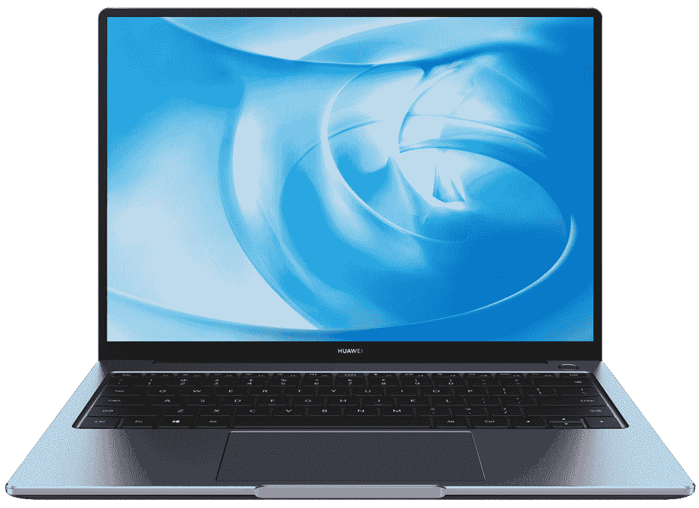

# 华为 MateBook 14 (2020)第一印象:潜在的发电站

> 原文：<https://www.xda-developers.com/huawei-matebook-14-2020-preview/>

华为 MateBook 14 (2020) 在该公司的一系列其他产品中亮相。虽然他们在智能手机领域的产品目前受到围攻，但他们的[配件](https://www.xda-developers.com/huawei-watch-gt-2-pro-smartwatch-freebuds-pro-tws-earbuds-launch/)和笔记本电脑目前还不错。华为 MateBook 14 我已经用了 24 小时了，我真的非常非常喜欢它。虽然我将有更多的时间来玩它，为我的全面审查，这些是我迄今为止的第一印象。

*关于这次动手:我们昨天收到了华为英国公司发来的华为 MateBook 14 供审查。这只是我们超过 24 小时使用的初步印象。华为没有对此次实践的内容提供任何意见。*

 <picture></picture> 

Huawei Matebook 14 2020

##### 华为 Matebook 14 (2020)

华为 MateBook 14 是一款非常小的笔记本电脑，可以承载一些出色的硬件。它时尚而有型，但不会在功能上妥协。仅仅过了 24 小时，我真的很喜欢！

## 华为 MateBook 14 (2020)规格

### 华为 MateBook 14 规格

| 

规格

 | 

华为 MateBook 14

 |
| --- | --- |
| **尺寸&重量** | 

*   307.00 毫米 x 223.80mm 毫米 x 15.90mm 毫米
*   1.49 千克

 |
| **显示** | 

*   14 英寸 IPS 液晶 FHD (2160x1440)
*   触摸屏(某些型号)
*   3:2
*   300 尼特

 |
| **处理器** |  |
| **GPU** |  |
| **闸板&存放** | 

*   16GB DDR4 @2666MHz 双 DIMM
*   512GB M.2 NVMe 西部数据 SN730 固态硬盘

 |
| **电池&充电** |  |
| **输入/输出** | 

*   2 个 USB 3.2 类型 A
*   1 个 USB 型
*   1 个 HDMI 2.0 接口
*   3.5 毫米耳机/麦克风组合插孔

 |
| **连通性** | 

*   无线网络 802.11a/b/g/n/ac
*   蓝牙 5.0

 |
| **操作系统** |  |
| **其他特性** | 

*   Microsoft Office 365，30 天试用版

 |

* * *

## 华为 MateBook 14:设计和制造质量

就设计而言，华为 MateBook 14 与该公司以前的笔记本电脑没有太大的不同。它采用相同的喷砂铝外壳，印有“HUAWEI”徽章，非常轻薄，重量为 1.49 千克。作为一款 14 英寸的笔记本电脑，它真的非常小，超级容易单手携带。虽然 16 英寸笔记本电脑 [Honor MagicBook Pro](https://www.xda-developers.com/honor-magicbook-pro-preview/) 带来了一些调整，但我很快适应了。有了纤薄的边框，笔记本电脑的外形比我习惯的任何东西都要小得多。

华为 MateBook 14 拥有 3:2 纵横比的 1440p 显示屏。这有点奇怪，但我很快就习惯了。触摸屏使用直观，屏幕上的疏油涂层有助于防止油性指纹在屏幕上堆积。

这里还有一个背光键盘，它绝对可以在弱光下使用。这在白天不是最明显的，但显然这不是你想要使用背光键盘的时候。

这是一个薄膜键盘，不是机械键盘，但是用起来足够好看。我对它没有任何问题，它绝对不是一个坏键盘。显然，这个价位的笔记本电脑会走一些捷径，如果我说实话，这可能是比本来可以走的更好的捷径之一。键盘上还有一个 1 百万像素的摄像头，你只需点击它就可以弹出来。

笔记本电脑下方的左右两侧是一对 2W 扬声器。虽然完全没有低音，但他们做得很好，并且在右上角还有一个指纹传感器。左侧是一个 USB-C 端口、一个 HDMI 端口和一个 3.5 毫米耳机和麦克风插孔。右边是两个 USB-A 3.2 端口。

总的来说，华为 MateBook 14 是一款非常小的笔记本电脑，可以承载一些出色的硬件。它时尚而有型，但不会在功能上妥协。

## 表演

鉴于我使用华为 MateBook 14 的时间很少，目前我真的只能为你快速说出规格。锐龙 7 4800H 是目前你能买到的高端笔记本电脑芯片组之一，它的电池效率也令人难以置信。它拥有 8 个内核和 16 条线程，甚至比 Honor MagicBook Pro 的锐龙 4600H 还要强大。16GB 的双 DIMM DDR4 RAM 肯定可以满足您几乎所有的需求，512GB 的 nVME SSD 意味着游戏和大型应用程序将快速启动。在设置所有应用程序和撰写这篇评论的一天中，我没有遇到任何性能问题，所以这绝对是一个好迹象。此刻我印象深刻。

## 电池和结论

华为 MateBook 14 配备了 56Wh 电池，锐龙 7 4800H 是一款非常节能的芯片组。

华为 MateBook 14 是一款光滑时尚的小型笔记本电脑，配备了一些出色的硬件，并没有在功能上做出妥协，以保持其尺寸。

设置我所有的应用程序和完成其他工作，在大约 5 个小时的使用时间内，电池电量从 70%下降到 15%。我非常喜欢笔记本电脑的这种电池续航时间，尤其是当你考虑到安装应用程序和设置新设备是一个比大多数工作流程更耗电的过程时。

总的来说，我印象很深刻。虽然我不想根据我目前使用这台笔记本电脑的时间给出任何建议或结论，但我认为它绝对值得关注。锐龙 7 4800H 并不逊色，加上其他动力装置规格，它很可能值这个要价。

 <picture></picture> 

Huawei Matebook 14 2020

##### 华为 Matebook 14 (2020)

华为 MateBook 14 是一款非常小的笔记本电脑，可以承载一些出色的硬件。它时尚而有型，但不会在功能上妥协。仅仅过了 24 小时，我真的很喜欢！