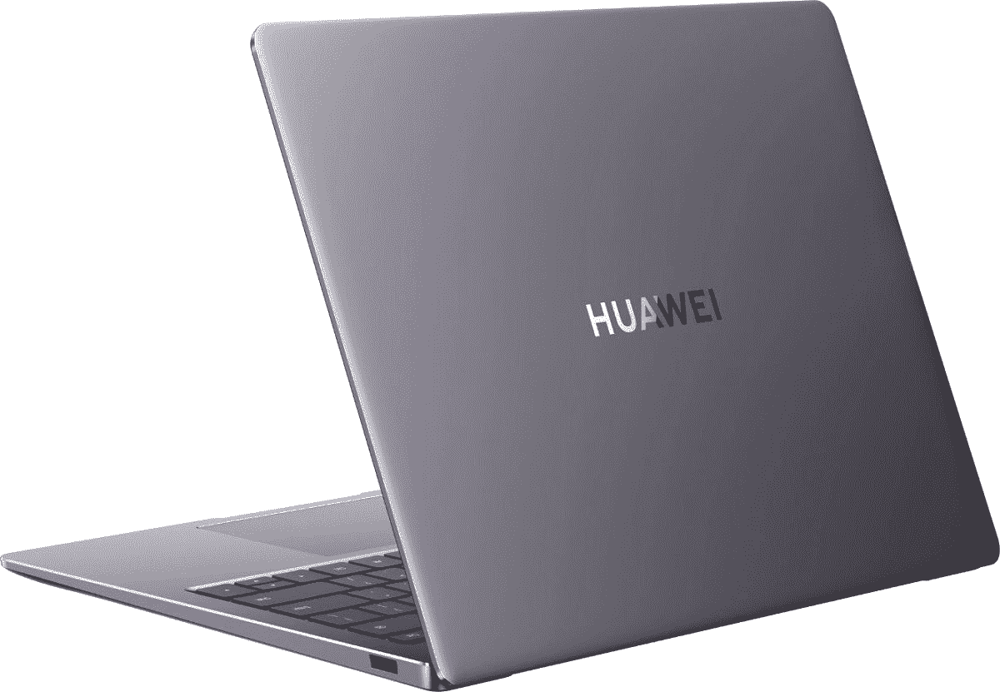

# 华为 MateBook 14s 评测:90Hz 的显示屏让它脱颖而出

> 原文：<https://www.xda-developers.com/huawei-matebook-14s-review/>

华为有制造一些非常棒的笔记本电脑的历史。它是第一个将杜比 Atmos 音频放入 MateBook X 的 13 英寸笔记本电脑中的公司，它一直在推动高屏幕与机身比率、高质量键盘等。华为 MateBook 14 是首批搭载 [Windows 11](https://www.xda-developers.com/windows-11/) 的产品之一，它配备了一些我们在最新一代笔记本电脑上看到的功能。

最值得注意的是，它有一个 90Hz 的显示屏，比今天市场上大多数其他笔记本电脑的 60Hz 屏幕更流畅。它还配备了英特尔的 Tiger Lake H35 处理器，对于生产力性能来说，它相当不错(我们稍后将讨论没有专用 GPU 的强大处理器的影响)。首先，它具有华为笔记本电脑特有的功能，例如 Huawei Share，你可以用华为手机点击它，立即分享照片和视频，或者轻松地将你的屏幕无线扩展到其他华为设备。

**浏览此评论:**

### 华为 MateBook 14 规格

| 

中央处理器

 | 酷睿 i7-11370H |
| 

制图法

 | 虹膜 Xe |
| 

身体

 | 313.82x229.76x16.7mm，1.43kg |
| 

显示

 | 14.2 英寸，2，520x1，680，213ppi，90%屏幕与机身比例，90Hz，400 尼特，100% sRGB，1500:1 对比度，178 度视角 |
| 

储存；储备

 | 1TB NVMe PCIe 固态硬盘 |
| 

随机存取存储

 | 16GB LPDDR4x 双通道 |
| 

电池

 | 60 瓦时锂聚合物 |
| 

连通性

 | IEEE 802.11a/b/g/n/ac/ax，160 MHz，蓝牙 5.1 |
| 

港口

 | (2)USB Type-C(1)USB 3.2 Gen 1 Type-A(1)HDMI(1)3.5 毫米音频 |
| 

投入

 | 1.5 毫米键程全尺寸背光键盘带多点触控的触摸板内置华为 Share |
| 

网络摄像头

 | 720P 高清摄像头 |
| 

声音的

 | 扬声器 x 4 麦克风 x4 |
| 

操作系统（Operating System）

 | Windows 11 主页 |
| 

材料

 | 铝金属 |
| 

颜色

 | 太空灰 |
| 

价格

 | £1299.99 |

注意，在这种情况下，两个 [USB Type-C](https://www.xda-developers.com/best-usb-c-laptops/) 端口中有一个支持 [Thunderbolt 4](https://www.xda-developers.com/best-thunderbolt-4-laptops/) ，但大部分配置不支持。这真的很奇怪，但当你去配置你所购买的型号时，实际上有一个英特尔 Evo 认证的选项，只有在配置了酷睿 i7、16GB RAM 和 1TB SSD 的情况下才可用。

## 设计:MateBook 14s 看起来像华为笔记本电脑，但只有一个 Thunderbolt 端口，而且是可选的

我回顾了一大堆华为笔记本电脑，一直追溯到 2016 年推出的最初的 MateBook。它们都有一个共同的设计，可能最大的区别是从花瓣标志转移到印在引擎盖上的华为文字标志。它们几乎都是由铝制成的，这个的基色叫做太空灰。

它还有云杉绿色，我有点嫉妒。显然，像灰色和银色这样的中性色在笔记本电脑中更受欢迎，就像黑色在手机中受欢迎一样。作为一个使用很多设备的评论者，我喜欢与众不同的东西。

不幸的是，另一种颜色选择是我开始发现 MateBook 14s 的一个最大问题:缺少或有点缺少 Thunderbolt。事情是这样的。为了获得 Thunderbolt，你必须购买配备 Core i7、16GB RAM 和 1TB 存储的型号，据我所知，这仅在太空灰色配置中可用。

对于 MateBook 14s，Thunderbolt 4 只提供最高端的配置。

我确实认为这款笔记本电脑的价格很有价值，但让我失望的是，Thunderbolt 和英特尔 Evo 认证不是标准的。有了 Thunderbolt 4，你可以在一个 USB Type-C 端口上连接一个外部 GPU，或者你可以连接两个 4K 显示器或一个 8K 显示器。这是真正为雷电 3 的高端电脑保留的东西，但随着 Thunderbolt 4 的出现，它已经变得更加主流。

另一个难点是，如果您为英特尔 Evo 配置支付额外费用，只有一个 USB Type-C 端口是 Thunderbolt。它是“左边第二个 USB-C 端口”，大概是指从左边数第二个*。我不指望普通消费者知道他们的外部 GPU 连接到哪个，因为端口也没有标记，尽管它们彼此相邻。*

除了两个 USB Type-C 端口，设备左侧还有一个 HDMI 端口和一个 3.5 毫米音频插孔。在右侧，有一个 USB 3.2 Gen 1 Type-A 端口。

总的来说，设计很漂亮，这是我长期以来对华为笔记本电脑的评价，因为它们都遵循相同的设计语言。大多数配置缺乏 Thunderbolt 令人失望，特别是因为它感觉像是在单个配置上添加了单个端口，只是为了检查一个框。

## 显示器:90Hz 的 14.2 英寸屏幕很漂亮

你绝对应该在你的下一台笔记本电脑中寻找一个像这样的高刷新率屏幕。在 PC 市场，更高的刷新率一直是游戏的一大特色，旨在为您提供额外的毫秒反应时间。但正如我们几年来在移动市场上看到的那样，高刷新率为每个人创造了更好的体验。所以现在，我们看到它们在个人电脑市场变得更加主流。

90Hz 的刷新率是 MateBook 14s 的真正卖点

华为 MateBook 14s 的触摸屏为 14.2 英寸，尺寸为 2，520x1，680，长宽比为 3:2。它还拥有 90%的屏幕与机身比例，这可能是 3:2 显示屏下最高的屏幕与机身比例。如果不是，也很接近了。此外，网络摄像头实际上位于顶部边框，这是一种真正身临其境的体验。

支持 99%的 sRGB、71%的 NTSC、76%的 Adobe RGB 和 75%的 P3，对于高端笔记本电脑来说，色域相当稳定。不过说实话，90Hz 的刷新率才是真正的卖点。

在我的测试中，亮度最大值为 430.9 尼特，对比度最大值为 1，730:1，这两项都远远超过了华为自己规格表上列出的承诺。对于非有机发光二极管笔记本电脑来说，黑点也相当低。

这是一个美丽的屏幕，正如我提到的，网络摄像头在顶部挡板。这是你不会在每一台华为笔记本电脑上看到的。几年前，该公司开始将网络摄像头放在键盘的弹出键中，这是一种隐私措施，利用了没有人关心网络摄像头的事实。当然，在这个在家工作的时代，网络摄像头的位置比几年前重要得多。

坏消息是，这是一个 720p 的相机，就像今天位置很重要一样，分辨率也很重要。正如我提到的，我们在 PC 上看到高刷新率之前就在移动设备上看到了高刷新率，这同样适用于优秀的前置摄像头。你可以花 3000 美元买一台配备 720p 网络摄像头的笔记本电脑，花 300 美元买一台配备 1080p 60fps 前置摄像头的智能手机。这是一个问题，而且正在逐渐好转。不幸的是，现在进入市场的产品已经准备了好几年了。

## 键盘:华为 MateBook 14s 有 1.5 毫米的按键，指纹传感器等等

华为的 MateBook 14s 有 Chiclet 风格的 1.5 毫米按键，这对于笔记本电脑来说是一个非常标准的深度。这也是华为自 2016 年开始生产 Windows 笔记本电脑以来一直使用的*T4 标准。最终，键盘打字感觉很好，而且很准确。不幸的是，对我来说，没有美国风格的变体了，但你可以在设置中将其设置为美国，这很容易适应。*

有趣的是，在 F6 和 F7 键之间仍然有一个按钮，尽管那里没有摄像头。

在右上角，有一个电源按钮，兼作指纹传感器。其实挺好的，也是我不在乎有没有红外摄像头的原因。华为一直在制造快速准确的指纹传感器，它也是第一个制造 Windows 笔记本电脑(MateBook X)的人，当你按下电源按钮时，而不是在 PC 启动后扫描你的指纹，这就是 MateBook 14s 的功能。这意味着你按下它一次，它会在启动时自动让你登录。挺好的。

当然，它配备了微软的 Precision 触摸板，可以充分利用大部分可用空间。这也是华为 Share 传感器的位置，所以我们来谈一谈。

## 华为份额

几年前，华为着手建立一个生态系统。它有智能手机、智能手表、笔记本电脑、耳机等等，所以唯一缺少的是它们能够协同工作，为任何愿意投资该公司产品的人丰富用户体验。笔记本电脑开始包括华为共享，所以你可以用你的华为手机点击 NFC 标签，传输选择的照片和视频。现在已经扩展到包括完整的多屏体验。

Huawei Share 让您可以像使用电脑一样使用手机。

一旦你把手机放在触摸板上，它就会请求访问设备的许可。批准后，您将看到屏幕镜像。然后，你可以做像拖放文件这样的事情，你甚至可以把存储在手机上的文件放在笔记本电脑上的应用程序中打开。例如，一个 Word 文档将在 Word 的完整 Windows 版本中打开，而不是在手机上共享的移动办公应用程序中打开。

## 性能和电池寿命:华为 MateBook 14s 有一个 35W 的 CPU，但没有专用的 GPU

华为发给我的 MateBook 14s 包括一个英特尔酷睿 i7-11370H，16GB 内存和 1TB 固态硬盘。这种配置与我们过去几年看到的任何配置都有点不同。部分原因是老虎湖 H35 系列是全新的。历史上，H 系列处理器是 45W，它们配备了大量的内核和线程。H35 是，你猜对了，35W，但也只有四核八线程。它的目的是为轻薄的设备提供能量。

让这款设备有些独特的另一点是，它没有专用的 GPU。通常，H 系列处理器配有专用显卡，因为游戏和视频编辑器等需要更强大 CPU 的应用也将受益于更高的显卡性能。一个倾向于补充另一个。

这只是我用 Tiger Lake H35 评测的第二台机器，第一台是 [Surface Laptop Studio](https://www.xda-developers.com/surface-laptop-studio-review/) ，它确实有专用显卡。我注意到这是一种不同类型的机器。首先，这绝对不是一台游戏电脑。我试着在这里运行 *Forza Horizon 5* ，它甚至告诉我它没有支持的 GPU。我试图无视这些警告，但进展并不顺利。它可以运行像*光晕:主酋长收藏*这样的东西，一般来说，它可以处理 FHD 游戏，但如果这是你的目标，还有更好的选择。这也不是视频编辑电脑。

这是一台生产力机器，它以一种我没有想到的方式赢得了我的尊重。这不是我第一次看到没有配备专用显卡的 H 系列处理器，尽管我会说，当这种情况发生时，该设备的继任者总是会回到 U 系列 CPU。这就是我所期待的我在这里的印象。

这让我想起了我们从英特尔看到的 28W U 系列处理器，但有一点点芥末酱。过去，苹果的 13 英寸 MacBook Pro 和其他一些产品都配有这种芯片，但这始终是从高效芯片中获得稳定性能的一种方式。它非常整洁，我不得不说，我不想念这里的专用图形。只是不是那种 PC。

就电池续航时间而言，我的续航时间不到 6 小时(最多 5 小时 55 分钟)，这相当不错，因为在进行不同类型的真实测试时，这段时间实际上相当一致。这是平衡的电源设置和中等亮度。

对于基准测试，我使用了 PCMark 10、3DMark、Geekbench 和 Cinebench。

|  | 

华为 MateBook 14sCore i7-11370H

 | 

联想 Yoga Slim 7Ryzen 7 4800U (28W)

 | 

[联想 ThinkPad X1 Carbon Gen 9](https://www.xda-developers.com/lenovo-thinkpad-x1-carbon-review/) 酷睿 i7-1185G7

 |
| --- | --- | --- | --- |
| 

PCMark 10

 | 5,174 | 5,252 | 5,168 |
| 

3DMark:时间间谍

 | 1,877 | 1,376 |  |
| 

极客工作台

 | 1,505 / 5,751 | 1,160 / 6,362 | 1,489 / 5,280 |
| 

电影院长凳

 | 1,450 / 5,781 | 1,245 / 8,703 | 1,303 / 4,224 |

正如你所看到的，老虎湖 H35 处理器做得相当好。AMD 往往在多核测试上做得更好，但那是因为 AMD 在他们的芯片上放了更多的核心。

## 结论:该不该买华为 MateBook 14s？

华为 MateBook 14s 是一款优秀的笔记本电脑。凭借 90Hz 显示屏和 35W 英特尔 CPU 带来的工作效率，我非常喜欢它。这还是在我们进入华为生态系统之前。

当然，它并不完美。真的让我很失望的是，你必须购买最高端的配置才能获得英特尔 Evo，即使这样，两个 USB Type-C 端口中也只有一个包含 Thunderbolt 4。鉴于 Thunderbolt 已经成为主流，我期待更多。另一个令人失望的问题是 720p 网络摄像头。如果你想买一台新的笔记本电脑在家办公，那么 1080p 摄像头的选择是值得考虑的。

但我们也可以谈谈华为的所有出色功能。我喜欢多设备功能的一点是，您不必通过软件来实现它。例如，如果我将一张照片从 iPhone 分享到 MacBook，我可以通过分享对话框将其隔空投送到 MacBook。华为通过 NFC 做到了这一点，所以如果你想将手机连接到笔记本电脑，只需对着触摸板轻轻一点。

当然，你必须愿意生活在华为的生态系统中才能正常工作，这让我想到了一个主要问题，那就是你根本无法在美国买到这些产品。

 <picture></picture> 

Huawei MateBook 14s

##### 华为 Matebook 14s

华为 MateBook 14s 提供了一个 3:2 90Hz 的大显示屏，屏幕与机身的比例为 90%，具有高级构造等等。