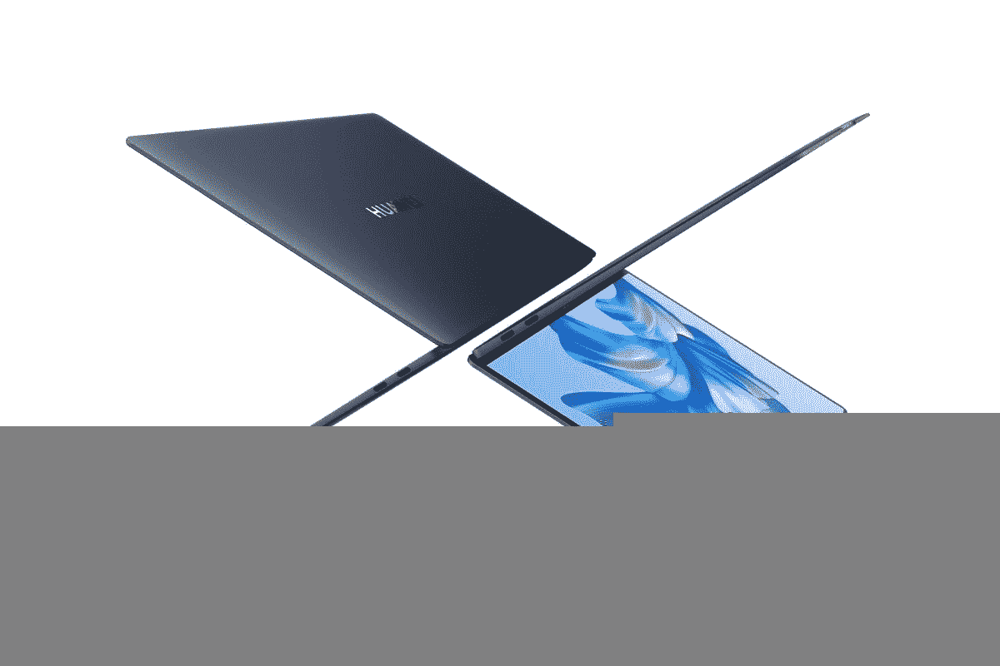
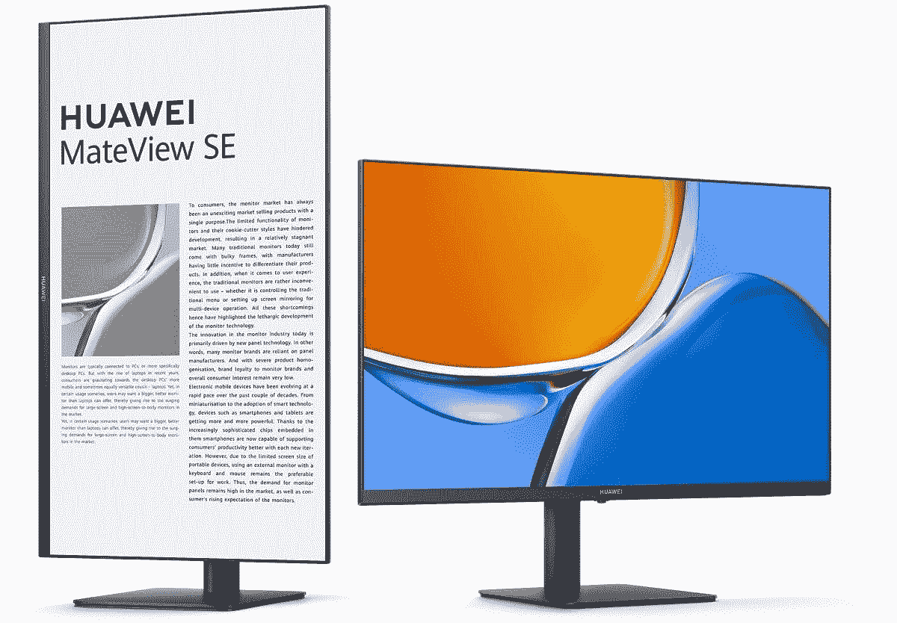

# 华为 MateBook X Pro 评测:又一个华为伟大，但仍不完美

> 原文：<https://www.xda-developers.com/huawei-matebook-x-pro-2022-review/>

尽管华为的手机业务因法律限制而陷入困境，但华为的笔记本电脑仍保持增长，华为 MateBook X Pro 的 2022 版是该公司的另一款出色的笔记本电脑。它的速度很快，有一个漂亮的显示屏，而且它建造得很坚固。它感觉像一台高级笔记本电脑，而且在大多数情况下，使用起来非常棒。

我对它有一些问题，首先是网络摄像头仍然不令人惊讶(尽管这次它的位置至少是正确的)。我也不喜欢麦克风的位置，因为如果我想在打电话时使用笔记本电脑，很容易分散注意力。

我想说这可能是我用过的最好的华为笔记本电脑，尽管我仍然希望有些东西是不同的。它远非完美无缺，但它值得一些关注。

华为还送了我一个 MateView SE 显示器，我和 MateBook X Pro 一起测试。我不认为它值得自己的评论，但我可以说它是一个坚实的基本显示器，有很好的彩色覆盖范围和一些有趣的功能，如长时间阅读的电子书模式。这绝对是值得一试的家庭和办公室使用。

 <picture></picture> 

Huawei MateBook X Pro (2022)

##### 华为 MateBook X Pro (2022)

华为 MateBook X Pro 是一款高端笔记本电脑，具有高端性能和漂亮、清晰的显示屏。

 <picture></picture> 

Huawei MateView SE (asjustable stand)

##### 华为 MateView SE

华为 MateView SE 是一款相当基本的显示器，但它仍然通过其 24 英寸的全高清面板提供了可靠的体验。

**浏览此评论:**

## 华为 MateBook X Pro:价格和可用性

*   华为 MateBook X Pro 现在有售，但是在美国买不到
*   它在英国的售价为 1799 英镑，包括一个英特尔酷睿 i7 处理器和 16GB 内存

华为 MateBook X Pro 于今年夏天首次发布，如果你在英国，现在就可以购买，尽管只能从华为的网站上购买。在某个时候，它可能会在亚马逊和其他零售商那里出售。

华为目前销售的唯一配置在英国售价 1799 英镑，在德国售价 2199 英镑，但它还包括一个免费的华为 MateView(标准型号，不是这篇评论中提到的 SE)，这使得价格更加合理。

## 华为 MateBook X Pro:规格

| 

中央处理器

 | 英特尔酷睿 i7-1260 处理器(12 个内核，16 个线程，最高 4.7GHz，18MB 高速缓存) |
| 

制图法

 | 英特尔 Iris Xe 显卡(96 EUs，最高 1.4GHz) |
| 

显示

 | 14.2 英寸全视角显示屏，3.1K (3120 x 2080) IPS，264 DPI，90Hz 刷新率，高达 500 尼特，100% DCI-P3，Delta E<1，10 点多点触控康宁大猩猩玻璃 |
| 

规模

 | 310 x 221 x 15.6 毫米(12.2 x 8.7 x 0.61 英寸)1.26 千克(2.78 磅) |
| 

记忆

 | 16GB LPDDR5(焊接) |
| 

储存；储备

 | 1TB NVMe PCIe 4 固态硬盘 |
| 

电池

 | 60 瓦时电池 |
| 

港口

 | 

*   2 个 Thunderbolt 4 (40Gbos)
*   2 个 USB Type-C(带电源和显示端口)
*   3.5 毫米耳机插孔

 |
| 

声音的

 | 六个立体声扬声器带噪声消除功能的四阵列麦克风华为声音 |
| 

连通性

 | Wi-Fi 6E，802.11ax 蓝牙 5.2 |
| 

照相机

 | 高清 720p RGB 和 IR 混合摄像头，电子隐私快门 |
| 

颜色

 | 太空灰 |
| 

材料

 | 铝金属 |
| 

操作系统（Operating System）

 | Windows 11 主页 |
| 

价格

 | 1799(含华为 MateView 显示器) |

## 设计:建造质量感觉优质

*   华为 MateBook X Pro 的全铝结构让人感觉像高端产品一样坚固
*   它只有 USB Type-C 端口，其中两个支持 Thunderbolt 4

如果有一件事我从来没有抱怨过华为的笔记本电脑，那就是制造质量。我评测过的每一台笔记本电脑都感觉超级坚固，这款也不例外。它有一个全铝底盘，有一个令人放心的分量，它感觉很坚固。由铝制成意味着它不是周围最轻的笔记本电脑，但 2.77 磅远不算重。就铝制笔记本电脑而言，它是你能找到的最轻的笔记本电脑之一。

我希望华为能改变的一件事是这款笔记本电脑的颜色。今年的版本有墨蓝色和白色配色，但我的审查单位仍然是经典的太空灰，我真的不喜欢。还不错，但是我评测过的几乎每一款华为/Honor 笔记本电脑都是这个颜色，就是有点闷。我认为键盘是黑色的，与机箱的颜色不匹配，这对我没有帮助，这会让我觉得它更高级。不过，华为确实在这方面做了一些不错的事情——我喜欢盖子和底座边缘闪亮的装饰，给这个原本平淡无奇的机箱增添了一点光彩。

另一件有趣的事情是触摸板，我将在稍后详细讨论。现在，我会说我喜欢它的样子。触摸板一直延伸到笔记本电脑的边缘，甚至在底部的凹口周围，所以从这个意义上来说，它看起来非常独特。

华为 MateBook X Pro 相当薄，尺寸为 15.6mm，但我对这里的端口选择还是有些失望。在笔记本电脑的左侧，有两个 Thunderbolt 4 端口，以及一个耳机插孔。

在右边，两个 USB Type-C 端口(不是 Thunderbolt)完善了端口的总选择。

USB Type-C 是未来，的确，如果每个外设都使用它，那就太好了。但是很多都没有，所以如果你有鼠标、键盘或外接显示器，你很可能需要适配器。有些人对此没有意见，因为他们已经有了一个 [Thunderbolt dock](https://www.xda-developers.com/best-thunderbolt-docks/) ，但当笔记本电脑要求我为相对基本的功能购买额外的外设时，我总是感到失望。虽然 15.6 毫米确实很薄，但也有更薄、端口更多的笔记本电脑。但由于华为将边缘做得比机箱的其他部分薄得多，实际上没有太多空间来放置其他东西。就我个人而言，我会选择稍微平坦一点的机箱来支持 USB Type-A 和 HDMI。

## 显示和声音:漂亮的 3.1K 屏幕

*   华为 MateBook X Pro 拥有超清晰的 3.1K IPS 显示屏，长宽比为 3:2
*   它覆盖了 100%的 DCI-P3，如果你需要它，它会变得非常明亮

华为 MateBook X Pro 配备了 14.2 英寸的显示屏，它的长宽比为 3:2，这已经是一个很好的开始。我试过几台 16:10 宽高比的笔记本电脑，但 3:2 更少见，看起来总是很棒。如果你想在阅读网页或文档时不滚动屏幕，更高的屏幕会让多任务处理变得更加容易，因此它非常适合工作。我不会说这与 16:10 有很大的不同，但我会一直欣赏更高的屏幕。

它也非常清晰，分辨率为 3120 x 2080，刷新率为 90Hz，尽管默认设置为 60Hz。不过，90Hz 的显示器实际上会大大缩短电池寿命，所以当你使用电池供电时，你可能希望坚持使用 60Hz。

你还可以获得触摸支持，这是我一直喜欢在笔记本电脑上看到的东西，即使它不是敞篷车。有很多情况下，我本能地想要伸出手去触摸屏幕，当我不能的时候很失望，所以我很高兴这里不是这种情况。

华为宣称这款显示器的 DCI-P3 覆盖率为 100%，颜色准确度为 Delta E < 1，的确，这是一款很棒的屏幕。从刚刚使用它，它看起来绝对精彩，充满活力的颜色和巨大的反差。我的测试显示，它覆盖了 98%的 DCI-P3、100%的 sRGB 和 89%的 Adobe RGB，这对内容创作者和创意专业人士来说非常棒。

我还测量了亮度和对比度水平，MateBook X Pro 在这方面也很出色。尽管华为标榜高达 500 尼特的亮度，但我实际上达到了 580，这对于任何笔记本电脑来说都是非常棒的，并且它达到了 1300:1 的最大对比度-对于 IPS 面板来说也是一个很好的结果。

至于声音，华为在 MateBook X Pro 中打包了一个六扬声器设置，虽然我不是一个发烧友，但我可以说它变得非常大声，我的耳朵没有明显的失真。这听起来很棒，无论是音乐还是语音通话，这都是华为在这款笔记本电脑上强调的东西，它称之为“华为智能会议”。有各种功能来增强您的声音，以及网络摄像头的过滤器和效果。

不幸的是，这种体验的其他部分使通话不太理想。笔记本电脑正面有四个麦克风，位于触摸板和腕托的正下方。如果你看不到这是哪里，这也是你的手去的地方，这意味着如果你在打电话时试图使用电脑，你会直接对着麦克风发出一些噪音，这对另一边的人来说不会是一个很好的体验。

我一直对我评论的所有华为笔记本电脑的一个批评是网络摄像头的位置，因为它通常在键盘下面。值得庆幸的是，这一次，华为将摄像头放在了显示屏上方，这是早就应该做的。然而，这仍然是一个 720p 网络摄像头，图像质量并不出色。像大多数 720p 相机一样，它是可用的，但它非常粗糙，远远谈不上清晰。这可能是因为笔记本电脑也支持 Windows Hello 面部识别，这在某种程度上弥补了我的图像质量。寡妇你好在这里工作真的很好，而且很方便。

## 第二个屏幕:华为 MateView SE 是一款非常棒的基本显示器

*   华为 MateView SE 采用全高清分辨率，刷新率为 75Hz
*   它覆盖了 90%的 DCI-P3，所以它仍然是伟大的创造性工作

除了 MateBook X Pro，华为还向我发送了 MateView SE，这是一款用于办公的相对基本的显示器。这是一个 24 英寸(技术上是 23.8 英寸)的显示器，它有全高清分辨率，这大约是你在这个价格上所期望的东西。它还具有 75Hz 的最大刷新率，如果你想让事情看起来更流畅一点，这很好。它并不是真的打算与 MateBook X Pro 相匹配，只是碰巧在同一时间公布。

不过，这是一个很好的屏幕。在我自己的个人显示器旁边，它看起来更明亮、更有活力，但感觉对眼睛来说更轻松一些。华为声称这款显示器覆盖了 90%的 DCI-P3，根据我的测试，这似乎是真的。它还覆盖了 81%的 Adobe RGB 和 80%的 NTSC，因此它是一个非常棒的面板，即使它没有 MateBook X Pro 那么棒。

至于亮度，华为只声称 250 尼特，这并不算特别，尽管对于一款更便宜的显示器来说并不是完全出乎意料。在我的测试中，它确实达到了 274 尼特，所以比宣传的要好一点。

也有一些可用的温度配置，包括温暖，标准，中性和凉爽，但你可以设置自己的自定义配置。我发现 Standard 是最好的(这是我在上面测试的)，因为它实际上比中性配置文件更“中性”，中性配置文件更倾向于更冷的白点，大约 7300K。

当然，显示器包括一些颜色配置文件，如 sRGB，HDR 模式和游戏模式，但我总是把它留在 P3 模式，以获得最佳的颜色覆盖范围。最值得注意的是电子书模式，这是为了更长时间的阅读。在这种模式下，显示器变成黑白，蓝光亮度显著降低，以减少阅读时的眼睛疲劳。

这个价位左右可以找到带 USB 集线器的显示器。

这款 MateView SE 还包括一个可调节的支架，因此你可以调节高度和倾斜角度，以及垂直旋转屏幕，如果你想在大屏幕上阅读，这与电子书的颜色配置文件非常匹配。不幸的是，它没有旋转支架，但显示器很容易调节，底座的超薄外形意味着它不会给你的桌面空间带来太大的麻烦。

对于输入，你有一个 HDMI 端口和一个 DisplayPort 端口，尽管盒子里只有 HDMI 电缆。这种端口设置并不可怕，但以这个价格，你可以开始找到一些显示器也有 USB 集线器，或至少内置扬声器，你也不会在这里得到。不过，大多数显示器可能不会有相同级别的彩色覆盖，所以这取决于您的优先选择。

## 键盘和触摸板:打字很棒，但我不喜欢这个触摸板

*   键盘有 1.5 毫米的行程，相当舒适
*   华为 Free Touch 为触摸板添加了一些非常酷的功能，但也存在一些问题

回到笔记本电脑本身，是时候谈谈键盘了，坦率地说，这很好。我通常对键盘不太挑剔，我会说这款相当不错。按键有整整 1.5 毫米的行程，这对于笔记本电脑来说非常好，而且打字起来感觉很舒服。我真的对它没有任何问题，尽管我不认为我会把它放在与联想笔记本电脑或我最近评测的 Dynabook Portégé X40L-K 相同的水平上。那些都有很棒的键盘，这个也很棒，但没那么神奇。

这个键盘没有什么太值得注意的地方，除了华为似乎利用了以前隐藏网络摄像头的空间，添加了一个启动 Windows 语音打字功能的新键。对某些人来说，这可能是一个有用的特性，尽管它看起来像是一个仓促的决定，只是为了利用那个空间。电源按钮仍然内置指纹传感器，即使面部识别已经可用，所以你可以选择你喜欢的任何方法。

键盘下面是触摸板，它同时超级酷，也有些令人失望。华为有一段时间一直在吹捧一些独特的触摸板功能，比如敲触摸板截图。在 MateBook X Pro 中，你总共可以使用触摸板执行八种手势，包括通过单击触摸板的顶角来最小化或关闭活动窗口。我最喜欢的是，你可以在触摸板的右边缘滑动单个手指来调节音量，或者在左边缘滑动单个手指来调节显示亮度。这并不完全是新的，但华为在这个机制中添加了触觉反馈，所以你可以感受到每一个调整程度。你甚至不用用力按它，它识别出手势就开始点击。我不能夸大我有多喜欢这种触感。

不过，我希望这能扩展到触摸板的基本功能。点击这个触摸板的感觉并不好，尤其是当你试图点击和拖动，并且将手指向上移动到触摸板的中间时。我不止一次发现自己不确定是否已经将手指从触摸板上抬起足够长的时间，并且我不小心拖动了一些东西或者选择了过多的东西。如果你只是点击触摸板的底部，感觉很好，但虽然它仍然可以在中间附近点击，但触感不在那里，所以它有时会影响我的工作。

## 性能:速度很快，但电池寿命仍然是英特尔 P 系列的一个问题

*   英特尔酷睿 i7-1260P 处理器和 16GB 内存为您的日常工作提供充足的性能
*   英特尔 P 系列处理器的电池续航时间仍然不够长

谈到性能，华为 MateBook X Pro 配备了英特尔酷睿 i7-1260P，这是英特尔 P 系列的一部分，默认 TDP 为 28W。拥有 12 个内核和 16 个线程，对于像这样相对轻便的笔记本电脑来说，这是一个非常强大的 CPU，它由 16GB 的 RAM 支持。在我的使用中，大部分是在打开多个标签页的情况下浏览网页时使用 WordPress，我从未遇到过任何性能障碍。我也做一些光图像编辑，这也没有太大的问题。笔记本电脑也不会发出太大的声音，尽管风扇偶尔会转得很快。

查看基准测试，分数大约是您对该处理器的期望。它与我评测过的其他采用英特尔 P 系列处理器的笔记本电脑不相上下，在一些测试中，它甚至击败了 Dynabook Portégé X40L-K，后者采用了酷睿 i7-1270P 处理器。如果你想获得最佳性能，你需要在华为电脑管理器中启用性能模式。在某些情况下，它看起来实际上执行得更差，但在大多数情况下，这样会更快。这就是这些基准的基础。

|  | 

华为 MateBook X ProCore i7-1260P

 | 

Dynabok Portégé X40L-K 酷睿 i7-1270P

 | 

[惠普 Spectre x360 13.5](https://www.xda-developers.com/hp-spectre-x360-13-5-review/) 酷睿 i7-1255U

 |
| --- | --- | --- | --- |
| 

PCMark 10

 | 5,653 | 4,878 | 5,533 |
| 

3DMark:时间间谍

 | 1,967 | 1,939 | 1,553 |
| 

Geekbench 5(单/多)

 | 1,761 / 9,865 | 1,742 / 9,195 | 1,682 / 7,534 |
| 

Cinebench R23(单/多)

 | 1,543 / 9,348 | 1,707 / 8,319 | 1,684 / 6,287 |
| 

交叉标记(总体/生产力/创造力/响应能力)

 | 1,791 / 1,666 / 1989 / 1,624 | 1,504 / 1,407 / 1,774 / 1,119 | 1,593 / 1,509 / 1,781 / 1,340 |

英特尔 P 系列处理器仍然存在散热和电池寿命问题。

虽然散热不是这款笔记本电脑最糟糕的，但这些结果凸显了英特尔酷睿 P 系列处理器的一个问题。它们有更高的 TDP 和更快的潜力，但公司正在将它们放在以前有 15W 处理器的笔记本电脑中，这在这种情况下没有意义。这几乎是今年早些时候拥有 U 系列处理器的同一机箱，现在它的 CPU 产生了更多的热量，需要更多的冷却。虽然它比仍然采用 U 系列处理器的 HP Spectre x360 13.5 更快，但在许多测试中，这种差异并不是很大。

这些处理器的第二个缺点是电池寿命。为了测试这台笔记本电脑的电池寿命，我做了两件事。首先，为了进行更标准化的测试，我让一个 20 小时的 YouTube 视频播放(720p，全屏)，亮度和音量设置为 50%。它持续了大约 6 小时 40 分钟，这并不可怕。然后，在现实生活中，我只是像往常一样用它来工作，亮度设置为 50%，刷新率为 60Hz，Windows 电源设置为平衡，电池节电模式的电池寿命为 20%。总的来说，电池寿命在 4 小时 40 分钟左右。我得到的最糟糕的结果是三个多小时，但这是一个明显的异常值，在大多数情况下，我至少非常接近四个小时。有一次，我睡了 5 个小时。

坦白地说，那没有我想象的那么糟糕。考虑到我评论过的其他配备 P 系列处理器的笔记本电脑，以及这款电脑拥有令人难以置信的清晰显示屏的事实，我原本预计会糟糕得多，所以这是一个惊喜。尽管如此，它离惊人的电池续航时间还很远，如果你打算带着笔记本电脑去某个地方，你会想要一个附近的插座。

## 华为生态系统和软件

*   你可以将你的华为手机或平板电脑连接到 MateBook X Pro
*   华为还包括华为智能会议和免费触摸等功能

华为笔记本电脑的一大卖点是如何与华为生态系统融合，这里也是如此。这里没有什么新东西，但是如果你不熟悉的话，还是值得重申一下。你可以做的事情之一是将你的手机连接到你的笔记本电脑，这让你可以镜像你的手机屏幕，甚至可以同时打开你手机上的多个应用程序。您还可以轻松地将文件从手机传输到 PC。

有了华为平板电脑，你实际上可以将它用作笔记本电脑的第二块屏幕，所以如果你想在旅途中拥有两块屏幕，这是一个很好的功能。您还可以使用电脑鼠标和键盘与平板电脑进行交互，更轻松地在设备之间移动文件。再说一次，这并不新鲜，因为我个人并不使用华为手机或平板电脑，所以我觉得它没那么有用。

奇怪的是，我似乎无法启用华为移动应用引擎，该引擎应该可以让你在 Windows 上运行 Android 应用，即使没有 Windows 11 或使用 Android 的 Windows 子系统。华为 PC Manager 应用程序中没有提到它，所以可能这台笔记本电脑还不支持。

不过，华为在笔记本电脑中捆绑了其他软件。首先，有华为声音和华为相机，它们统称为华为也称为“智能会议”的一部分。华为 Sound 提供了一些不同的设置，以增强视频通话期间的语音识别，因此在特定场景下，您可以听得更清楚。你也可以调整你的扬声器的音频，尽管这些功能和你用标准音频驱动程序得到的并没有什么不同。

华为相机更有趣，因为它可以将虚拟背景应用到您的网络摄像头，添加美颜滤镜等等。它不能弥补我们这里黯淡无光的网络摄像头，但它可能很好，而且由于远程工作的广泛过渡，许多其他笔记本电脑已经开始这样做。

最后，华为 Free Touch 让您可以定制使用这种独特触摸板的手势。正如我上面提到的，有八种手势可用，它们通过为您提供某些功能的快捷方式来帮助您充分利用触摸板。这些实际上非常有用，尽管这取决于你是否愿意去习惯它们。我已经提到过在边缘滚动来调整音量或亮度，但你可以用指关节敲触摸板来截图或录制屏幕，按触摸板的顶角来关闭或最小化一个窗口，等等。

## 谁应该买华为 MateBook X Pro？

总而言之，我认为华为 MateBook X Pro 有很多东西可以提供，虽然它有点贵，但对于你所得到的东西来说并不算贵。同样，1799 美元的价格标签包括一个相当昂贵的显示器，所以这并不像最初看起来那么贵。你所支付的，你会得到一个惊人的显示，伟大的声音，优质的建设质量，以及良好的打字体验。你不能要求更多了。除了，也许，在美国可以买到。

**你应该买华为 MateBook X Pro 如果:**

*   您是一名富有创造力的专业人士，想要色彩准确的显示器
*   消费大量媒体，如电影、音乐或网络视频
*   您重视高端设计和制造质量
*   你花很多时间打字

**你不应该买华为 MateBook X Pro 如果:**

*   你住在美国
*   电池续航时间长对于您的使用情形至关重要
*   您希望使用内置网络摄像头和麦克风打很多电话
*   您有许多外围设备需要传统端口，并且不需要适配器

我对华为 MateBook X Pro 最大的问题是内置的网络摄像头和麦克风设置，加上缺乏传统端口是不幸的。我也不喜欢触摸板的某些方面，但你可能会习惯它的工作方式。

至于华为 MateView SE，我想说这是一个不错的价格显示器。我发现缺少扬声器有点遗憾，因为我也想把我的任天堂 Switch 连接到它上面，但如果你只使用笔记本电脑，它可能已经比这个价格范围内的任何显示器都有更好的扬声器。这样做的原因是漂亮的颜色覆盖，枢轴支持和电子书模式，如果你花很多时间阅读，这可能会派上用场。

 <picture></picture> 

Huawei MateBook X Pro (2022)

##### 华为 MateBook X Pro (2022)

华为 MateBook X Pro 是一款高端笔记本电脑，具有高端性能和漂亮、清晰的显示屏。

 <picture></picture> 

Huawei MateView SE (asjustable stand)

##### 华为 MateView SE

华为 MateView SE 是一款相当基本的显示器，但它仍然通过其 24 英寸的全高清面板提供了可靠的体验。