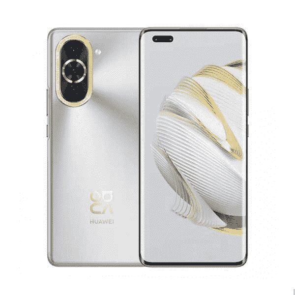

# 华为 Nova 10 Pro 评测:独特的硬件组合，既酷又贵

> 原文：<https://www.xda-developers.com/huawei-nova-10-pro-review/>

华为 Nova 系列是一个有趣的系列，主要面向年轻人，价格更实惠。它通常包含一些旗舰级的功能，但在其他一些功能上有所下降，华为 Nova 10 Pro 坚持这一理念，增加了一些亮点。

值得一提的是，这是华为的老问题，就像它之前的其他设备一样。你没有得到 Play Store，你得到了 AppGallery，你过去在 AppGallery 上可能遇到的任何同样的困难在这里仍然适用。这并不是说没有改进——事实上，AppGallery 已经开始成为我的一个不错的选择。然而，对于大多数人来说，它仍然没有达到值得转换的水平。它对大多数事情都很有效，但它并不完美，我仍然经常发现自己在某些任务上挣扎。

我喜欢 Nova 10 Pro 作为一款智能手机，但像往常一样，软件情况有时很难克服，尤其是价格。

 <picture></picture> 

Huawei Nova 10 Pro

##### 华为 Nova 10 Pro

华为 Nova 10 Pro 是华为的一款时尚中端智能手机，内置一些非常酷的摄影技术。

* * *

## 华为 Nova 10 Pro:规格

|  | 

华为 Nova 10 Pro

 |
| --- | --- |
| 

中央处理器

 | 骁龙 778G 4G |
| 

尺寸和重量

 | 

*   164.2 毫米 x 74.5 毫米 x 7.9 毫米
*   191g

 |
| 

显示

 | 

*   6.78 英寸有机发光二极管 1200x2652
*   10.7 亿种颜色，HDR10
*   120 赫兹

 |
| 

照相机

 | 

*   50MP f/1.8 PDAF
*   800 万像素超宽，f/2.2，112 度
*   2MP 深度传感器
*   6000 万像素 100 度前置摄像头
*   800 万像素 2x 长焦前置

 |
| 

记忆

 | 8GB 内存，128GB/256GB |
| 

电池

 | 4500 毫安时 |
| 

网络

 | 仅支持 LTE 和 4G |
| 

传感器

 | 光学显示指纹传感器、加速度计、气压计、陀螺仪传感器、地磁传感器、霍尔传感器(模拟)、接近传感器、光传感器 |
| 

港口

 | USB-C 2.0 |
| 

操作系统（Operating System）

 | 搭载 EMUI 12 的 Android 12 |
| 

颜色；色彩；色调

 | 黑色、银色、绿色、紫色 |
| 

价格

 | 从€699 号开始 |

***关于这次评测:*** *我最近去柏林 IFA 的时候收到了华为发来的 Nova 10 Pro 进行评测。虽然该公司赞助我与其他媒体人员一起参加此次活动，但它并没有对此次审查的内容提供任何意见。*

* * *

## 设计

华为 Nova 10 Pro 的设计很漂亮，虽然有点过了。这款手机的正面非常漂亮，有一个 6.78 英寸的 120Hz AMOLED 显示屏。左上角有一个药丸形状的摄像头切口，它包含两个前置摄像头。然而，它不是用于面部解锁的——其中一个是用于自拍的 60MP 前置摄像头，支持高达 100 度的视野，另一个是 2x 长焦。

然而，在背面，事情变得真正令人眼花缭乱。摄像头模块被一个金环包围，摄像头岛中央的主传感器也被黄金包围。这款手机的背面有某种轻微纹理的金属，底部印有该公司的 nova 标志...也是金色的。它看起来很好，但我认为相机模块有点俗气。

我猜这是一个“年轻”的设计，这显然是华为一直在追求的。它在手中感觉很好，除了它有多夸张之外，我没有太多的批评。如果不是因为疯狂的金戒指，我想这将是今年发布的廉价手机中我最喜欢的设计之一。附带的盒子*确实*覆盖了相当多的黄金，所以如果你喜欢，你可以直接使用它。

顶部和底部有双扬声器，相当不错的触觉，显示屏是弯曲的。底部还有一个光学显示屏下指纹传感器。所有这些都增加了手机的高级感，特别是曲面显示屏(实用性除外)通常只为旗舰智能手机保留。我们已经看到越来越多的中端选项推出，但 Huwaei Nova 10 Pro 的整个工作就是尽可能像旗舰一样。

* * *

## 华为 Nova 10 Pro:摄像头

公平地说，华为在相机方面并没有真正失去影响力。Nova 10 Pro 有一个非常好的相机系统。一些最强大的相机硬件在这里去前置摄像头系统，包装 60MP 超宽。这是一个非常高质量的传感器，看起来不错，我认为这对于这款设备的目标市场来说是有意义的。

另一个非常酷的功能是前置摄像头的 2 倍长焦。你见过社交媒体平台上的视频显示用户放大他们身后的东西吗？这正是*的目的。这并不完全符合我的胃口，但将它包含在针对年轻人的手机中是完全有意义的。质量也不差，超宽的宽度非常适合一张照片容纳很多人。下面的自拍照是压缩的，但你可以在 Flickr 相册中找到未压缩的版本。*

最后，背面的摄像头也很不错。我特别注意到它们在弱光下表现很好，我在夜间散步时拍了一些令人印象深刻的照片。奇怪的是，我在白天拍摄天空时遇到了一些奇怪的事情，但我认为这些问题可以随着时间的推移得到解决。您可以在下面嵌入的 Flickr 相册中查看未压缩的照片。

* * *

## 华为 Nova 10 Pro: EMUI

华为 Nova 10 Pro 预装了基于 Android 12 的 EMUI 12。正如你所知，谷歌 Play 没有服务，所以你需要利用华为自己的 AppGallery 来获取应用程序。随着时间的推移，它肯定会改善。你可以在商店里找到特定地区的应用程序，而且每天都有越来越多的应用程序被添加进来。一些爱尔兰和德国的银行仍然无法使用它，但这肯定比以前好了。

然而，可悲的是，对大多数人来说，尽管在华为手机上付出了努力并取得了进展，但仍然很难推荐华为手机。它就要实现了，我*终于*明白了该公司在 HMS 方面的努力来自哪里，但还没有远到任何人都可以简单地*使用华为手机。有一些预算选项可以做很多华为可以做的事情，但有了 Google Play 服务，就可以像以往一样轻松地切换和获得所有你喜欢的应用程序。我确实发现曲线薪酬有助于弥补一些差距，因为这是我之前无法做出改变的一个重要原因。*

问题是，换成华为手机就是换成了一个全新的生态系统。同样，用户可以从 Android 切换到 iPhone，出于论证的目的，用户可以从“Android”(正如我们所知的)切换到华为的 EMUI。都是 Android，但向 EMUI 的跳跃是一个更大的飞跃，需要熟悉一个全新的生态系统，它有自己的怪癖。当你切换到 iPhone 时，你也不能访问你所有的应用程序，但是在 App Store 上有很多选择。

然而，如果不是每个重要的应用程序都在 AppGallery 上，那么*就会*起作用。如果我的银行应用程序在 AppGallery 上，如果我可以持续使用手机在商店支付，如果我可以轻松地在手机上接收电子邮件，那么我就会感兴趣。然而，这些都不是事实，安装另一个电子邮件应用程序，如 Blue Mail ( [，华为推荐](https://consumer.huawei.com/en/community/details/App-Recommendation-Blue-Mail-Never-Miss-Your-Email-Push-Notifications/topicId_135585/))也不是 Gmail 的完美替代品。我还发现，有时候，AppGallery 搜索/花瓣搜索很糟糕，我需要转到我的浏览器搜索一个应用程序。我遇到的最好的例子是 3DMark。

我现在明白华为的目标了，那就是创造一个完全不同的生态系统。它不是 Android(嗯，它是，但它不是同一个生态系统)，它显然也不是苹果。华为想成为第三个玩家。它正在实现，但是在解决这些问题之前，到目前为止，很难证明对大多数人来说是正确的。我认为这个领域的第三个参与者是很好的竞争，正如他们所说，罗马不是一天建成的。也许现在还不好，但谁知道 AppGallery 的未来会怎样。

但我要说的一件事是:当我打开 AppGallery 时，为什么会出现一个闪屏广告？

* * *

## 华为 Nova 10 Pro:性能

华为 Nova 10 Pro 配备了 4G 版的骁龙 778G，性能非常出色。在正常使用中，你不会注意到任何问题，它会处理你能处理的任何事情。我在使用这款设备时遇到的唯一延迟是在拍照和切换应用程序时的相机取景器中，但这种延迟很少，而且是短暂的。

不过，就像这款芯片组一样，它配备了一个相当不给力的 GPU。你不会在这款手机上玩游戏，因为 Adreno 642L 落后于许多竞争对手，不会在很多游戏中存活下来。当我在 Honor 70 中测试这款芯片组时，它甚至难以在最低设置下实现 Genshin Impact 中的稳定帧率。如果你想要一部游戏手机，那么这款手机应该避免，除非你是一个休闲游戏玩家。你可以玩像 *PUBG* 、*使命召唤*或*神庙逃亡*这样的游戏，但你必须将图形设置调低一点。

然而，在正常使用情况下，你使用手机不会有任何问题。浏览互联网、给朋友发短信、拍照，一切都会非常顺利。这是一个伟大的芯片组，对于那些只是正常使用手机而没有任何超级密集的人来说。

* * *

## 充电和电池寿命

华为 Nova 10 Pro 的另一个头条特点是充电速度。在盒子里装一个 100W 的充电器，这款手机从 0%充到 100%需要 20 分钟。对于目标市场来说，像这样的快速充电速度是有意义的，因为它针对的是那些在路上的人，他们可能需要一次短时间给手机充电。

最重要的是，华为自己的 EMUI 软件在电池寿命方面相当不错，芯片组也是如此。在我作为日常司机使用的几天里，这部手机的电池还不错，能够让我度过一天。虽然这与我在其他手机上的正常使用情况相去甚远，因为我无法使用我所有的应用程序。这样一来，你的里程数肯定会有变化。

* * *

## 该不该买华为 Nova 10 Pro？

华为 Nova 10 Pro 在过去两年中遭遇了与之前所有华为设备相同的问题，那就是很难向几乎所有人推荐。我在今年早些时候评测了华为 P50 Pro，非常喜欢它，当谈到 AppGallery 时，我真的感受到了该公司正在做什么。尽管如此，目前对我来说，要转换成全职还是非常困难的。它没有我需要的所有东西，即使它正在向那里发展，但现在它不在那里。

换句话说，在它出现之前，很难推荐它。相机很棒，但在这款设备的定价(€699 对于这里提供的东西来说相当昂贵)和一些普通消费者可能会遇到的困难之间，我真的不知道如何推荐这款手机。如果 Revolut 是你的主要银行，而你不在乎总是按时收到电子邮件通知，那么这款手机可能会更容易销售。然而，目前还不是。尽管我很想这样。

 <picture></picture> 

Huawei Nova 10 Pro

##### 华为 Nova 10 Pro

华为 Nova 10 Pro 是华为的一款时尚中端智能手机，内置一些非常酷的摄影技术。

不管怎样，这款手机是一个好兆头，华为真的在听，事情正在向前发展。AppGallery 每天都在改进，随着每个应用程序服务的本地化方法(AppGallery 上有爱尔兰版本的应用程序，这给我留下了非常深刻的印象)，它开始达到一个点，我认为我*可以*推荐它。那一天还没有到来，但是在这个领域有一个可行的竞争者，至少对消费者来说总是好的。这也是一款独一无二的手机，它拼凑的功能足够独特，我认为华为开始意识到，要想蓬勃发展，它需要找到一个可行的利基市场。这很可能是一个开始。