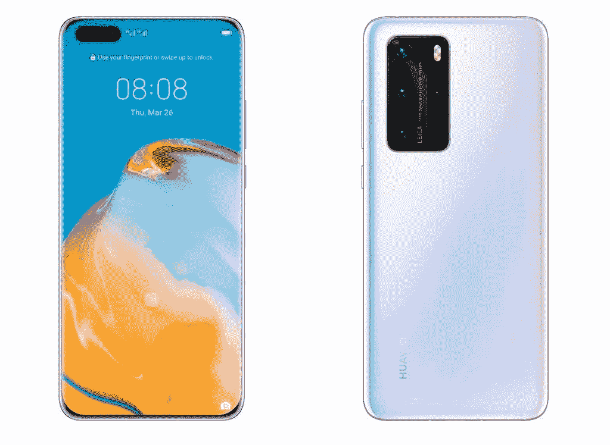
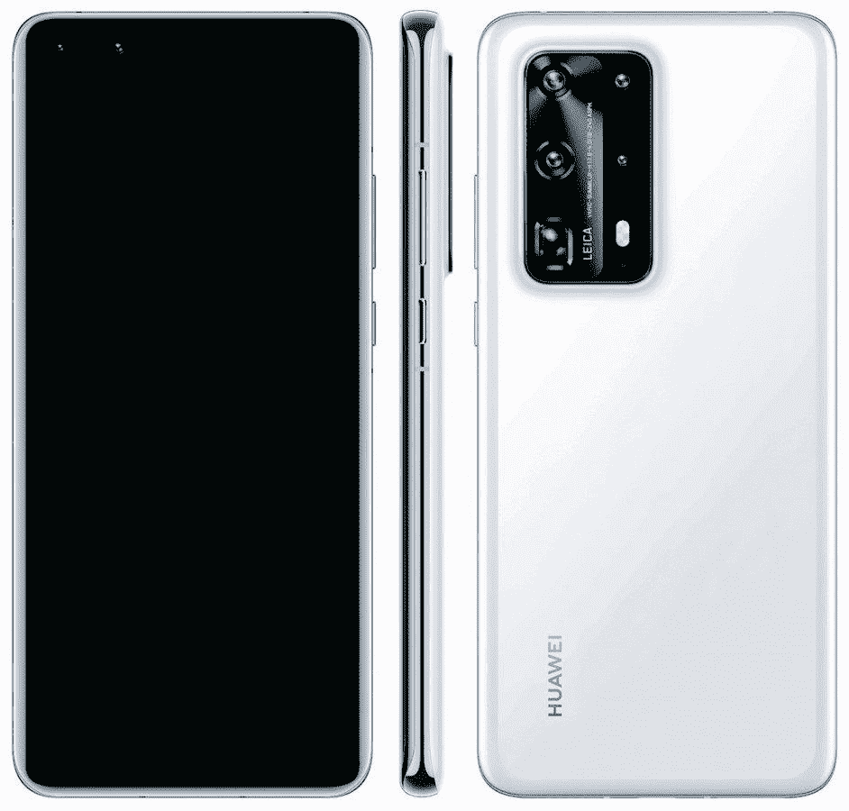
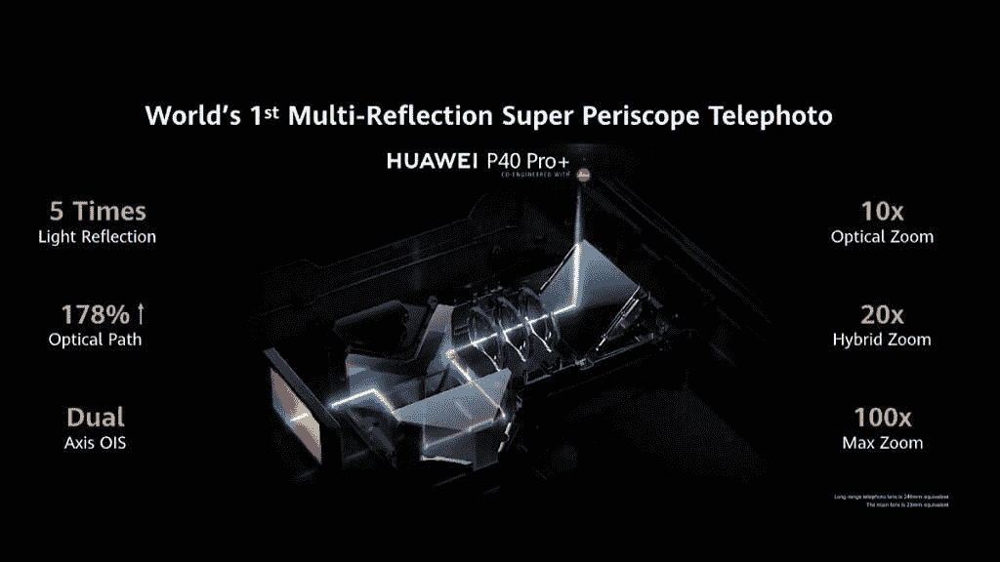

# 华为 P40、P40 Pro 和 Pro+宣布推出 5G 和 UltraVision 摄像头

> 原文：<https://www.xda-developers.com/huawei-p40-pro-specifications-features-pricing-availability/>

回到 12 月，华为[计划在 3 月发布](https://www.xda-developers.com/huawei-p40-launch-march-2020-huaweis-version-google-mobile-services/)P40 系列。可以说*从那以后世界发生了很大的变化，但是华为仍然在继续发布他们的产品。该公司现已在一次在线发布会上正式发布了华为 P40、华为 P40 Pro 和华为 P40+。*

华为 P40 系列实际上是在 2 月份推出的 P40 Lite，但今天我们终于看到了旗舰产品。这些是华为 2020 年最新的高端智能手机，它们将大量功能打包成有吸引力的包。显示器尺寸从 6.1 英寸到 6.58 英寸不等，但总的来说，该系列有许多相同的规格。

**华为 P40 Pro XDA 论坛 **

## 华为 P40 系列:规格

| 

规范

 | 

华为 P40

 | 

华为 P40 Pro

 | 

华为 P40 Pro+

 |
| --- | --- | --- | --- |
| **尺寸&重量** | 

*   148.9 x 71.06 x 8.5mm 毫米
*   175 克

 | 

*   158.2 x 72.6 x 8.95mm 毫米
*   203 克

 | 

*   158.2 x 72.6 x 9.0mm 毫米
*   226 克

 |
| **显示** | 

*   6.1 英寸
*   有机发光二极管（Organic Light Emitting Diode 的缩写）
*   2340 x 1080

 | 

*   6.58 英寸
*   有机发光二极管（Organic Light Emitting Diode 的缩写）
*   2640 x 1200
*   90 赫兹

 | 

*   6.58 英寸
*   有机发光二极管（Organic Light Emitting Diode 的缩写）
*   2640 x 1200
*   90 赫兹

 |
| **CPU** | 麒麟 990 5G 八核 CPU:

*   2 个 Cortex-A76 @ 2.86 GHz
*   2 个 Cortex-A76 @ 2.36 GHz
*   4x Cortex A55 @ 1.95 GHz

 | 麒麟 990 5G 八核 CPU:

*   2 个 Cortex-A76 @ 2.86 GHz
*   2 个 Cortex-A76 @ 2.36 GHz
*   4x Cortex A55 @ 1.95 GHz

 | 麒麟 990 5G 八核 CPU:

*   2 个 Cortex-A76 @ 2.86 GHz
*   2 个 Cortex-A76 @ 2.36 GHz
*   4x Cortex A55 @ 1.95 GHz

 |
| **闸板** | 8GB | 8GB | 8GB |
| **存储** | 128GB，nano 存储卡扩展 | 256GB，nano 存储卡扩展 | 512GB，nano 存储卡扩展 |
| **后置摄像头** | 

*   带 RYYB 的 5000 万像素 UltraVision，4 合 1 像素宁滨，f/1.9
*   16MP 超广角摄像头，f/2.2
*   800 万像素 OIS 长焦，f/2.4

 | 

*   带 RYYB 的 5000 万像素 UltraVision，4 合 1 像素宁滨，f/1.9，OIS
*   40MP 视频和超广角摄像头，f/1.8
*   1200 万像素超感光长焦，f/3.4
*   飞行时间传感器

 | 

*   带 RYYB 的 5000 万像素 UltraVision，4 合 1 像素宁滨，f/1.9，OIS
*   40MP 视频和超广角摄像头，f/1.8
*   8MP 10X 光学超级潜望镜长焦
*   800 万像素 3 倍光学长焦
*   飞行时间传感器

 |
| **前置摄像头** | 32MP，f/2.2 | 

*   32MP，f/2.2
*   红外深度传感器

 | 

*   32MP，f/2.2
*   红外深度传感器

 |
| **操作系统** | 基于 Android 10 的 EMUI 10.1(无谷歌服务) | 基于 Android 10 的 EMUI 10.1(无谷歌服务) | 基于 Android 10 的 EMUI 10.1(无谷歌服务) |
| **电池** | 3800 毫安时 | 4200 毫安时 | 4200 毫安时 |
| **充电** | 40W 有线充电 | 

*   40W 有线充电
*   27W 无线充电

 | 

*   40W 有线充电
*   40W 无线充电

 |
| **连通性** | 

*   GSM、HSPA、LTE、5G
*   蓝牙 5.1
*   WiFi AX
*   国家足球联盟
*   电子 SIM 卡
*   GPS，AGPS，Glonass，伽利略，QZSS

 |  |  |
| **传感器** | 指纹传感器、接近传感器、环境光、指南针、加速度计 | 指纹传感器、接近传感器、环境光、指南针、加速度计 | 指纹传感器、接近传感器、环境光、指南针、加速度计 |
| **杂项** |  |  |  |

## 华为 P40 系列:设计

正如您所料，这三款设备的设计非常相似。它们都有位于背面左上角的矩形摄像头模块。所有这三个还具有打孔显示器，孔放在左上角。说到显示器，Pro 和 Pro+有 90Hz 的显示器，华为在这些显示器上包括了他们所谓的“溢出显示器”。

 <picture></picture> 

Huawei P40 Pro - Ice White

溢出显示是完全的边对边显示。显示屏的四边都是弯曲的，在你触摸的任何地方都能形成非常平滑的过渡。显示屏的可用区域在边缘处略微弯曲，但与 Mate 30 Pro 的“瀑布”显示屏相差甚远。这创造了一个惊人的无边框的感觉，而不牺牲可用性。华为 P40 Pro 和 P40 Pro+的显示屏为 6.58 英寸，而 P40 的显示屏较小，为 6.1 英寸。

 <picture></picture> 

Huawei P40 Pro+

该显示器也是 Goodix 的“超薄”光学显示指纹传感器的所在地。该传感器比上一代传感器大 30%，速度快 30%。华为也有一些新奇的动画与之搭配。Goodix 还为 P40 系列提供了 AMOLED 触摸控制器和智能音频放大器。

坚持设计，有许多颜色可供选择。所有这三种型号都有冰白色、深海蓝和光滑表面的黑色可供选择。哑光表面还有银霜色和腮红金色可选。P40 Pro+有陶瓷背面，有黑色和白色可选。

## 摄像机

## 

如果巨型相机模块没有放弃，华为 P40 系列在相机部门有很多事情要做。这三个设备上的头条新闻是一个 50MP RYYB 1/1.28 " "超视觉传感器。“与去年 P30 系列的 40MP 传感器相比，这款相机拥有最高的进光量、更高的动态范围和更低的噪声。

为了配合更大的传感器，华为 P40 系列还拥有一个新的高清图像引擎。这是该公司的第三代人工智能图像引擎，它有许多改进。它逐像素地进行无损图像分离，优化每一个可能的场景，并且在任何焦距下都可以做到这一点。您可以拍摄大照片，并将其分割成较小的照片，而不会降低质量。

另一个很酷的技巧是“超级分辨率”手机从主摄像头和长焦镜头获取信息，并将它们合并在一起，创建一个分辨率提高的图像。这些功能与 XD Fusion 引擎配合使用，因此您可以在一天中的任何时间放大和裁剪，以创建清晰的图像。

说到变焦，P40 系列在变焦方面有很多能力。标准的 P40 可以做 3 倍光学变焦，拍人像很好。P40 Pro 可以使用超灵敏超变焦镜头进行 5X 光学变焦。P40 Pro+具有短程、中程和远程多功能性。它可以进行 3 倍光学变焦和 10 倍光学变焦，并声称可以在它们之间平滑过渡。

这三款设备的正面都有一个 32MP 摄像头，但 Pro 和 Pro+也有一个红外深度传感器。除了 50MP 主摄像头，P40 Pro 还有 40MP 广角摄像头，5MP 长焦镜头和 TOF 镜头。除了主 50MP 和 40MP 广角相机之外，P40 Pro+还具有双 8MP 长焦镜头和 TOF 镜头。

虽然硬件令人印象深刻，但它与软件相结合，可以产生更多的多功能性和功能。在华为 P40 系列上，由于采用 AI AWB 算法的多光谱色温传感器，无论灯光如何复杂，您都可以拍摄工作室般的照片。黄金瞬间功能在按下快门按钮之前拍摄多张照片，并为您呈现三张最佳照片以供保存；虽然这种功能在其他手机上已经存在了一段时间，但 P40 系列的这一功能令人印象深刻，因为它采用了更新的相机硬件。该软件还可以实现简洁的编辑技巧，例如从图像中消除对路人的拍照轰炸，以及消除隔着玻璃拍摄时的反射。船上还有一个手持超级夜间模式。

对于录像来说，这些设备有相当多的功能。你可以在 HDR 拍摄，4K 60fps，4K 延时，7680fps 超慢动作，OIS 加 AIS 超稳长焦视频录制。由于 3 个立体声麦克风，这些手机还能够进行音频缩放。当然，相机上也有专业模式用于视频录制。

## 表演

再说性能。P40 系列搭载麒麟 990 5G SoC，包含 16 核 Mali-G76 GPU。P40 Pro+具有 4 层过冷系统、3D 石墨烯薄膜和超薄蒸汽室冷却系统。P40 配有 3800 毫安时电池，而 P40 Pro 和 Pro+配有 4200 毫安时电池。三个都有 40W 有线充电，Pro+也有 40W *无线*用华为充电板充电。P40 Pro 支持 27W 无线充电。

## 软件

华为 P40 系列带有该公司的 EMUI 皮肤，在这里是基于 Android 10 的 EMUI 10.1。华为推出了一款名为“MeeTime”的预装应用。这是一款类似 FaceTime 和 Google Duo 的视频/音频通话应用。它声称在网络带宽差的情况下有最好的分辨率。其他一些功能包括背景变化、屏幕共享和平板电脑支持。

谷歌应用显然是华为设备的一个大话题，而 P40 不包括它们。华为有 3000 名工程师从事 [HMS Core(华为移动服务)](https://www.xda-developers.com/huawei-hms-core-android-alternative-google-play-services-gms/)开发。他们与 Qwant 合作在欧洲进行搜索。华为也有其即时应用的替代品，名为“[华为快捷应用](https://www.xda-developers.com/huawei-quick-apps-alternative-google-instant-apps/)

华为在 P40 系列的 EMUI 10.1 上也有自己的语音助手，叫 Celia。你可以通过命令“嗨，西莉亚”或按住电源按钮一秒钟来召唤语音助手。Celia 可以帮助您完成常规的日常任务，例如发起电话和文本，设置日历约会和提醒，开始语音记录，翻译句子，播放音乐，视频，切换设备设置和手电筒，当然，还可以搜索体育，天气等信息。Celia 兼容 HiVision 人工智能镜头和人工智能触摸购物。Celia 将在英国、法国、西班牙、智利、墨西哥和哥伦比亚以英语(英国)、法语和西班牙语等语言提供。

**华为 P40 Pro XDA 论坛 **

## 定价和可用性

这些手机有很多很棒的功能，尤其是在相机方面，但是它们的价格是多少呢？华为 P40 在€的售价为 799 英镑(876 美元)，将于 4 月 7 日开始发售。P40 Pro 售价€999 英镑(1095 美元)，也将于 4 月 7 日上市。最后，Pro Pro+的价格为€1399 英镑(1534 美元)，将于 6 月份上市。华为表示，这些设备将在“选定的市场”上市。下面是价格和颜色选项的简单分类:

| 

型号

 | 

颜色

 | 

价格

 |
| --- | --- | --- |
| 华为 P40 |  | €799 |
| 华为 P40 Pro |  | €999 |
| 华为 P40 Pro+ |  | €1399 |