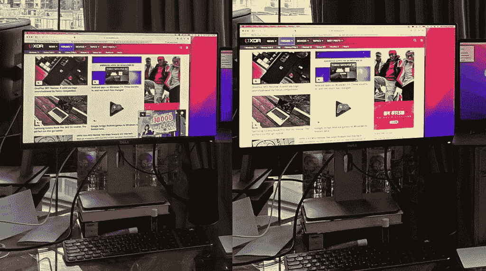
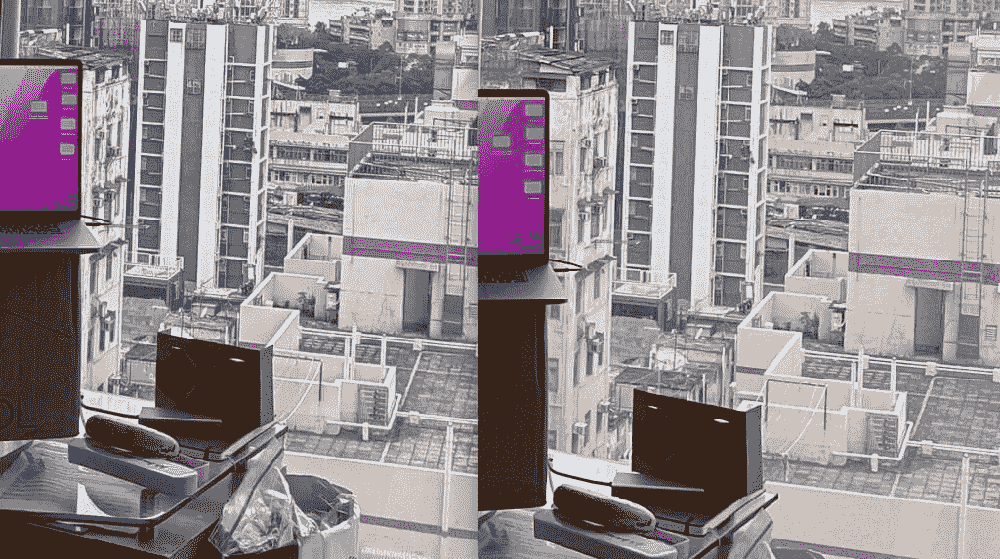
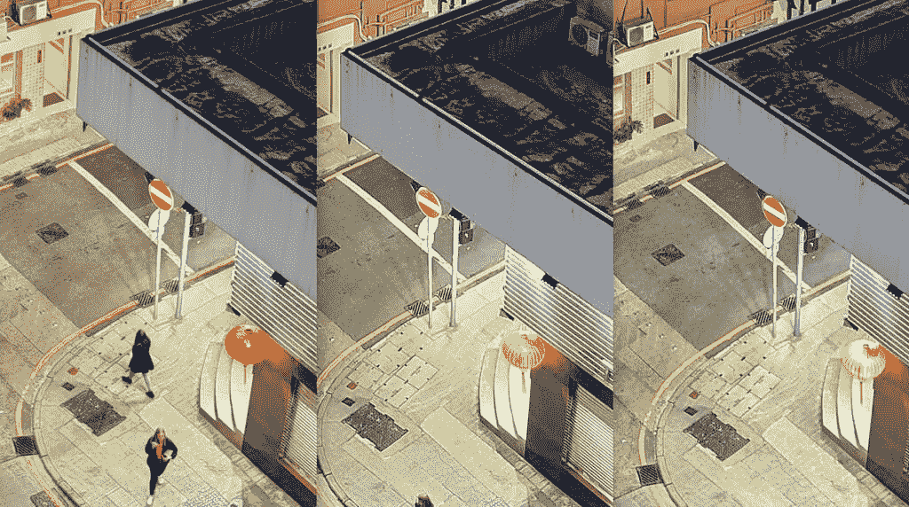
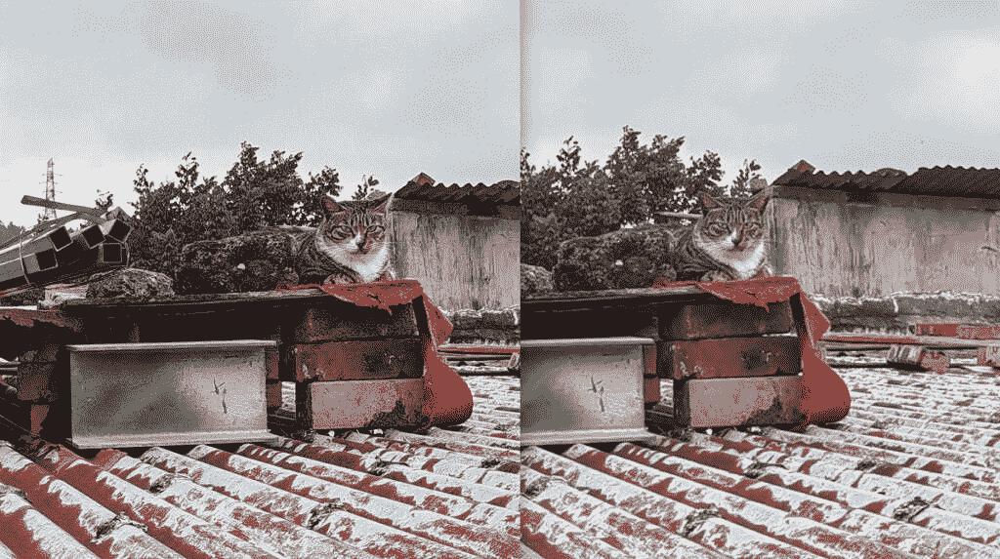

# 华为 P50 口袋评论:Galaxy Z Flip 3，但要别致和昂贵

> 原文：<https://www.xda-developers.com/huawei-p50-pocket-review/>

在选择仅在 mainland China 发布其 2021 年可折叠手机[华为 Mate X2](https://www.xda-developers.com/huawei-mate-x2-review/) 之后，华为凭借一款新的可折叠手机虎威 P50 口袋重返全球舞台(将是欧洲和亚洲的大部分地区)。就像[三星的 Galaxy Z Flip 3](https://www.xda-developers.com/samsung-galaxy-z-flip-3/) 一样，它是一个翻盖式的可折叠产品，可以从一个小型化妆压实机形状的正方形变成一个矩形平板。

正如熟悉[华为旗舰](https://www.xda-developers.com/best-huawei-phones/)的人所料，硬件工艺无可挑剔:屏幕没有压痕的迹象；铰链完全折叠平整；这款手机的主摄像头几乎与出色的华为 P50 Pro 主摄像头不相上下——这在我看来比 Galaxy Z Flip 3 的摄像头更好。但在过去几年里，美国制裁导致的一些常见缺陷一直困扰着华为的国际发布:没有谷歌移动服务支持，手机运行的是 4G 版骁龙 888。

考虑到在欧洲€1299 英镑(折合 1466 美元)的相对较高价格，以及在新加坡和香港等亚洲地区便宜约 100 美元，华为 P50 口袋可以被视为一种小众奢侈品或收藏家的物品。事实上，有一个“高级版”，由荷兰高级时装设计师 Iris van Herpen 设计的金色设计，零售价为 1599€(1750 美元)。显然，华为瞄准的是一个特定的市场。这是明智的，因为对于西方的普通消费者来说，P50 Pocket 很难与更便宜的 5G 和支持谷歌的 Galaxy Z Flip 3 相抗衡。

 <picture></picture> 

Huawei P50 Pocket

##### 华为 P50 口袋

华为最新的可折叠手机时尚而超级时尚，配有一个强大的主摄像头。但是通常的警告仍然适用..

## 华为 P50 Pocket:价格和可用性

华为 P50 Pocket 于去年 12 月在中国发布，但现在才开始与华为 P50 Pro 一起在国际市场推出，包括英国、德国、波兰、保加利亚、捷克共和国、新加坡、马来西亚、香港等市场。查看华为的消费者网站，了解它是否以及何时将在您所在的地区上市。华为 P50 有黑色、白色或金色三种选择，后者是前面提到的价格更高的“高级版”。黑色和白色型号配备 8GB 内存和 256GB 存储，而金色型号配备 12GB 内存和 512GB 存储。

*   华为 P50 口袋:€1299
*   华为 P50 掌上尊享版:€1599

## 华为 P50 口袋:规格

| 

规格

 | 

华为 P50 口袋

 |
| --- | --- |
| **打造** | 

*   铝制中框，玻璃背板

 |
| **尺寸&重量** | 

*   展开时:170 x 75.5 x 7.2 毫米
*   折叠后:87.3 x 75.5 x 15.2 毫米
*   190 克

 |
| **显示** | 

*   主屏幕:6.9 英寸 120 赫兹 AMOLED，1188 x 2790
*   次要:1.04 英寸 AMOLED，340 x 340

 |
| **SoC** | 高通骁龙 888 4G |
| **风筒&储存** | 

*   黑、白型号:8GB RAM256GB UFS 3.1 存储空间
*   高级版型号:12GB RAM512GB UFS 3.1 存储

 |
| **电池&充电** | 

*   4000 毫安时
*   40W 快速充电(含充电器)

 |
| **安全** | 侧装式指纹传感器 |
| **后置摄像头** | 

*   **主摄像头:**4000 万像素，f/1.8“真彩”主摄像头
*   **辅助:**1300 万像素，f/2.2 超广角摄像头
*   **第三:** 32MP，“超光谱”相机

 |
| **前置摄像头** | 1070 万像素 f/2.2 前置摄像头 |
| **端口** | USB Type-C 3.1 |
| **音频** | 双立体声扬声器 |
| **连通性** |  |
| **软件** |  |
| **其他特征** | 

*   纳米存储卡插槽
*   铰链保持半折叠

 |

***关于这篇评测:*** 华为 1 月 18 日送我一个白色的 P50 口袋测试。华为在这篇文章中没有投入。

## 硬件和设计

*   6.9 英寸 120 赫兹有机发光二极管屏幕，不会像三星 Galaxy Z Flip 3 那样出现粗糙的折痕
*   展开后，厚度仅为 7.2 毫米
*   外部屏幕可以用作相机取景器
*   即使在 2022 年，骁龙 888 也绰绰有余，5G 的缺乏对许多人来说也不是什么大问题

当它展开时，华为 P50 口袋——至少我的白色型号——看起来与华为 P50 口袋相似，具有同样引人注目的双环相机模块设计和沉浸式屏幕，带有由最小边框包裹的小打孔。6.9 英寸，21:9 的显示屏比典型的平板智能手机略长，但在大多数情况下，它感觉非常相似，不像华为自己的 Mate X2 或[三星 Z Fold 3](https://www.xda-developers.com/samsung-galaxy-z-fold-3/) 那样的更大的可折叠手机，感觉就像是一只完全不同的野兽。

尽管有褶皱，但华为 P50 Pocket 的屏幕有一条很难看到/找到的折痕。从大多数角度看，你都不会看到它，当你的手指穿过屏幕的折叠部分时，你只会感觉到轻微的缩进。这是对 Galaxy Z Flip 3 的一个重大改进，Galaxy Z Flip 3 的折痕即使在稍微偏离角度的情况下也很明显，并且有一个可以随时感觉到的深槽。

120Hz 的显示屏看起来很棒——亮度足以在阳光直射下使用，动画生动，色彩鲜艳。就像华为 Mate X2 一样，P50 口袋也有一个铰链，可以完全折叠平整，不会像 Galaxy Z Flip 3 那样留下缝隙。这使得 P50 的口袋在折叠时比 Galaxy Z Flip 3 略薄(15.2 毫米到 15.9 毫米)。右侧有一个侧装式指纹识别器，还有一个音量摇杆。

就像华为 Mate X2 一样，P50 口袋也有一个铰链，可以完全折叠，不会像 Galaxy Z Flip 3 那样留下缝隙

前面提到的双环摄像头模块实际上只是一个摄像头模块，底部的圆圈实际上是一个 1 英寸的辅助屏幕，即使折叠起来也可以使用手机。可惜因为屏幕太小，不如 Galaxy Z Flip 3 更大的屏幕有用。在 P50 Pocket 上，您可以将屏幕用作相机取景器，这样您就可以使用主相机系统进行自拍；以及检查日历、通知和控制音乐播放。最终，由于尺寸和形状的原因，你只能从中获得有限的效用，类似于我们在早期翻盖可折叠手机上遇到的问题。

P50 口袋的四周构造良好，铰链非常坚固，可以半折叠到这个笔记本电脑形状的设置中，一半屏幕直立。P50 Pocket 的软件实际上只利用了相机应用程序中的这一设置，因为取景器将移动到屏幕的上半部分，下半部分显示相机控制。这允许免提自拍或延时视频。

* * *

## 摄像机

*   出色的主相机，可与玻璃平板旗舰媲美
*   超宽相机洗出色彩

P50 Pocket 的主相机系统由一个 40MP“真色度”主相机、一个 13MP 超宽相机和一个 32MP“超光谱”相机组成。主摄像头以华为的 True-Chroma 图像引擎命名，这是一种软件/硬件解决方案，据称可以让手机重现人眼看到的准确颜色。同时，超级光谱相机是一个色温传感器，可以帮助 XD Fusion Pro 图像引擎，帮助手机拍摄更多深度和图像信息的照片。

这种 XD 和色度营销在现实世界中真的有什么意义吗？是的，华为 P50 Pro 的主摄像头拍摄的照片色彩强烈，清晰度很高。让我们看一些样品。

华为 P50 Pro 的主摄像头拍摄出色彩强烈的清晰照片

这是一个光线情况复杂的镜头:有一束相对明亮的光线从右边的窗户射进来，但也有一部分镜头被阴影覆盖——在桌子下面，电脑显示器下面和窗帘后面的桌子部分。现在，我能说 P50 袖珍版的镜头对现实生活 100%准确吗？不，比当时的场景要酷一点。但 iPhone 的镜头一如既往地过于温暖。如果我们放大到实际大小，查看 100%的作物，我们可以看到 P50 Pocket 的 10MP 照片比 iPhone 13 的 12MP 照片更详细，噪音也更少。

 <picture></picture> 

P50 Pocket (left); iPhone 13 Pro (right)

在这里，我可以说 P50 Pro 的照片确实有更准确的颜色-水瓶的浅蓝色阴影和左侧的白纸。

这是在房间的另一个地方同样的镜头的另一个 100%的裁剪。

 <picture></picture> 

P50 Pocket (left); iPhone 13 Pro (right), 100% crops.

从香蕉到棕色纸板咖啡杯架，再到照片右上角的一小片海洋，华为的照片比苹果的照片颜色更准确。

我们来对比一下 P50 Pro 和其他手机。这是一张华为 P50 Pocket 与[三星 Galaxy S21 Ultra](https://www.xda-developers.com/samsung-galaxy-s21/) 和[谷歌 Pixel 6 Pro](https://www.xda-developers.com/google-pixel-6/) 的夜间城市照片。

三个镜头都很优秀，真的是吹毛求疵。Galaxy S21 Ultra 和 Pixel 6 Pro 的整体照明效果更好，在 P50 口袋图像中，照片的上四分之一有点暗。但后来 P50 口袋的红色更生动，灯光曝光更好，特别是在灯笼和右下象限附近的停车标志拍摄。让我们放大 100%。

 <picture></picture> 

P50 Pocket (left); Galaxy S21 Ultra (middle); Pixel 6 Pro (right), 100% crops.

总的来说，P50 Pocket 的主摄像头很强，与我几个月前测试的[华为 P50 Pro](https://www.xda-developers.com/huawei-p50-pro-hands-on/) 不相上下。注意我说的是主摄像头，因为超宽摄像头并没有带来同样的高标准。肯定不如 P50 Pro 的超宽传感器。最大的问题是主照片和超宽照片之间的颜色不一致。下面两张图片是在一秒钟内连续拍摄的。

这是另一组，如果我们放大 100%，超宽镜头远不如主摄像头清晰。这是一个耻辱，因为华为可以说是这个想法的先驱(早在 2019 年的 Mate 30 Pro)，即超宽摄像头不应明显劣于主摄像头。

 <picture></picture> 

P50 Pocket main camera (left); ultra-wide (right), 100% crops.

我在周末的一次野营旅行中带上了 P50 口袋，这是测试手机弱光能力的好时机。因为华为已经放弃了它的 RYYB 传感器(额外的黄色像素帮助它吸收了大量的光线)，这里的 40MP 传感器没有华为 P40 Pro 中使用的那些巨大的传感器，P50 Pocket 确实需要夜间模式才能在非常暗的场景中获得出色的拍摄效果。

正如你所看到的，没有夜间模式，拍摄的照片会熄灭灯光，但有了夜间模式，P50 Pocket 能够拍出像素般均衡的照片。这是另一个夜间模式开/关示例。

与苹果、谷歌和三星手机不同，P50 Pocket 不会自动开启夜间模式，你必须自己切换到该模式。手机自动控制一切有利有弊，但在这里，如果拍摄质量相差太大，我更喜欢手机自动使用夜间模式。

自拍没问题。实际的前置摄像头在细节上有点软，所以如果你用主摄像头拍摄，你会得到更清晰的照片。到了晚上，它也会变得更亮。

P50 Pocket 的视频功能低于四位数欧元的手机。对华为来说，从稳定性到动态范围的一切都低于标准。相比之下，P50 Pro 的摄像头要好得多。

* * *

## 软件

*   华为 P50 Pocket 运行 EMUI 而不是鸿蒙系统，这是一个熟悉的华为 UI
*   不，谷歌移动服务并不理想，但也许不是绝对的交易破坏者
*   花瓣搜索可以使查找和安装应用程序更加容易
*   西莉亚是华为的数字语音助手，这是我第一次在中国以外的地方看到它

华为 P50 Pocket 运行在 EMUI 12 上，而不是鸿蒙系统上。华为拒绝透露他们为什么还没有在全球智能手机上推出鸿蒙系统，但作为一个在手机上使用过鸿蒙系统的人，我可以说总体体验不会有太大不同。在很大程度上，这里的 EMUI 仍然像 Android 一样，只是华为将通知面板和控制中心分成了两个独立的窗格。而且没有应用托盘，所以所有应用都在主屏幕上。但我喜欢滑动菜单，它允许在浮动窗口中快速启动应用程序。

说到应用程序——到目前为止，大多数阅读的人都知道华为手机不能运行谷歌移动服务，包括谷歌的核心应用程序，如 Gmail、YouTube、Google Drive 等。这是否会使手机无法使用，取决于你是谁，你需要什么。对一些人来说，这是完全不可能的。

对我来说，我可以说这肯定不理想，但也不是不能用。事实是，有很多方法可以访问这些谷歌应用。例如，Gmail 仍然可以通过微软 Outlook 等第三方邮件应用程序运行。谷歌日历也可以毫无问题地与 Outlook 同步。谷歌地图完全可以在手机上使用，唯一的例外是你不能登录，所以你不能保存位置或者写商业评论。但除此之外，如果你想在谷歌地图上从 A 点导航到 B 点，你可以。YouTube 可以通过网络浏览器直接访问——事实上，华为的原生网络浏览器已经将 YouTube 加入了书签。

大多数西方人知道的主要应用程序，如 Instagram、脸书和 Twitter，都完全没有问题。虽然这些应用在华为的 AppGallery 上不可用，但华为有一个名为花瓣搜索的解决方案。本质上，花瓣搜索将你的应用程序搜索引向可靠的来源，如 APK 镜报、APK 纯网，或者如果有的话，像脸书网站这样的官方下载来源。

对我来说，没有谷歌移动服务肯定不理想，但这也不会使手机无法使用

P50 Pocket 也有自己的语音助手，以弥补没有谷歌的。命名为西莉亚，这是几年前推出的，但据我所知，我不记得西莉亚是国际可用，直到最近。这是我第一次使用 Celia，体验还可以。它可以通过说“嘿西莉亚”或长按电源按钮来触发。它可以帮助我设置闹钟或启动第一方华为应用程序，没有问题。当我让它设置闹钟时，她甚至知道确认时间并等待我的回应。但西莉亚误解单词的频率比 Siri 或谷歌助手更高，有时当我问它一个直截了当的问题(如兑换货币)时，它会带我进行网络搜索，而不是只给我答案。

有西莉亚总比完全没有语音助手好，也许假以时日，会有所改善。但它超越谷歌助手的可能性微乎其微，至少在世界英语地区是如此。

* * *

## 一般性能和电池寿命

2022 年，当 5G 就绪[骁龙 8 代 1](https://www.xda-developers.com/qualcomm-snapdragon-8-gen-1/) 即将到来时，华为 P50 口袋装运 4G 版的骁龙 888 将损害其吸引力，但在真空中，骁龙 888 4G 是否缺乏动力？绝对不行。在我一周的使用过程中，华为 P50 Pocket 运行流畅，5G 连接仍处于初级阶段，几乎无法提供更快的速度。过去三个月，我一直在香港和洛杉矶使用 5G 数据计划，这两个主要城市拥有一些最好的移动基础设施，如果我说 5G 真的对我的生活产生了任何实际影响，那我是在撒谎。是的，这确实会影响手机的“未来”价值，但如果这真的让你很感兴趣，那么你就有机会忽略这一点。

4000 毫安时的电池也赋予了手机出色的续航能力。华为一直能够创造奇迹，看看它的电池优化和 4000 毫安时电池是否真的能在这里走得很远。我去露营的那天，我在山里徒步旅行，频繁地使用手机，在一天工作了 16 个小时后，我带着还只有 18%电量的 P50 Pocket 睡觉。

* * *

## 结论

当然，如果没有两个主要考虑因素，我在这篇评论中所说的大部分都是没有实际意义的:价格和 GMS 的情况。事实是，华为€1299 英镑(1466 美元)的定价，加上无法使用谷歌移动服务，真的限制了 P50 Pocket 的主流吸引力。

值得好奇的是，华为为什么没有将这款手机的价格定得更低，特别是 Galaxy Z Flip 3 现在已经上市，具有 5G 连接能力，不受限制的软件和更低的价格。如果要我猜的话，那就是华为的消费者群体不愿意仅仅因为超出该集团控制范围的制裁就放弃其优质品牌地位。在 mainland China、马拉西亚和香港的部分地区，华为被视为奢侈品牌，其产品比其他中国制造商略胜一筹。“华为被中国人视为手机中的劳力士，”几个月前，香港一位受欢迎的手机进口商告诉我，当时我对他所有的中国版 P50 Pros 在第一天售罄表示惊讶。有些人会买华为的产品，即使它更贵，即使它没有谷歌。例如，2700 美元的华为 Mate X2 在 2021 年的大部分时间都处于缺货状态。

华为能达到与欧洲消费者同样的地位吗？它可以被视为一个奢侈品牌，其产品理应得到更高的价格？在制裁之前，华为很好地走上了这条路，当时该公司的手机在整个欧洲创造了销售记录并获得了好评。现在有了障碍，这将是一场艰苦的战斗。但华为如果不坚持，就什么都不是。

 <picture></picture> 

Huawei P50 Pocket

##### 华为 P50 口袋

华为最新的可折叠手机时尚而超级时尚，配有一个强大的主摄像头。但是通常的警告仍然适用。