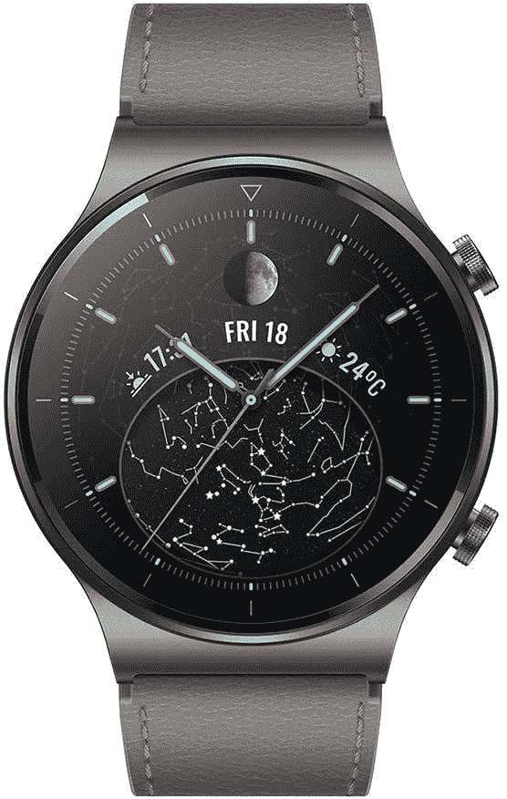
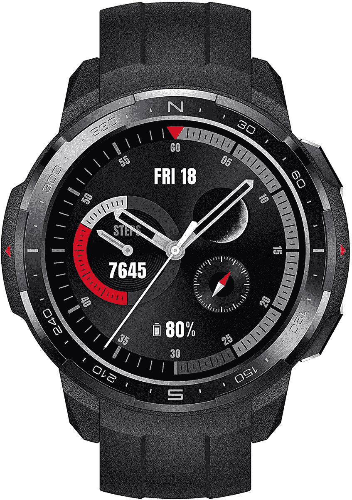
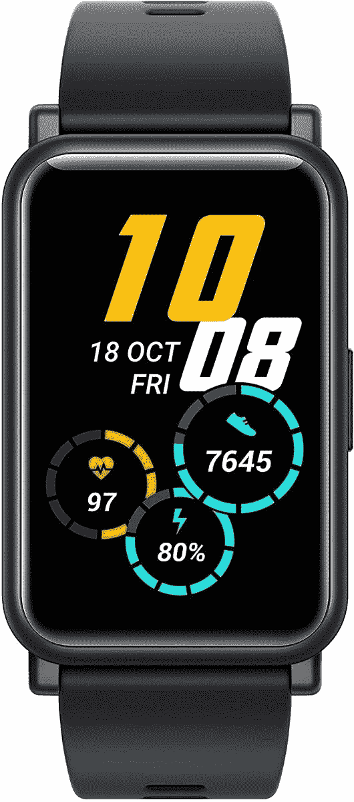

# 华为 Watch GT 2 Pro、Honor Watch GS Pro 和 Honor Watch ES 是迄今为止最好的 LiteOS

> 原文：<https://www.xda-developers.com/huawei-watch-gt-2-pro-honor-watch-es-gs-pro-liteos-review/>

我过去一直是 LiteOS 的公开批评者，我认为即使从我最近对华为 Watch GT 2e 的报道来看，在我看来，它的许多问题都没有真正得到纠正。话虽如此，并不是 LiteOS 没有功能，而是它所包含的功能并不是我在智能手表中真正看重的那种。华为和 Honor 都在过去一个月推出了自己的可穿戴设备——华为在 HDC 2020 上推出了[华为手表 GT 2 Pro](https://www.xda-developers.com/huawei-watch-gt-2-pro-smartwatch-freebuds-pro-tws-earbuds-launch/) ，而 Honor 在今年的 IFA 2020 上推出了 [Honor 手表 GS Pro 和 Honor 手表 ES](https://www.xda-developers.com/honor-launches-watch-gs-pro-es-smartwatches-magicbook-14-15-pro-laptops/) 。我们三个都用上了，我必须说，我是他的粉丝。

## 规范

| 

规范

 | 

华为手表 GT 2 Pro

 | 

荣誉手表 GS Pro

 | 

荣誉手表 ES

 |
| --- | --- | --- | --- |
| 尺寸和重量 | 

*   46.7 x 46.7 x 11.4 毫米
*   52g

 |  |  |
| 显示 | 

*   1.39 英寸 Super AMOLED
*   454 x 454 分辨率
*   蓝宝石玻璃

 | 

*   1.39 英寸 Super AMOLED
*   454 x 454 分辨率
*   玻璃

 | 

*   1.64 英寸 AMOLED
*   280 x 456 分辨率
*   玻璃

 |
| 表带选项 | 

*   黑色氟橡胶
*   灰棕色皮革

 | 不适用的 | 不适用的 |
| 内存储器 | 4GB | 4GB | 4GB |
| 连通性 |  |  |  |
| 其他功能 | 

*   扬声器
*   无线充电

 | 不适用的 | 不适用的 |
| 传感器 | 

*   加速计
*   陀螺仪
*   地磁的
*   背景光
*   光学心率
*   气压
*   SpO2

 | 

*   加速计
*   陀螺仪
*   地磁的
*   光学心率
*   气压
*   SpO2

 | 

*   加速计
*   陀螺仪
*   光学心率
*   SpO2

 |
| 电池 | 455 毫安时 | 790 毫安时 | 180 毫安时 |
| 持久性 |  | 

*   5ATM 防水性
*   符合军用标准-810G

 |  |
| 操作系统（Operating System） | 华为 LiteOS | 华为 LiteOS | 华为 LiteOS |
| 颜色；色彩；色调 |  | 

*   木炭黑
*   泥灰白色
*   迷彩蓝

 | 

*   陨石黑
*   珊瑚粉色
*   冰岛白

 |

*关于这篇文章:华为手表 GT 2 Pro 被我自己的网站 [IrishTech.ie](http://irishtech.ie) 接受审查，而 Honor 手表 GS Pro 和 Honor 手表 ES 被 XDA 开发者网站接受审查。华为和 Honor 都没有对此次评估的内容发表任何意见。*

* * *

## 设计和舒适度

### 华为手表 GT 2 Pro

华为 Watch GT 2 Pro 采用了这三款智能手表中最高端的设计，提供了传统的手表外观和蓝宝石玻璃正面。顶部完全平坦，下面是陶瓷玻璃和舒适的氟橡胶表带。这是一款佩戴舒适的手表，看起来也是最时尚的。我为传统的手表外观启用了一个永远在线的显示屏，这增加了体验，尽管这样做会对电池造成影响。这款有时确实会不舒服，但我通常可以轻松地连续戴上几个小时。

### 荣誉手表 GS Pro

Honor Watch GS Pro 还采用了常规的手表式设计。然而，它非常笨重，长时间佩戴会很不舒服。它也很重。如果你想要一些时尚的东西，这不是一款可以戴的智能手表，尽管它显然是为了耐用而制造的，而且看起来也不坏。不过，这绝对不会是所有人都喜欢的设计。我不知道为什么，因为它比手表 GT 2 Pro 更轻，但这只手表在几个小时后戴在手腕上感觉不舒服和沉重。我想这是由于它的庞大，我发现自己相当频繁地把它拿下来，每次几分钟。这不是一个大问题，但这是要记住的事情，也是笨重的智能手表应该有的。

### 荣誉手表 ES

荣誉手表 ES 有一个相当独特的设计，在手腕上采取一个小的，轻微弯曲，重量轻的矩形形状。整体操作系统和 watchfaces 都经过了调整，这绝对是三人中我最喜欢的一款，而我更喜欢华为 Watch GT 2 Pro 的传统手表般的设计，Honor Watch ES 因其优质和独特的外观而获得亚军。Honor Watch ES 是三款手表中最舒适的一款，又轻又小，你可以完全忘记它的存在。我可以连续几天戴着它。

## 软件功能:LiteOS

几乎所有这三款智能手表都以不同的形式提供了相同的功能。这三者之间唯一的真正区别是 Honor Watch ES 缺乏 GPS 支持。即使这样，它也可以连接到你的智能手机，并使用其中的 GPS 数据，老实说，我真的从来没有*只是*把我的智能手表带在身边。我知道有人这样做，但我认为这是一个相当小众的用例。所有这三种设备都可以自动检测锻炼活动，并开始为您跟踪它。

除了缺少 GPS，这三款智能手表都提供了智能手表应有的最低要求。心率追踪、精确的睡眠追踪和血氧水平的 SpO2 监测是任何 LiteOS 智能手表的三大支柱，没有一个被遗漏。这三款设备都有月经周期跟踪功能，还有其他选择功能，如指南针、闹钟、定时器和天气预报。

您也可以在华为健康应用中启用通知。华为健康应用是智能手机上设置和配置所有这些设备的必备软件，它还允许您查看您的信息。华为健康 app 的最新版本可以从华为 AppGallery 下载。您不能再从谷歌 Play 商店下载更新的版本，需要更新的版本来设置这些设备。

上面的截图显示了华为健康应用程序的运行及其提供的数据。您可以查看步行、睡眠等方面的深入数据。我仍然坚持认为压力监视器是绝对无用的，但其余的功能都很有趣，非常有用。我经常使用睡眠追踪器来保持一个睡眠模式。

我走的路相当慢，但我可以看到 Huwaei Watch GT 2 Pro 上的 GPS 非常准确。这并不令人惊讶，但是很高兴知道您可以依靠它进行准确的跟踪。顺便说一下， [Watch GT 2e review](https://www.xda-developers.com/huawei-watch-gt-2e-review/) 也对 LiteOS 进行了更多深入的介绍，如果你想了解一下的话。Honor Watch GS Pro 同样精确，我可以很容易地推荐它们中的任何一款用于 GPS 跟踪。在 Honor Watch ES 的情况下，它只会使用你的智能手机进行跟踪。

总结一下 LiteOS——它有一些不错的想法，运行得很好，但是，缺乏应用程序是一个杀手。我知道 LiteOS 智能手表只是基本的追踪器，但尽管如此，它们还是很贵。

## 独特的硬件功能

所有这三种设备的独特硬件功能是它们真正脱颖而出的地方。它们都提供相同的基本体验，但无疑是针对三种不同类型的人。

### 华为手表 GT 2 Pro

我先从华为 Watch GT 2 Pro 说起。这是三款中价格最高的一款(€299 英镑)，它提供了最全面的体验。首先，它有无线充电功能(而不是针式连接器)，还有扬声器和环境光传感器。我经常使用无线充电功能，这很好，比使用专用的 pin 充电器容易得多。在我伏案工作的时候把它摘下来会容易得多。鉴于我很少给它充电，为了方便起见，我总是需要随时插上 pin 充电器，占用一个充电端口，只是为了一个月使用几次。

至于扬声器，它不是世界上最好的扬声器，但考虑到手表 GT 2e 上的扬声器有多差，我实际上对音频的可收听性印象深刻。我仍然不建议真的全部使用它(一个会说话的手表会让你在公共场合被盯着看)，但我想，如果你想使用它，拥有硬件是很好的。它还配有蓝宝石玻璃正面和蓝牙 v5.1，这才是真正重要的。

### 荣誉手表 GS Pro

Honor Watch GS Pro 经历了 14 项不同的 MIL-STD-810G 测试，包括温度-湿度-海拔阻力、盐雾、抗沙性和抗湿性。换句话说，如果耐用性是你所追求的，那么 Honor Watch GS Pro 肯定是像坦克一样建造的。正因为如此，长时间戴着它会不舒服，这导致我不时地把它摘下来。我也有点困惑，为什么它的正面使用普通玻璃而不是蓝宝石玻璃，因为它是坚固耐用的。尽管如此，这款手表对于经常与恶劣天气对抗的人来说是一个绝佳的选择。更重要的是，这款手表一次充电可持续 **25 天**。你可以连续 48 小时使用 GPS。这比华为手表 GT 2 Pro 便宜一点，€249 英镑。

### 荣誉手表 ES

荣誉手表 ES 并没有真正提供多少独特的功能，但这就是它的妙处。这是另外两种智能手表的相对便宜的替代品，但为日常用户提供了另外两种智能手表的基本体验。我真的不在乎其他智能手表的许多额外功能，就时尚而言，Honor Watch ES 是三款手表中我最喜欢的。它在€卖 99 英镑，比竞争对手便宜得多。

* * *

## 结论

这些智能手表都各有千秋，我可以根据不同的原因推荐给大家。想要更轻(更便宜)的东西吗？荣誉手表是我的首选。想去徒步旅行吗？荣誉手表 GS Pro 是最好的。最后，如果你想要最好的日常使用，华为 Watch GT 2 Pro 不会错。它仍然是 LiteOS，有时会缺乏，但是，这些手表是最好的 LiteOS。

 <picture></picture> 

Huawei Watch GT 2 Pro

华为 Watch GT 2 Pro 集 LiteOS 之大成，提供迄今为止任何 LiteOS 智能手表中最完整的硬件包。

 <picture></picture> 

Honor Watch GS Pro

##### 荣誉手表 GS Pro

想要一款在徒步旅行时能够抵御恶劣天气、电池续航时间看似无限的产品吗？荣誉手表 GS Pro 是适合你的手表。

 <picture></picture> 

Honor Watch ES

##### 荣誉手表 ES

想找一件小巧舒适但又有点花哨的衣服吗？荣誉手表 ES 体积小，重量轻，价格相对便宜，但仍然包含许多有用的功能！