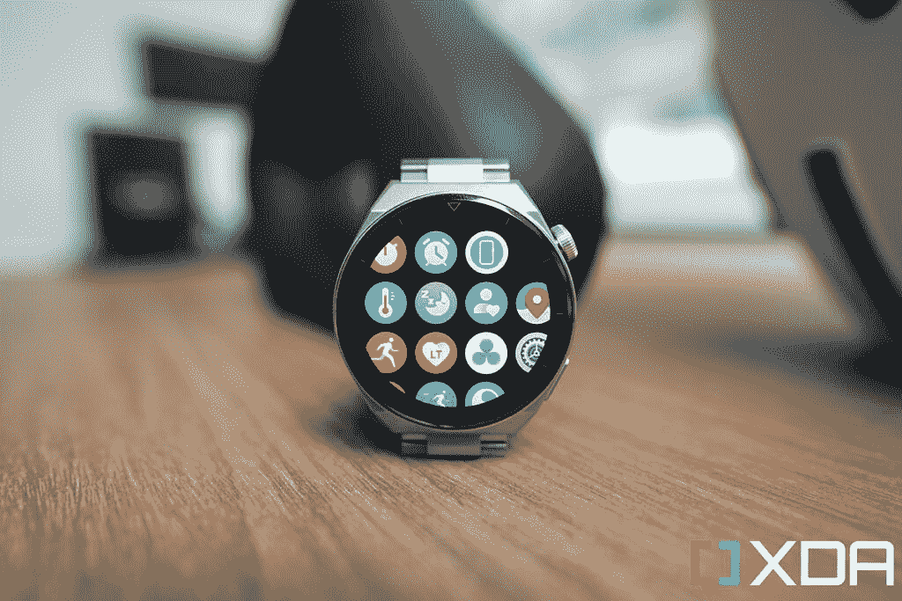
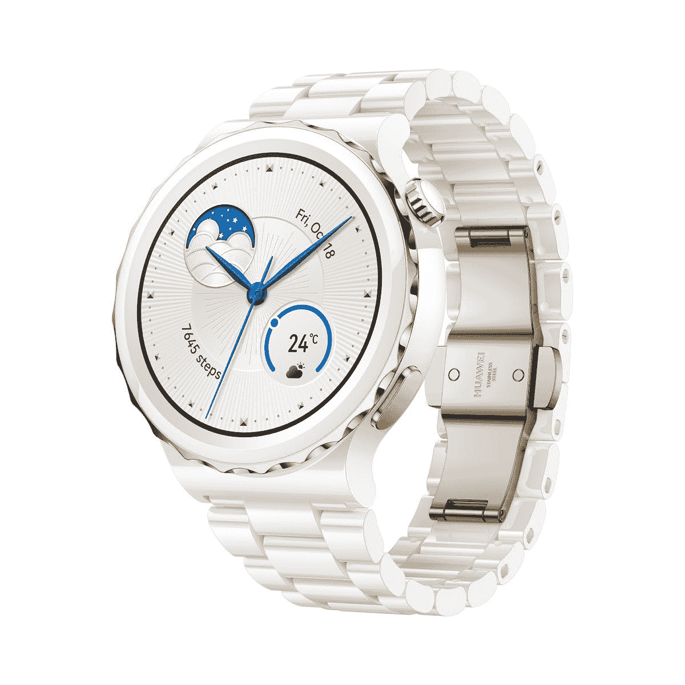
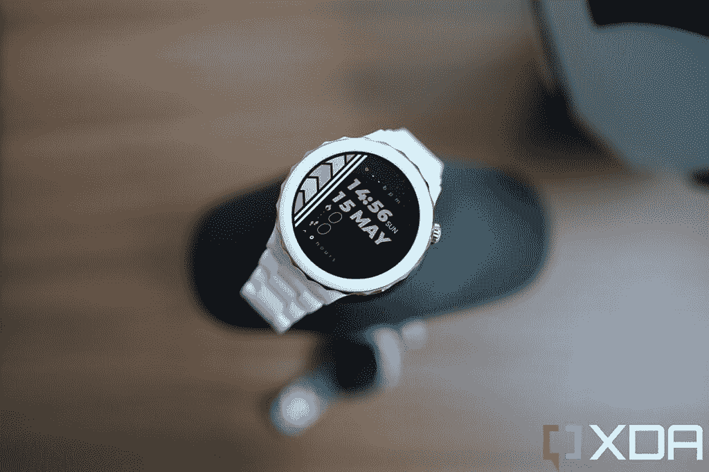
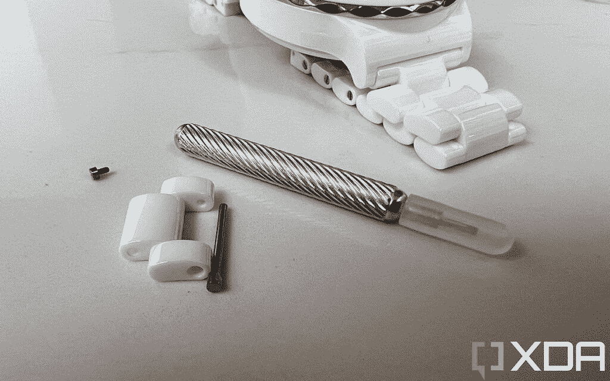
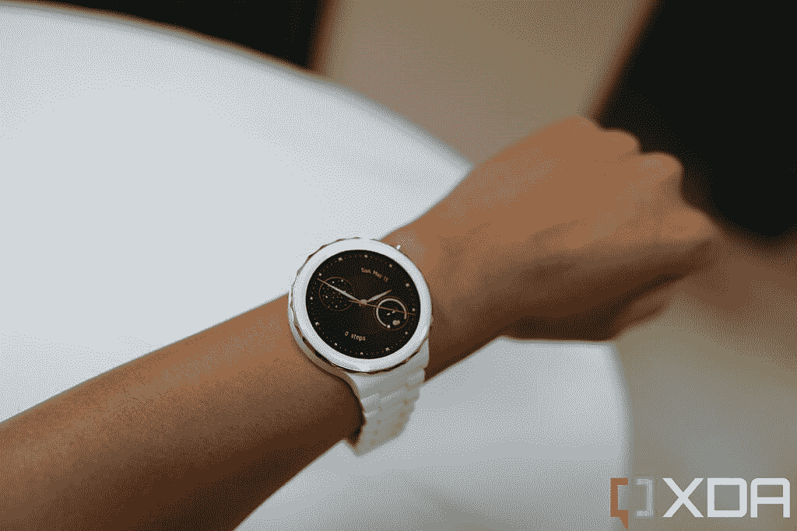

# 华为手表 GT 3 Pro 评测:最豪华的智能手表硬件

> 原文：<https://www.xda-developers.com/huawei-watch-gt-3-pro-review/>

五年来，我一直在评论华为的消费产品，有一个清晰的主题贯穿了我所有的评论:无可挑剔的硬件通常是其产品类别中最好看和建造得最好的，但如果与顶级竞争对手相比，软件体验就不太好了。尽管华为的新智能手表系列 Watch GT 3 Pro 在改善软件方面取得了长足的进步，但它仍然没有完全实现。无论是钛还是陶瓷模型，华为手表 GT 3 Pro 看起来绝对华丽，相比之下，三星的 Galaxy Watch 4 感觉很便宜。但有些事情 Galaxy Watch 4 或 [Apple Watch 7](https://www.xda-developers.com/apple-watch-series-7-review/) 可以做到，而华为的智能手表还做不到，比如访问英语语音助手或以动态方式回复通知。

但也许这只是我作为一个吹毛求疵的评论家，因为华为的智能手表卖得很好，根据研究公司 IDC 的数据，2021 年全球销量为 4270 万块。尽管这一数字仍落后于三星和小米(分别为 4810 万部和 5440 万部)，但这标志着华为同比增长 35%，而三星和小米分别为 3.8%和 7.9%。当然，Apple Watch 仍然高高在上，在 2021 年售出了 1.611 亿部，但 Apple Watch 由于其 iOS 锁定功能，基本上是一只完全不同的野兽。

这意味着华为的智能手表是 Android 用户第三大最受欢迎的可穿戴设备，它的增长速度超过了这个领域的所有人。手表 GT 3 Pro 可能会继续这一趋势，因为即使按照华为已经很高的硬件标准，这在我看来也是最好看和最优质的智能手表系列。

 <picture></picture> 

The Huawei Watch GT 3 Pro titanium model.

 <picture></picture> 

Huawei Watch GT 3 Pro

##### 华为手表 GT 3 Pro

华为手表 GT 3 Pro 采用了超高端的设计，使用钛或陶瓷材料包裹在华丽的有机发光二极管屏幕周围，比我测试过的任何其他 Android 智能手表都要亮。

 <picture></picture> 

The Huawei Watch GT 3 Pro ceramic model.

* * *

## 华为 Watch GT 3 Pro:定价和供货情况

华为 Watch GT 3 Pro 有钛或陶瓷两种型号，目前正在 mainland China 销售，并将于 5 月 30 日开始在部分欧洲和亚洲地区销售，包括英国、德国、新加坡和马来西亚。销售平台包括亚马逊英国和华为在线商店。下面列出了价格(以人民币、欧元和英镑计算)。

**钛型号**

*   华为手表 GT 3 Pro 钛金版(46mm) w/皮质表带:2688/€369/299.99
*   华为手表 GT 3 Pro 钛金版(46mm) w/钛金表带:€499/ 429.99

**陶瓷模型**

*   华为手表 GT 3 Pro 陶瓷版(43mm) w/皮质表带:2988/€499/429.99
*   华为手表 GT 3 Pro 陶瓷版(43mm) w/陶瓷表带:4688/€599/499.99

* * *

## 华为手表 GT 3 Pro 系列:规格

| 

规格

 | 

华为手表 GT 3 Pro

 |
| --- | --- |
| **尺寸、重量、构造** | 

*   钛(46 毫米):
    *   46.6 毫米× 46.6 毫米× 10.9 毫米
    *   54g(无带)
    *   黑色氟橡胶表带
    *   灰色皮革带
*   陶瓷(42.9 毫米):
    *   42.9 毫米× 42.9 毫米× 10.5 毫米
    *   50 克
    *   白色陶瓷表带
    *   白色皮革带

 |
| **显示** | 

*   钛:
*   陶瓷:
*   始终显示(AOD)
*   466 x 466 像素

 |
| **传感器** | 

*   加速计
*   陀螺仪传感器
*   地磁传感器
*   光学心率传感器
*   大气压力传感器
*   体温传感器

 |
| **电池&充电** | 

*   钛:
*   陶瓷:
*   无线充电

 |
| **软件** | 

*   鸿蒙系统 2
*   兼容 Android 6.0+和 iOS 9.0+

 |
| **其他功能** | 

*   心电图
*   GPS，GLONASS，伽利略，北斗和 QZSS。
*   IP68，5 大气压防水
*   NFC(部分国家)
*   蓝牙
*   扬声器
*   麦克风

 |

***关于这篇评测:**这篇评测是在对华为提供的 Huawei Watch GT 3 Pro 的钛金和陶瓷模型进行了两周的测试后撰写的。华为还报道了我去米兰参加产品发布会的行程。该公司在此次审查中没有任何意见。*

* * *

## 华为手表 GT 3 Pro:设计和硬件

*   采用优质材料的经典设计
*   明亮生动的有机发光二极管屏幕
*   锻炼时穿有点太重了
*   表带可能不会完美地适合每一只手腕

华为 Watch GT 3 Pro 的两个型号都采用蓝宝石水晶玻璃覆盖其 466 x 466 有机发光二极管屏幕(46 毫米钛型号为 1.4 英寸，43 毫米陶瓷型号为 1.3 英寸)和陶瓷背面。不同的是前后夹层之间的材料:钛模型使用航空航天级钛框架，陶瓷模型使用陶瓷。两种型号都配有与车身材料相匹配的皮革表带。

与 Fitbit Sense 或 Galaxy Watch 4 相比，这些手表，尤其是我手握的钛金属型号，感觉很重，带着表带的重量略高于 90 克(手表本身为 54 克)。陶瓷模型更小，轻约 10g。切换到实心凸耳，而不是在[华为 Watch 3](https://www.xda-developers.com/huawei-watch-3-review/) 或华为 Watch GT 2 Pro 中看到的开口凸耳设计，增加了更大手表的感觉。

陶瓷模型看起来很醒目，但我更喜欢钛模型

全陶瓷模型是展会的明星——陶瓷手表被认为比金属手表更豪华——它在框架周围的金色装饰和蝴蝶扣上看起来非常醒目。但是对于我的手腕和我穿的衣服，我更喜欢钛模型。

两款手表都有一个既可点击又可旋转的表冠，以及一个独立的按钮。我发现后一个按钮是不必要的，因为 crown plus 组合的滑动和点击已经足够在手表的鸿蒙系统支持的用户界面中导航了。表冠以纹理罗纹为特色，在钛金属表款上显得尤为经典。

钛金属表带配有一个可展开的带扣，每当它锁在我的手腕上时，都会发出令人满意的咔哒声。然而，这些表带设计的性质意味着它们可能不适合每种手腕类型(典型的带扣-孔型表带有更多的调整空间)。把它们调整到合适的大小也需要一点时间:钛金属表带在每个表带链内都有小开关，可以让它们松开。这些开关是如此之小，以至于我花了五分多钟才拆下一个更紧的连接。陶瓷模型需要更多的工作，其带包含微型螺钉，需要特定的工具(包装中包含的微型螺丝刀)来移除或添加链接。我花了 10 多分钟的时间摆弄陶瓷模型，使之更接近理想状态。这两款手表都为手腕较粗的人提供了额外的链接。华为表示，如果你需要数字，钛金属型号可以适合 140 毫米至 210 毫米的手腕尺寸，而陶瓷型号则适合 130 毫米至 190 毫米。

 <picture></picture> 

If you want to remove or add links in the ceramic model, you must fiddle with the tiny screwdrivers with the included screwdriver.

顺便说一下，在奢侈品手表领域，需要删除或添加链接以获得合适的尺寸是绝对正常的，发烧友甚至可能会喜欢这个过程。但对我来说，这有点麻烦，你需要确保有充足的照明和平坦干净的表面来摆弄陶瓷带，因为陶瓷带的微型螺钉非常小。

尽管做了这么多手脚，陶瓷模型并不完全适合我的手腕。它要么有点太松，要么有点太紧，因为我的手腕大小正好在一个链节的大小之间。钛模型，然而，适合我的手腕刚刚好。对于普通的日常穿着，尤其是当我参加一些新闻发布会时，它为我原本朴素的着装风格增添了一点点光彩。然而，在我看来，这款手表太重了，不适合在健身时佩戴。可惜了，因为华为 Watch GT 3 Pro 相当擅长追踪活动。稍后将详细介绍。

这两款手表都配有扬声器和麦克风，让我可以通过手腕上的手表接电话。华为没有说明为手表供电的芯片，也没有说明内存或电池大小，但请放心，它们足够强大，足以处理手表的 UI。电池寿命尤其令人印象深刻，钛型号一次充电可持续两周，陶瓷型号可持续七天。

 <picture></picture> 

The Huawei Watch GT 3 Pro fits my girlfriend's wrist better.

人们期望从昂贵的智能手表中获得的所有传感器都在这里，包括光学心率、SpO2、陀螺仪、加速度计、气压计和磁力计，后者允许指南针功能在没有互联网连接的情况下工作。心率传感器从非专业手表 GT 3 或去年的手表 GT 2 Pro 升级而来:它现在有八个光电二极管，据说可以更准确地检测。

GT 3 Pro 手表的防护等级为 IP68 和 5ATM，这意味着你绝对可以在室内游泳池游泳，甚至在 30 米深的海里潜水。

* * *

## 华为 Watch GT 3 Pro:软件和功能

*   运行在华为专有的鸿蒙系统上
*   丰富多彩的用户界面和美观的动画
*   缺乏第三方应用支持
*   允许对短信通知进行预设回复—比以前好，但还不够

华为 Watch GT 3 Pro 运行在鸿蒙系统上，它是一个反应灵敏的用户界面，具有丰富多彩的图形和流畅的动画。该手表适用于 Android 和 iOS 设备，但您必须下载华为健康应用程序才能配对。

这里存在第一个问题:由于美国政府的制裁，你在谷歌 Play 商店找到的华为健康应用程序已经过时，无法连接到手表上。相反，你必须通过华为的 AppGallery 或华为官方链接安装新版本的华为健康，你可以通过扫描手表设置屏幕上的二维码来访问华为官方链接。

需要从第三方来源安装应用程序需要一些额外的步骤，如在 Android 中授予权限，在 iOS 中也是一个主要的麻烦，所以华为 Watch GT 3 Pro 的设置过程比 Fitbit、Mobvoi、三星等在西方有稳固业务的品牌的智能手表更复杂。

鸿蒙系统是一个反应灵敏的用户界面，具有丰富多彩的图形和流畅的动画

一旦你配对了手表，华为健康应用程序就可以很好地为我提供相关信息。有几十种免费的表盘可供选择(还有很多要花钱的)，有些看起来相当不错。但这些表盘中只有几个提供交互式复杂功能(意味着你可以点击表盘的一部分来访问一个功能)。

这里判断第三方 app 情况要看观点。如果我将它与 Galaxy Watch 3 或 Fitbit Versa 3 进行比较，无论如何它们都没有很好的第三方应用程序支持，那么它并没有那么糟糕。我唯一怀念的其他安卓智能手表的应用是谷歌地图。华为的地图替代品花瓣地图在香港和新加坡等城市还可以，但在米兰和我长大的加州就不太好了。如果我将华为的应用情况与 Apple Watch(可穿戴设备中的黄金标准仍然存在)进行比较，那么华为 Watch GT 3 Pro 会感觉受到限制。

华为 Watch GT 3 Pro 缺少数字助理也是一样。对于习惯了 Apple Watch 的人来说，这是一个巨大的损失，因为你可以要求 Siri 做无数的事情，Apple Watch 在检测语音命令方面非常智能，你甚至不必触摸手表就可以开始要求 Siri 做事情。

但是，如果你来自三星智能手表，你真的会失去那么多吗？因为即使到今天，Galaxy Watch 4 仍然没有提供谷歌助手(据说[很快就会改变](https://www.xda-developers.com/galaxy-watch-4-google-assistant-support/)，但我还没有收到，我在科技评论社区的大多数同行也没有收到)，所以你只能使用 Bixby，Bixby 并没有那么好。

### 回复短信通知

我过去对华为智能手表的一个很大的抱怨是，尽管它可以接收通知，但它不允许我回应或与它们互动。在 WhatsApp、微信、Slack 和 Signal 之间，我每天会收到超过 100 条消息，一个让我直接在手腕上回复(而不是需要掏出手机)的手表节省了我很多时间。

我很高兴地告诉大家，华为让我们能够从一系列固定的回答中进行选择，这让情况有所改善。这些回答也是可定制的(在华为健康应用内)，所以我设置了一些我经常说的短语，这很有帮助。但这仍然不如让我直接在手腕上用我想要的东西来回应，苹果和三星的智能手表让我这样做。

在华为的辩护中，这是*非常非常少*安卓手表做对的事情。Fitbit 和中国安卓品牌智能手表也不允许我动态响应，虽然 WearOS 允许，但商店货架上的大多数 WearOS 设备现在都运行在动力不足的骁龙 3100 芯片上，无法正确处理语音听写。唯一允许我在手表上直接响应的 Android 智能手表是 Galaxy Watch 4。所以华为的问题不是华为特有的问题。但还是很烦。

### 健身和健康跟踪

我已经佩戴华为 Watch GT 3 Pro 两周了，它跟踪我的数据的准确性给我留下了深刻的印象。在我看来，步数是准确的，当我从温和的米兰旅行到酷热的新加坡时，手表甚至准确地检测到了我皮肤温度的上升。

一天晚上，我用华为手表 GT 3 Pro 跟踪我的自行车骑行，同时将手机留在一个储物柜中，手表 GT 3 Pro 的 GPS 准确地跟踪了路径和距离。

华为手表 GT 3 Pro 也可以非常准确地跟踪步数，因为它能够识别出我只是移动手腕或骑自行车时的真实步数。

## 该不该买华为 Watch GT 3 Pro？

由于钛型号的起价相当于 400 美元，陶瓷型号的起价为 599 美元，华为 Watch GT 3 Pro 比大多数安卓智能手表都要贵，包括 Galaxy Watch 4。然而，华为手表 GT 3 Pro 的材质比三星的智能手表要高级得多。起初，陶瓷表的定价对我来说似乎也很高，直到我做了一些研究，意识到陶瓷表的传统定价要高得多——高达四位数。如果通过这个镜头来看，那么华为的陶瓷 GT Watch 3 Pro 其实是目前为止最实惠的陶瓷手表。

虽然我喜欢华为 Watch GT 3 Pro 的外观和感觉(特别是钛金属型号)，但无法动态响应通知或使用可靠的语音助手对我来说是一种阻碍。眼下，因为 Galaxy Watch 4 也没有一个好的数字助手，我可以证明在它上面使用华为 Watch GT 3 Pro 是合理的，但当谷歌助手最终到达三星的可穿戴设备上时，它将有太大的软件优势，让我无法切换回来。

如果你不在乎回复通知或使用数字助理，那么华为 Watch GT 3 Pro 在其他地方都做得很好，同样，我不仅喜欢三星的手表，也喜欢我最近测试的其他智能手表，如 [Skagen Falster Gen 6](https://www.xda-developers.com/skagen-falster-gen-6-review/) 。

无论如何，华为正在可穿戴设备上努力，手表 GT 3 Pro 是该公司迄今为止最完美的产品。

 <picture></picture> 

Huawei Watch GT 3 Pro

##### 华为手表 GT 3 Pro

华为手表 GT 3 Pro 是一款优质智能手表，有钛或陶瓷两种材质，电池续航时间长，屏幕也很棒。